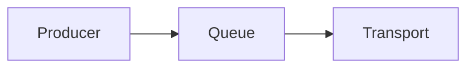

# CMS Writing Guide

이 사이트의 글은 Sveltia CMS를 통해 작성할 수 있습니다.

## 기본 작성 흐름

1. `/admin/`에 접속한다.
2. Blog collection에서 새 글을 만든다.
3. Title, Date, Category, Description을 입력한다.
4. 시리즈 글이라면 Series, Series Title, Series Order를 입력한다.
5. 본문은 Markdown으로 작성한다.
6. 저장하면 GitHub Actions가 자동으로 포맷팅하고 배포한다.

## Description 작성 규칙

- 40~180자로 작성한다.
- 제목을 그대로 반복하지 않는다.
- 글에서 다루는 문제, 선택, 결과가 드러나게 쓴다.

예시:

```text
Reliable / BestEffort 채널에서 send(), queue pressure, drop 정책, backpressure 처리 기준을 정리합니다.
```

## Series 작성 규칙

연속 글이라면 아래 필드를 함께 입력한다.

```yaml
series: unilink-design
seriesTitle: unilink 설계 노트
seriesOrder: 1
```

같은 series 안에서 seriesOrder는 중복되면 안 된다.

## Mermaid 작성 규칙

Mermaid는 반드시 fenced code block으로 작성한다.

````md

````

주의:

- ` ```mermaid flowchart LR`처럼 첫 줄에 내용을 붙이지 않는다.
- tab 대신 space를 사용한다.
- Mermaid source를 별도 코드블록으로 중복 작성하지 않는다.

## 게시 전 확인

- description이 40~180자인가?
- category가 올바른가?
- tags에 빈 값이 없는가?
- 시리즈 글이라면 seriesOrder가 있는가?
- Mermaid block이 깨지지 않았는가?
