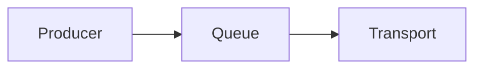

# CMS Writing Guide

이 사이트의 글은 Sveltia CMS를 통해 작성할 수 있습니다.

## 기본 작성 흐름

1. `/admin/`에 접속한다.
2. Blog collection에서 새 글을 만든다.
3. Title, Date, Project, Kind, Description을 입력한다.
4. 시리즈 글이라면 Series와 Series Order를 입력한다.
5. 본문은 Markdown으로 작성한다.
6. 저장하면 GitHub Actions가 콘텐츠를 검증하고 배포한다.

## 글 분류 기준

### Project

프로젝트와 직접 관련된 글이면 선택합니다.

- `unilink`: unilink 설계/구현/릴리즈 기록
- `ai-curator`: AI Curator 파이프라인/운영 기록
- `site`: 이 블로그, Sveltia CMS, Astro 운영 기록

프로젝트와 직접 관련 없는 개인 공부 글이면 비워둡니다.

### Kind

글의 성격입니다.

- `design`: 설계 노트
- `implementation`: 구현 기록
- `retrospective`: 회고
- `study`: 개인 학습
- `note`: 기타 노트
- `devlog`: 트러블슈팅 등 개발 일지

### Tags

태그는 보조 키워드입니다.
메인 탐색 UI에는 노출하지 않고, 관련 글/SEO/검색용으로만 사용합니다.

- 태그는 모두 소문자로 작성합니다 (CI에서 검증됩니다).
- 글당 3~5개를 권장합니다.
- 새 태그를 만들기 전에 기존 태그를 재사용할 수 있는지 확인합니다 (블로그 태그 페이지 참고).

## Description 작성 규칙

- 40~180자로 작성한다.
- 제목을 그대로 반복하지 않는다.
- 글에서 다루는 문제, 선택, 결과가 드러나게 쓴다.

예시:

```text
Reliable / BestEffort 채널에서 send(), queue pressure, drop 정책, backpressure 처리 기준을 정리합니다.
```

## Series 작성 규칙

연속 글이라면 아래 필드를 함께 입력한다.

```yaml
series: unilink-design
seriesOrder: 1
```

같은 series 안에서 seriesOrder는 중복되면 안 된다.

## Mermaid 작성 규칙

Mermaid는 반드시 fenced code block으로 작성한다.

````md

````

주의:

- ` ```mermaid flowchart LR`처럼 첫 줄에 내용을 붙이지 않는다.
- tab 대신 space를 사용한다.
- Mermaid source를 별도 코드블록으로 중복 작성하지 않는다.

## 목록 화면에서 글 찾기

Blog collection 글이 많아지면 목록 화면에서 정렬(Sort)뿐 아니라 그룹(Group) 보기를 사용하면 편합니다.

- 목록 상단의 Group 옵션에서 Project / Series / Kind 기준으로 묶어서 볼 수 있습니다.
- Draft 필터로 초안만 따로 모아 볼 수 있습니다.

## 게시 전 확인

- description이 40~180자인가?
- project/kind가 올바른가?
- tags에 빈 값이 없는가?
- 시리즈 글이라면 seriesOrder가 있는가?
- Mermaid block이 깨지지 않았는가?
