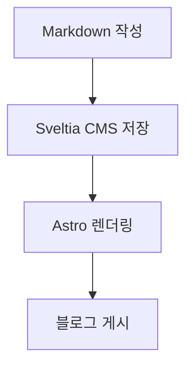

## 문단

문단은 빈 줄로 구분합니다. 한 줄 안에서 **굵게**, *기울임*, `인라인 코드`를 사용할 수 있습니다.

취소선은 ~~이렇게~~ 작성합니다.

링크는 [Astro](https://astro.build/)처럼 작성합니다.

문장 끝에 공백 두 칸을 넣으면  
같은 문단 안에서 줄바꿈할 수 있습니다.

특수 문자를 그대로 보여주고 싶으면 백슬래시로 escape합니다. 예: \*별표 그대로 표시\*

## 제목 계층

큰 단위는 `##`, 그 아래 단위는 `###`를 사용합니다.

### 세부 제목

세부 제목 아래에는 짧은 설명이나 예시를 붙입니다.

#### 더 작은 제목

너무 깊은 제목은 글을 읽기 어렵게 만들 수 있으니 필요한 경우에만 사용합니다.

## 목록

- 순서가 없는 목록
- 두 번째 항목
  - 들여쓴 하위 항목
  - 하위 항목은 공백 두 칸으로 들여씁니다
- 항목 안에 코드를 넣을 수도 있습니다: `std::priority_queue<int>`

1. 순서가 있는 목록
2. 두 번째 항목
3. 세 번째 항목

설명 목록처럼 쓰고 싶으면 굵은 라벨과 문단을 조합합니다.

**문제**  
최댓값을 빠르게 꺼내야 합니다.

**해결**  
힙 기반 우선순위 큐를 사용합니다.

## 인용문

> 인용문은 `>`로 시작합니다.
> 여러 줄을 이어서 작성할 수 있습니다.

> 인용문 안에서도 **굵게**와 `코드`를 사용할 수 있습니다.

## 코드 블록

언어 이름을 코드 펜스 뒤에 붙이면 문법 강조에 사용할 수 있습니다.

```cpp
#include <iostream>
#include <queue>

int main() {
    std::priority_queue<int> pq;

    pq.push(10);
    pq.push(30);
    pq.push(20);

    while (!pq.empty()) {
        std::cout << pq.top() << " ";
        pq.pop();
    }

    return 0;
}
```

출력 예시는 `text` 코드 블록으로 작성합니다.

```text
30 20 10
```

JSON이나 YAML도 같은 방식으로 작성합니다.

```json
{
  "title": "Markdown 작성 예시",
  "draft": true,
  "tags": ["markdown", "sveltia"]
}
```

```yaml
title: Markdown 작성 예시
draft: true
tags:
  - markdown
  - sveltia
```

## 체크리스트

- [x] raw Markdown 모드에서 작성하기
- [x] 코드 블록 언어 지정하기
- [ ] 게시 전에 `draft`를 `false`로 바꾸기

## 표

| 문법 | 용도 |
| --- | --- |
| `**text**` | 굵게 |
| `` `code` `` | 인라인 코드 |
| 코드 펜스 + 언어 이름 | C++ 코드 블록 |

정렬이 필요한 표는 구분선에 콜론을 붙입니다.

| 이름 | 설명 | 정렬 |
| :--- | :--- | ---: |
| `push` | 값을 삽입합니다 | 오른쪽 |
| `top` | 최상위 값을 조회합니다 | 오른쪽 |
| `pop` | 최상위 값을 제거합니다 | 오른쪽 |

## 이미지

이미지는 `public_folder` 기준 경로를 사용합니다.

```md

```

이미지에 링크를 걸고 싶으면 아래처럼 감쌉니다.

```md
[](https://example.com)
```

## 각주

본문 중간에 각주를 달 수 있습니다.[^note]

[^note]: 각주는 글 아래쪽에 모아서 표시됩니다.

## 접기 영역

HTML의 `details`와 `summary`는 Markdown 안에서 사용할 수 있습니다.

<details>
<summary>자세히 보기</summary>

이 영역은 사용자가 펼쳤을 때만 보입니다.

- 목록도 작성할 수 있습니다.
- 코드도 넣을 수 있습니다.

```text
hidden content
```

</details>

## Mermaid 다이어그램

이 프로젝트의 블로그 페이지는 `mermaid` 코드 블록을 다이어그램으로 바꿉니다.



## 구분선

아래처럼 하이픈 세 개로 구분선을 만들 수 있습니다.

---

구분선 아래의 새 문단입니다.
