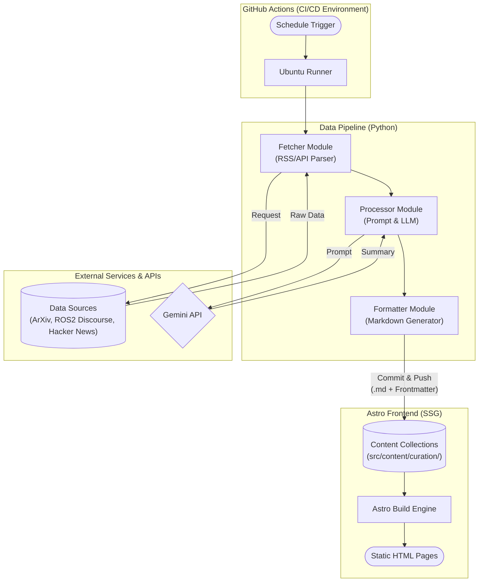
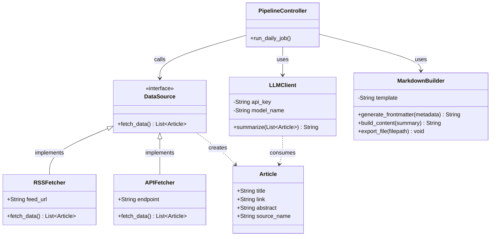

> 업데이트: 이후 Weekly 리포트와 별도 아카이브가 추가되었다.
> 현재 구조는 ai-curator README와 repository 구현을 기준으로 한다.

## 1. 시스템 개요

별도의 백엔드 서버나 동적 데이터베이스 없이 동작하는 완전 자동화 큐레이션 파이프라인입니다. 정보 수집부터 AI 요약, 웹사이트 배포까지의 전 과정이 단일 리포지토리 내에서 처리되는 서버리스(Serverless) 및 정적 사이트 생성(SSG) 기반 아키텍처를 채택했습니다.

### 주요 설계 원칙

* **비용 통제:** 클라이언트(브라우저) 사이드에서의 API 호출을 원천 배제하여 악의적인 트래픽 공격에 따른 비용 과금을 방어합니다.
* **유지보수 효율화:** 프론트엔드 코드와 데이터 파이프라인(Python 스크립트)을 단일 저장소에서 관리하되, 모듈을 명확히 분리합니다.
* **정적 데이터 관리:** RDBMS 대신 마크다운(`.md`) 파일과 Git 커밋 히스토리를 시계열 데이터베이스처럼 활용합니다.

---

## 2. 시스템 아키텍처 및 워크플로우

전체 시스템은 크게 데이터 수집 및 가공을 담당하는 **파이프라인 모듈(Python)**과 정적 렌더링을 담당하는 **프론트엔드 모듈(Astro)**로 분리되어 동작합니다.

### 2.1. 컴포넌트 아키텍처 (Component Architecture)

시스템을 구성하는 주요 모듈 간의 논리적 의존성 및 데이터 흐름입니다.



### 2.2. 아키텍처 워크플로우 (Sequence Diagram)

파이프라인이 실행되는 하루 주기의 데이터 흐름 명세입니다.

```mermaid
sequenceDiagram
    autonumber
    actor Cron as GitHub Actions (Trigger)
    participant Fetcher as Python Pipeline
    participant LLM as Gemini API
    participant Repo as GitHub Repository
    participant Astro as Astro SSG

    Cron->>Fetcher: 지정된 시간에 파이프라인 실행
    activate Fetcher
    
    rect rgb(30, 30, 30)
    Note over Fetcher, LLM: 1. 데이터 수집 및 가공
    Fetcher->>Fetcher: 타겟 소스(RSS, API) 스크래핑
    Fetcher->>LLM: 텍스트 데이터 및 프롬프트 전송
    activate LLM
    LLM-->>Fetcher: 요약 및 인사이트 데이터 반환
    deactivate LLM
    end
    
    rect rgb(40, 40, 40)
    Note over Fetcher, Repo: 2. 데이터 저장
    Fetcher->>Repo: Frontmatter 포함 YYYY-MM-DD.md 생성
    Fetcher->>Repo: src/content/curation/ 경로에 Commit & Push
    end
    deactivate Fetcher
    
    rect rgb(30, 30, 30)
    Note over Repo, Astro: 3. 빌드 및 배포
    Repo->>Astro: Commit 발생 시 배포 Action 트리거
    activate Astro
    Astro->>Astro: SSG 빌드 (Markdown -> HTML)
    Astro-->>Repo: gh-pages 브랜치로 배포 완료
    deactivate Astro
    end
```



---

## 3. 파이프라인 모듈 설계 (Class Diagram)

Python 기반의 데이터 수집기(`scripts/`) 내부의 객체 지향적 구조와 역할 명세입니다. 외부 소스 확장을 고려하여 인터페이스를 분리했습니다.



### 모듈별 책임 (Responsibility)

* **`PipelineController`**: 배치 작업의 전체 생명주기 관리. 설정된 소스 목록을 순회하며 프로세스를 순차 제어합니다.
* **`DataSource` (인터페이스/구현체)**: 외부 데이터를 읽어와 시스템 내부 규격인 `Article` 객체로 정규화합니다.
* **`Article`**: 데이터 전송 객체(DTO).
* **`LLMClient`**: 정규화된 리스트를 바탕으로 프롬프트를 구성하고 Gemini API와 통신하여 텍스트를 반환합니다.
* **`MarkdownBuilder`**: LLM 응답과 메타데이터를 결합하여 Astro 프레임워크 규격에 맞는 마크다운 파일을 시스템에 기록합니다.

---

## 4. 구성 요소 및 구현 명세

### 4.1. Data Pipeline (Python + GitHub Actions)

* **실행 환경:** GitHub Actions 워크플로우 (Cron 스케줄러)
* **수집 모듈:** `feedparser` 및 `requests`를 통한 외부 RSS/API 원문 데이터 수집.
* **가공 모듈:** `google-generativeai` 라이브러리를 통해 Gemini API 호출. 아키텍처 및 로보틱스 관점에서의 시사점을 도출하도록 프롬프트를 구성.

### 4.2. Data Storage (Markdown Content Collections)

* **저장 방식:** 파이프라인 스크립트 종료 시, Astro가 파싱할 수 있는 Frontmatter를 최상단에 포함한 `.md` 파일 동적 생성.
* **저장 경로:** `src/content/curation/YYYY-MM-DD.md`
* **자동화:** 생성 후 봇(Bot) 계정을 통해 리포지토리에 자동 Commit & Push.

**생성 마크다운 포맷 예시:**

```yaml
---
title: "2026-04-23 데일리 큐레이션"
pubDate: 2026-04-23
tags: ["ros2", "ai"]
sources: ["ArXiv", "ROS Discourse"]
---
(AI 요약 본문 데이터)
```

### 4.3. Frontend (Astro)

* **렌더링 방식:** 정적 사이트 생성(SSG).
* **데이터 연동:** Astro의 Content Collections API를 사용하여 빌드 타임에 마크다운을 HTML로 변환.
* **호스팅:** 빌드된 정적 에셋은 GitHub Pages(`gh-pages` 브랜치)를 통해 무료 서빙.
