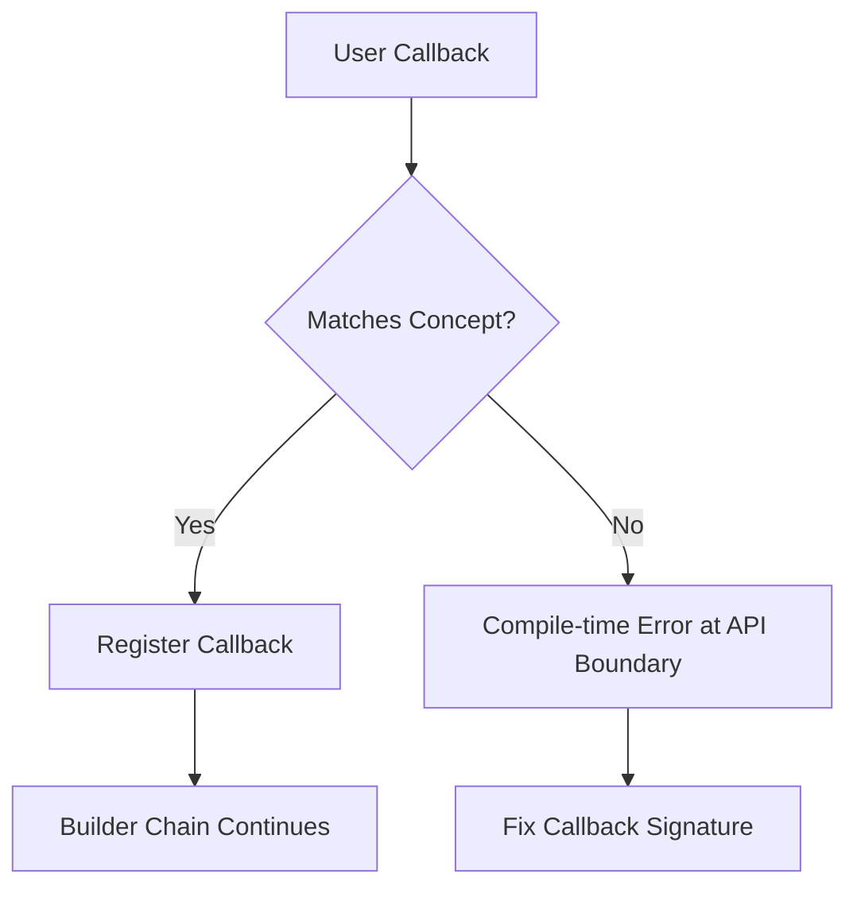
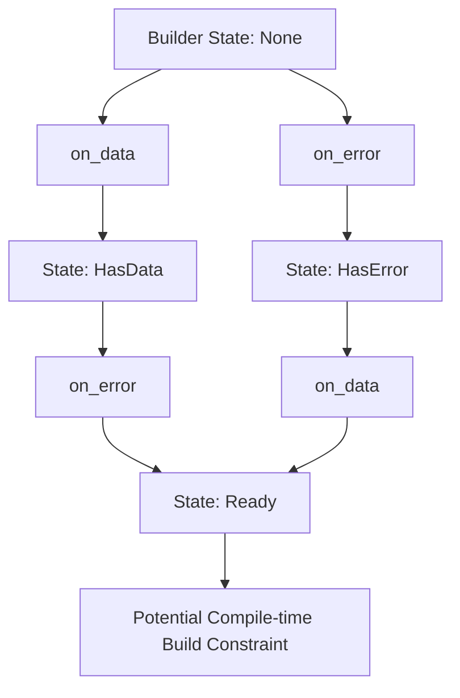
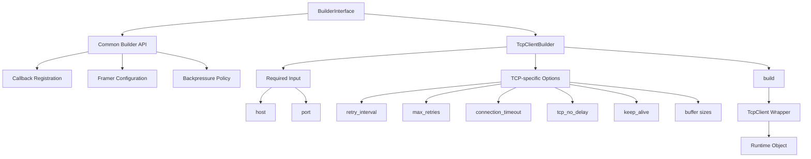

## 도입: 통신 객체 생성의 복잡성

  통신 객체는 단순한 값 객체와 다르다.
  TCP client를 예로 들면 host와 port만으로 객체를 만들 수 있을 것처럼 보이지만, 실제 사용 가능한 수준에서는 더 많은 설정이 필요하다.

  수신 데이터를 처리할 callback이 필요하고, 에러 처리 방식도 정해야 한다. 연결이 끊겼을 때 재시도할지, 송신 queue가 쌓였을 때 어떻게 처리할지, stream 기반 데이터를 message 단위로 나눌지도 결정해야 한다. TCP라면 `TCP_NODELAY`, keep-alive, connection timeout 같은 transport-specific option도 고려해야 한다.

  이런 설정을 모두 생성자 인자로 받게 하면 API는 금방 복잡해진다.

  ```cpp
  TcpClient client(
      "127.0.0.1",
      9000,
      3000,
      -1,
      5000,
      true,
      false
  );
  ```

  이 코드는 짧지만 명확하지 않다.
  각 숫자와 boolean이 무엇을 의미하는지 코드만 보고 이해하기 어렵다. 생성자 overload가 늘어나면 사용자는 어떤 생성자를 선택해야 하는지도 계속 확인해야 한다.

  unilink에서는 이 문제를 Builder API로 풀었다.
  필수 입력은 entry point에서 받고, 선택적 설정은 fluent API로 명시적으로 연결한다.

  ```cpp
  auto client = unilink::tcp_client("127.0.0.1", 9000)
      .retry_interval(std::chrono::milliseconds(3000))
      .max_retries(-1)
      .connection_timeout(std::chrono::milliseconds(5000))
      .tcp_no_delay(true)
      .keep_alive(false)
      .build();
  ```

  Builder API의 핵심은 단순히 “객체 생성을 편하게 하는 것”이 아니다.
  통신 객체의 설정 단계와 실행 단계를 분리하고, callback과 runtime policy를 일관된 방식으로 구성하는 것이다.

  ```mermaid
  mindmap
    root((Communication Object Configuration))
      Required Inputs
        host / port
        device path
        baud rate
        socket path
      Callback
        on_data
        on_message
        on_error
        on_connect
        on_disconnect
      Runtime Policy
        framer
        backpressure strategy
        backpressure threshold
      Transport Options
        retry interval
        max retries
        connection timeout
        tcp no delay
        keep alive
      Lifecycle
        auto start
        independent context
  ```

  ## Builder가 담당하는 역할

  unilink에서 Builder는 통신 객체가 생성되기 전에 필요한 설정을 모으는 계층이다.
  사용자는 builder를 통해 callback, framer, backpressure, reconnect, socket option 같은 설정을 구성한 뒤 `build()`를 호출한다.

  ```cpp
  auto client = unilink::tcp_client("127.0.0.1", 9000)
      .on_data([](const unilink::MessageContext& ctx) {
          // handle received data
      })
      .on_error([](const unilink::ErrorContext& err) {
          // handle error
      })
      .build();
  ```

  이 구조에는 몇 가지 의도가 있다.

  첫째, 필수 입력과 선택 설정을 분리한다.
  TCP client에서 host와 port는 필수 입력이다. 반면 callback, retry, framer, backpressure 정책은 선택 설정이다. Builder는 필수 입력으로 시작하고, 선택 설정은 fluent API로 이어 붙이는 구조를 만든다.

  둘째, 생성 전 설정 단계를 명확히 한다.
  통신 객체가 실제로 만들어지기 전까지는 builder가 설정을 보관한다. 사용자는 `build()`를 호출하는 시점에 설정이 실행 객체로 전달된다고 이해할 수 있다.

  셋째, transport별 차이를 builder 내부로 모은다.
  TCP client에는 retry, connection timeout, TCP option 같은 설정이 필요할 수 있다. Serial에는 baudrate, parity, stop bit 같은 설정이 필요할 수 있다. Builder는 공통 설정과 transport별 설정을 분리해 다룰 수 있게 한다.

  ```mermaid
  flowchart TD
      A[Required Input] --> B[Builder]
      B --> C[Common Configuration]
      B --> D[Transport-specific Configuration]
      B --> E[Callback Registration]
      B --> F[Runtime Policy]
  
      C --> G[build]
      D --> G
      E --> G
      F --> G
  
      G --> H[Wrapper Object]
  ```

  이 구조 덕분에 public API는 단순한 사용 흐름을 유지하면서도, 내부적으로는 다양한 설정을 확장할 수 있다.

  ## 설계 목표: 읽히는 설정 코드

  Builder API의 가장 중요한 목표는 설정 코드가 읽히는 것이다.

  생성자 기반 API는 인자가 적을 때는 간결하지만, 설정 항목이 많아질수록 의미가 흐려진다. 특히 숫자, boolean, duration, buffer size가 섞이면 코드만 보고 의도를 파악하기 어렵다.

  반면 Builder API는 설정의 의미를 메서드 이름으로 드러낸다.

  ```cpp
  auto client = unilink::tcp_client("127.0.0.1", 9000)
      .retry_interval(std::chrono::milliseconds(3000))
      .max_retries(5)
      .connection_timeout(std::chrono::milliseconds(5000))
      .tcp_no_delay(true)
      .keep_alive(true)
      .send_buffer_size(64 * 1024)
      .receive_buffer_size(64 * 1024)
      .build();
  ```

  이 코드는 생성자 방식보다 길지만, 각 설정의 의미가 명확하다.
  통신 객체처럼 설정 항목이 많고 일부만 선택적으로 사용하는 경우에는 명시적인 fluent API가 생성자 overload보다 유지보수에 유리하다.

  ```mermaid
  mindmap
    root((Builder API Goals))
      Readability
        named configuration
        clear intent
      Extensibility
        optional settings
        transport-specific options
      Consistency
        common callback pattern
        common build flow
      Safety
        callback signature constraints
        controlled construction
      Separation
        configuration phase
        runtime phase
  ```

  unilink의 Builder API는 이 목표를 기준으로 설계되었다.

  ## BuilderInterface: 공통 설정 계층

  unilink에는 transport별 builder가 존재한다.
  예를 들어 TCP client, TCP server, Serial, UDP, UDS는 각각 생성에 필요한 입력과 세부 옵션이 다르다.

  하지만 모든 builder가 callback 등록, framer 설정, backpressure 설정을 각자 구현하면 중복이 발생한다.
  따라서 공통 설정은 `BuilderInterface`에 모으고, transport별 설정은 개별 builder가 담당하는 구조를 사용한다.

  ```mermaid
  flowchart TD
      A[BuilderInterface]
  
      A --> B[Common Callback API]
      B --> B1[on_data]
      B --> B2[on_message]
      B --> B3[on_error]
      B --> B4[on_connect]
      B --> B5[on_disconnect]
  
      A --> C[Common Runtime Policy]
      C --> C1[framer]
      C --> C2[use_line_framer]
      C --> C3[use_packet_framer]
      C --> C4[backpressure_strategy]
      C --> C5[backpressure_threshold]
  
      A --> D[Transport-specific Builders]
      D --> D1[TcpClientBuilder]
      D --> D2[TcpServerBuilder]
      D --> D3[SerialBuilder]
      D --> D4[UdpBuilder]
      D --> D5[UdsBuilder]
  ```

  이 구조의 장점은 명확하다.

  공통 API는 한 곳에서 관리하고, transport별 옵션은 각 builder에만 추가하면 된다.
  예를 들어 TCP client에만 필요한 `tcp_no_delay`나 `keep_alive`는 `TcpClientBuilder`에 두고, 모든 transport에서 공통적으로 사용할 수 있는 `on_data`, `on_error`, `use_line_framer`는 `BuilderInterface`에 둔다.

  즉, `BuilderInterface`는 모든 transport가 공유하는 설정 언어 역할을 한다.

## C++20 Concepts: Callback Signature 검증

비동기 통신 라이브러리에서 callback은 중요한 API다.
수신 데이터, 연결 상태, 에러 상태는 대부분 callback을 통해 사용자 코드로 전달된다.

문제는 callback signature가 잘못되었을 때다.
예를 들어 `on_data`는 수신 메시지 context를 받아야 하고, `on_error`는 error context를 받아야 한다. 사용자가 잘못된 인자를 받는 lambda를 넘기면 컴파일 단계에서 이를 잡아낼 수 있어야 한다.

unilink는 이를 C++20 Concepts로 제한한다.

```cpp
template <typename T>
concept DataHandler =
    std::invocable<T, const wrapper::MessageContext&>;

template <typename T>
concept ErrorHandler =
    std::invocable<T, const wrapper::ErrorContext&>;

template <typename T>
concept ConnectionHandler =
    std::invocable<T, const wrapper::ConnectionContext&>;
```

이 구조는 callback 등록 메서드가 어떤 callable을 받을 수 있는지 명확히 표현한다.

```cpp
template <DataHandler F>
auto on_data(F&& handler);

template <ErrorHandler F>
auto on_error(F&& handler);

template <ConnectionHandler F>
Derived& on_connect(F&& handler);
```

Concepts를 사용한다고 해서 모든 template error message가 단순해지는 것은 아니다.
하지만 중요한 차이는 오류가 깊은 내부 구현에서 뒤늦게 발생하는 것이 아니라, 사용자가 `on_data`, `on_error`, `on_connect`를 호출한 API 경계에서 더 빠르게 드러난다는 점이다.

즉, Concepts는 callback 규칙을 문서로만 설명하는 대신 API 호출 접점에서 fail-fast 성격의 컴파일 타임 계약으로 만든다.



이 방식은 런타임 검증이 아니라 컴파일 타임 검증이다.
비동기 통신 코드에서 callback signature 오류를 실행 후 발견하는 것보다, 빌드 단계에서 API 경계에서 발견하는 편이 안전하다.

## Rebind와 BuilderState

unilink Builder에는 `BuilderState`와 `Rebind` 구조도 포함되어 있다.

`BuilderState`는 callback 등록 상태를 bitmask로 표현한다.
예를 들어 data callback이 등록되었는지, error callback이 등록되었는지를 상태로 추적할 수 있다.

```cpp
enum BuilderState : uint32_t {
    None = 0,
    HasData = 1 << 0,
    HasError = 1 << 1,
    Ready = HasData | HasError
};
```

그리고 `on_data()`나 `on_error()`는 handler를 저장한 뒤, 새로운 State를 가진 builder 타입으로 재바인딩한다.

```cpp
template <DataHandler F>
auto on_data(F&& handler) {
    on_data_ = std::forward<F>(handler);
    return typename Derived::template Rebind<
        State | BuilderState::HasData>(
            std::move(static_cast<Derived&>(*this)));
}
```

이 구조는 typestate pattern과 유사한 형태를 만들 수 있다.
현재 구조에서는 callback 등록이 필수 build 조건으로 강제되는 것은 아니지만, `BuilderState`와 `Rebind`는 향후 더 강한 compile-time validation을 도입할 수 있는 기반이 된다.

예를 들어 특정 transport에서 `on_error` 등록을 필수로 하거나, message 기반 API에서는 framer 설정 이후에만 `on_message`를 허용하는 식의 제약을 타입 단계에서 표현할 수 있다.
이렇게 발전시키면 런타임에 누락을 발견하는 방식이 아니라, `build()`를 호출하기 전에 잘못된 설정 조합을 막는 foolproof한 인터페이스에 가까워질 수 있다.



중요한 점은 이 구조가 현재 모든 callback 등록을 강제한다는 의미는 아니라는 것이다.
오히려 fluent API를 유지하면서도, 필요할 경우 더 엄격한 타입 기반 builder로 확장할 수 있는 설계 여지를 남겨둔 것이다.

## Transport-specific Builder

공통 설정은 `BuilderInterface`에 있지만, 모든 설정이 공통일 수는 없다.

TCP client는 TCP client만의 설정이 필요하다.
예를 들어 retry interval, max retries, connection timeout, TCP_NODELAY, keep-alive, send/receive buffer size 같은 옵션은 TCP client의 성격에 더 가깝다.

```cpp
auto client = unilink::tcp_client("127.0.0.1", 9000)
    .retry_interval(std::chrono::milliseconds(3000))
    .max_retries(5)
    .connection_timeout(std::chrono::milliseconds(5000))
    .tcp_no_delay(true)
    .keep_alive(true)
    .send_buffer_size(64 * 1024)
    .receive_buffer_size(64 * 1024)
    .build();
```

이런 설정은 Serial이나 UDP에 그대로 적용하기 어렵다.
따라서 transport-specific builder는 공통 builder를 상속하면서도 자신에게 필요한 옵션을 추가한다.



이 흐름에서 `BuilderInterface`는 모든 transport가 공유하는 설정 언어를 제공하고, `TcpClientBuilder`는 TCP client에 필요한 세부 설정을 추가한다.
마지막으로 `build()`는 공통 설정과 transport-specific 설정을 wrapper 객체에 전달한다.

이 구조는 공통성과 특수성을 분리한다.

공통 설정은 모든 builder에서 같은 방식으로 제공한다.
transport별 설정은 해당 builder에서만 노출한다.
따라서 사용자는 공통 사용 흐름을 유지하면서도, transport별 세부 옵션을 필요한 곳에서만 사용할 수 있다.


## build(): 설정에서 실행 객체로

  Builder의 마지막 단계는 `build()`다.

  Builder 단계에서는 설정을 모은다.
  `build()` 단계에서는 이 설정을 실제 wrapper 객체에 적용한다.

  TCP client builder를 기준으로 보면, `build()`는 다음과 같은 역할을 한다.

  ```mermaid
  flowchart TD
      A[Builder State] --> B[Create Wrapper Object]
      B --> C[Apply Callbacks]
      C --> D[Apply Transport Options]
      D --> E[Apply Backpressure Settings]
      E --> F[Apply Framer]
      F --> G[Apply Message Handler]
      G --> H[Return Wrapper]
  ```

  이 구조에서 Builder는 runtime object가 아니다.
  실제 통신을 수행하는 것은 wrapper 객체다.

  Builder는 설정을 모으고, wrapper 생성 시점에 그 설정을 전달한다.

  ```cpp
  auto client = unilink::tcp_client("127.0.0.1", 9000)
      .on_data([](const unilink::MessageContext& ctx) {
          // handle data
      })
      .use_line_framer("\n")
      .backpressure_threshold(64 * 1024)
      .build();
  
  client->start();
  client->send("hello");
  ```

  이 구분은 중요하다.

  Builder는 configuration phase를 담당한다.
  Wrapper는 runtime phase를 담당한다.

  ```mermaid
  flowchart LR
      A[Configuration Phase] --> B[Builder]
      B --> C[build]
      C --> D[Runtime Phase]
      D --> E[Wrapper]
  ```

  이렇게 나누면 객체 생성 전 설정과 생성 후 실행이 명확히 분리된다.

  ## Framer와 Backpressure 설정

  unilink Builder의 특징 중 하나는 단순 transport option뿐 아니라, 비동기 통신에서 반복되는 런타임 문제도 설정할 수 있다는 점이다.

  대표적인 예가 framer다.

  ```cpp
  auto client = unilink::tcp_client("127.0.0.1", 9000)
      .use_line_framer("\n")
      .on_message([](const unilink::MessageContext& msg) {
          // handle complete line message
      })
      .build();
  ```

  이 구조에서 사용자는 직접 수신 buffer를 누적하고 delimiter를 찾는 코드를 작성하지 않아도 된다.
  Builder 단계에서 line framer를 설정하고, runtime에서는 message callback으로 완성된 메시지를 받는다.

  Packet 기반 framing도 같은 방향으로 확장할 수 있다.

  ```cpp
  auto client = unilink::tcp_client("127.0.0.1", 9000)
      .use_packet_framer({0x02}, {0x03}, 4096)
      .on_message([](const unilink::MessageContext& msg) {
          // handle framed packet
      })
      .build();
  ```

  backpressure도 builder에서 설정할 수 있다.

  ```cpp
  auto client = unilink::tcp_client("127.0.0.1", 9000)
      .backpressure_strategy(
          unilink::base::constants::BackpressureStrategy::BestEffort)
      .backpressure_threshold(64 * 1024)
      .on_backpressure([](size_t queued_bytes) {
          // observe queue pressure
      })
      .build();
  ```

  이 API는 내부 queue 구현을 직접 노출하지 않는다.
  대신 사용자가 선택해야 하는 정책만 public API로 드러낸다.

  ```mermaid
  mindmap
    root((Runtime Policy in Builder))
      Framing
        line framer
        packet framer
        custom framer factory
        message callback
      Backpressure
        strategy
        threshold
        notification callback
      Error Handling
        error callback
        context-based reporting
  ```

  이것이 unilink Builder의 중요한 역할이다.
  Builder는 단순 옵션 설정기가 아니라, 통신 객체의 runtime behavior를 구성하는 API다.

  ## Member Function Callback 지원

  비동기 callback API는 lambda만 받으면 충분해 보일 수 있다.
  하지만 실제 애플리케이션에서는 클래스의 멤버 함수로 이벤트를 처리하고 싶은 경우도 많다.

  unilink Builder는 이런 사용을 위해 객체 포인터와 멤버 함수 포인터를 받는 overload도 제공한다.

  ```cpp
  class Handler {
  public:
      void handle_data(const unilink::MessageContext& ctx) {
          // handle data
      }
  
      void handle_error(const unilink::ErrorContext& err) {
          // handle error
      }
  };
  
  Handler handler;
  
  auto client = unilink::tcp_client("127.0.0.1", 9000)
      .on_data(&handler, &Handler::handle_data)
      .on_error(&handler, &Handler::handle_error)
      .build();
  ```

  이 API는 내부적으로 멤버 함수 포인터를 lambda로 감싸는 방식으로 처리할 수 있다.

  ```mermaid
  flowchart TD
      A[Object + Member Function] --> B[Builder overload]
      B --> C[Wrap as Lambda]
      C --> D[Store Callback]
      D --> E[Invoke on Event]
  ```

  이 기능은 작은 편의 기능처럼 보일 수 있지만, 실제 애플리케이션 구조에서는 유용하다.
  특히 통신 이벤트를 별도 manager class에서 처리하는 구조라면 callback 등록 코드가 더 읽기 쉬워진다.

  ## Trade-off: Builder API의 비용

  Builder API는 사용성을 높이지만 비용도 있다.

  첫 번째는 구현 복잡성이다.
  생성자 하나로 끝나는 구조보다 `BuilderInterface`, derived builder, `Rebind`, `State`, Concepts가 들어간 구조는 구현 난이도가 높다.

  두 번째는 컴파일 비용이다.
  template과 concept을 사용하는 구조는 public header에 많은 로직이 들어갈 수 있고, 컴파일 오류 메시지도 여전히 길어질 수 있다.

  세 번째는 API 일관성 유지 비용이다.
  Transport별 builder가 늘어나면 어떤 설정을 공통 builder에 둘지, 어떤 설정을 transport별 builder에 둘지 계속 판단해야 한다.

  ```mermaid
  mindmap
    root((Builder Trade-offs))
      Benefits
        readable configuration
        optional settings
        fluent usage
        compile-time callback constraints
        transport-specific extension
      Costs
        template complexity
        compile-time overhead
        public header complexity
        API consistency burden
  ```

  이 trade-off에도 불구하고 unilink에서는 Builder 구조를 선택했다.

  이유는 통신 객체의 설정 복잡성이 생성자 기반 API보다 Builder 기반 API에 더 잘 맞기 때문이다.
  특히 여러 transport를 지원하고, callback과 runtime policy를 함께 설정해야 하는 라이브러리에서는 Builder가 public API의 일관성을 유지하는 데 유리하다.

  ## 정리: Builder의 역할

  unilink에서 Builder는 다음 역할을 담당한다.

  ```mermaid
  mindmap
    root((unilink Builder Role))
      Configuration
        required inputs
        optional settings
        transport-specific options
      Callback Contract
        data handler
        error handler
        connection handler
        concept-based validation
      Runtime Policy
        framer
        backpressure
        auto start
      Object Creation
        build
        wrapper construction
        setting propagation
      API Consistency
        fluent API
        CRTP
        common builder interface
  ```

  Builder는 단순히 객체 생성을 편하게 만드는 도구가 아니다.
  unilink에서 Builder는 public API의 일관성을 유지하고, transport별 설정을 분리하며, 비동기 통신에서 필요한 callback과 runtime policy를 구성하는 핵심 계층이다.

  정리하면 다음과 같다.

  - 필수 입력과 선택 설정을 분리한다.
  - callback signature를 Concepts로 제한한다.
  - CRTP를 통해 fluent API에서 derived builder 타입을 유지한다.
  - `BuilderState`와 `Rebind`를 통해 상태 기반 확장 가능성을 둔다.
  - 공통 설정은 `BuilderInterface`에 모으고, transport별 설정은 개별 builder에 둔다.
  - `build()` 단계에서 설정을 wrapper 객체로 전달한다.
  - framer와 backpressure 같은 runtime concern도 builder 설정으로 표현한다.

  Builder API는 unilink의 사용 경험을 결정하는 중요한 계층이다.
  통신 객체의 생성 과정을 명시적으로 만들고, 설정의 의미를 코드에 드러내며, transport별 차이를 확장 가능한 방식으로 흡수한다. 이 점에서 Builder는 unilink의 Unified API를 실제 사용 코드로 연결하는 핵심 설계 요소라고 볼 수 있다.
