## 도입: 설계 배경에서 Public API로

이전 글에서는 unilink를 만든 배경과 설계 방향을 정리했다.
핵심은 여러 통신 방식을 단순히 지원하는 것이 아니라, TCP, UDP, Serial, Unix Domain Socket을 하나의 일관된 개발 경험으로 다루는 것이었다.

이 목표를 실제 코드 구조로 옮기기 위해 가장 먼저 정리해야 하는 영역은 public API다.

라이브러리에서 public API는 단순한 함수 목록이 아니다.
사용자가 라이브러리를 이해하는 출발점이고, 애플리케이션 코드가 직접 의존하는 계약이다. 내부 구현이 아무리 잘 분리되어 있어도 public API가 복잡하거나 일관성이 없으면 사용자는 transport별 차이를 계속 의식해야 한다.

unilink에서는 이 문제를 줄이기 위해 `unilink.hpp`를 public entry point로 두고, 그 아래에 Facade, Builder, Wrapper 구조를 배치했다.

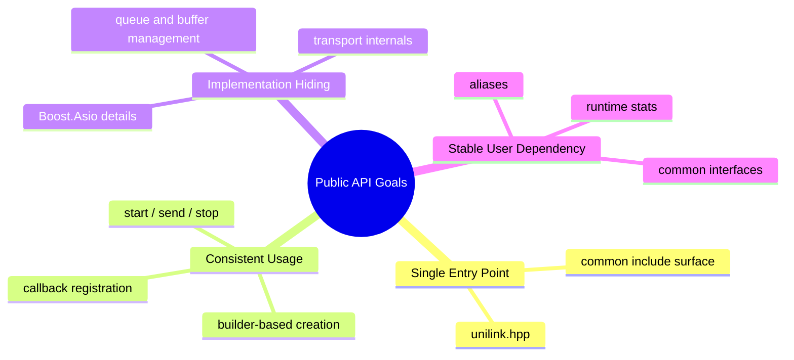

이 글에서는 unilink의 public API가 어떤 구조로 정리되어 있는지, 그리고 왜 Facade, Builder, Wrapper 중심으로 구성되었는지 살펴본다.

## Public API의 역할

통신 라이브러리의 내부 구현은 복잡할 수밖에 없다.
TCP client, TCP server, UDP, Serial, UDS는 서로 다른 초기화 방식과 runtime 동작을 가진다. 또한 비동기 read/write, callback lifetime, queue, backpressure, framer, error handling, logging 같은 공통 문제도 함께 다뤄야 한다.

하지만 사용자가 처음 만나는 API는 가능한 한 단순해야 한다.

unilink의 public API는 다음 역할을 담당한다.

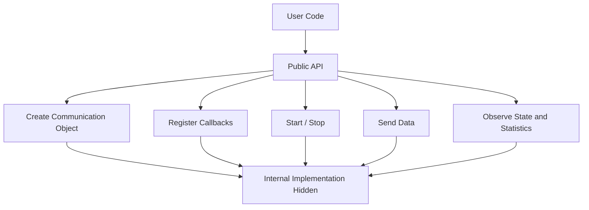

즉, 사용자는 통신 객체를 만들고, callback을 등록하고, 데이터를 주고받고, 상태를 확인하면 된다.
반대로 socket, acceptor, serial port, io_context, async operation, internal queue, buffer ownership 같은 구현 세부사항은 public API 밖으로 밀어낸다.

이 구분이 명확해야 라이브러리 사용자는 transport의 세부 구현보다 자신의 애플리케이션 로직에 집중할 수 있다.

## unilink.hpp: Public Facade

unilink의 public API 중심에는 `unilink.hpp`가 있다.

`unilink.hpp`는 단순히 여러 header를 모아둔 include 파일이 아니다.
사용자가 어떤 구성요소를 직접 바라봐야 하는지 정리하는 Facade 역할을 한다.

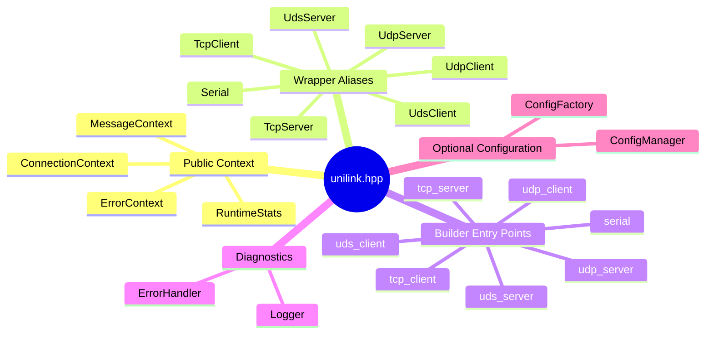

사용자는 내부 namespace와 구현 파일을 세부적으로 찾아 들어가지 않고도, `unilink.hpp`를 통해 주요 public API에 접근할 수 있다.

```cpp
#include <unilink/unilink.hpp>
```

이 방식은 “single-header library”를 의미하지 않는다.
unilink는 내부적으로 여러 wrapper, builder, transport, diagnostics, memory, framer 계층을 가진다. 다만 사용자가 처음 의존해야 하는 public surface를 하나의 진입점으로 정리했다는 의미에 가깝다.

즉, `unilink.hpp`는 내부 구조를 없애는 것이 아니라, 내부 구조를 사용자가 직접 탐색하지 않아도 되게 만드는 Facade다.

## Facade가 숨기는 것과 드러내는 것

Facade의 핵심은 모든 것을 숨기는 것이 아니다.
사용자에게 필요한 것은 드러내고, 불필요한 구현 세부사항은 숨기는 것이다.

unilink의 Facade는 다음과 같은 기준으로 public API를 정리한다.

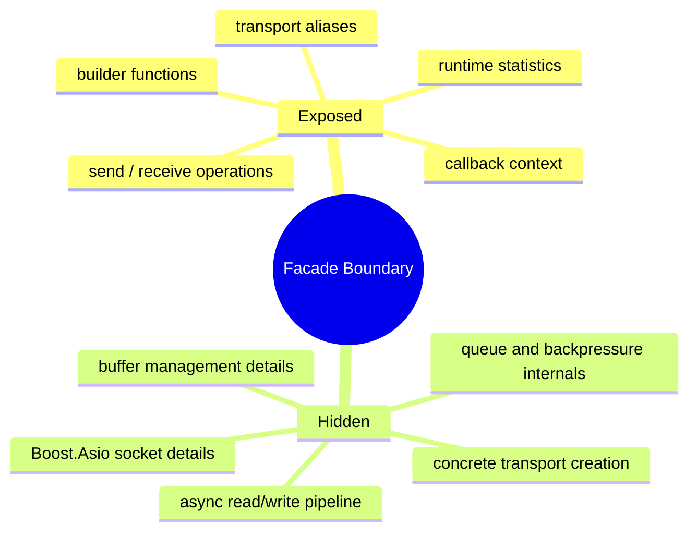

예를 들어 사용자는 `wrapper::TcpClient`라는 내부 namespace를 직접 사용할 수도 있지만, public API에서는 `unilink::TcpClient` alias로 접근할 수 있다.

```cpp
using TcpClient = wrapper::TcpClient;
using Serial = wrapper::Serial;
using UdpClient = wrapper::UdpClient;
```

사용자 입장에서는 “어디에 구현되어 있는가”보다 “무엇을 사용할 수 있는가”가 중요하다. unilink namespace에서 핵심 타입을 바로 노출하면 API 탐색 비용이 줄어든다.

## Builder Entry Point

unilink의 객체 생성은 생성자를 직접 호출하는 방식보다 builder entry point를 통해 시작된다.

```cpp
auto client = unilink::tcp_client("127.0.0.1", 9000)
    .on_data([](const unilink::MessageContext& ctx) {
        // handle received data
    })
    .on_error([](const unilink::ErrorContext& err) {
        // handle error
    })
    .build();
```

여기서 `unilink::tcp_client(...)`는 곧바로 TCP client 객체를 만드는 함수가 아니라, TCP client builder를 반환하는 진입점이다.
사용자는 이 builder에 callback, framer, backpressure, transport option 등을 설정한 뒤 `build()`를 호출해 실제 wrapper 객체를 생성한다.

이 구조는 다음과 같은 흐름을 만든다.

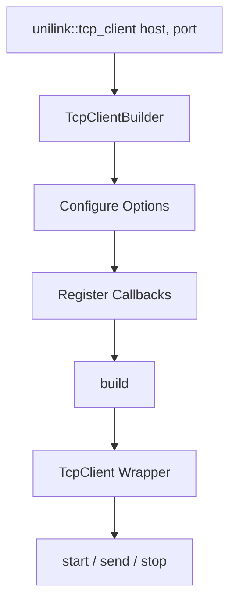

이 방식의 장점은 객체 생성 시점과 설정 과정을 분리할 수 있다는 점이다.

통신 객체는 단순한 값 객체가 아니다.
연결 대상, callback, retry 정책, framer, backpressure 정책, socket option 등 다양한 설정이 필요할 수 있다. 이 설정을 생성자 인자로 모두 받게 하면 생성자는 금방 복잡해진다.

Builder를 사용하면 필수 정보는 entry point에서 받고, 선택적 설정은 fluent API로 연결할 수 있다.

## Transport별 Entry Point

unilink는 transport별로 서로 다른 entry point를 제공한다.
하지만 entry point 이후의 사용 흐름은 최대한 동일하게 유지한다.

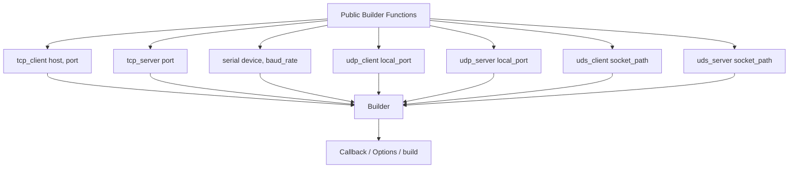

각 transport는 생성에 필요한 최소 정보가 다르다.

TCP client는 host와 port가 필요하다.
TCP server는 listen할 port가 필요하다.
Serial은 device path와 baud rate가 필요하다.
UDP는 local port를 기준으로 시작할 수 있다.
UDS는 socket path가 필요하다.

이 차이는 entry point의 인자로 드러난다.
하지만 그 이후에는 builder 기반 설정 흐름으로 합류한다.

```cpp
auto serial = unilink::serial("/dev/ttyUSB0", 115200)
    .on_data([](const unilink::MessageContext& ctx) {
        // handle serial data
    })
    .on_error([](const unilink::ErrorContext& err) {
        // handle error
    })
    .build();
auto server = unilink::tcp_server(9000)
    .on_connect([](const unilink::ConnectionContext& ctx) {
        // client connected
    })
    .on_data([](const unilink::MessageContext& ctx) {
        // handle client data
    })
    .on_error([](const unilink::ErrorContext& err) {
        // handle error
    })
    .build();
```

transport별 시작점은 다르지만, 사용자는 동일한 패턴으로 객체를 설정하고 사용할 수 있다.

## Wrapper: 사용자가 다루는 실행 객체

Builder가 객체 생성 과정을 담당한다면, Wrapper는 생성 이후 사용자가 직접 다루는 실행 객체다.

unilink에서 wrapper는 transport별 구현을 감싸면서도 사용자에게 공통적인 조작 방식을 제공한다.

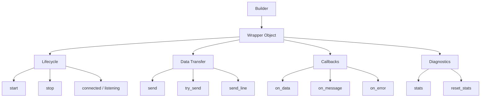

사용자는 wrapper를 통해 `start`, `stop`, `send`, `try_send`, `stats` 같은 동작을 수행한다.
이때 TCP인지 Serial인지 UDP인지에 따라 내부 동작은 달라질 수 있지만, public API의 기본 흐름은 유지된다.

이 구조는 transport별 구현 차이를 wrapper 내부로 격리한다.
사용자는 socket이나 serial port를 직접 다루지 않고, 통신 객체의 lifecycle과 데이터 송수신만 다룬다.

## Channel과 Server의 분리

모든 통신 객체를 하나의 interface로 묶는 것이 항상 좋은 것은 아니다.
1:1 point-to-point 통신과 1:N server 통신은 사용자가 기대하는 동작이 다르다.

예를 들어 TCP client나 Serial은 기본적으로 하나의 channel로 볼 수 있다.
반면 TCP server는 여러 client를 accept하고, 특정 client에게 보내거나 전체 client에게 broadcast할 수 있어야 한다.

unilink는 이 차이를 `ChannelInterface`와 `ServerInterface`로 분리한다.

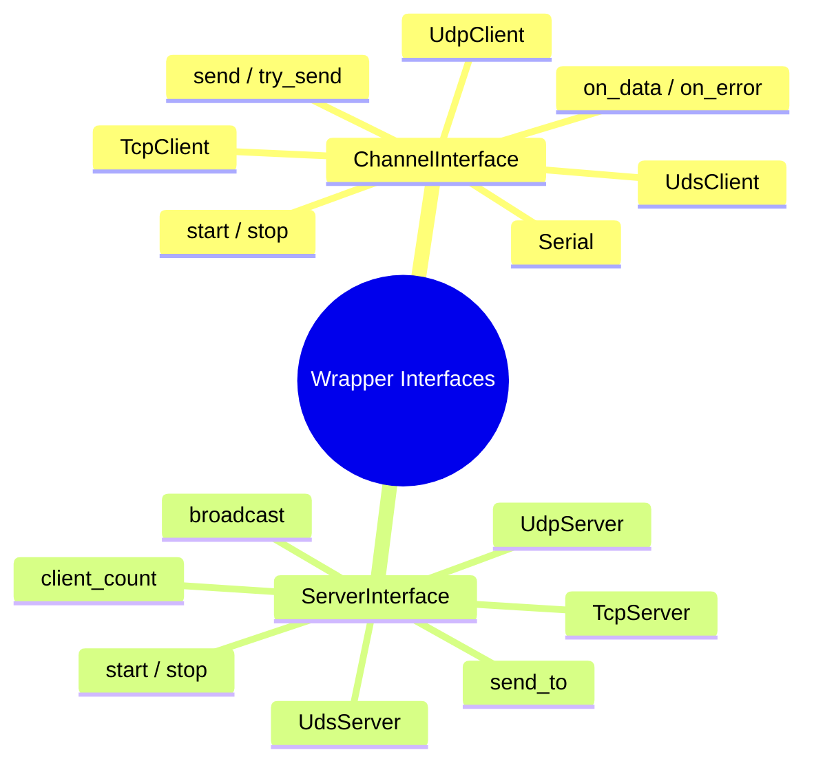

이 분리는 public API의 일관성을 유지하면서도, 억지 추상화를 피하기 위한 선택이다.

모든 transport를 완전히 같은 interface에 넣으면 겉으로는 단순해 보일 수 있다.
하지만 server가 필요한 `broadcast`, `send_to`, `client_count` 같은 개념을 channel 객체에도 억지로 넣게 되면 API가 오히려 부자연스러워진다.

따라서 unilink는 공통화할 수 있는 영역은 공통화하되, 통신 모델 자체가 다른 부분은 interface를 분리한다.

## Framer와 Backpressure의 Public API 노출

unilink의 public API는 단순히 연결과 송수신만 제공하지 않는다.
비동기 통신에서 반복적으로 발생하는 문제도 사용자가 설정할 수 있는 API로 노출한다.

대표적인 예가 framer다.

TCP나 Serial은 stream 기반이므로 수신된 byte chunk가 곧 하나의 메시지라는 보장이 없다.
이 문제를 애플리케이션 코드가 매번 직접 처리하게 하면 수신 buffer 누적, delimiter 검색, packet parsing 코드가 반복된다.

unilink는 builder 단계에서 framer를 설정할 수 있게 한다.

```cpp
auto client = unilink::tcp_client("127.0.0.1", 9000)
    .use_line_framer("\n")
    .on_message([](const unilink::MessageContext& msg) {
        // handle complete message
    })
    .build();
```

이 예시에서 사용자는 stream chunk가 아니라 framer를 통과한 message 단위 callback을 받을 수 있다.

backpressure도 마찬가지다.
송신 queue가 쌓이는 상황은 transport 내부의 문제처럼 보이지만, 실제로는 애플리케이션 정책과 연결된다. 어떤 데이터는 반드시 보내야 하고, 어떤 데이터는 최신성만 유지하면 된다.

따라서 unilink는 backpressure strategy와 threshold를 builder 설정으로 노출한다.

```cpp
auto client = unilink::tcp_client("127.0.0.1", 9000)
    .backpressure_strategy(unilink::base::constants::BackpressureStrategy::BestEffort)
    .backpressure_threshold(64 * 1024)
    .on_backpressure([](size_t queued_bytes) {
        // observe queue pressure
    })
    .build();
```

이처럼 public API는 내부 문제를 그대로 노출하는 것이 아니라, 사용자가 선택해야 하는 정책만 정리해서 제공한다.

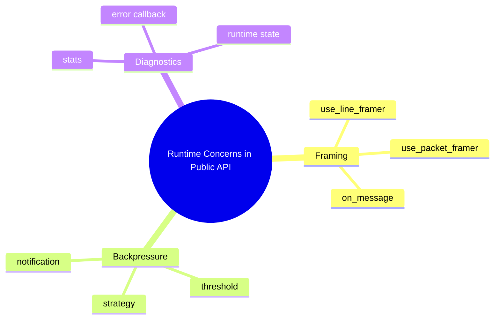

이 접근은 unilink의 API 설계에서 중요한 기준이다.
구현 세부사항은 숨기되, 사용자가 의사결정해야 하는 정책은 public API로 드러낸다.

## Facade와 Builder의 경계

Facade와 Builder는 역할이 다르다.

Facade는 사용자가 어디에서 시작해야 하는지를 정리한다.
Builder는 객체를 어떻게 설정하고 생성할지를 정리한다.

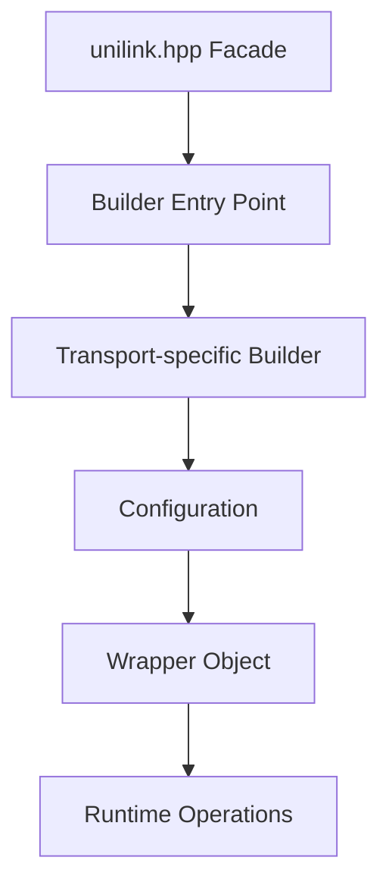

`unilink.hpp`가 없더라도 내부 header를 직접 include해 객체를 만들 수는 있다.
하지만 그렇게 하면 사용자는 어떤 header를 포함해야 하는지, 어떤 namespace의 타입을 써야 하는지, 어떤 builder를 직접 생성해야 하는지 알아야 한다.

반대로 Facade를 제공하면 사용자는 다음처럼 시작할 수 있다.

```cpp
#include <unilink/unilink.hpp>

auto client = unilink::tcp_client("127.0.0.1", 9000)
    .on_data([](const unilink::MessageContext& ctx) {
        // handle data
    })
    .build();
```

이 코드는 내부 구조를 모르는 상태에서도 읽을 수 있다.

- `unilink::tcp_client(...)`로 TCP client를 만들기 시작한다.
- `on_data(...)`로 수신 callback을 등록한다.
- `build()`로 실행 객체를 만든다.
- 이후 `start()`와 `send()`로 사용한다.

이 정도 흐름이 보이면 public API의 1차 목표는 달성된 것이다.

## Unified API가 의미하는 것

Unified API는 모든 transport를 완전히 동일하게 만드는 것이 아니다.
오히려 transport별 차이를 인정한 상태에서, 사용자 경험의 공통 축을 만드는 것이다.

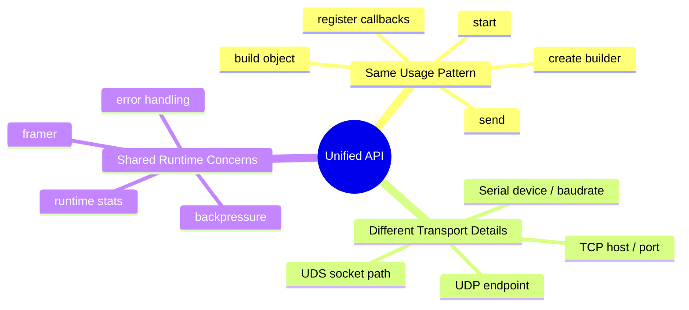

무리한 추상화는 오히려 API를 불편하게 만든다.
TCP server와 Serial port를 완전히 같은 객체처럼 다루려 하면, 어느 한쪽에는 맞지 않는 개념이 public API에 들어가게 된다.

unilink의 방향은 “모든 것을 하나의 타입으로 통합”하는 것이 아니다.
사용자가 반복적으로 마주치는 흐름을 통일하고, transport별 차이는 필요한 곳에서만 드러내는 것이다.

## Trade-off

Facade 기반 public API는 장점이 크지만, trade-off도 있다.

첫 번째는 include dependency가 커질 수 있다는 점이다.
`unilink.hpp`가 여러 public wrapper와 builder를 모으는 역할을 하기 때문에, 작은 기능만 사용하는 경우에도 비교적 넓은 public surface를 포함하게 된다.

두 번째는 public API 설계의 책임이 커진다는 점이다.
Facade에 무엇을 포함할지, 어떤 alias를 제공할지, 어떤 convenience function을 노출할지는 사용자의 의존 지점을 결정한다. 한 번 public API로 노출한 이름은 쉽게 바꾸기 어렵다.

세 번째는 편의성과 명시성 사이의 균형이다.
`unilink::tcp_client(...)` 같은 entry point는 사용하기 쉽지만, 내부적으로 어떤 builder와 wrapper가 연결되는지 처음에는 감춰진다. 따라서 문서와 예제에서 이 흐름을 명확히 설명해야 한다.

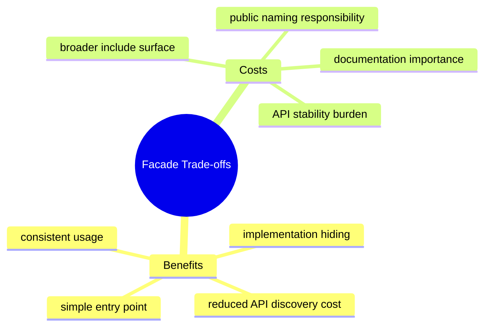

즉, Facade는 단순히 편의 기능이 아니다.
사용자 경험을 단순하게 만드는 대신, 라이브러리 설계자가 public API의 경계를 더 신중하게 관리해야 한다.

## 정리: Public API의 역할

unilink의 Unified API는 다음 구조를 중심으로 구성된다.

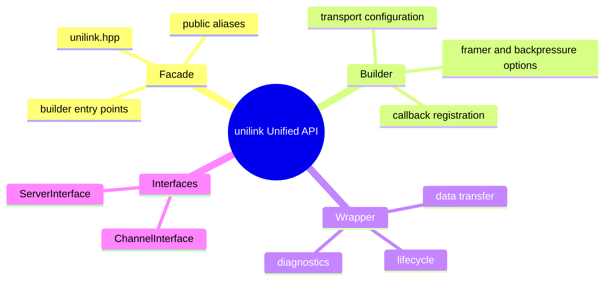

이 구조를 통해 사용자는 transport별 세부 구현보다 공통 사용 흐름에 집중할 수 있다.

unilink에서 `unilink.hpp`는 public entry point이고, Builder는 설정과 생성 흐름을 담당하며, Wrapper는 실제 runtime operation을 담당한다.
또한 Channel과 Server interface를 분리해 1:1 통신과 1:N 통신의 차이를 무리하게 숨기지 않는다.

정리하면 unilink의 Unified API는 다음 목표를 가진다.

- 사용자가 시작할 위치를 명확히 한다.
- transport별 객체 생성 흐름을 builder로 통일한다.
- 내부 구현 세부사항은 wrapper와 transport 계층 뒤로 숨긴다.
- 공통 runtime concern은 API로 정리해 선택 가능하게 만든다.
- 무리한 단일 interface 대신 Channel과 Server를 분리한다.

이러한 구조 때문에 unilink는 여러 통신 방식을 지원하면서도 사용자는 비교적 일관된 방식으로 객체를 만들고 사용할 수 있다.
