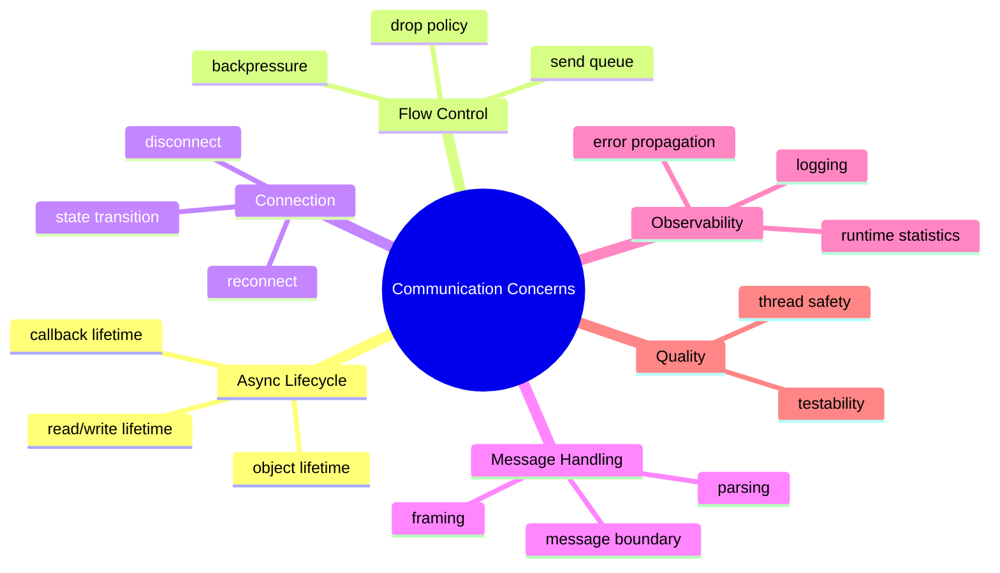
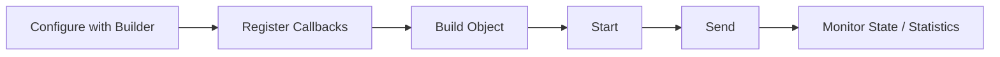
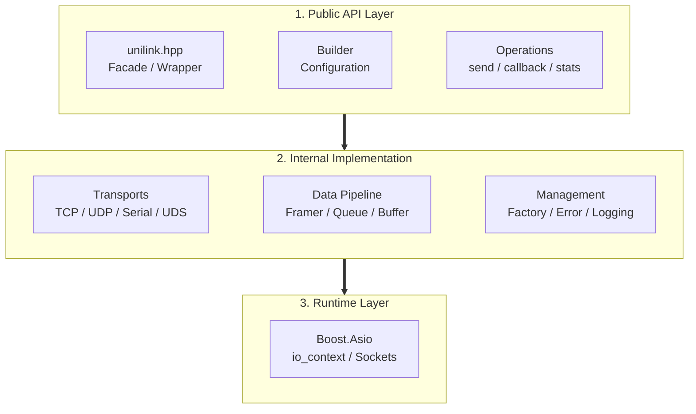
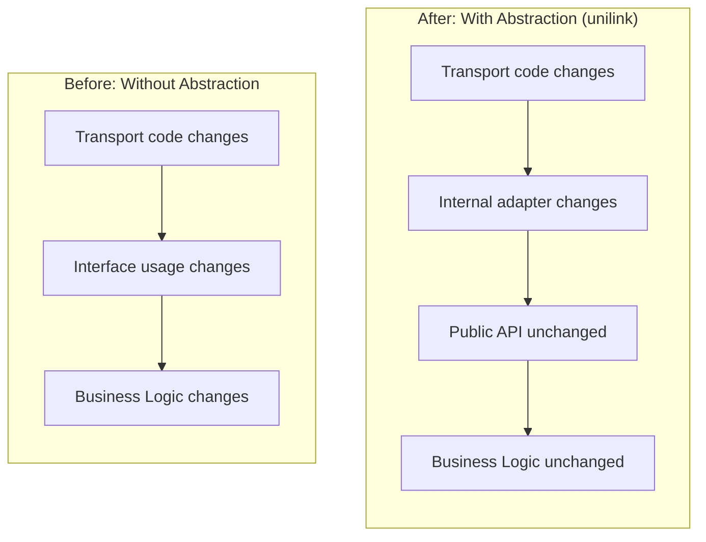

## 도입: 반복되는 통신 구현

통신 코드는 많은 소프트웨어 시스템에서 반복적으로 등장한다.

로봇, 장비 제어, 서버 연동, 테스트 도구, 진단 프로그램처럼 외부 장치나 다른 프로세스와 데이터를 주고받는 시스템에서는 TCP, UDP, Serial, Unix Domain Socket과 같은 다양한 통신 방식이 사용된다.

각 통신 방식은 서로 다른 특성을 가진다. TCP는 연결 기반의 stream 통신이고, UDP는 비연결 datagram 통신이다. Serial은 장치 파일과 포트 설정을 다뤄야 하며, Unix Domain Socket은 같은 머신 내 프로세스 간 통신에 적합하다.

하지만 애플리케이션 개발자의 관점에서 보면 반복되는 흐름은 상당히 유사하다.


프로토콜은 다르지만, 애플리케이션이 기대하는 사용 흐름은 크게 다르지 않다.
문제는 이 흐름이 통신 방식마다, 프로젝트마다 반복적으로 다시 구현된다는 점이다.

실제 프로젝트에서는 통신 방식이 바뀌었을 뿐인데 비즈니스 로직까지 함께 수정해야 하는 경우가 있다. TCP 기준으로 작성한 구조를 Serial로 옮기거나, 테스트용 UDP 인터페이스를 실제 장비용 Serial 인터페이스로 바꾸는 과정에서 callback 구조, 에러 처리, queue 정책이 함께 흔들리기도 한다.

unilink는 이러한 반복과 구조적 흔들림을 줄이고, 여러 통신 방식을 일관된 API로 다루기 위해 설계한 C++ 비동기 통신 라이브러리다.

## 문제 정의: 구현 반복과 불일치

통신 코드는 처음에는 간단한 wrapper로 시작하는 경우가 많다.

예를 들어 TCP client를 만들 때는 socket 생성, connect, async read/write, error callback 정도만 있으면 충분해 보인다. Serial 통신도 port open, read/write, close 정도로 시작할 수 있다.

그러나 실제 사용 가능한 수준으로 확장하면 고려해야 할 요소가 빠르게 늘어난다.



이러한 기능은 특정 프로젝트에서 한 번만 필요한 것이 아니다. TCP, Serial, UDP처럼 통신 방식이 달라져도 유사한 문제가 반복된다.

그럼에도 각 통신 방식의 구현이 개별적으로 작성되면 API 형태, 에러 처리 방식, callback 구조, queue 정책이 서로 달라지기 쉽다. 결과적으로 애플리케이션 코드는 transport의 차이를 필요 이상으로 많이 알게 되고, 통신 방식이 바뀔 때마다 사용 코드도 함께 흔들리게 된다.

이 문제는 단순한 코드 중복의 문제가 아니다. 통신 구현이 애플리케이션 로직 안으로 깊게 들어올수록, 작은 transport 변경도 전체 구조 변경으로 이어질 수 있다. 따라서 필요한 것은 단순한 wrapper가 아니라, 통신 방식의 차이와 애플리케이션 로직 사이에 명확한 경계를 세우는 구조다.

## 설계 목표: 개발 경험 통합

unilink의 목표는 단순히 여러 통신 방식을 지원하는 것이 아니다.

TCP, UDP, Serial, Unix Domain Socket을 모두 지원하더라도 각 API가 서로 다르게 동작한다면 사용자는 결국 transport별 사용법을 따로 익혀야 한다.

따라서 unilink의 핵심 목표는 “프로토콜을 하나로 만드는 것”이 아니라, “여러 통신 방식을 하나의 일관된 개발 경험으로 다루는 것”이다.


사용자는 가능한 한 다음과 같은 흐름으로 통신 객체를 다룰 수 있어야 한다.

```cpp
auto client = unilink::tcp_client("127.0.0.1", 9000)
    .on_data([](auto data) {
        // handle received data
    })
    .on_error([](auto error) {
        // handle error
    })
    .build();

client.start();
client.send("hello");
```

이 흐름의 핵심은 transport별 세부 구현이 아니라 사용 방식의 일관성이다.



Serial, TCP, UDP, UDS는 내부 구현이 다르지만, 애플리케이션이 사용하는 기본 흐름은 최대한 동일하게 유지하는 것이 목표였다.

물론 모든 transport를 완전히 같은 형태로 추상화할 수는 없다. TCP client와 TCP server는 구조가 다르고, UDP는 연결 상태보다 endpoint 관리가 중요하다. Serial은 baudrate, parity, stop bit 같은 포트 설정이 필요하다.

따라서 unilink는 공통화할 수 있는 영역과 transport별로 분리해야 하는 영역을 명확히 나누는 방향으로 설계했다.

## 설계 원칙 1: 단순한 Public API

비동기 통신 구현은 내부적으로 복잡하다.

Boost.Asio 기반으로 구현할 경우 `io_context`, socket, strand, async operation, buffer lifetime, executor, work guard 등을 고려해야 한다.

그러나 이러한 요소가 모두 public API에 노출되면 라이브러리 사용자는 통신 로직보다 비동기 구현 세부사항을 더 많이 다루게 된다.

unilink에서는 public API의 역할을 제한하고, 내부 복잡성은 구현 계층으로 숨기는 방향을 선택했다.



이 구조를 통해 사용자는 단순한 API를 사용하고, 라이브러리는 내부에서 transport별 복잡성을 관리한다.

이 방향은 unilink의 계층 구조에도 직접적으로 반영된다. 사용자에게 노출되는 API는 Facade, Builder, Wrapper 중심으로 구성하고, 실제 transport 구현은 내부 계층으로 분리한다.

중요한 것은 내부 구현을 숨기는 것 자체가 아니다. 사용자가 반드시 알아야 하는 개념과 라이브러리 내부에서 책임져야 하는 구현 세부사항을 구분하는 것이다. public API는 사용자가 의존하는 계약이고, 내부 구현은 성능과 안정성을 위해 계속 개선될 수 있는 영역이다.

## 설계 원칙 2: Transport 차이의 내부 격리

TCP client, TCP server, UDP, Serial, UDS는 구현 방식이 다르다. 그러나 애플리케이션에서 공통적으로 기대하는 동작은 상당 부분 겹친다.

unilink는 이 공통 동작을 중심으로 API를 구성하고, transport별 차이는 builder option과 내부 transport 계층으로 분리한다.

예를 들어 TCP client는 remote endpoint에 연결해야 하고, TCP server는 acceptor를 통해 여러 client를 관리해야 한다. UDP는 datagram 단위의 송수신과 endpoint 정보가 중요하며, Serial은 장치 경로와 포트 설정이 필요하다.

이 차이를 애플리케이션 코드에 직접 노출하면 transport가 바뀔 때 사용자 코드도 크게 변경된다. 반면, 내부 transport 계층에서 차이를 격리하면 public API는 안정적으로 유지할 수 있다.



이 구조는 새로운 transport가 추가되더라도 사용자가 익힌 기본 사용 흐름은 유지하고, 내부 구현과 builder만 확장하는 방식으로 대응할 수 있게 한다.

즉, unilink의 abstraction은 통신 방식의 차이를 없애기 위한 것이 아니다. 차이는 내부에 남겨두되, 그 차이가 애플리케이션 전체로 전파되지 않도록 막는 것이다.

## 설계 원칙 3: 비동기 통신 문제의 API화

통신 라이브러리는 단순히 `send`와 `receive`를 감싸는 수준에서 끝나기 어렵다.

실제 시스템에서 사용하려면 비동기 통신에서 반복적으로 발생하는 문제를 함께 고려해야 한다. 예를 들어 송신 속도가 실제 전송 속도보다 빠를 때 발생하는 backpressure, stream 기반 통신에서 message boundary를 구분하는 framing, callback으로 전달되는 buffer의 lifetime 문제는 통신 방식과 무관하게 자주 등장한다.

이러한 문제를 매번 애플리케이션 코드에서 직접 처리하게 만들면, transport가 바뀔 때마다 비슷한 보조 로직이 반복된다. 또한 프로젝트마다 queue 정책, error handling, buffer 처리 방식이 달라지면서 사용 경험도 일관되지 않게 된다.

unilink는 이런 문제를 내부 구현에만 숨기지 않고, 필요한 부분은 API 설계의 일부로 다루는 방향을 선택했다. `send`, `try_send`, callback, framer, runtime statistics 같은 개념은 단순한 부가 기능이 아니라, 비동기 통신을 안정적으로 사용하기 위한 공통 접점이다.

즉, unilink의 목적은 통신 함수를 단순히 감싸는 것이 아니라, 비동기 통신에서 반복적으로 마주치는 문제를 일관된 방식으로 다룰 수 있는 기반을 제공하는 것이다.

## 설계 원칙 4: 변경 영향 분리

라이브러리에서 중요한 목표 중 하나는 사용자의 코드를 안정적으로 유지하는 것이다.

통신 라이브러리는 내부적으로 계속 바뀔 수밖에 없다. transport 구현이 개선될 수 있고, queue 정책이 보완될 수 있으며, reconnect 처리나 error propagation 방식도 더 안정적으로 다듬어질 수 있다. 하지만 이러한 내부 변경이 매번 사용자 코드 변경으로 이어진다면 라이브러리 사용 비용은 커진다.

unilink는 사용자 코드가 의존해야 할 영역과, 라이브러리 내부에서 자유롭게 개선할 수 있는 영역을 분리하는 방향으로 구조를 잡았다.

사용자 코드는 public API에 의존한다.  
내부 구현은 transport별 구현, queue, framer, retry, socket option, logging처럼 계속 개선될 수 있는 영역으로 둔다.

이 구조의 목적은 내부 변경을 막는 것이 아니다. 오히려 내부 구현은 더 적극적으로 개선할 수 있어야 한다. 대신 그 변화가 애플리케이션의 메시지 처리 코드나 비즈니스 로직으로 불필요하게 전파되지 않도록 하는 것이 중요하다.

즉, 내부 구현은 자유롭게 바꿀 수 있어야 하고, 사용자 코드는 가능한 한 안정적으로 유지되어야 한다.

## 정리: 설계 방향

unilink는 여러 통신 방식을 지원하는 C++ 비동기 통신 라이브러리다.

그러나 핵심 목적은 단순히 지원하는 프로토콜의 수를 늘리는 것이 아니라, 서로 다른 통신 방식을 “하나의 일관된 개발 경험”으로 묶어내는 데 있다.

TCP, UDP, Serial, Unix Domain Socket은 서로 다른 특성을 가진다. 이 차이를 완전히 없앨 수는 없다. 그리고 없애는 것이 목표도 아니다.

unilink가 지향하는 것은 그 차이가 애플리케이션 코드 전체로 번지지 않도록 경계를 세우는 것이다.

이를 위해 unilink는 public API를 단순하게 유지하고, transport별 차이는 내부 구현으로 격리하며, 비동기 통신에서 반복적으로 등장하는 문제를 공통 API 개념으로 다룬다.

결국 unilink의 설계 방향은 다음 문장으로 정리할 수 있다.

> 통신 방식을 하나로 만드는 것이 아니라, 통신 방식의 차이가 애플리케이션 코드에 미치는 영향을 줄이는 것.

이것이 unilink를 설계한 가장 중요한 배경이다.
