## TL;DR

- 문제: Wrapper가 Channel 계약만 알면 실제 TCP, UDP, Serial, UDS 구현체를 누가 선택할지 결정해야 한다.
- 선택: ChannelFactory가 config를 해석해 concrete Channel 생성을 담당하고 Wrapper는 생성 정책에서 분리한다.
- 포기한 것: Wrapper 내부에 transport 선택 로직과 생성 조건을 모두 넣어 책임을 키우지 않는다.
- 확인할 지표: config 검증, factory 분기 복잡도, 새 transport 추가 시 수정 범위, dependency injection 용이성.

## 도입: Channel 구현체는 누가 선택하는가

Channel은 transport 차이를 흡수하기 위한 공통 통신 계약이다.
Wrapper는 TCP, UDP, Serial 같은 concrete transport를 직접 알 필요 없이, Channel 계약에만 의존할 수 있다.

하지만 설계 관점에서 보면 여전히 중요한 질문이 하나 남는다.

> Wrapper가 Channel 계약만 안다면, 실제 TCP나 Serial Channel 구현체는 누가, 언제, 어떻게 선택해서 만들어 줄 것인가?

TCP client 설정이면 TCP client transport가 필요하고, Serial 설정이면 Serial transport가 필요하다. UDP 설정이면 UDP channel이 필요하며, UDS 설정이면 Unix Domain Socket용 channel이 필요하다.

이 선택 로직을 wrapper 내부에 모두 넣을 수도 있다.
하지만 그렇게 하면 wrapper는 다시 transport 종류를 알아야 하고, 생성 조건도 직접 관리해야 한다. 결국 wrapper가 transport 차이를 숨기는 계층이 아니라, transport 생성 로직까지 떠안는 계층이 된다.

unilink에서는 이 역할을 `ChannelFactory`로 분리한다.

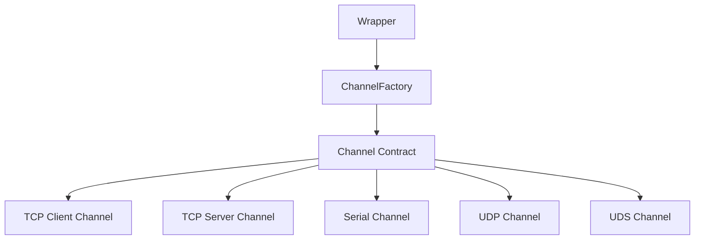

`ChannelFactory`는 config를 보고 적절한 Channel 구현체를 생성한다.
Wrapper는 어떤 concrete transport가 생성되는지 세부적으로 알 필요 없이, 반환된 Channel 계약에만 의존하면 된다.

## Factory가 필요한 이유

Factory가 없다면 wrapper 내부에는 transport 선택 로직이 들어가야 한다.

```cpp
if (type == TransportType::TcpClient) {
    channel = TcpClientTransport::create(...);
} else if (type == TransportType::Serial) {
    channel = SerialTransport::create(...);
} else if (type == TransportType::Udp) {
    channel = UdpChannel::create(...);
}
```

처음에는 단순해 보이지만, transport가 늘어나고 설정이 복잡해질수록 wrapper가 점점 많은 책임을 갖게 된다.

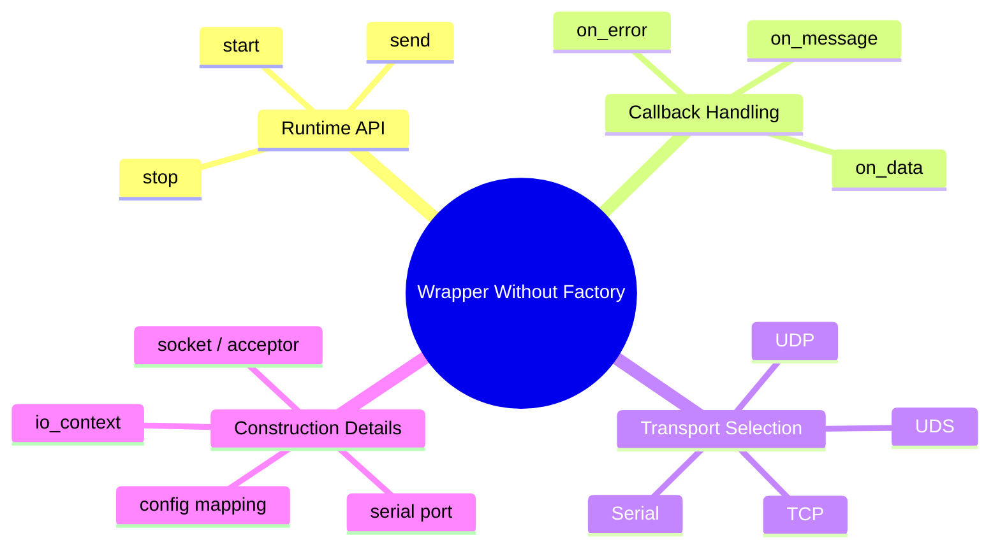

Wrapper는 사용자가 실제로 다루는 실행 객체다.
따라서 wrapper의 책임은 lifecycle, send, callback, stats 같은 public runtime API에 집중하는 편이 좋다.

Transport 선택과 생성은 별도의 계층으로 분리하는 것이 더 자연스럽다.

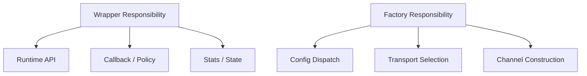

이렇게 나누면 wrapper는 “어떻게 동작할 것인가”에 집중하고, factory는 “어떤 구현체를 만들 것인가”에 집중할 수 있다.

## ChannelFactory의 역할

`ChannelFactory`의 역할은 명확하다.

입력으로 config를 받고, 그 config에 맞는 concrete Channel을 생성한다.

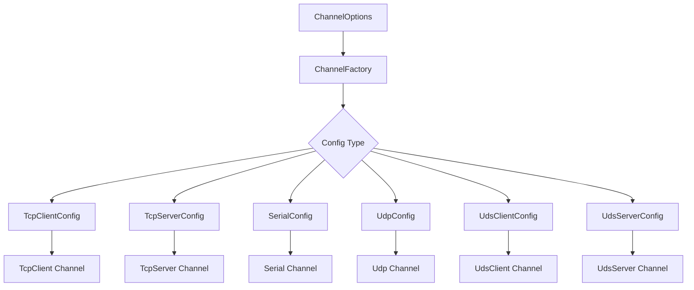

개념적으로 보면 다음과 같다.

```cpp
class ChannelFactory {
public:
    using ChannelOptions = std::variant<
        TcpClientConfig,
        TcpServerConfig,
        SerialConfig,
        UdpConfig,
        UdsClientConfig,
        UdsServerConfig
    >;

    static std::shared_ptr<Channel> create(
        const ChannelOptions& options,
        std::shared_ptr<boost::asio::io_context> external_ioc = nullptr);
};
```

여기서 핵심은 `ChannelOptions`다.
하나의 factory function이 여러 config 타입을 받을 수 있도록 `std::variant`를 사용한다.

즉, factory는 문자열이나 enum만으로 transport 종류를 선택하지 않는다.
config 타입 자체가 어떤 transport를 생성해야 하는지 표현한다.

## Config가 생성 의도를 표현한다

Factory에서 중요한 설계 포인트는 생성 조건을 config 타입으로 표현한다는 점이다.

TCP client를 만들려면 `TcpClientConfig`가 필요하다.
TCP server를 만들려면 `TcpServerConfig`가 필요하다.
Serial을 만들려면 `SerialConfig`가 필요하다.
UDP를 만들려면 `UdpConfig`가 필요하다.

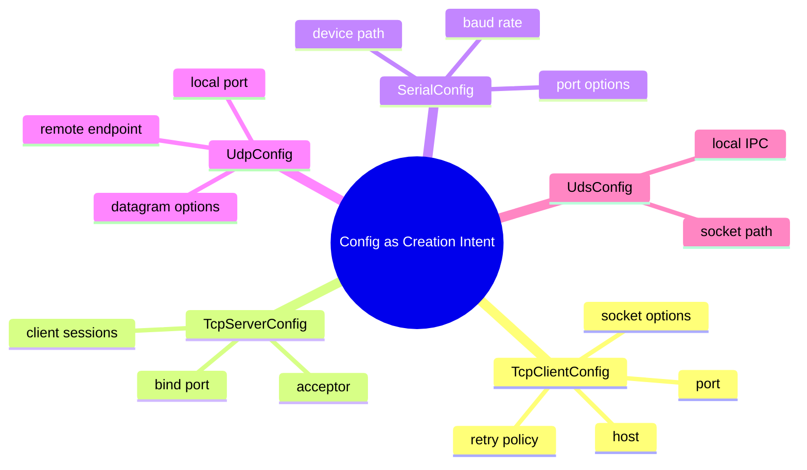

이 방식은 생성 의도를 명시적으로 만든다.

```cpp
config::TcpClientConfig cfg;
cfg.host = "127.0.0.1";
cfg.port = 9000;

auto channel = ChannelFactory::create(cfg);
```

이 코드를 읽으면 어떤 Channel을 만들려는지 분명하다.
별도의 `TransportType::TcpClient` 같은 enum을 추가로 전달하지 않아도 된다.

Config 타입이 곧 생성 의도를 나타낸다.

## std::variant와 std::visit

`ChannelFactory`는 여러 config 타입을 `std::variant`로 묶고, `std::visit`을 통해 실제 타입별 생성 함수로 분기한다.

개념적으로는 다음과 같은 구조다.

```cpp
std::shared_ptr<Channel> ChannelFactory::create(
    const ChannelOptions& options,
    std::shared_ptr<boost::asio::io_context> external_ioc) {
    return std::visit(
        [&external_ioc](const auto& config) -> std::shared_ptr<Channel> {
            using T = std::decay_t<decltype(config)>;

            if constexpr (std::is_same_v<T, TcpClientConfig>) {
                return create_tcp_client(config, external_ioc);
            } else if constexpr (std::is_same_v<T, SerialConfig>) {
                return create_serial(config, external_ioc);
            } else if constexpr (std::is_same_v<T, UdpConfig>) {
                return create_udp(config, external_ioc);
            }
        },
        options);
}
```

이 구조에는 몇 가지 장점이 있다.

첫째, 지원 가능한 config 타입이 `ChannelOptions`에 명시된다.
어떤 transport를 factory가 생성할 수 있는지 타입 수준에서 확인할 수 있다.

둘째, 각 config 타입에 대한 생성 경로가 컴파일 타임 분기로 정리된다.
`if constexpr`를 사용하면 타입별 생성 로직을 명확히 나눌 수 있다.

셋째, 잘못된 타입이 들어오는 경로를 줄일 수 있다.
`std::variant`에 포함되지 않은 config 타입은 애초에 `ChannelOptions`로 전달될 수 없다.

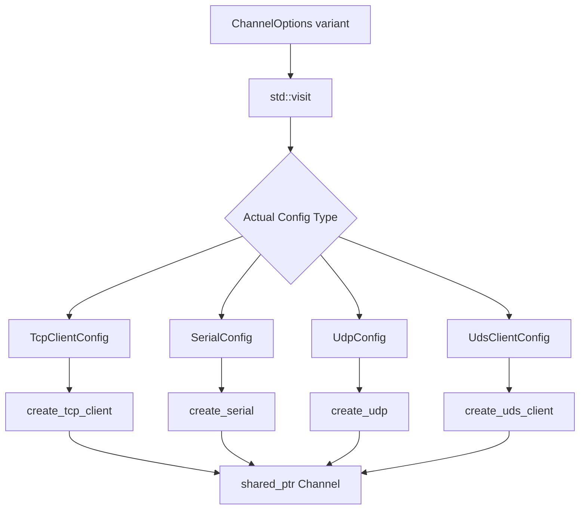

여기서 중요한 점은 `std::variant`가 지원 가능한 config 집합을 닫힌 타입 집합으로 만든다는 것이다.

전통적인 `enum` + `switch` 방식이나 문자열 기반 factory에서는 transport type과 config payload가 따로 움직일 수 있다. 예를 들어 type은 TCP인데 config는 Serial용 구조체인 잘못된 조합을 만들 여지가 생긴다. 이런 오류는 런타임에서야 드러날 가능성이 높다.

반면 `std::variant` 기반 구조에서는 factory가 받을 수 있는 config 타입의 목록이 타입 시스템 안에 들어간다.
새로운 transport를 추가하려면 `ChannelOptions`에 config 타입을 추가해야 하고, `std::visit` 분기에서 해당 타입을 처리해야 한다. 이 과정에서 누락된 분기는 컴파일 단계에서 드러날 수 있다.

또한 `dynamic_cast`나 런타임 타입 검사에 의존하지 않고, config의 실제 타입에 따라 생성 경로를 정할 수 있다.
즉, Factory는 런타임 문자열 비교나 불안정한 downcast보다, 타입으로 생성 경로를 정리하는 방식을 선택했다.

이 설계의 핵심은 단순히 “여러 타입을 받을 수 있다”가 아니다.
지원 가능한 config 집합을 명시적으로 닫아두고, 타입 기반 dispatch로 생성 책임을 안전하게 관리하는 데 있다.

## 외부 io_context 지원

통신 라이브러리에서 `io_context` 관리는 중요한 설계 포인트다.

라이브러리가 내부 `io_context`를 직접 관리할 수도 있고, 사용자가 외부에서 관리하는 `io_context`를 주입할 수도 있다.

unilink의 `ChannelFactory`는 optional external `io_context`를 받는다.

```cpp
static std::shared_ptr<Channel> create(
    const ChannelOptions& options,
    std::shared_ptr<boost::asio::io_context> external_ioc = nullptr);
```

이 인자는 생성되는 transport가 어떤 runtime context에서 동작할지 결정한다.

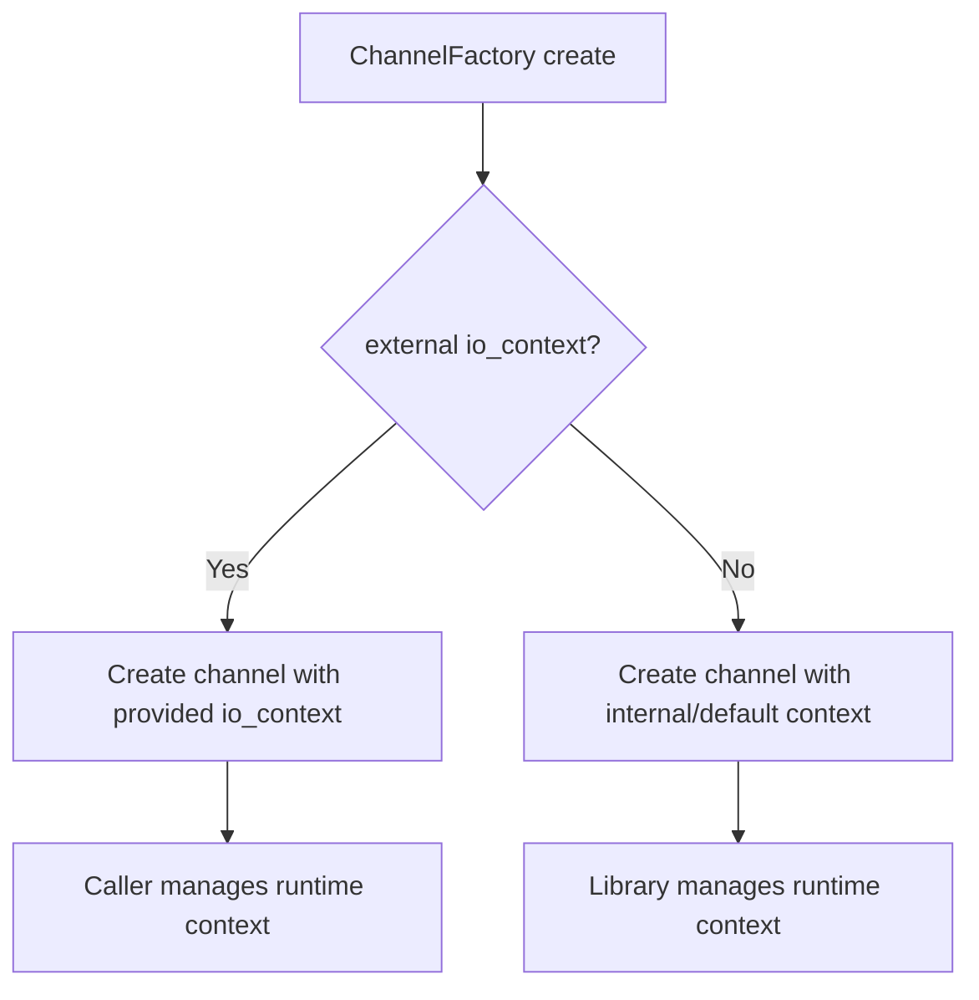

외부 `io_context`를 지원하면 사용자는 여러 channel을 하나의 event loop에 묶거나, 이미 존재하는 application-level runtime에 unilink channel을 통합할 수 있다.

반대로 external context를 제공하지 않으면 transport가 내부 context를 사용해 동작할 수 있다.

이 선택지를 factory에서 처리하면 wrapper는 context 생성 방식에 대해 덜 알게 된다.
Wrapper는 반환된 Channel을 사용하면 되고, context 사용 방식은 factory와 transport 생성 로직이 담당한다.

## Transport별 생성 함수

`ChannelFactory`는 내부적으로 transport별 생성 함수를 가진다.

```cpp
static std::shared_ptr<Channel> create_tcp_client(
    const TcpClientConfig& cfg,
    std::shared_ptr<boost::asio::io_context> external_ioc);

static std::shared_ptr<Channel> create_serial(
    const SerialConfig& cfg,
    std::shared_ptr<boost::asio::io_context> external_ioc);

static std::shared_ptr<Channel> create_udp(
    const UdpConfig& cfg,
    std::shared_ptr<boost::asio::io_context> external_ioc);
```

이 방식은 `create()` 함수 하나에 모든 transport 생성 세부사항을 몰아넣지 않기 위한 선택이다.

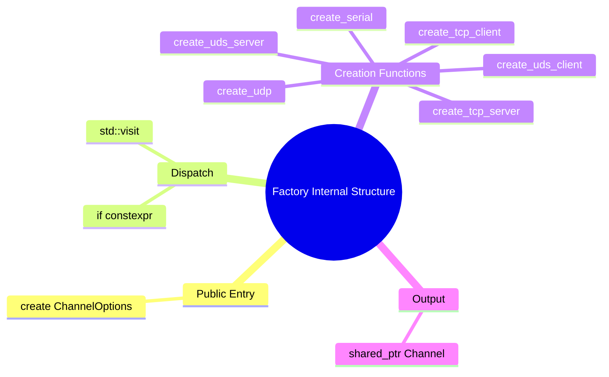

외부에서 보면 factory는 단일 진입점을 제공한다.
내부에서는 transport별 생성 함수로 분리되어 있어 각 transport의 생성 조건을 독립적으로 다룰 수 있다.

예를 들어 Serial은 serial port 객체가 필요할 수 있고, TCP server는 acceptor 객체가 필요할 수 있다.
UDP는 local port와 endpoint 설정이 중요하고, UDS는 socket path가 중요하다.

Factory 내부에서 이 차이를 감싸면 wrapper는 이런 세부 차이를 몰라도 된다.

## Wrapper와 Factory의 관계

Wrapper는 `ChannelFactory`를 통해 Channel을 얻는다.

Wrapper가 직접 TCP transport를 생성하지 않고, config를 만든 뒤 factory에 생성을 위임하면 구조가 단순해진다.

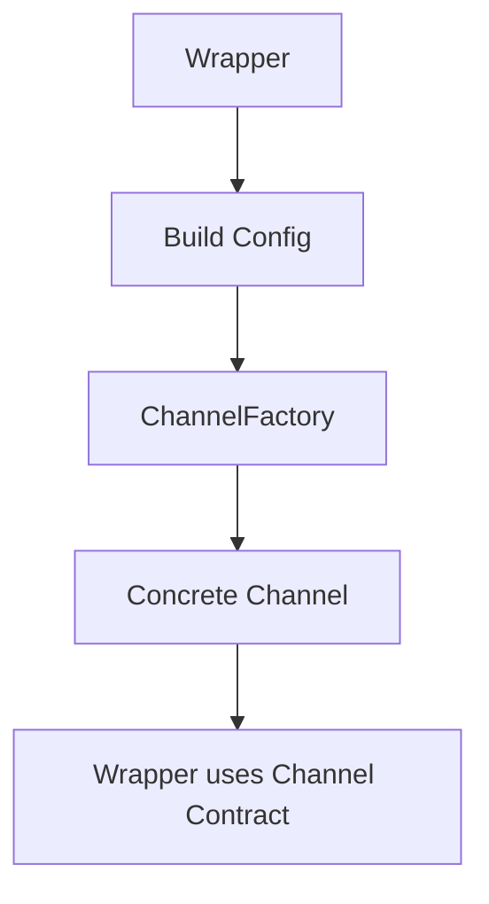

이 구조에서 wrapper의 역할은 config를 구성하고, 생성된 Channel을 사용해 runtime API를 제공하는 것이다.

Factory의 역할은 config에 맞는 concrete channel을 선택하고 생성하는 것이다.

Transport의 역할은 실제 protocol-specific I/O를 수행하는 것이다.

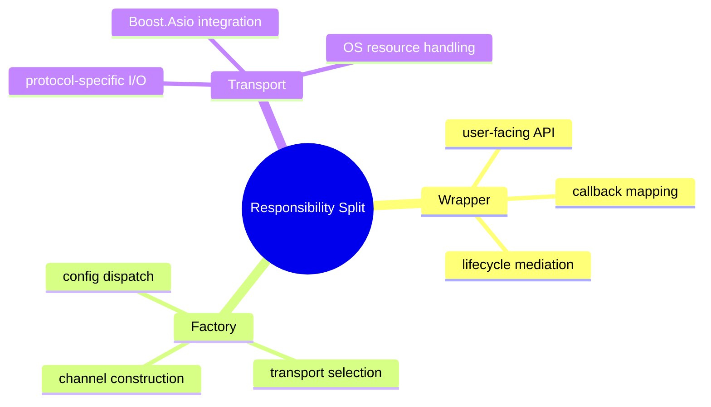

이 책임 분리는 unilink 구조에서 중요하다.
Wrapper가 transport 선택까지 담당하면 wrapper는 점점 무거워지고, transport가 늘어날수록 변경 영향을 받게 된다.

Factory를 분리하면 transport 추가나 생성 방식 변경이 wrapper에 직접 퍼지는 것을 줄일 수 있다.

## Factory와 Dependency Injection

Factory는 dependency injection과도 연결된다.

Wrapper는 concrete transport를 직접 생성하지 않고 Channel 계약을 받거나, factory를 통해 생성된 Channel을 사용한다.
이 구조는 wrapper가 구체 transport 타입에 강하게 묶이는 것을 줄인다.

```cpp
class TcpClient {
public:
    explicit TcpClient(std::shared_ptr<Channel> channel)
        : channel_(std::move(channel)) {}

private:
    std::shared_ptr<Channel> channel_;
};
```

이런 구조에서는 실제 TCP channel 대신 test double이나 mock channel을 넣을 수 있다.
또한 production code에서는 factory가 concrete transport를 생성하고, test code에서는 직접 fake channel을 주입할 수 있다.

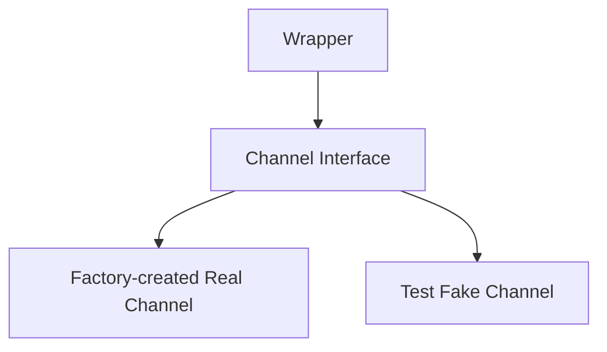

Factory는 production path에서 concrete channel을 생성하고, DI 구조는 wrapper가 concrete transport에 직접 의존하지 않게 만든다.

이 관점에서 ChannelFactory는 단순한 객체 생성 유틸리티가 아니라, 의존성 방향을 정리하는 아키텍처 요소다.

## Factory 설계의 Trade-off

Factory 계층을 두는 것도 비용이 있다.

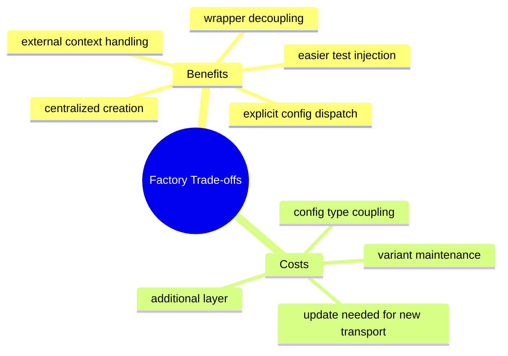

첫 번째 비용은 계층이 하나 더 늘어난다는 점이다.
Wrapper가 직접 transport를 생성하면 코드 흐름은 짧아질 수 있다. Factory를 두면 생성 경로가 한 단계 더 생긴다.

두 번째 비용은 `ChannelOptions` 유지 비용이다.
새로운 transport config가 추가되면 variant에 타입을 추가하고, `std::visit` 분기와 생성 함수를 함께 추가해야 한다.

세 번째 비용은 factory가 config 타입을 알게 된다는 점이다.
Factory는 transport 선택을 담당하는 만큼, 지원하는 config 타입과 transport 생성 방식에 대한 지식을 가진다.

하지만 이 비용은 wrapper와 transport 구현을 분리하기 위해 감수할 만하다.
생성 책임을 factory에 모으면 wrapper는 실행 객체로서의 역할에 집중할 수 있고, transport 추가와 생성 방식 변경도 한 곳에서 관리할 수 있다.

## 정리

ChannelFactory는 config를 기반으로 concrete Channel 구현체를 생성하는 계층이다.

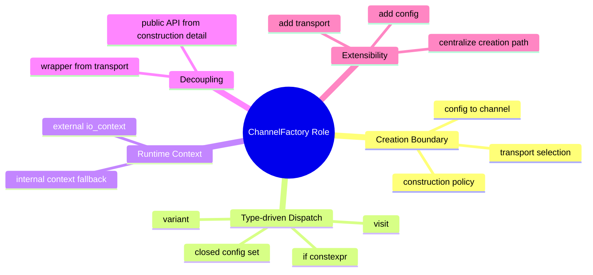

정리하면 다음과 같다.

- ChannelFactory는 Wrapper와 concrete transport 생성 로직을 분리한다.
- Config 타입이 생성 의도를 표현한다.
- `std::variant`는 factory가 지원하는 config 집합을 닫힌 타입 집합으로 만든다.
- `std::visit`과 `if constexpr`는 config 타입별 생성 경로를 타입 기반으로 정리한다.
- 외부 `io_context`를 지원해 runtime context 주입 경로를 제공한다.
- Factory는 production path에서 concrete Channel을 만들고, DI 관점에서는 wrapper가 Channel 계약에만 의존하게 돕는다.
- 새로운 transport가 추가되면 factory의 variant와 생성 함수가 명확한 확장 지점이 된다.

Channel 계층이 “통신 행위의 공통 계약”이라면, ChannelFactory는 그 계약을 만족하는 concrete 구현체를 선택하고 생성하는 경계다.
이 구조 덕분에 unilink는 wrapper의 public API를 안정적으로 유지하면서도, 내부 transport 구현과 생성 방식을 독립적으로 확장할 수 있다.
