## 도입: 추상화된 Channel에서 실제 I/O로

Channel은 통신 행위를 추상화한 공통 계약이다.
Wrapper는 Channel 계약에 의존하고, ChannelFactory는 config를 기반으로 concrete Channel 구현체를 생성한다.

하지만 결국 데이터는 실제 네트워크 socket이나 serial port를 통해 이동해야 한다.
`start`, `stop`, `async_write`, `on_bytes`, `on_state` 같은 Channel 계약은 그 자체로 동작하지 않는다. 이 계약을 TCP, UDP, Serial, UDS 같은 실제 통신 방식에 맞게 구현하는 계층이 필요하다.

unilink에서 이 역할을 담당하는 것이 Transport 계층이다.

Transport는 public API가 아니다.
사용자가 직접 다루기보다는 Wrapper와 Channel 뒤에 숨어 있는 내부 구현 계층이다. 그러나 실제 비동기 I/O, socket 상태, reconnect, send queue, backpressure, error mapping, runtime statistics 같은 핵심 동작은 대부분 이 계층에서 발생한다.

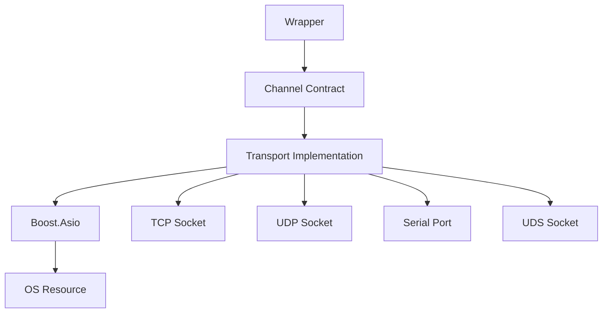
```mermaid
flowchart TD
    A[Wrapper] --> B[Channel Contract]
    B --> C[Transport Implementation]
    C --> D[Boost.Asio]
    D --> E[OS Resource]

    C --> C1[TCP Socket]
    C --> C2[UDP Socket]
    C --> C3[Serial Port]
    C --> C4[UDS Socket]
```

Transport 계층은 unilink에서 가장 구현 세부사항이 많은 영역이다.
이 글에서는 Transport를 “프로토콜 구현체”로만 보지 않고, Channel 계약을 실제 비동기 I/O로 변환하는 실행 계층이라는 관점에서 정리한다.

## Transport의 역할

Transport는 concrete Channel이다.
즉, `interface::Channel`이 정의한 공통 계약을 실제 protocol-specific I/O로 구현한다.

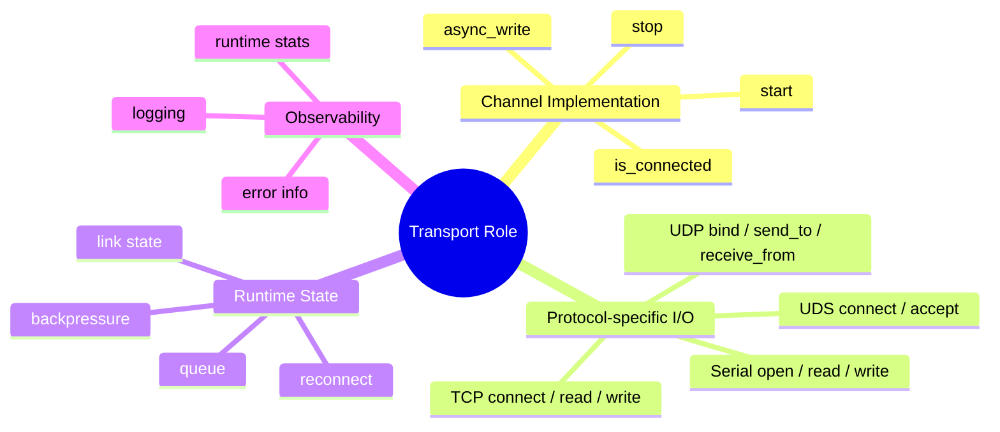
```mermaid
mindmap
  root((Transport Role))
    Channel Implementation
      start
      stop
      is_connected
      async_write
    Protocol-specific I/O
      TCP connect / read / write
      UDP bind / send_to / receive_from
      Serial open / read / write
      UDS connect / accept
    Runtime State
      link state
      reconnect
      queue
      backpressure
    Observability
      runtime stats
      error info
      logging
```

Transport가 담당하는 일은 단순히 Boost.Asio 함수를 호출하는 것이 아니다.

Transport는 다음을 함께 관리한다.

* 통신 리소스의 생성과 정리
* 비동기 read/write 루프
* 연결 상태 전이
* 재연결 정책
* 송신 queue
* backpressure
* callback 이벤트 발생
* 통계와 에러 정보 기록

따라서 Transport는 unilink에서 실제 runtime behavior가 모이는 계층이라고 볼 수 있다.

## Channel 계약 구현

Transport는 Channel 계약을 구현한다.

개념적으로 보면 다음과 같다.

```cpp
class TcpClient : public Channel {
public:
    void start() override;
    void stop() override;
    bool is_connected() const override;
    bool is_backpressure_active() const override;

    bool async_write_copy(ConstByteSpan data) override;
    bool async_write_move(std::vector<uint8_t>&& data) override;
    bool async_write_shared(std::shared_ptr<const std::vector<uint8_t>> data) override;

    void on_bytes(OnBytes callback) override;
    void on_state(OnState callback) override;
    void on_backpressure(OnBackpressure callback) override;
};
```

이 인터페이스는 transport별 세부사항을 외부에 노출하지 않는다.
TCP client는 내부적으로 resolver, socket, timer, strand를 사용하지만, Channel 계약을 통해 외부에 드러나는 것은 공통 동작이다.

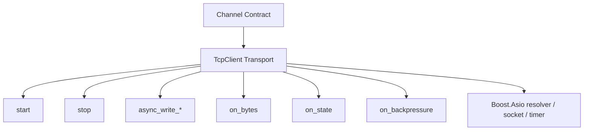
```mermaid
flowchart TD
    A[Channel Contract] --> B[TcpClient Transport]

    B --> C[start]
    B --> D[stop]
    B --> E[async_write_*]
    B --> F[on_bytes]
    B --> G[on_state]
    B --> H[on_backpressure]

    B --> I[Boost.Asio resolver / socket / timer]
```

이 구조의 핵심은 Transport가 내부 구현의 자유를 가지면서도, 외부에는 Channel 계약을 유지한다는 점이다.

Wrapper는 `TcpClient` transport인지, `Serial` transport인지 직접 알 필요가 없다.
Transport는 Channel 계약을 지키는 한 내부 구현을 자유롭게 바꿀 수 있다.

## Boost.Asio 기반 실행 모델

unilink Transport 계층은 Boost.Asio 기반으로 동작한다.

TCP client를 예로 들면, 내부 구현은 `io_context`, `strand`, `socket`, `resolver`, `steady_timer`, work guard, thread 등을 관리한다.
이 구성은 비동기 connect, read, write, timeout, retry를 처리하기 위한 실행 기반이다.

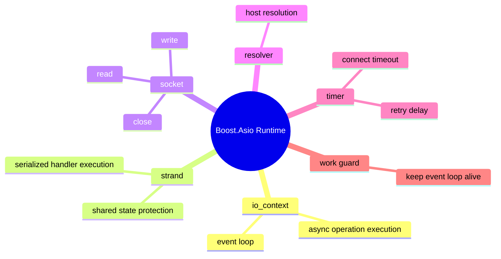
```mermaid
mindmap
  root((Boost.Asio Runtime))
    io_context
      event loop
      async operation execution
    strand
      serialized handler execution
      shared state protection
    socket
      read
      write
      close
    resolver
      host resolution
    timer
      connect timeout
      retry delay
    work guard
      keep event loop alive
```

Transport는 `start()`가 호출되면 비동기 실행 루프를 준비하고, 필요한 경우 내부 `io_context`를 실행한다. 이후 비동기 resolve/connect/read/write 작업은 Boost.Asio handler를 통해 진행된다.

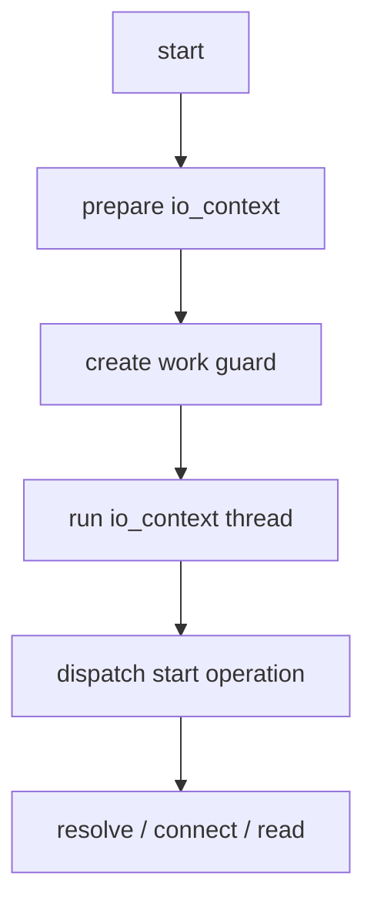
```mermaid
flowchart TD
    A[start] --> B[prepare io_context]
    B --> C[create work guard]
    C --> D[run io_context thread]
    D --> E[dispatch start operation]
    E --> F[resolve / connect / read]
```

이 구조는 사용자가 blocking connect나 blocking read를 직접 다루지 않게 만든다.
Transport 내부에서 비동기 작업을 구성하고, 결과는 Channel callback으로 전달한다.

## Strand와 상태 일관성

비동기 I/O에서는 여러 handler가 서로 다른 시점에 실행된다.
connect handler, read handler, write handler, retry timer, stop 요청이 겹치면 socket 상태, queue 상태, link state가 서로 충돌할 수 있다.

Transport는 이런 문제를 줄이기 위해 `strand`를 사용한다.

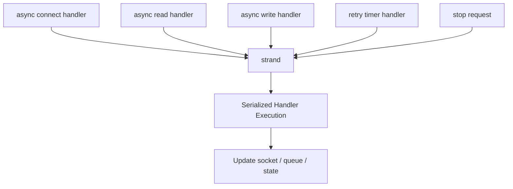
```mermaid
flowchart TD
    A[async connect handler] --> S[strand]
    B[async read handler] --> S
    C[async write handler] --> S
    D[retry timer handler] --> S
    E[stop request] --> S

    S --> F[Serialized Handler Execution]
    F --> G[Update socket / queue / state]
```

`strand`의 핵심은 handler 실행 순서를 직렬화한다는 점이다.
같은 strand에 dispatch/post된 handler들은 동시에 실행되지 않으므로, transport 내부의 socket, queue, state transition 같은 공유 상태를 더 예측 가능하게 관리할 수 있다.

이 지점에서 단순한 `std::mutex`와 차이가 있다.
비동기 callback 내부에서 mutex로 긴 구간을 보호하면 I/O thread가 blocking되어 event loop 전체의 응답성을 떨어뜨릴 수 있다. 반면 `strand`는 handler의 실행 순서 자체를 비동기 실행 모델 안에서 직렬화하므로, 불필요한 blocking 구간을 줄이면서 상태 변경 순서를 제어할 수 있다.

물론 `strand`가 모든 동시성 문제를 자동으로 해결하는 것은 아니다.
callback 저장, 외부 thread에서 호출되는 API, stop 처리, stats 조회처럼 strand 밖에서 접근될 수 있는 상태는 mutex나 atomic state가 여전히 필요하다.

따라서 Transport 계층은 `strand`, `atomic`, `mutex`, sequence id 같은 장치를 조합해 상태 일관성을 유지한다.

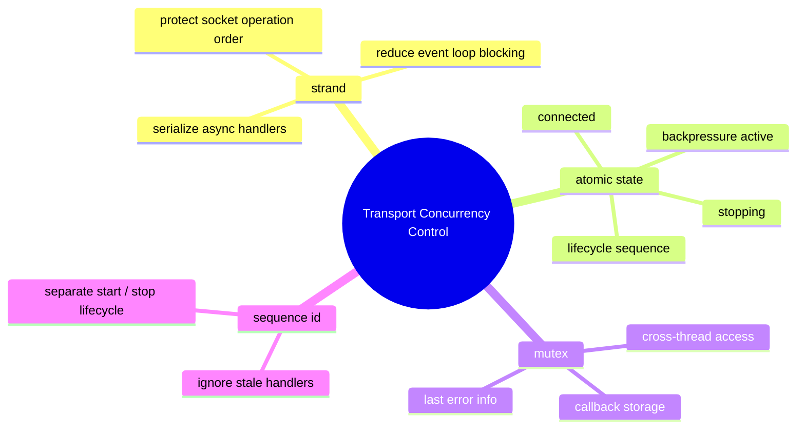
```mermaid
mindmap
  root((Transport Concurrency Control))
    strand
      serialize async handlers
      protect socket operation order
      reduce event loop blocking
    atomic state
      connected
      stopping
      backpressure active
      lifecycle sequence
    mutex
      callback storage
      last error info
      cross-thread access
    sequence id
      ignore stale handlers
      separate start / stop lifecycle
```

중요한 것은 하나의 도구로 모든 동시성을 해결하려 하지 않는 것이다.
I/O handler 순서는 `strand`로 정리하고, thread boundary를 넘는 상태는 mutex나 atomic으로 보호한다. 이 조합이 Transport 계층의 비동기 상태 관리를 구성한다.

## Lifecycle과 상태 전이

Transport는 단순히 socket을 열고 닫는 계층이 아니다.
연결 상태를 추적하고, 상태 변화를 Channel callback으로 전달해야 한다.

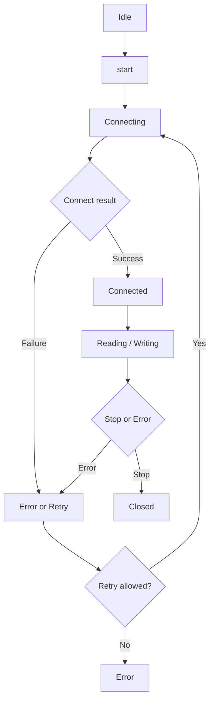
```mermaid
flowchart TD
    A[Idle] --> B[start]
    B --> C[Connecting]
    C --> D{Connect result}

    D -- Success --> E[Connected]
    D -- Failure --> F[Error or Retry]

    E --> G[Reading / Writing]

    G --> H{Stop or Error}
    H -- Stop --> I[Closed]
    H -- Error --> F

    F --> J{Retry allowed?}
    J -- Yes --> C
    J -- No --> K[Error]
```

TCP client의 경우 `start()`는 내부적으로 resolve/connect 흐름을 시작한다.
연결에 성공하면 `Connected` 상태로 전이하고, 실패하면 error 또는 retry 흐름으로 이동한다.

UDP나 Serial은 상태 전이의 의미가 다를 수 있다.
UDP는 TCP처럼 연결이 성립되는 구조가 아니며, Serial은 장치 open 상태가 핵심이다. 그러나 Channel 계약은 이런 transport별 차이를 공통 상태 이벤트로 정리한다.

Transport 계층의 역할은 각 protocol-specific 상태를 unilink의 공통 link state로 매핑하는 것이다.

## Read Path: raw bytes에서 Channel 이벤트로

Transport는 실제 I/O 리소스에서 데이터를 읽는다.
그런 다음 읽은 byte buffer를 Channel의 `on_bytes` callback으로 전달한다.

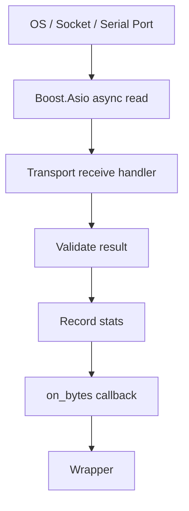
```mermaid
flowchart TD
    A[OS / Socket / Serial Port] --> B[Boost.Asio async read]
    B --> C[Transport receive handler]
    C --> D[Validate result]
    D --> E[Record stats]
    E --> F[on_bytes callback]
    F --> G[Wrapper]
```

Transport는 데이터를 message 단위로 해석하지 않는다.
TCP나 Serial은 stream 기반이므로 read handler에서 받은 데이터가 완성된 message라는 보장이 없다.

따라서 Transport는 raw byte 단위의 이벤트를 전달하고, message framing은 Wrapper 또는 Framer 계층에서 처리하는 것이 더 자연스럽다.

이러한 분리로 각 모듈은 본업에 집중할 수 있다.

Transport는 I/O에 집중한다.
Framer는 message boundary에 집중한다.
Wrapper는 사용자-facing callback으로 변환한다.

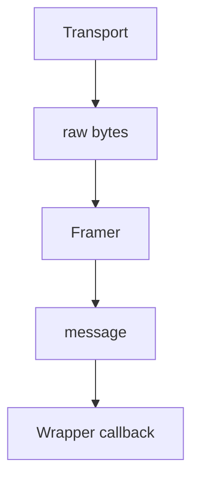
```mermaid
flowchart TD
    A[Transport] --> B[raw bytes]
    B --> C[Framer]
    C --> D[message]
    D --> E[Wrapper callback]
```

이렇게 나누면 Transport가 protocol I/O와 application message parsing을 동시에 책임지지 않아도 된다.

## Write Path: API 요청에서 async write까지

송신 경로는 수신 경로보다 더 복잡하다.
데이터를 바로 socket에 쓰는 것이 아니라, queue, backpressure, buffer ownership, write in-progress 상태를 함께 고려해야 하기 때문이다.

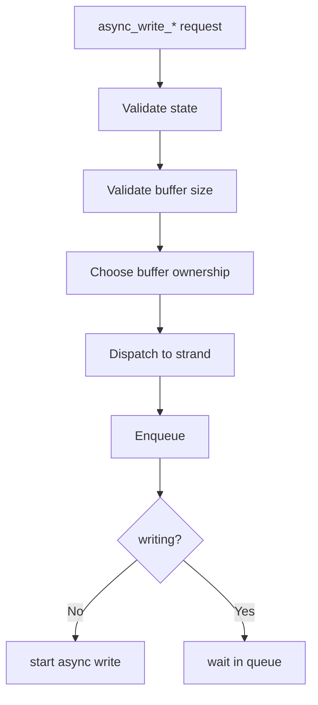
```mermaid
flowchart TD
    A[async_write_* request] --> B[Validate state]
    B --> C[Validate buffer size]
    C --> D[Choose buffer ownership]
    D --> E[Dispatch to strand]
    E --> F[Enqueue]
    F --> G{writing?}
    G -- No --> H[start async write]
    G -- Yes --> I[wait in queue]
```

unilink Transport는 여러 송신 API를 제공한다.

* `async_write_copy`: 데이터를 내부 queue로 복사한다.
* `async_write_move`: `std::vector<uint8_t>`의 ownership을 transport로 이동한다.
* `async_write_shared`: `std::shared_ptr<const std::vector<uint8_t>>`로 공유 ownership을 유지한다.

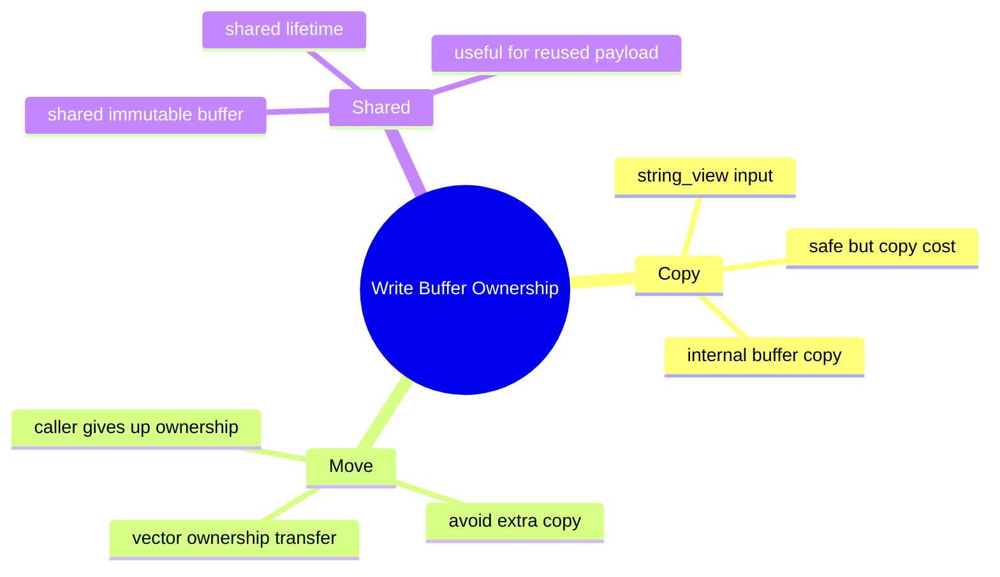
```mermaid
mindmap
  root((Write Buffer Ownership))
    Copy
      string_view input
      internal buffer copy
      safe but copy cost
    Move
      vector ownership transfer
      avoid extra copy
      caller gives up ownership
    Shared
      shared immutable buffer
      shared lifetime
      useful for reused payload
```

이 API들은 단순한 편의 기능이 아니다.
비동기 write에서 가장 흔한 문제 중 하나는 buffer lifetime이다.

Boost.Asio의 async write는 호출 직후 완료되는 것이 아니라, 나중에 handler에서 완료된다.
따라서 write operation이 완료될 때까지 buffer가 살아 있어야 한다. 만약 caller가 넘긴 임시 buffer나 local buffer를 그대로 참조하면, 실제 write가 수행되기 전에 buffer가 사라져 dangling pointer 문제가 발생할 수 있다.

unilink는 이 문제를 API 차원에서 분리한다.

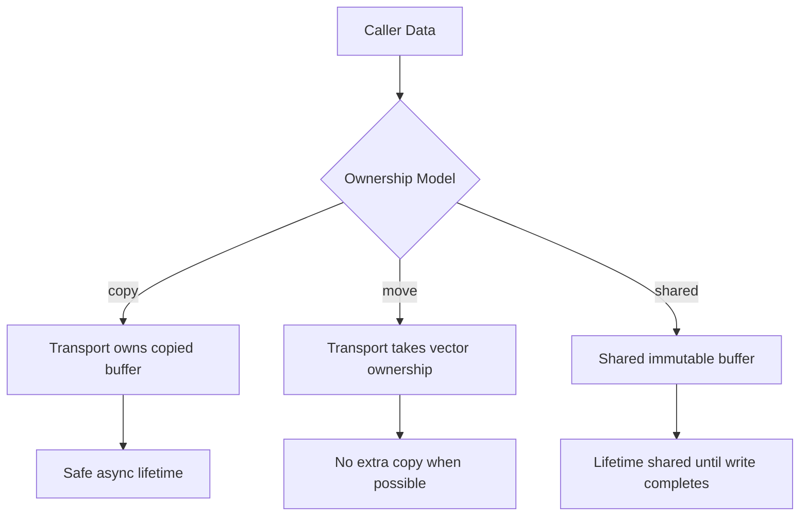
```mermaid
flowchart TD
    A[Caller Data] --> B{Ownership Model}

    B -- copy --> C[Transport owns copied buffer]
    C --> D[Safe async lifetime]

    B -- move --> E[Transport takes vector ownership]
    E --> F[No extra copy when possible]

    B -- shared --> G[Shared immutable buffer]
    G --> H[Lifetime shared until write completes]
```

`copy` 방식은 비용이 있지만 안전하다.
`move` 방식은 caller가 ownership을 넘기므로 추가 복사를 줄일 수 있다.
`shared` 방식은 동일 payload를 여러 곳에서 참조하거나, 비동기 완료 시점까지 명확한 lifetime을 유지해야 할 때 유용하다.

이렇게 ownership 모델을 명시적으로 나누면, 사용자는 성능과 안전성 사이에서 의도적인 선택을 할 수 있고, Transport는 async write가 완료될 때까지 필요한 buffer lifetime을 보장할 수 있다.

송신 API는 이후 queue와 backpressure 정책을 거쳐 실제 async write로 이어진다.

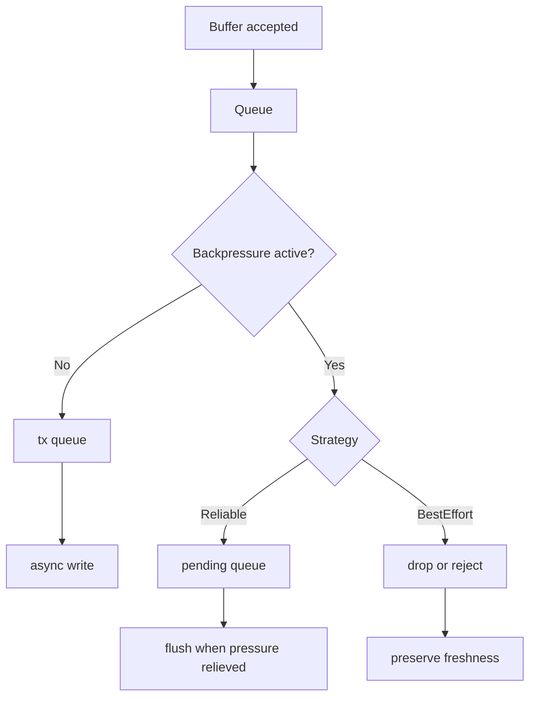
```mermaid
flowchart TD
    A[Buffer accepted] --> B[Queue]
    B --> C{Backpressure active?}

    C -- No --> D[tx queue]
    D --> E[async write]

    C -- Yes --> F{Strategy}
    F -- Reliable --> G[pending queue]
    F -- BestEffort --> H[drop or reject]

    G --> I[flush when pressure relieved]
    H --> J[preserve freshness]
```

따라서 Transport의 write path는 단순한 `socket.write()` 호출이 아니다.
buffer lifetime, queue pressure, ownership transfer, async completion을 함께 관리하는 데이터 파이프라인이다.

## Backpressure와 Queue 관리

Transport 계층은 송신 queue와 backpressure도 관리한다.

애플리케이션이 데이터를 생성하는 속도가 실제 전송 속도보다 빠르면 queue가 증가한다.
이때 무조건 계속 쌓으면 메모리 사용량과 지연이 증가한다. 반대로 무조건 버리면 신뢰성이 떨어진다.

Transport는 backpressure strategy에 따라 queue를 다르게 처리한다.

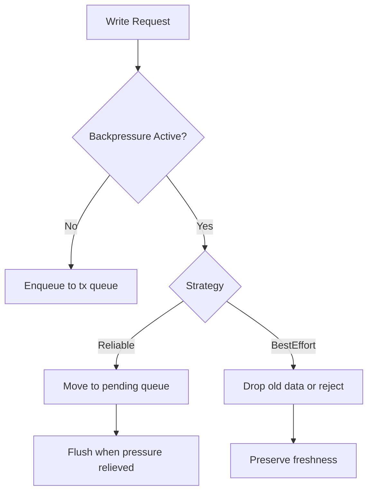
```mermaid
flowchart TD
    A[Write Request] --> B{Backpressure Active?}

    B -- No --> C[Enqueue to tx queue]

    B -- Yes --> D{Strategy}

    D -- Reliable --> E[Move to pending queue]
    E --> F[Flush when pressure relieved]

    D -- BestEffort --> G[Drop old data or reject]
    G --> H[Preserve freshness]
```

Reliable 전략에서는 backpressure 상황에서도 데이터를 가능한 보존하려고 한다.
BestEffort 전략에서는 최신성을 우선해 오래된 데이터를 버릴 수 있다.

Transport는 queue size, pending bytes, high/low watermark, backpressure event를 관찰하고, 필요하면 `on_backpressure` callback으로 상태를 전달한다.

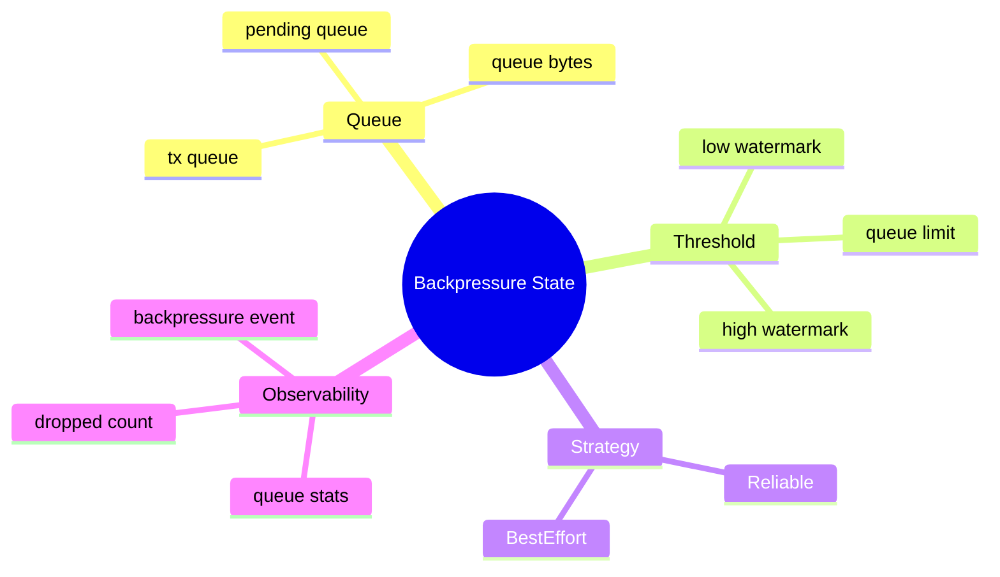
```mermaid
mindmap
  root((Backpressure State))
    Queue
      tx queue
      pending queue
      queue bytes
    Threshold
      high watermark
      low watermark
      queue limit
    Strategy
      Reliable
      BestEffort
    Observability
      backpressure event
      dropped count
      queue stats
```

Backpressure는 단순한 내부 최적화가 아니다.
통신 라이브러리의 runtime behavior를 결정하는 중요한 정책이다.

## Error 처리와 상태 보고

Transport는 Boost.Asio error code를 그대로 사용자에게 노출하지 않는다.
내부적으로 error를 기록하고, 공통 error context 또는 link state로 변환할 수 있어야 한다.

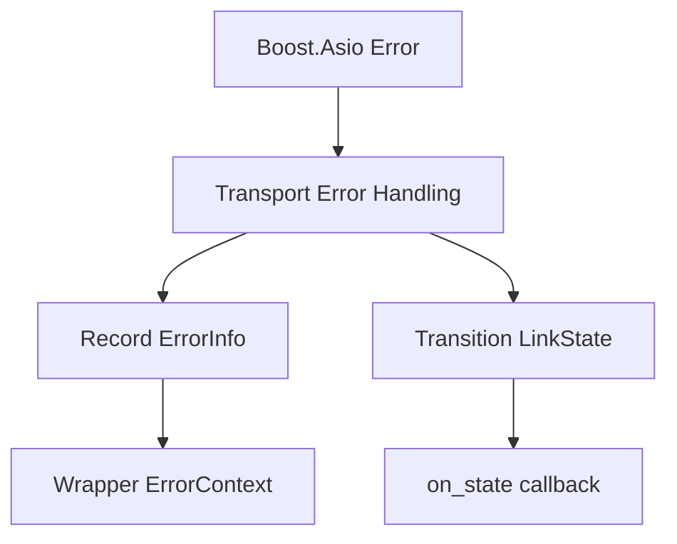
```mermaid
flowchart TD
    A[Boost.Asio Error] --> B[Transport Error Handling]
    B --> C[Record ErrorInfo]
    B --> D[Transition LinkState]
    D --> E[on_state callback]
    C --> F[Wrapper ErrorContext]
```

Transport 계층에서는 다음과 같은 에러가 발생할 수 있다.

* resolve 실패
* connect 실패
* read 실패
* write 실패
* timeout
* socket close
* queue limit 초과
* callback exception

이런 에러를 모두 개별 transport 내부에만 가두면 wrapper나 사용자는 원인을 알기 어렵다.
따라서 Transport는 error를 기록하고, 상태 전이를 발생시키며, 필요하면 wrapper가 이를 사용자-facing error callback으로 변환할 수 있도록 정보를 제공한다.

## RuntimeStats

Transport는 runtime statistics를 기록한다.

송신이 몇 번 수락되었는지, 실제로 몇 byte가 전송되었는지, 수신량은 얼마인지, drop이 발생했는지, queue가 얼마나 쌓였는지 같은 정보는 통신 문제를 분석할 때 중요하다.

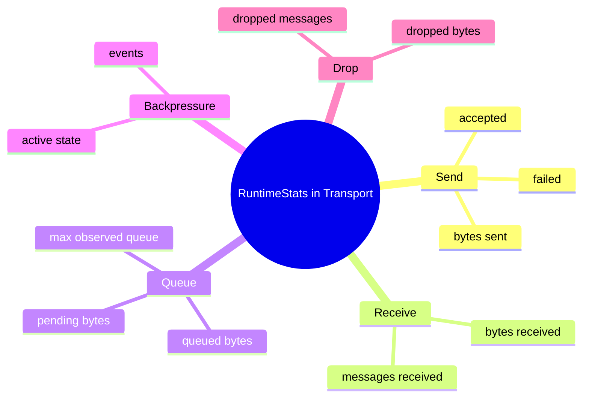
```mermaid
mindmap
  root((RuntimeStats in Transport))
    Send
      accepted
      failed
      bytes sent
    Receive
      bytes received
      messages received
    Queue
      queued bytes
      pending bytes
      max observed queue
    Backpressure
      active state
      events
    Drop
      dropped messages
      dropped bytes
```

Transport는 실제 I/O가 일어나는 위치이기 때문에, 가장 정확한 통계를 기록할 수 있다.
Wrapper는 이 정보를 사용자-facing `RuntimeStats`로 전달한다.

이 구조는 관측성을 위한 계층 분리다.

Transport는 측정한다.
Wrapper는 노출한다.
사용자는 진단한다.

## Transport별 차이

Transport 계층에서는 각 통신 방식의 차이가 실제로 드러난다.

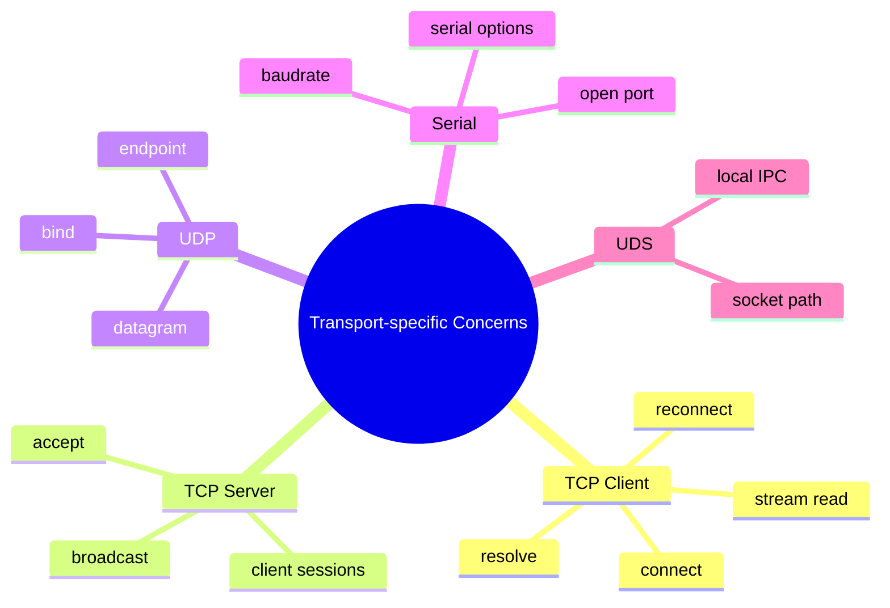
```mermaid
mindmap
  root((Transport-specific Concerns))
    TCP Client
      resolve
      connect
      reconnect
      stream read
    TCP Server
      accept
      client sessions
      broadcast
    UDP
      bind
      datagram
      endpoint
    Serial
      open port
      baudrate
      serial options
    UDS
      socket path
      local IPC
```

이 차이를 완전히 없앨 수는 없다.
오히려 Transport 계층의 목적은 이 차이를 숨기는 것이 아니라, 올바른 위치에 모으는 것이다.

TCP reconnect 정책은 TCP transport에서 다루는 것이 자연스럽다.
Serial port option은 Serial transport에서 다루는 것이 자연스럽다.
UDP endpoint와 datagram 처리는 UDP transport에서 다루는 것이 자연스럽다.

즉, Transport 계층은 transport-specific concern을 모아두는 장소다.
덕분에 Wrapper와 Channel 계약은 더 단순하게 유지될 수 있다.

## Transport 설계의 Trade-off

Transport 계층은 실제 I/O를 담당하기 때문에 구현 복잡도가 높다.

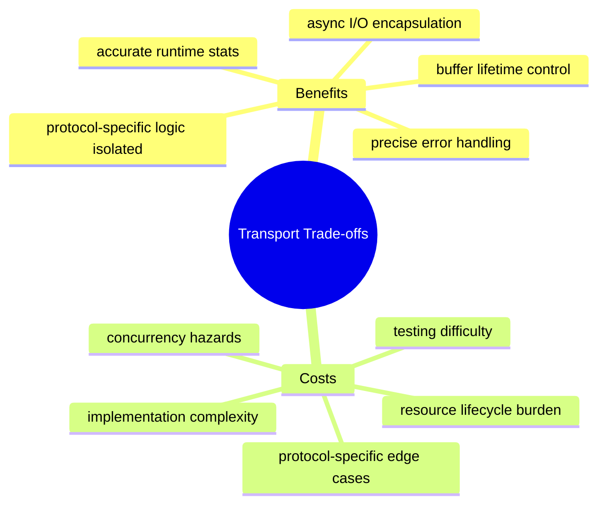
```mermaid
mindmap
  root((Transport Trade-offs))
    Benefits
      protocol-specific logic isolated
      accurate runtime stats
      precise error handling
      async I/O encapsulation
      buffer lifetime control
    Costs
      implementation complexity
      concurrency hazards
      protocol-specific edge cases
      testing difficulty
      resource lifecycle burden
```

첫 번째 비용은 동시성 복잡성이다.
비동기 handler, stop 요청, reconnect timer, write queue가 서로 영향을 주기 때문에 상태 관리가 쉽지 않다.

두 번째 비용은 프로토콜별 edge case다.
TCP 연결 실패와 UDP endpoint 변경, Serial 장치 제거는 서로 다른 방식으로 처리해야 한다.

세 번째 비용은 테스트 난이도다.
실제 socket이나 serial port를 사용하는 테스트는 환경 의존성이 생긴다. 따라서 mock, loopback, integration test를 적절히 나눠야 한다.

그럼에도 Transport 계층은 반드시 필요하다.
이 복잡성을 public API나 wrapper로 끌어올리면 사용자 코드가 transport 세부사항에 오염된다. Transport 계층은 복잡성을 없애는 것이 아니라, 복잡성이 있어야 할 위치에 격리하는 설계다.

## 정리

unilink에서 Transport 계층은 Channel 계약을 실제 비동기 I/O로 구현하는 계층이다.

```mermaid
mindmap
  root((Transport Role))
    Channel Implementation
      start
      stop
      async_write
      callbacks
    Async Runtime
      Boost.Asio
      io_context
      strand
      socket / port
    State Management
      link state
      reconnect
      lifecycle
    Data Pipeline
      read path
      write queue
      buffer ownership
    Runtime Policy
      backpressure
      queue threshold
      error reporting
    Observability
      RuntimeStats
      logging
      error info
```

정리하면 다음과 같다.

* Transport는 Channel 계약을 실제 TCP/UDP/Serial/UDS I/O로 구현한다.
* Boost.Asio 기반의 비동기 실행 모델을 내부에 감춘다.
* strand, timer, socket, queue, atomic state를 통해 runtime 상태를 관리한다.
* raw byte 수신 이벤트를 Channel callback으로 전달한다.
* write 요청은 queue, buffer ownership, backpressure 정책을 거쳐 async write로 이어진다.
* error와 runtime stats는 transport에서 기록하고 wrapper를 통해 사용자에게 전달된다.
* transport-specific concern은 Transport 계층 안에 격리한다.

Transport 계층은 unilink에서 가장 복잡한 내부 구현 계층이다.
하지만 이 복잡성을 내부에 모아두기 때문에, 사용자는 Wrapper와 Channel 수준의 단순한 API로 여러 통신 방식을 다룰 수 있다.
