## 도입: 실행 객체로서의 Wrapper

통신 라이브러리에서 사용자가 실제로 다루는 객체는 내부 transport 구현체가 아니다.
사용자는 socket, acceptor, serial port, `io_context`, async read/write pipeline을 직접 다루기보다, `start`, `send`, `stop`, `on_data`, `on_error` 같은 의미 있는 동작을 호출하고 싶어 한다.

unilink에서 이 역할을 담당하는 계층이 Wrapper다.

Wrapper는 public API와 transport implementation 사이에 위치한다.
사용자에게는 단순한 실행 객체처럼 보이지만, 내부적으로는 transport 객체 생성, lifecycle 관리, callback 연결, framer 적용, backpressure 처리, runtime statistics 조회 같은 작업을 중재한다.

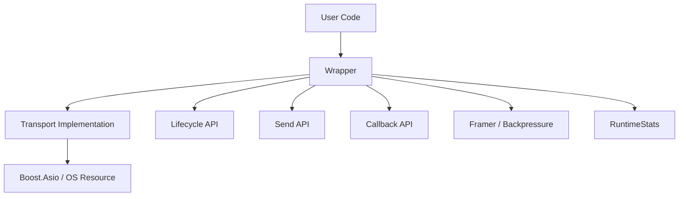

Wrapper의 목적은 transport 구현을 숨기는 것만이 아니다.
사용자 코드가 기대하는 안정적인 API와 내부 구현이 요구하는 복잡한 상태 관리를 분리하는 것이다.

## Wrapper가 필요한 이유

TCP client를 예로 들면, 겉으로는 단순한 동작만 있으면 될 것처럼 보인다.

```cpp
client.start();
client.send("hello");
client.stop();
```

하지만 내부적으로는 다음 문제가 함께 따라온다.

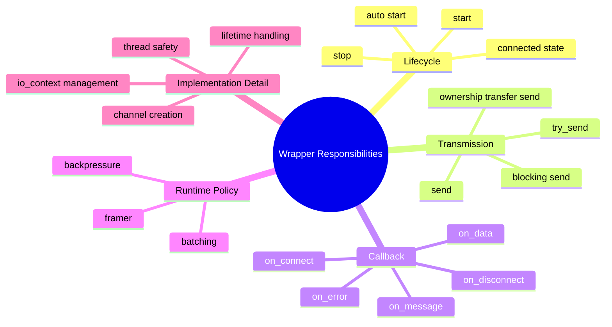

이 요소를 모두 transport 구현에 직접 노출하면 사용자는 내부 구현의 세부사항에 의존하게 된다.
반대로 wrapper 계층에서 이를 정리하면, transport 구현은 내부에서 바뀌더라도 사용자-facing API는 유지할 수 있다.

Wrapper는 다음 역할을 한다.

- 사용자가 호출하는 public operation을 정의한다.
- 내부 transport 객체에 명령을 위임한다.
- callback과 runtime policy를 보관하고 연결한다.
- 내부 상태와 lifetime을 관리한다.
- transport별 구현 차이를 사용자 코드에서 격리한다.

이 구조 덕분에 사용자는 통신 객체를 “실행 가능한 객체”로 다룰 수 있고, 내부 transport는 wrapper 뒤에서 교체되거나 개선될 수 있다.

## 용어 정리: Wrapper, Channel, Transport

Wrapper 구조를 설명하기 전에 이 글에서 사용하는 몇 가지 용어를 먼저 정리한다.
통신 계층은 여러 단계로 나뉘어 있기 때문에, `Wrapper`, `Channel`, `Transport`라는 단어가 섞이면 구조를 이해하기 어려워질 수 있다.

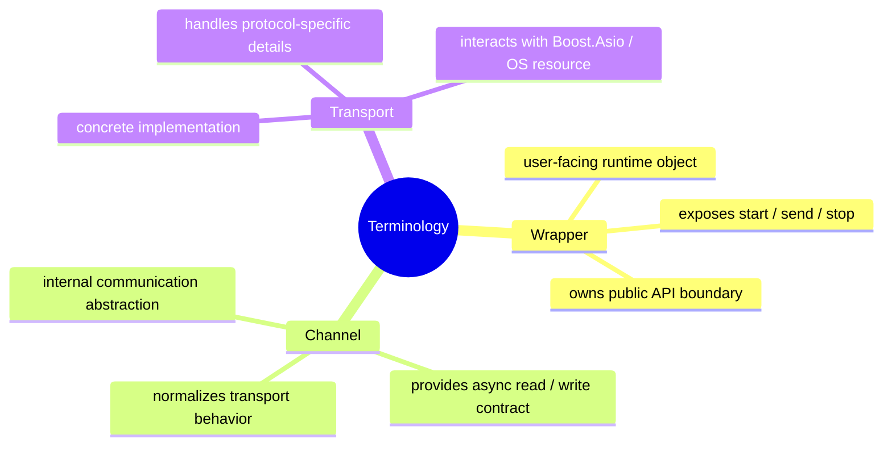

이 글에서 `Wrapper`는 사용자가 직접 다루는 실행 객체를 의미한다.
예를 들어 `TcpClient` wrapper는 `start`, `send`, `stop`, `on_data`, `on_error` 같은 public API를 제공한다.

`Channel`은 wrapper 내부에서 사용하는 통신 추상화 단위다.
Wrapper는 Channel을 통해 실제 송수신을 수행하지만, 사용자가 Channel을 직접 다루지는 않는다.

`Transport`는 TCP, UDP, Serial, UDS처럼 실제 프로토콜별 구현을 담당하는 계층이다.
Transport는 Boost.Asio socket, acceptor, serial port 같은 OS 또는 라이브러리 리소스와 직접 맞닿아 있다.

정리하면 Wrapper는 사용자-facing 계층이고, Channel은 내부 통신 추상화이며, Transport는 실제 프로토콜 구현 계층이다.

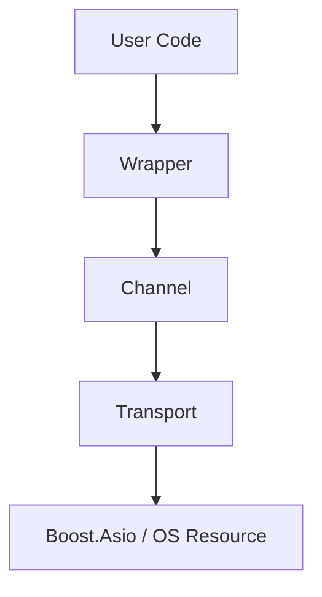

## Public API와 내부 구현의 분리

Wrapper의 가장 중요한 설계 기준은 public API와 내부 구현의 분리다.

예를 들어 `TcpClient` wrapper는 public header에서 다음과 같은 동작을 노출한다.

```cpp
std::future<bool> start();
void stop();

bool send(std::string_view data);
bool try_send(std::string_view data);
bool send_line(std::string_view line);
bool try_send_line(std::string_view line);

bool connected() const;
RuntimeStats stats() const;

TcpClient& on_data(MessageHandler handler);
TcpClient& on_error(ErrorHandler handler);
TcpClient& framer(std::unique_ptr<framer::IFramer> framer);
TcpClient& on_message(MessageHandler handler);
```

이 API는 사용자가 통신 객체를 다루는 데 필요한 동작을 중심으로 구성되어 있다.
반면 실제 구현에 필요한 mutex, condition variable, channel instance, external `io_context`, thread, work guard, framer instance, pending promise 같은 요소는 public header에 직접 노출되지 않는다.

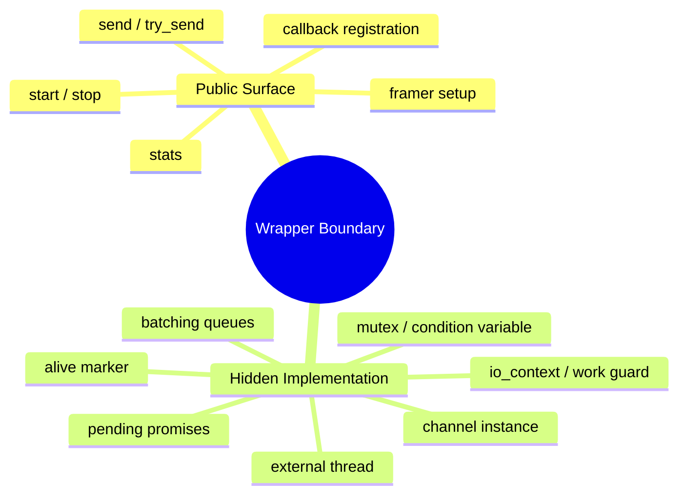

public header는 사용자의 컴파일 의존성이 된다.
따라서 내부 구현 세부사항이 public header에 많이 노출될수록, 내부 변경이 사용자 코드와 빌드 의존성에 영향을 줄 가능성이 커진다.

Wrapper는 사용자에게 필요한 API만 남기고, 구현 세부사항을 내부로 이동시켜 변경 영향을 줄인다.

## PImpl: 구현 세부사항 숨기기

unilink의 wrapper는 PImpl 구조를 사용한다.

개념적으로는 다음과 같은 형태다.

```cpp
class TcpClient : public ChannelInterface {
public:
    // User-facing lifecycle API
    std::future<bool> start() override;
    void stop() override;

    // User-facing transmission API
    bool send(std::string_view data) override;
    bool try_send(std::string_view data) override;

private:
    // Internal implementation object.
    // Transport creation, callback storage, synchronization,
    // framer, backpressure, and io_context management are hidden here.
    struct Impl;
    std::unique_ptr<Impl> impl_;
};
```

`TcpClient`의 public header에는 `Impl`의 정의가 없다.
사용자는 `TcpClient`가 어떤 mutex를 쓰는지, 어떤 channel을 생성하는지, 어떤 timer와 thread를 관리하는지 알 필요가 없다.

실제 구현 파일에서 `TcpClient::Impl`은 내부 상태를 가진다.

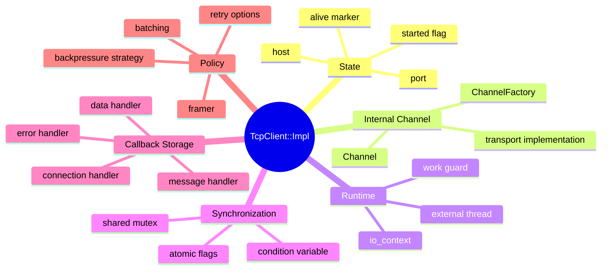

PImpl을 사용하면 public class는 얇은 facade처럼 동작한다.
대부분의 public method는 내부 `Impl`로 호출을 위임한다.

```cpp
std::future<bool> TcpClient::start() {
    return impl_->start();
}

void TcpClient::stop() {
    impl_->stop();
}

bool TcpClient::send(std::string_view data) {
    return impl_->send(data);
}
```

이 구조는 wrapper의 역할을 명확히 한다.

`TcpClient` public class는 사용자가 바라보는 안정적인 API다.
`TcpClient::Impl`은 transport 생성과 runtime 상태 관리를 담당하는 내부 구현이다.

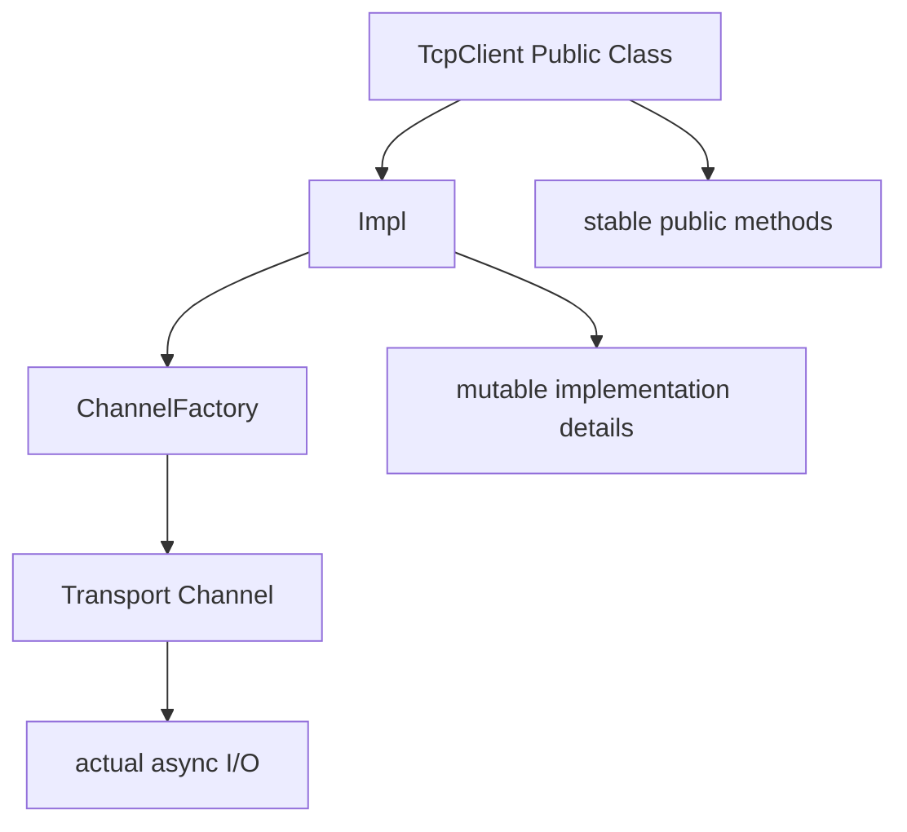

이렇게 나누면 내부 구현을 변경해도 public API를 유지하기 쉽다.

## ChannelInterface: 공통 실행 계약

Wrapper는 단순한 concrete class만으로 구성되지 않는다.
unilink는 1:1 통신 모델을 위한 공통 interface로 `ChannelInterface`를 둔다.

`ChannelInterface`는 TCP client, Serial, UDP client, UDS client처럼 point-to-point 성격의 통신 객체가 공통적으로 제공해야 하는 동작을 정의한다.

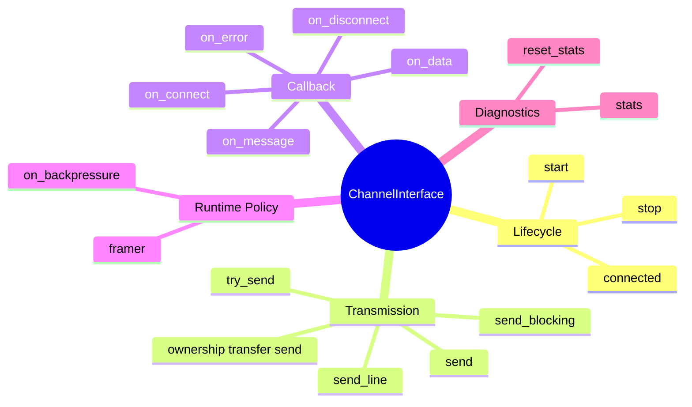

이 interface가 중요한 이유는 transport별 차이에도 불구하고, 사용자 관점의 공통 동작을 명확히 정의하기 때문이다.

TCP client와 Serial은 내부 구현이 다르다.
하지만 애플리케이션에서 보면 둘 다 시작하고, 데이터를 보내고, 수신 callback을 받고, 에러를 처리하고, 상태를 확인하는 객체다.

`ChannelInterface`는 이 공통점을 public contract로 만든다.

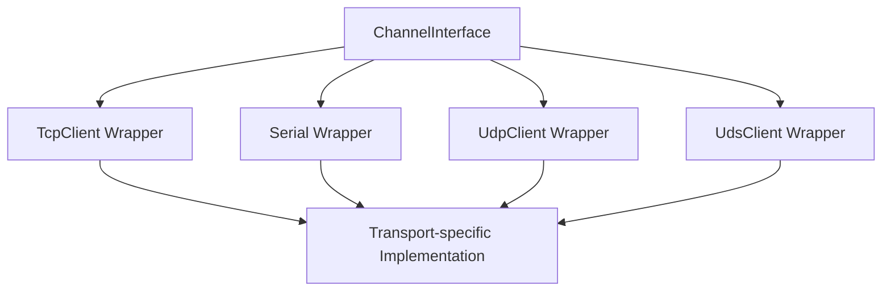

공통 interface를 두면 사용자 코드와 테스트 코드에서 wrapper를 같은 관점으로 다룰 수 있다.
다만 모든 통신 모델을 하나로 묶지는 않는다. 1:N server 성격의 통신은 별도의 `ServerInterface`로 분리하는 것이 더 자연스럽다.

## Wrapper와 Transport의 관계

Wrapper는 실제 I/O를 직접 수행하지 않는다.
실제 async read/write는 transport 또는 channel implementation이 담당한다.

Wrapper는 transport를 생성하고, transport의 이벤트를 사용자-facing callback으로 변환한다.

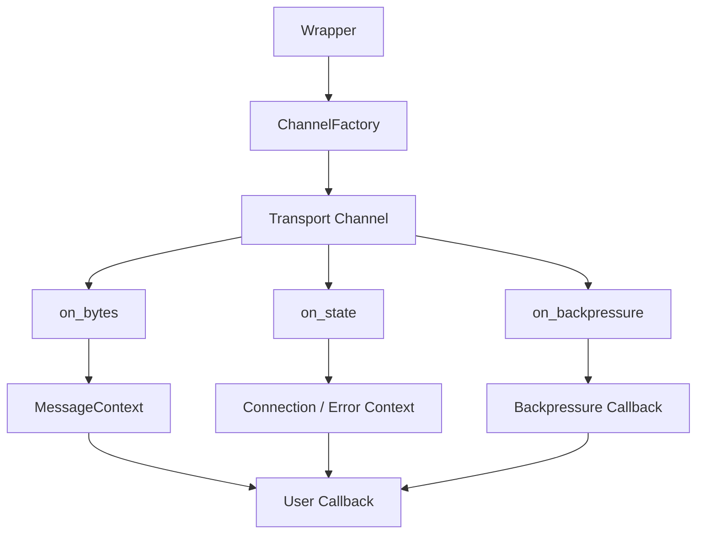

예를 들어 transport에서 raw byte span이 들어오면 wrapper는 이를 `MessageContext`로 감싸 사용자 callback에 전달한다.
상태 변화가 들어오면 연결 callback이나 에러 callback으로 변환한다.
backpressure 이벤트가 들어오면 condition variable을 깨우고, 사용자가 등록한 callback에도 알린다.

이 구조에서 transport는 낮은 수준의 I/O 이벤트를 제공하고, wrapper는 이를 사용자 API에 맞는 이벤트로 변환한다.

## Lifecycle 관리

비동기 객체에서 lifecycle 관리는 중요하다.
`start()`가 호출된 뒤 연결이 완료되기 전에 객체가 정리될 수도 있고, callback이 예약된 뒤 stop이 호출될 수도 있다. 또한 외부 `io_context`를 사용할 때는 context 실행 thread와 work guard 관리도 필요하다.

Wrapper는 이런 lifecycle 문제를 사용자 API 뒤에서 처리한다.

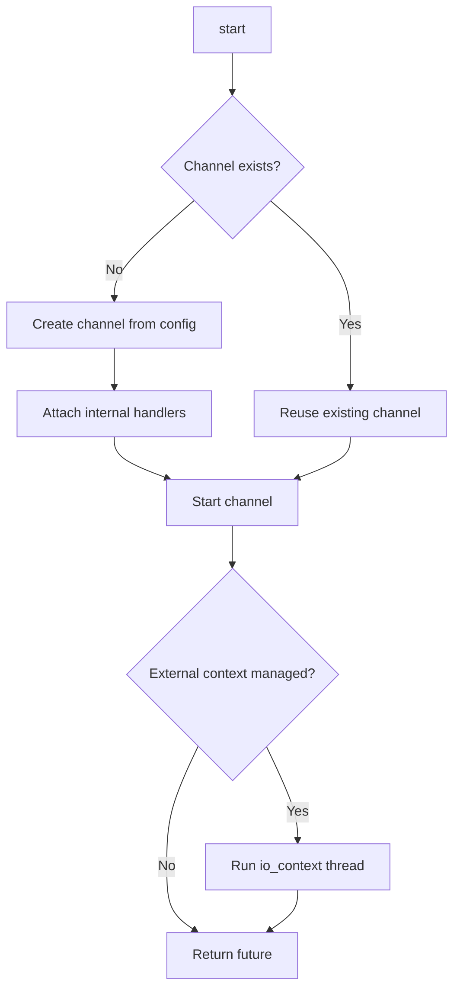

`start()`는 단순히 transport의 `start()`를 호출하는 것 이상의 역할을 한다.
channel이 아직 없으면 config를 만들고, factory를 통해 channel을 생성하고, 내부 handler를 연결한다. 필요하면 external `io_context`를 실행하기 위한 thread와 work guard도 준비한다.

`stop()`도 마찬가지다.

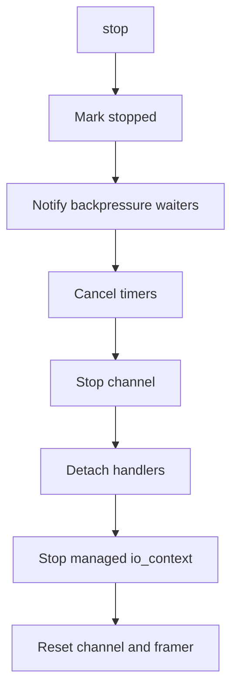

비동기 통신 객체는 stop 이후 callback이 잘못 호출되지 않도록 관리해야 한다.
Wrapper 내부에서 alive marker, mutex, pending promise, handler detach 같은 장치를 두는 이유가 여기에 있다.

## Send API: 정책을 담은 전송 함수

Wrapper의 전송 API는 단순히 `write`를 감싼 것이 아니다.
unilink는 전송 API를 몇 가지 성격으로 나눈다.

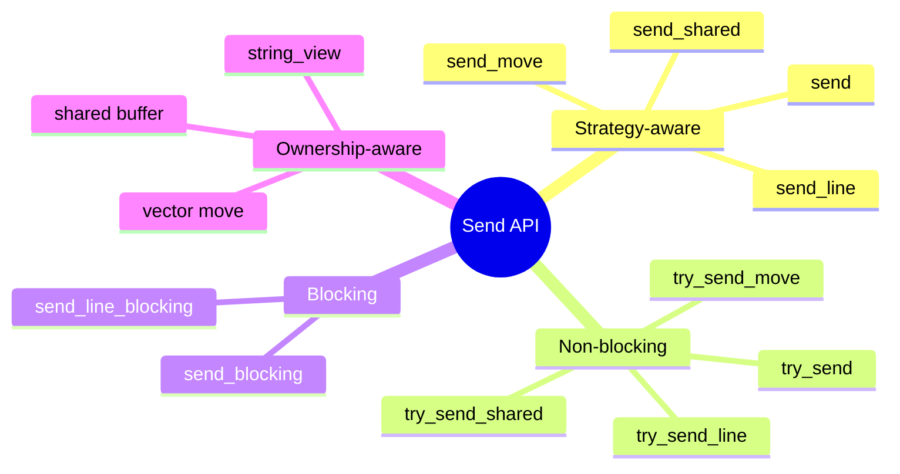

`send()`는 설정된 backpressure strategy를 따른다.
Reliable 전략이면 queue pressure가 해소될 때까지 기다리고, BestEffort 전략이면 non-blocking 방식으로 동작하며 queue가 가득 찬 경우 drop될 수 있다.

반면 `try_send()`는 명시적인 escape hatch다.
설정된 strategy와 관계없이 non-blocking 방식으로 동작한다.

이 구분은 API 이름에 정책을 담기 위한 선택이다.

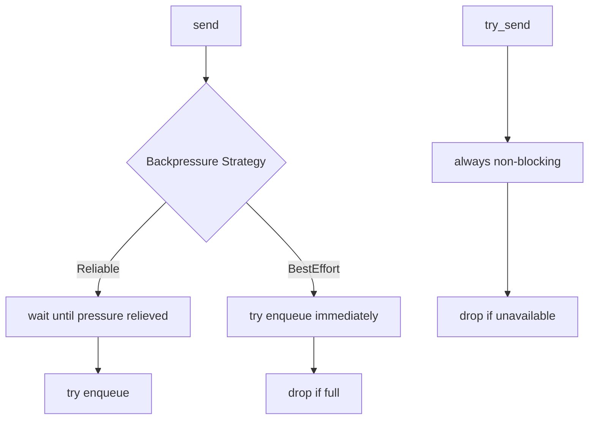

통신 라이브러리에서 “보낸다”는 말은 항상 단순하지 않다.
보낼 수 있을 때까지 기다릴 것인지, 지금 안 되면 버릴 것인지, ownership을 넘길 것인지, shared buffer로 유지할 것인지에 따라 API의 의미가 달라진다.

Wrapper는 이 차이를 명시적인 함수로 제공한다.

## Callback 변환과 Framer 연결

Wrapper는 transport에서 올라오는 raw data를 그대로 사용자에게 전달할 수도 있고, framer를 통해 message 단위로 변환해 전달할 수도 있다.

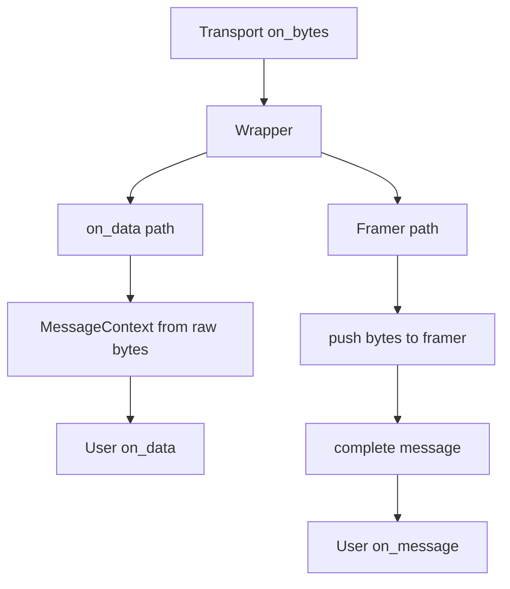

이 구조는 stream 기반 transport에서 특히 중요하다.

TCP나 Serial은 read callback 단위가 곧 message 단위가 아니다.
따라서 wrapper가 framer를 연결하면 사용자는 raw byte chunk와 complete message를 구분해 처리할 수 있다.

- `on_data`: transport에서 들어온 데이터 chunk를 처리
- `on_message`: framer가 추출한 complete message를 처리

이 분리는 API 의미를 명확하게 만든다.
사용자는 필요한 수준에 따라 raw data callback을 사용할 수도 있고, message callback을 사용할 수도 있다.

## Thread Safety와 Callback Safety

Wrapper 내부에는 여러 동시성 요소가 존재한다.

비동기 read/write는 I/O thread에서 실행될 수 있고, 사용자는 다른 thread에서 `send`, `stop`, callback 등록, stats 조회를 호출할 수 있다.
따라서 wrapper는 내부 상태를 보호해야 한다.

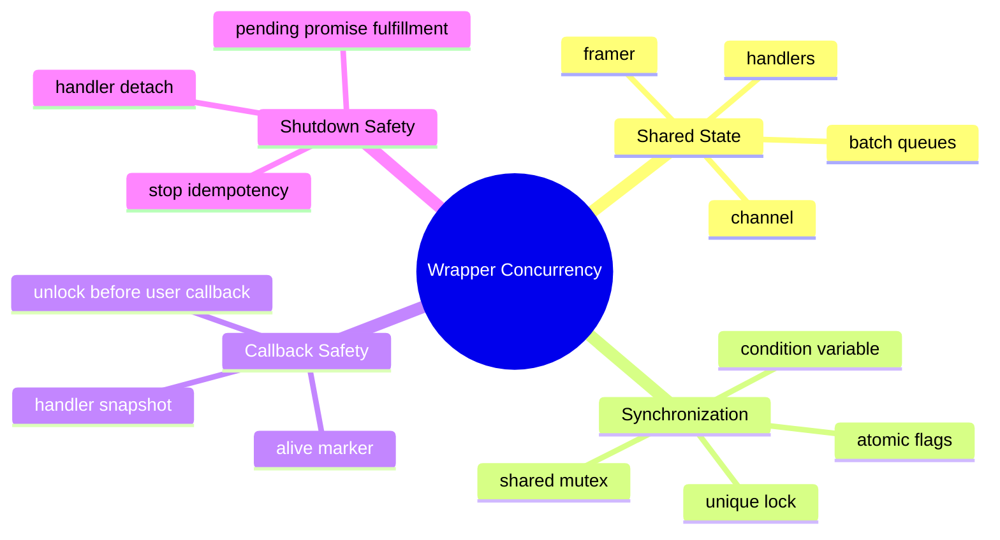

특히 사용자 callback을 호출할 때는 주의가 필요하다.

callback 내부에서 다시 wrapper API를 호출할 수 있고, 사용자가 긴 작업을 수행할 수도 있다.
따라서 내부 lock을 잡은 상태로 사용자 callback을 호출하면 deadlock이나 성능 문제가 생길 수 있다.

Wrapper는 필요한 경우 handler를 복사하거나 snapshot으로 잡은 뒤 lock을 풀고 callback을 호출하는 방식으로 이런 문제를 줄인다.

## RuntimeStats와 관측성

Wrapper는 사용자에게 runtime 상태를 확인할 수 있는 API도 제공한다.

```cpp
auto stats = client.stats();
client.reset_stats();
```

통신 라이브러리에서는 문제가 발생했을 때 원인을 추적하기 어렵다.
연결이 끊긴 것인지, 송신 queue가 가득 찬 것인지, drop이 발생한 것인지, 수신이 되고 있는지 등을 확인할 수 있어야 한다.

Wrapper는 내부 channel의 stats를 public API로 전달한다.

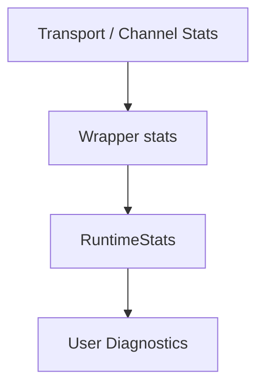

## Wrapper 설계의 Trade-off

Wrapper 계층은 public API를 안정화하고 내부 구현을 숨기는 데 유리하지만, 비용도 있다.

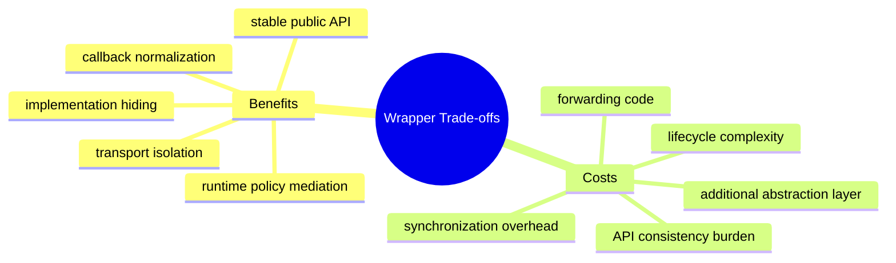

첫 번째 비용은 forwarding code다.
public method 대부분이 내부 `Impl`로 위임되므로 코드량이 늘어난다.

두 번째 비용은 lifecycle 복잡성이다.
Wrapper가 transport 생성, external context, thread, callback detach, stop idempotency까지 책임지면 내부 구현은 복잡해진다.

세 번째 비용은 API 일관성 유지다.
Transport가 늘어날수록 wrapper별 API가 비슷하게 유지되는지, 특정 transport에만 필요한 기능을 어디까지 노출할지 판단해야 한다.

그럼에도 wrapper 계층은 필요하다.
통신 라이브러리에서 사용자가 직접 transport 구현체를 다루게 하면, 내부 변경이 곧 사용자 코드 변경으로 이어진다. Wrapper는 이 의존성을 끊기 위한 계층이다.

포워딩 코드를 작성하고 lifecycle을 관리하는 비용은 분명 존재하지만, 장기적인 모듈 유지보수성과 외부 의존성 격리를 위해 충분히 지불할 가치가 있는 비용이다.
Wrapper는 단기적으로는 한 계층을 더 만드는 선택이지만, 장기적으로는 public API 안정성과 내부 구현 변경 자유도를 확보하는 설계 장치다.

## 정리: Wrapper의 역할

unilink에서 Wrapper는 사용자가 실제로 다루는 실행 객체이자, public API와 transport 구현 사이의 완충 계층이다.

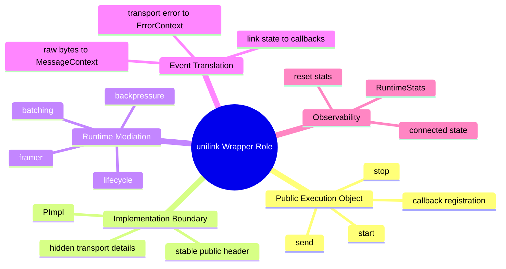

Wrapper의 핵심은 단순한 위임이 아니다.
사용자가 기대하는 단순한 API와 내부 transport가 요구하는 복잡한 runtime state 사이를 연결하는 것이다.

정리하면 다음과 같다.

- Wrapper는 사용자가 실제로 호출하는 실행 객체다.
- public API와 transport implementation 사이의 경계를 만든다.
- PImpl을 통해 내부 상태와 구현 세부사항을 숨긴다.
- ChannelInterface를 통해 1:1 통신 객체의 공통 계약을 정의한다.
- transport 이벤트를 사용자-facing callback context로 변환한다.
- framer, backpressure, batching 같은 runtime concern을 중재한다.
- lifecycle, thread safety, callback safety를 내부에서 관리한다.
- stats와 상태 조회를 통해 운영 관측성을 제공한다.

이 구조 덕분에 unilink는 내부 transport 구현을 확장하거나 개선하면서도, 사용자가 바라보는 API를 비교적 안정적으로 유지할 수 있다.
