## 도입: Transport가 아니라 통신 행위를 추상화하기

TCP, UDP, Serial, Unix Domain Socket은 서로 다른 특성을 가진다.
TCP는 연결 기반의 stream 통신이고, UDP는 비연결형 datagram 통신이다. Serial은 장치와의 point-to-point 통신을 위해 baudrate, parity, stop bit 같은 포트 설정을 다뤄야 하며, Unix Domain Socket은 같은 머신 내부의 프로세스 간 통신에 사용된다.

이처럼 각 통신 방식은 내부 구현과 동작 방식이 명확히 다르다.
하지만 애플리케이션 입장에서 원하는 목적은 생각보다 비슷하다.

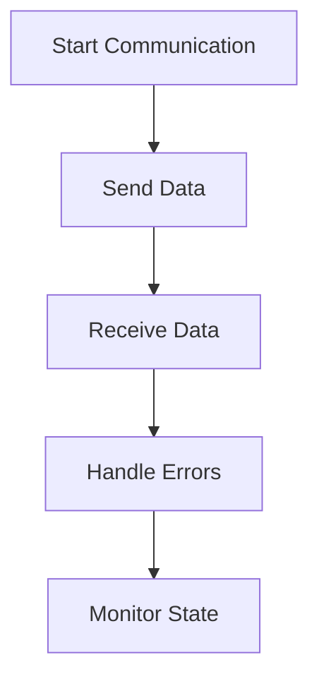

사용자는 일반적으로 통신 객체를 시작하고, 데이터를 보내고, 수신 이벤트를 받고, 에러를 처리하며, 현재 상태를 확인하고 싶어 한다.
즉, 사용자가 실제로 관심을 갖는 것은 TCP인지 Serial인지보다 “데이터를 안전하고 예측 가능한 방식으로 주고받을 수 있는가”에 가깝다.

wirestead의 Channel 계층은 이 관점에서 출발한다.
Channel은 특정 transport를 그대로 노출하는 대신, 여러 통신 방식에서 반복되는 통신 행위를 공통 계약으로 정리하기 위한 추상화다.

## 용어 정리: Wrapper, Channel, Transport

이 글에서 사용하는 `Wrapper`, `Channel`, `Transport`는 서로 다른 역할을 가진다.
세 용어가 섞이면 계층 구조를 이해하기 어려워지므로 먼저 의미를 분리해 둔다.

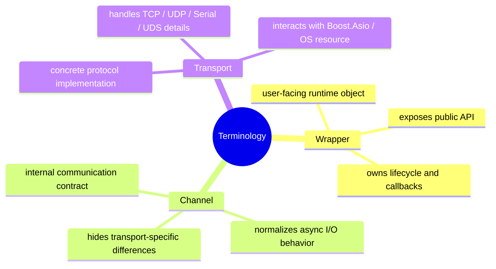

`Wrapper`는 사용자가 실제로 다루는 실행 객체다.
예를 들어 `TcpClient` wrapper는 `start`, `send`, `stop`, `on_data`, `on_error` 같은 public API를 제공한다.

`Channel`은 wrapper 내부에서 사용하는 통신 추상화 단위다.
Wrapper는 Channel 계약에 의존해 데이터를 보내고, 상태 변화를 받고, 수신 데이터를 callback으로 전달한다.

`Transport`는 실제 프로토콜별 구현 계층이다.
TCP, UDP, Serial, UDS 각각의 구체적인 동작은 transport 계층에서 처리하며, Boost.Asio socket, acceptor, serial port 같은 실제 리소스와 맞닿아 있다.

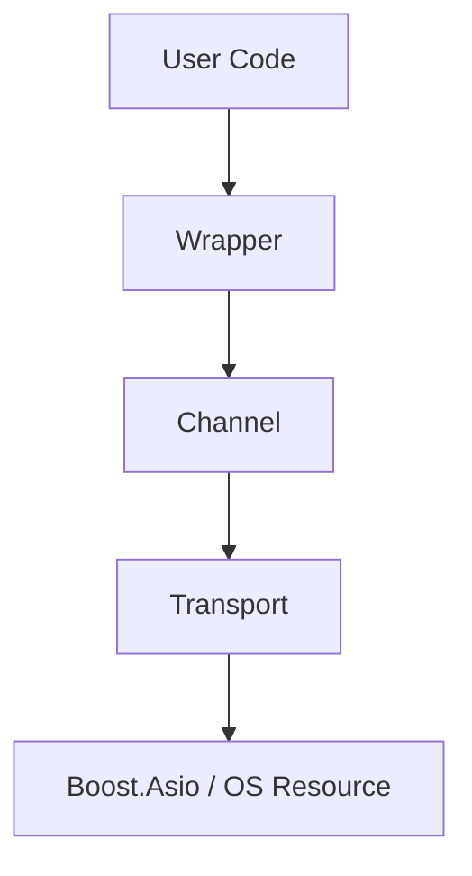

이 글에서 말하는 Channel은 사용자가 직접 호출하는 최상위 public API라기보다, Wrapper와 Transport 사이에서 통신 행위를 규격화하는 내부 계약에 가깝다.

## 문제: Transport를 직접 노출하면 변경이 퍼진다

가장 단순한 설계는 transport 구현을 애플리케이션 코드에서 직접 사용하는 것이다.

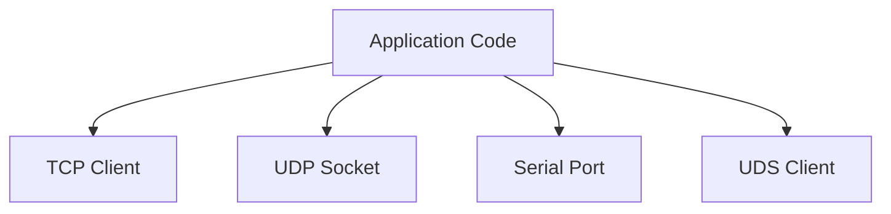

처음에는 이 구조가 단순해 보인다.
TCP client는 TCP client대로, Serial은 Serial대로 직접 호출하면 되기 때문이다.

하지만 시간이 지나면 transport별 API 차이가 애플리케이션 코드로 퍼지기 시작한다.
TCP는 연결과 재연결 흐름이 중요하고, UDP는 endpoint와 datagram 처리 방식이 중요하다. Serial은 장치 파일과 포트 설정, 장치 상태 변화가 중요하다.

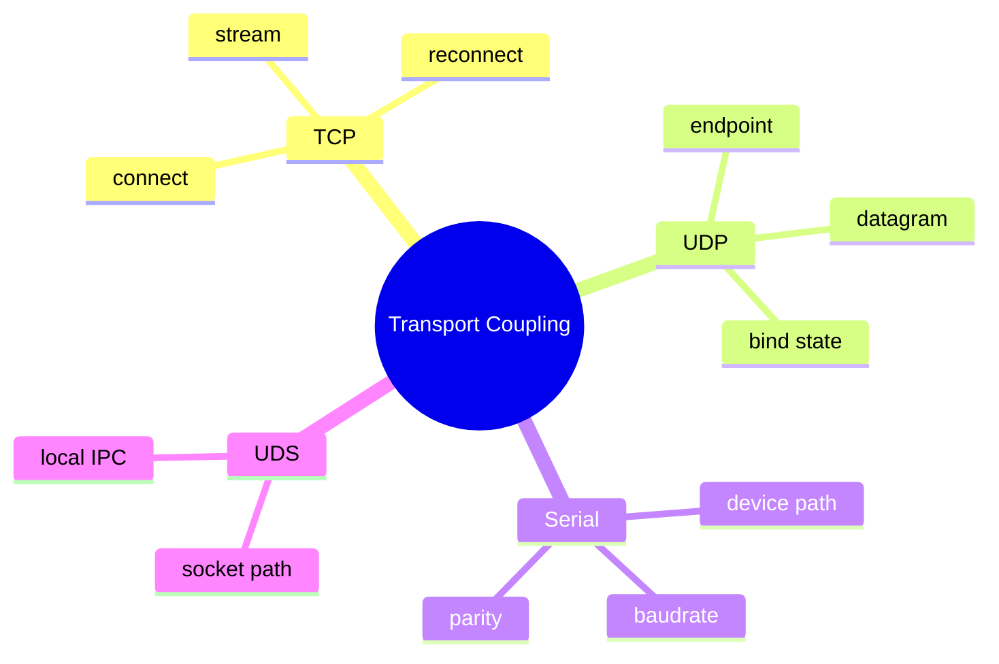

이 차이가 애플리케이션 코드에 직접 노출되면, transport 변경이 단순한 내부 구현 교체로 끝나지 않는다.
callback 형태, 상태 처리 방식, error handling, send 정책까지 함께 변경될 수 있다.

결국 문제는 코드 중복만이 아니다.
transport 구현이 애플리케이션 로직 안으로 들어올수록 작은 통신 방식 변경도 전체 구조 변경으로 이어질 수 있다. Channel 계층은 이 변경 영향 범위를 줄이기 위한 경계다.

## Channel의 역할

Channel은 TCP도 아니고 UDP도 아니다.
Serial도 아니고 UDS도 아니다.

Channel은 “통신 가능한 객체”가 공통적으로 가져야 하는 행위를 정의한다.

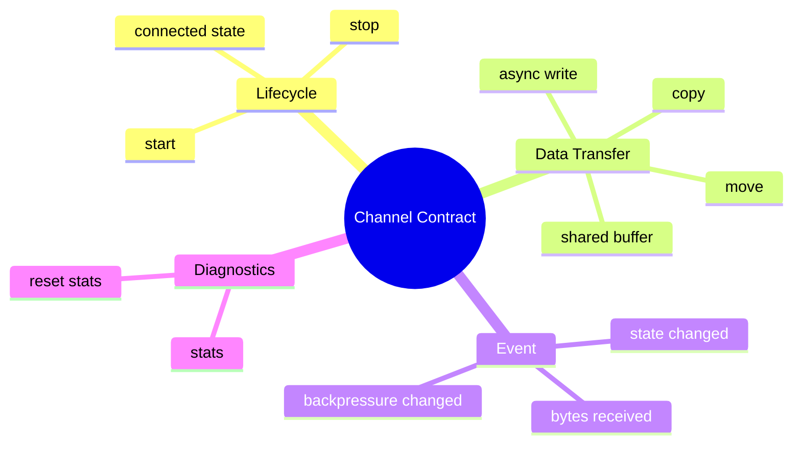

Channel의 목적은 모든 transport를 억지로 같은 구현처럼 보이게 만드는 것이 아니다.
대신 wrapper가 transport별 차이를 직접 알지 않아도 되도록, 통신 행위에 대한 최소 공통 계약을 제공하는 것이다.

중요한 점은 Channel이 TCP, UDP, Serial이라는 “기술 이름”을 추상화하는 것이 아니라는 점이다.
Channel은 `start`, `stop`, `write`, `receive event`, `state event`, `statistics` 같은 “통신 행위”를 추상화한다.

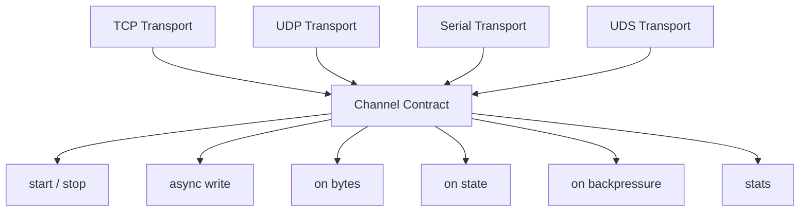

이 차이가 wirestead Channel 설계의 핵심이다.
구현 중심으로 보면 TCP, UDP, Serial은 모두 다르지만, 행위 중심으로 보면 공통 계약을 만들 수 있다.

## Channel Interface

Channel 계약은 개념적으로 다음과 같은 형태를 가진다.

```cpp
class Channel {
public:
    virtual ~Channel() = default;

    // Lifecycle
    virtual void start() = 0;
    virtual void stop() = 0;
    virtual bool is_connected() const = 0;

    // Backpressure and diagnostics
    virtual bool is_backpressure_active() const = 0;
    virtual RuntimeStats stats() const = 0;
    virtual void reset_stats() = 0;

    // Async write APIs
    virtual bool async_write_copy(ConstByteSpan data) = 0;
    virtual bool async_write_move(std::vector<uint8_t>&& data) = 0;
    virtual bool async_write_shared(
        std::shared_ptr<const std::vector<uint8_t>> data) = 0;

    // Events
    virtual void on_bytes(OnBytes callback) = 0;
    virtual void on_state(OnState callback) = 0;
    virtual void on_backpressure(OnBackpressure callback) = 0;
};
```

이 인터페이스는 특정 transport를 설명하지 않는다.
대신 wrapper가 transport를 다루기 위해 필요한 공통 동작만 정의한다.

특히 `start()`가 동기적으로 완료 결과를 반환하지 않는다는 점도 중요하다.
실제 연결이나 bind, async receive 준비는 transport에 따라 시간이 걸릴 수 있고, 완료 결과는 상태 callback이나 wrapper의 future 기반 API를 통해 사용자-facing 계층으로 전달될 수 있다.

즉, Channel의 `start()`는 “지금 즉시 연결이 완료된다”는 의미보다 “비동기 통신 루프를 시작한다”는 의미에 가깝다.
이렇게 시작 동작을 비동기 모델에 맞춰 규격화하면, TCP처럼 연결 완료가 필요한 transport와 UDP처럼 socket bind 이후 수신 대기 상태로 들어가는 transport를 같은 lifecycle 안에서 다룰 수 있다.

## UDP와 connected()의 해석

Channel 계약에는 `is_connected()`가 포함된다.
여기서 자연스럽게 생기는 질문이 있다.

> UDP는 비연결형 프로토콜인데 connected 상태를 어떻게 해석해야 할까?

이 부분에 대해서 고민을 많이 하였다. 공통 인터페이스를 만들 때 가장 조심해야 하는 지점이 바로 이런 edge case이기 때문이다.

TCP에서 `connected()`는 비교적 직관적이다.
remote endpoint와 연결이 성립되었는지를 의미한다.

반면 UDP에서는 동일한 의미의 연결이 존재하지 않는다.
따라서 UDP에서의 connected 상태는 TCP와 완전히 같은 의미가 아니라, “통신 가능한 상태” 또는 “remote endpoint가 결정되어 송신 가능한 상태”로 해석하는 편이 자연스럽다.

예를 들어 UDP channel은 socket이 local endpoint에 bind되면 수신 가능한 상태가 될 수 있다.
또한 remote endpoint가 설정되어 있거나 첫 수신을 통해 상대 endpoint를 확보하면, 1:1 channel 관점에서는 송신 가능한 상태로 볼 수 있다.

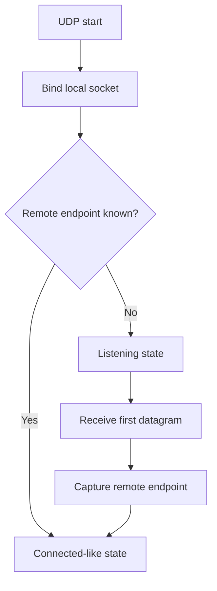

이처럼 Channel 계약은 각 transport의 물리적 의미를 완전히 동일하게 만들지 않는다.
대신 wrapper가 일관되게 판단할 수 있는 runtime state로 의미를 매핑한다.

이러한 설계가 추상화의 진수라고 생각한다.
공통 API를 위해 transport의 본질을 무시해서는 안 되지만, 그렇다고 모든 차이를 사용자 코드에 노출하면 추상화의 의미가 사라진다.

## Wrapper와 Channel의 관계

Wrapper는 사용자가 실제로 인스턴스화하고 호출하는 최상위 실행 객체다.
반면 Channel은 wrapper 내부에서 사용하는 통신 계약이다.

Wrapper는 Channel을 통해 transport와 통신한다.

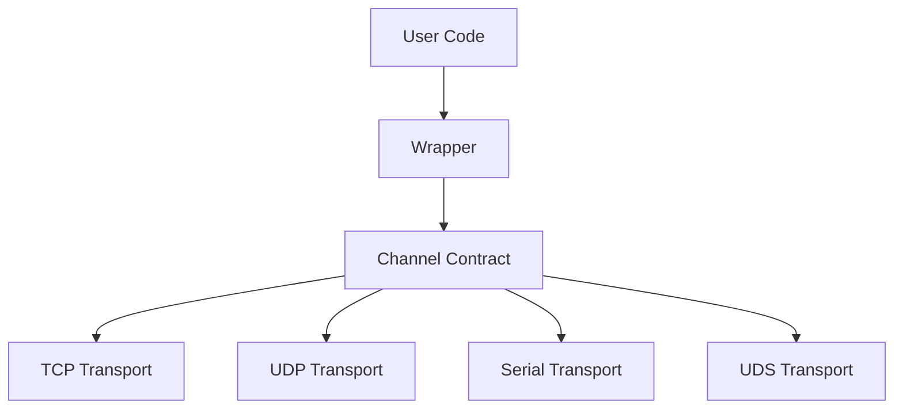

이 구조의 핵심은 wrapper가 concrete transport에 직접 의존하지 않는다는 점이다.
Wrapper는 Channel 계약만 알면 된다.

이렇게 하면 TCP transport 내부 구현이 바뀌어도 wrapper의 public API는 그대로 유지할 수 있다.
UDP의 endpoint 처리 방식이 바뀌거나 Serial의 내부 read/write 구현이 바뀌더라도, Channel 계약만 유지된다면 wrapper가 받는 영향은 제한된다.

## 의존성 주입 관점

Wrapper가 Channel 계약에 의존한다는 것은 의존성 주입(Dependency Injection) 관점에서도 의미가 있다.

예를 들어 wrapper가 concrete TCP transport를 직접 생성하고 직접 소유한다면, wrapper는 특정 구현에 강하게 묶인다.

```cpp
class TcpClient {
private:
    TcpTransport transport_; // concrete dependency
};
```

반면 wrapper가 Channel 추상화에 의존하면, 실제 구현체는 외부에서 주입하거나 생성 계층에서 결정할 수 있다.

```cpp
class TcpClient {
public:
    explicit TcpClient(std::shared_ptr<Channel> channel)
        : channel_(std::move(channel)) {}

    bool send(std::string_view data) {
        return channel_->async_write_copy(to_bytes(data));
    }

private:
    std::shared_ptr<Channel> channel_;
};
```

이 코드는 개념 예시지만, 설계 의도는 명확하다.
Wrapper는 구체 transport가 아니라 Channel 계약에 의존한다.

이 구조는 테스트에도 유리하다.
실제 socket을 열지 않고도 mock channel을 주입해 wrapper의 callback 연결, send 정책, lifecycle 처리를 검증할 수 있다.

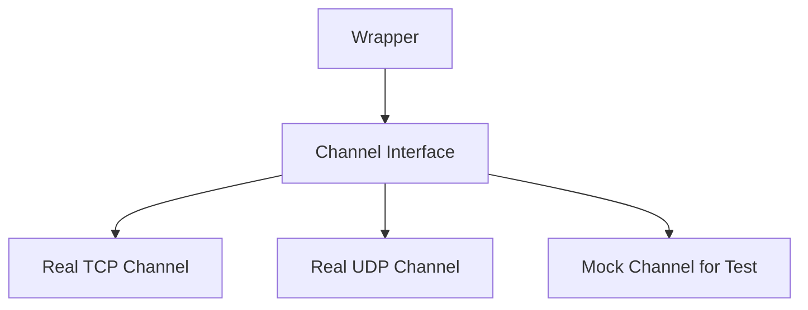

의존성 주입은 단순히 테스트 편의를 위한 기술이 아니다.
런타임 구현체를 public API로부터 분리하고, 변경 영향 범위를 내부로 제한하기 위한 구조적 장치다.

## Channel은 아키텍처 경계다

Channel 계층은 단순한 interface 하나가 아니다.
wirestead 아키텍처에서 변경이 넘어가지 않도록 막는 경계다.

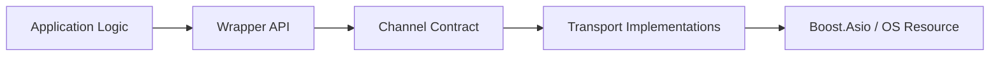

애플리케이션은 wrapper API에 의존한다.
Wrapper는 Channel 계약에 의존한다.
Transport 구현은 Channel 뒤에 위치한다.

이 구조 덕분에 transport 구현은 계속 개선할 수 있지만, 애플리케이션과 public API는 상대적으로 안정적으로 유지된다.

Channel이 없으면 wrapper는 transport 구현을 직접 알아야 한다.
반대로 Channel이 있으면 wrapper는 통신 행위에만 의존하고, transport 구현의 차이는 Channel 뒤로 밀려난다.

## Trade-off

Channel 추상화에도 비용은 있다.

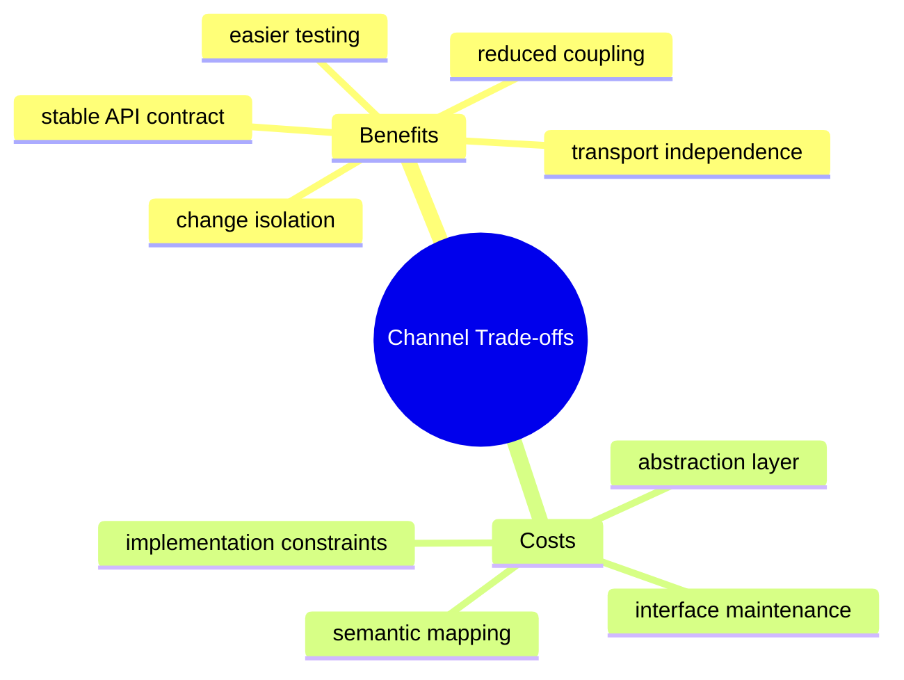

첫 번째 비용은 추상화 계층이 하나 늘어난다는 점이다.
Wrapper가 transport를 직접 호출하는 구조보다 간단하지 않다.

두 번째 비용은 interface 유지 비용이다.
Channel 계약에 메서드를 추가하거나 의미를 바꾸면 모든 transport 구현체가 영향을 받는다.

세 번째 비용은 semantic mapping이다.
TCP의 connected 상태와 UDP의 connected-like 상태처럼, transport마다 같은 메서드가 완전히 동일한 의미를 갖지 않을 수 있다. 이 경우 공통 계약의 의미를 너무 느슨하게 만들지 않으면서도 transport별 차이를 흡수해야 한다.

그럼에도 Channel 계층은 필요하다.
통신 라이브러리에서 transport 구현을 public API나 wrapper 로직에 직접 노출하면, 내부 구현 변경이 사용자 코드 변경으로 이어지기 쉽다. Channel은 이 의존성을 끊고, transport 차이를 내부로 격리하기 위한 비용 있는 선택이다.

## 정리

wirestead에서 Channel은 TCP, UDP, Serial, UDS를 단순히 하나로 묶기 위한 계층이 아니다.
더 정확히는 통신 방식의 차이를 뒤로 밀어내고, 애플리케이션과 wrapper가 실제로 필요로 하는 통신 행위를 앞으로 가져오기 위한 계약이다.

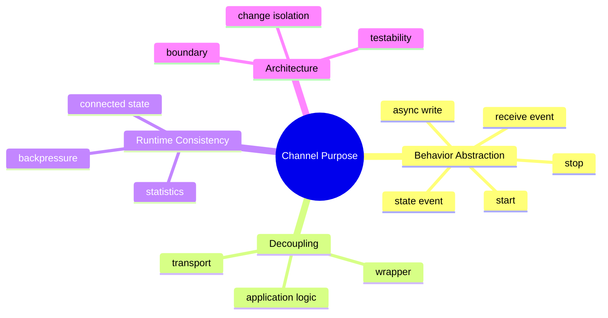

정리하면 다음과 같다.

- Channel은 transport가 아니라 통신 행위를 추상화한다.
- Wrapper는 concrete transport가 아니라 Channel 계약에 의존한다.
- Transport 구현은 Channel 뒤에 위치한다.
- Channel은 변경 영향 범위를 줄이는 아키텍처 경계다.
- UDP 같은 비연결형 transport도 Channel 계약에 맞게 runtime state를 해석해야 한다.
- 공통 계약은 테스트 가능성, API 안정성, 구현 교체 가능성을 높인다.

Channel 계층은 wirestead에서 가장 눈에 잘 띄는 public API는 아닐 수 있다.
하지만 Builder, Wrapper, Transport 구현을 하나의 일관된 구조로 연결하는 핵심 축이며, wirestead가 transport 구현이 아니라 통신 행위를 중심으로 설계되었다는 점을 가장 잘 보여주는 계층이다.
