## 도입: 수신 데이터는 곧 메시지가 아니다

통신 라이브러리에서 데이터를 수신했다고 해서, 그 데이터가 곧 하나의 완성된 메시지라는 보장은 없다.

TCP와 Serial은 대표적인 stream 기반 통신이다. 송신 측에서 한 번에 보낸 데이터라도 수신 측에서는 여러 조각으로 나뉘어 들어올 수 있고, 반대로 여러 메시지가 하나의 read callback에 함께 들어올 수도 있다.

예를 들어 송신 측에서 다음과 같이 두 개의 메시지를 보냈다고 하자.

```text
HELLO\n
WORLD\n
```

수신 측에서는 다음처럼 들어올 수 있다.

```text
HE
LLO\nWOR
LD\n
```

또는 다음처럼 한 번에 들어올 수도 있다.

```text
HELLO\nWORLD\n
```

따라서 Transport 계층이 전달하는 raw bytes를 곧바로 application message로 취급하면 문제가 생긴다.
애플리케이션은 “데이터가 들어왔다”가 아니라 “완성된 메시지가 들어왔다”를 기준으로 로직을 작성하고 싶은 경우가 많다.

이 차이를 해결하기 위한 계층이 Framer다.

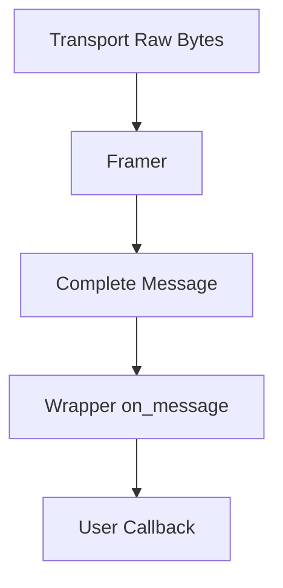
```mermaid
flowchart TD
    A[Transport Raw Bytes] --> B[Framer]
    B --> C[Complete Message]
    C --> D[Wrapper on_message]
    D --> E[User Callback]
```

Framer는 raw byte stream과 application message 사이의 경계다.
Transport가 I/O에 집중한다면, Framer는 message boundary를 찾는 데 집중한다.

## Framer가 필요한 이유

Transport는 protocol-specific I/O를 담당한다.
TCP socket에서 bytes를 읽고, Serial port에서 bytes를 읽고, UDP datagram을 받는 것이 Transport의 역할이다.

하지만 Transport가 application message까지 해석하기 시작하면 책임이 섞인다.

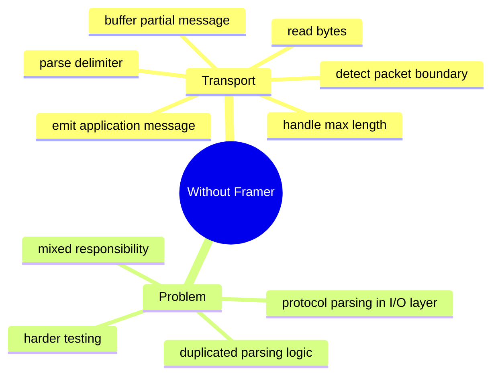
```mermaid
mindmap
  root((Without Framer))
    Transport
      read bytes
      parse delimiter
      detect packet boundary
      buffer partial message
      handle max length
      emit application message
    Problem
      mixed responsibility
      protocol parsing in I/O layer
      duplicated parsing logic
      harder testing
```

이 구조에서는 Transport가 I/O와 message parsing을 모두 책임지게 된다.
그렇게 되면 TCP, Serial, UDS처럼 stream을 다루는 transport마다 비슷한 buffer 누적과 delimiter 검색 로직이 반복된다.

Framer를 분리하면 역할이 명확해진다.

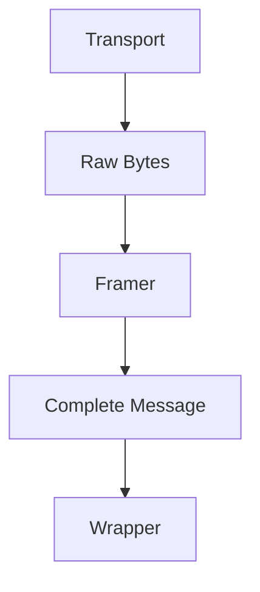
```mermaid
flowchart TD
    A[Transport] --> B[Raw Bytes]
    B --> C[Framer]
    C --> D[Complete Message]
    D --> E[Wrapper]
```

Transport는 raw bytes를 전달한다.
Framer는 message boundary를 찾는다.
Wrapper는 complete message를 사용자 callback으로 연결한다.

이 분리는 I/O와 message boundary 처리라는 서로 다른 관심사를 분리하는 설계다.

## Framer의 역할

Framer는 stream 기반 입력을 내부 buffer에 누적하고, 완성된 메시지를 찾으면 callback으로 전달한다.

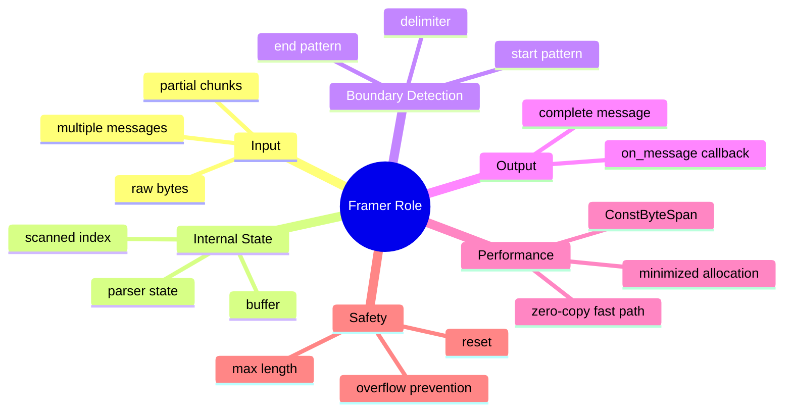
```mermaid
mindmap
  root((Framer Role))
    Input
      raw bytes
      partial chunks
      multiple messages
    Internal State
      buffer
      scanned index
      parser state
    Boundary Detection
      delimiter
      start pattern
      end pattern
    Output
      complete message
      on_message callback
    Performance
      ConstByteSpan
      zero-copy fast path
      minimized allocation
    Safety
      max length
      reset
      overflow prevention
```

Framer는 다음 문제를 해결한다.

- 메시지가 여러 read callback에 나뉘어 들어오는 경우
- 하나의 read callback에 여러 메시지가 들어오는 경우
- delimiter나 packet boundary가 chunk 경계에 걸치는 경우
- 메시지가 너무 길어져 buffer가 무한히 커지는 경우
- 연결 재시작이나 오류 이후 parser 상태를 초기화해야 하는 경우

즉, Framer는 “언제 application callback을 호출할 것인가”를 결정하는 계층이다.

## IFramer: 메시지 분리 전략의 공통 계약

unilink에서 Framer는 `IFramer` 인터페이스로 추상화된다.

개념적으로 보면 다음과 같다.

```cpp
class IFramer {
public:
    using MessageCallback =
        std::function<void(ConstByteSpan)>;

    virtual ~IFramer() = default;

    virtual void push_bytes(ConstByteSpan data) = 0;
    virtual void on_message(MessageCallback cb) = 0;
    virtual void reset() = 0;
};
```

이 인터페이스는 매우 작다.

- `push_bytes`: raw bytes를 framer에 입력한다.
- `on_message`: complete message가 추출되었을 때 호출할 callback을 등록한다.
- `reset`: 내부 buffer와 parser state를 초기화한다.

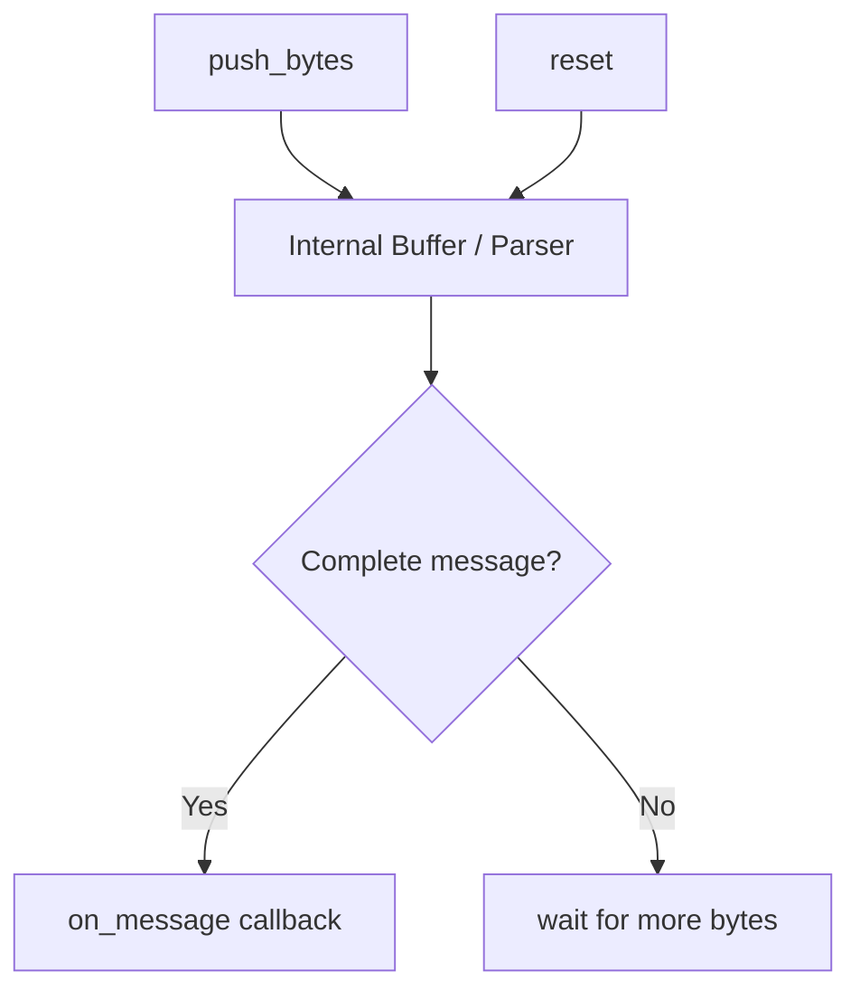
```mermaid
flowchart TD
    A[push_bytes] --> B[Internal Buffer / Parser]
    B --> C{Complete message?}
    C -- Yes --> D[on_message callback]
    C -- No --> E[wait for more bytes]
    F[reset] --> B
```

여기서 중요한 점은 `ConstByteSpan`을 사용한다는 것이다.
`ConstByteSpan`은 byte 배열을 소유하지 않는 view에 가깝다. Framer는 입력 데이터를 반드시 복사해서 소유하는 대신, 가능한 경우 들어온 buffer를 직접 scan할 수 있다.

즉, `IFramer`는 message boundary를 찾기 위한 계약이면서 동시에 불필요한 allocation과 copy를 줄이기 위한 인터페이스이기도 하다.

다만 view 기반 API는 lifetime을 명확히 해야 한다.
`ConstByteSpan`으로 전달된 데이터는 callback 호출 범위 안에서만 안전하게 참조해야 하며, Framer가 이후에도 필요로 하는 partial data는 내부 buffer로 복사해 보관해야 한다.

이 설계는 성능과 안전성 사이의 균형을 잡기 위한 선택이다.

Framer 인터페이스가 작다는 것도 중요한 장점이다.
Line 기반이든 packet 기반이든, 또는 사용자 정의 framing 전략이든 동일한 계약으로 연결할 수 있기 때문이다.

Framer는 Strategy 패턴에 가깝다.
Wrapper는 어떤 Framer가 들어왔는지 구체 타입을 알 필요 없이 `IFramer` 계약만 사용하면 된다.

## LineFramer: delimiter 기반 메시지 추출

가장 흔한 framing 방식은 delimiter 기반이다.

예를 들어 ASCII protocol, 로그 stream, NMEA 문장, line-based command protocol은 보통 `\n`, `\r\n` 같은 delimiter를 기준으로 메시지를 나눈다.

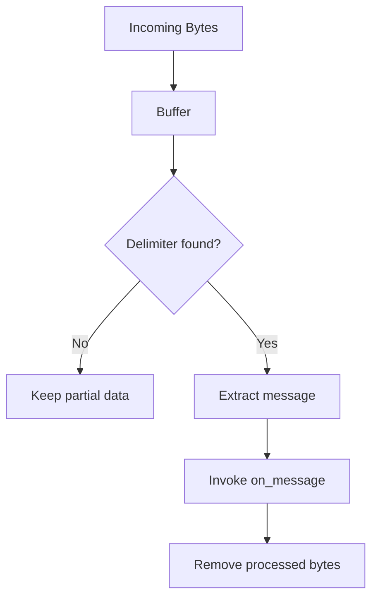
```mermaid
flowchart TD
    A[Incoming Bytes] --> B[Buffer]
    B --> C{Delimiter found?}

    C -- No --> D[Keep partial data]
    C -- Yes --> E[Extract message]
    E --> F[Invoke on_message]
    F --> G[Remove processed bytes]
```

`LineFramer`는 delimiter 문자열을 기준으로 buffer에서 메시지를 추출한다.

```cpp
auto framer = std::make_unique<LineFramer>(
    "\n",
    false,
    65536
);
```

여기서 주요 설정은 다음과 같다.

- `delimiter`: 메시지를 구분하는 문자열
- `include_delimiter`: 추출된 메시지에 delimiter를 포함할지 여부
- `max_length`: 허용할 최대 메시지 길이

LineFramer는 incoming data가 들어오면 내부 buffer와 함께 delimiter를 검색한다.
delimiter가 발견되면 delimiter 이전까지를 하나의 메시지로 보고 callback을 호출한다.

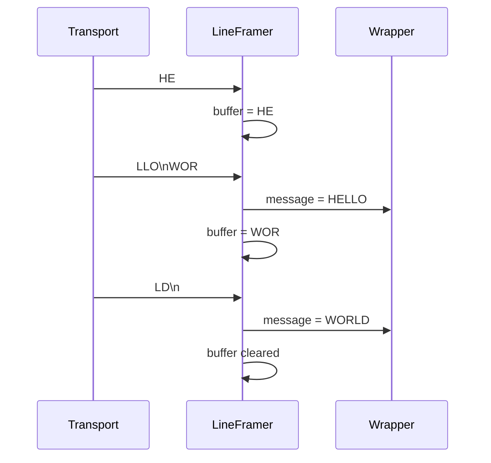
```mermaid
sequenceDiagram
    participant T as Transport
    participant F as LineFramer
    participant W as Wrapper

    T->>F: HE
    F->>F: buffer = HE

    T->>F: LLO\nWOR
    F->>W: message = HELLO
    F->>F: buffer = WOR

    T->>F: LD\n
    F->>W: message = WORLD
    F->>F: buffer cleared
```

이 구조 덕분에 사용자는 read chunk 경계를 의식하지 않아도 된다.
애플리케이션은 `on_message`에서 complete message만 받으면 된다.

## LineFramer의 buffer 관리

LineFramer의 핵심은 buffer 관리다.

수신 데이터가 항상 delimiter로 끝난다면 구현은 단순하다.
하지만 실제 stream에서는 delimiter가 chunk 사이에 걸칠 수 있다.

```text
Chunk 1: HEL
Chunk 2: LO\n
```

이 경우 첫 번째 chunk만으로는 메시지를 만들 수 없다.
LineFramer는 `HEL`을 buffer에 보관하고, 다음 chunk가 들어왔을 때 `LO\n`와 합쳐 delimiter를 찾는다.

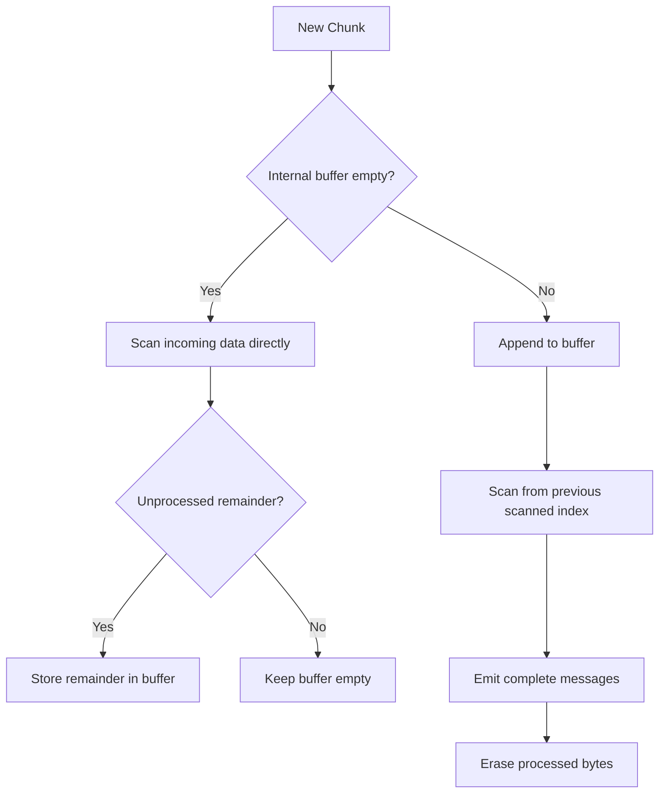
```mermaid
flowchart TD
    A[New Chunk] --> B{Internal buffer empty?}

    B -- Yes --> C[Scan incoming data directly]
    C --> D{Unprocessed remainder?}
    D -- Yes --> E[Store remainder in buffer]
    D -- No --> F[Keep buffer empty]

    B -- No --> G[Append to buffer]
    G --> H[Scan from previous scanned index]
    H --> I[Emit complete messages]
    I --> J[Erase processed bytes]
```

LineFramer는 buffer가 비어 있을 때는 들어온 data를 직접 scan할 수 있다.
이 경우 불필요한 copy를 줄일 수 있다.

인터페이스가 `ConstByteSpan` 기반이기 때문에, 조건이 맞으면 Transport의 수신 buffer를 별도의 allocation 없이 바로 scan하고 complete message를 callback으로 전달할 수 있다.
즉, message boundary가 현재 chunk 안에서 바로 해결되는 경우에는 zero-copy에 가까운 fast path를 만들 수 있다.

반대로 이전 partial message가 남아 있으면 새 data를 buffer에 append하고, 이전에 scan한 위치를 기준으로 다시 검색한다.
이때 delimiter가 chunk 경계에 걸릴 수 있으므로 delimiter length만큼 일부 구간을 다시 확인한다.

이 설계는 성능과 정확성 사이의 균형이다.

- buffer가 없으면 직접 scan한다.
- partial message가 있으면 buffer에 누적한다.
- 이미 scan한 부분을 최대한 다시 보지 않는다.
- chunk boundary에 걸친 delimiter는 놓치지 않는다.
- 이후에도 필요한 partial data만 내부 buffer로 복사한다.

## max_length와 방어적 설계

Framer는 내부 buffer를 가진다.
따라서 delimiter나 end pattern이 오지 않는 입력이 계속 들어오면 buffer가 무한히 커질 수 있다.

이 문제는 단순한 성능 문제가 아니다.
외부 입력에 의해 메모리가 계속 증가할 수 있기 때문에 DoS 관점에서도 위험하다.

LineFramer와 PacketFramer는 모두 최대 길이를 둔다.

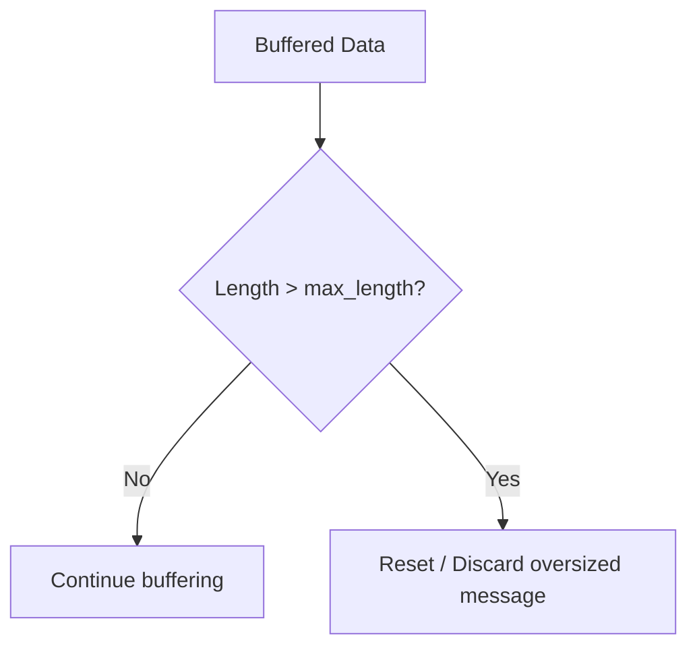
```mermaid
flowchart TD
    A[Buffered Data] --> B{Length > max_length?}

    B -- No --> C[Continue buffering]
    B -- Yes --> D[Reset / Discard oversized message]
```

`max_length`는 message framing에서 중요한 안전장치다.

정상적인 protocol이라면 일정 길이 안에서 delimiter나 end pattern이 나와야 한다.
그렇지 않다면 해당 입력은 손상되었거나, 잘못된 데이터이거나, 공격적인 입력일 수 있다.

Framer가 길이 제한을 두면 이런 입력이 transport나 application logic까지 영향을 주지 않도록 막을 수 있다.

## PacketFramer: start/end pattern 기반 packet 추출

LineFramer가 text 기반 protocol에 적합하다면, PacketFramer는 binary packet protocol에 적합하다.

많은 binary protocol은 다음과 같은 구조를 가진다.

```text
START_PATTERN + PAYLOAD + END_PATTERN
```

예를 들어 STX/ETX 기반 protocol이라면 다음처럼 볼 수 있다.

```text
0x02 ... payload ... 0x03
```

PacketFramer는 start pattern을 찾고, 그 이후 end pattern이 나올 때까지 데이터를 수집한다.

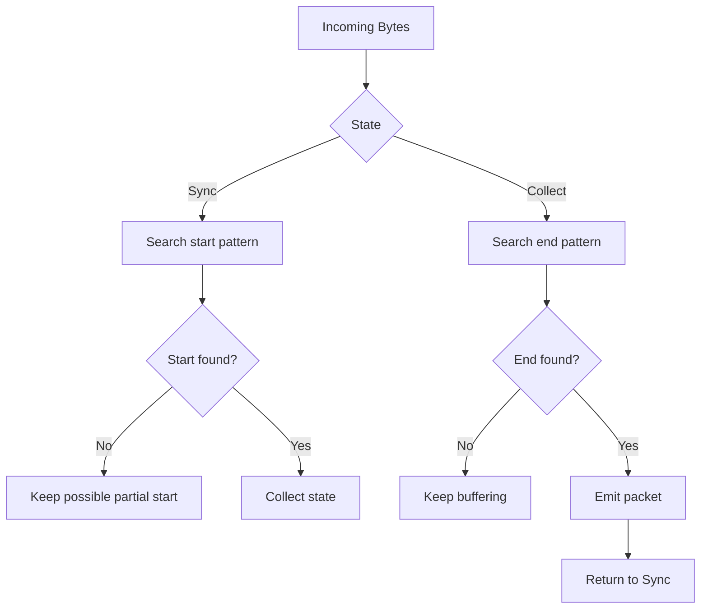
```mermaid
flowchart TD
    A[Incoming Bytes] --> B{State}

    B -- Sync --> C[Search start pattern]
    C --> D{Start found?}
    D -- No --> E[Keep possible partial start]
    D -- Yes --> F[Collect state]

    B -- Collect --> G[Search end pattern]
    G --> H{End found?}
    H -- No --> I[Keep buffering]
    H -- Yes --> J[Emit packet]
    J --> K[Return to Sync]
```

PacketFramer는 내부적으로 `Sync`와 `Collect` 상태를 가진다.

- `Sync`: start pattern을 기다리는 상태
- `Collect`: start pattern 이후 end pattern을 기다리는 상태

이 구조는 stream 중간에서 동기화가 깨졌을 때도 유용하다.
start pattern을 다시 찾으면서 packet boundary를 복구할 수 있기 때문이다.

## PacketFramer의 상태 관리

PacketFramer는 LineFramer보다 상태 관리가 더 중요하다.

LineFramer는 delimiter만 찾으면 되지만, PacketFramer는 start pattern과 end pattern을 모두 고려해야 한다.

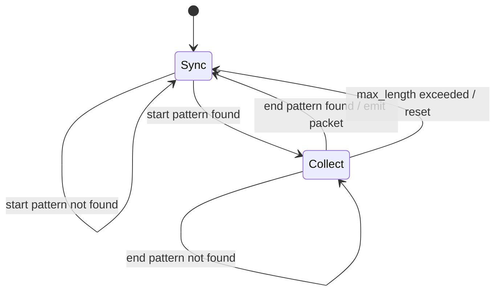
```mermaid
stateDiagram-v2
    [*] --> Sync
    Sync --> Sync: start pattern not found
    Sync --> Collect: start pattern found
    Collect --> Collect: end pattern not found
    Collect --> Sync: end pattern found / emit packet
    Collect --> Sync: max_length exceeded / reset
```

예를 들어 다음과 같은 입력이 들어올 수 있다.

```text
garbage garbage START payload END garbage START payload...
```

PacketFramer는 garbage를 버리고 start pattern부터 packet을 수집해야 한다.
end pattern을 찾으면 complete packet을 callback으로 전달하고, 다시 Sync 상태로 돌아간다.

이 상태 전이 덕분에 Framer는 stream 중간에서 다시 동기화할 수 있다.

## Framer와 Wrapper의 연결

Framer는 단독으로 사용되기보다 Wrapper 내부에서 연결된다.

Transport가 raw bytes를 올리면 Wrapper는 이를 Framer에 넣고, Framer가 complete message를 찾으면 Wrapper의 `on_message` callback으로 연결한다.

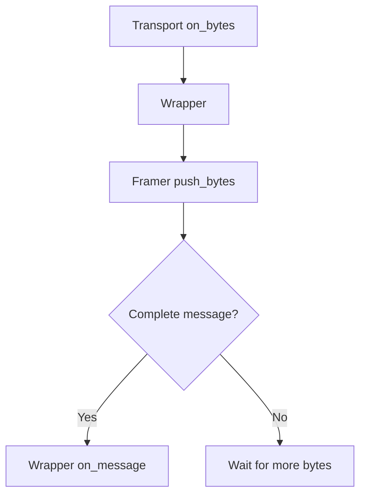
```mermaid
flowchart TD
    A[Transport on_bytes] --> B[Wrapper]
    B --> C[Framer push_bytes]
    C --> D{Complete message?}
    D -- Yes --> E[Wrapper on_message]
    D -- No --> F[Wait for more bytes]
```

사용자 입장에서는 두 가지 callback을 구분할 수 있다.

```cpp
auto client = unilink::tcp_client("127.0.0.1", 9000)
    .use_line_framer("\n")
    .on_data([](const unilink::MessageContext& ctx) {
        // raw chunk callback
    })
    .on_message([](const unilink::MessageContext& msg) {
        // complete message callback
    })
    .build();
```

`on_data`는 transport에서 들어온 raw chunk에 가깝다.
`on_message`는 framer가 추출한 complete message에 가깝다.

이 분리는 중요하다.
어떤 애플리케이션은 raw chunk를 직접 처리하고 싶을 수 있고, 어떤 애플리케이션은 message 단위만 보고 싶을 수 있다. unilink는 이 둘을 분리해 제공한다.

## Builder에서 Framer 설정하기

Framer는 Builder 단계에서 설정할 수 있다.

```cpp
auto client = unilink::tcp_client("127.0.0.1", 9000)
    .use_line_framer("\n")
    .on_message([](const unilink::MessageContext& msg) {
        // handle line message
    })
    .build();
```

Packet 기반 protocol이라면 다음처럼 설정할 수 있다.

```cpp
auto client = unilink::tcp_client("127.0.0.1", 9000)
    .use_packet_framer({0x02}, {0x03}, 4096)
    .on_message([](const unilink::MessageContext& msg) {
        // handle packet
    })
    .build();
```

또는 custom framer factory를 넘기는 방식으로 사용자 정의 framing 전략을 사용할 수도 있다.

```cpp
auto client = unilink::tcp_client("127.0.0.1", 9000)
    .framer([] {
        return std::make_unique<MyCustomFramer>();
    })
    .on_message([](const unilink::MessageContext& msg) {
        // handle custom-framed message
    })
    .build();
```

이 구조는 Framer를 Strategy처럼 교체할 수 있게 만든다.
Wrapper는 `IFramer` 계약만 알면 되고, 실제 framing 방식은 Builder에서 주입된다.

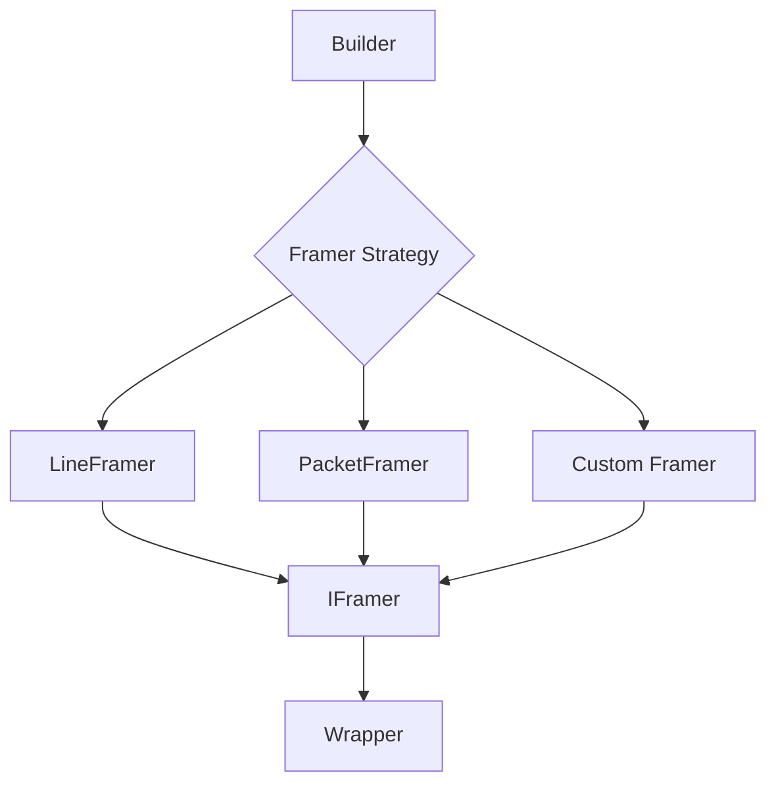
```mermaid
flowchart TD
    A[Builder] --> B{Framer Strategy}

    B --> C[LineFramer]
    B --> D[PacketFramer]
    B --> E[Custom Framer]

    C --> F[IFramer]
    D --> F
    E --> F

    F --> G[Wrapper]
```

Framer를 Builder에서 설정하는 방식은 public API를 단순하게 유지하면서도, protocol별 message boundary 처리 전략을 유연하게 바꿀 수 있게 한다.

## Framer 설계의 Trade-off

Framer 계층도 비용이 있다.

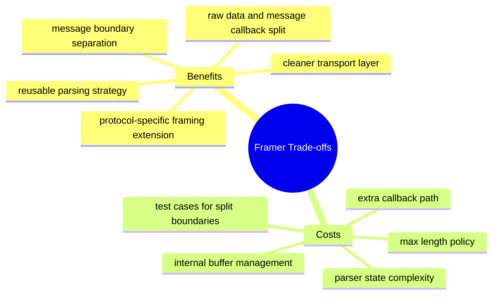
```mermaid
mindmap
  root((Framer Trade-offs))
    Benefits
      message boundary separation
      reusable parsing strategy
      raw data and message callback split
      cleaner transport layer
      protocol-specific framing extension
    Costs
      internal buffer management
      parser state complexity
      max length policy
      extra callback path
      test cases for split boundaries
```

첫 번째 비용은 내부 buffer 관리다.
Framer는 partial message를 보관해야 하므로 buffer와 parser state를 가진다.

두 번째 비용은 edge case 처리다.
delimiter가 chunk 경계에 걸리는 경우, start pattern의 일부만 마지막에 남는 경우, end pattern이 오지 않는 경우, max length를 넘는 경우를 모두 고려해야 한다.

세 번째 비용은 테스트 복잡성이다.
정상 메시지뿐 아니라 split delimiter, multiple messages in one chunk, oversized message, reset 이후 상태 같은 케이스를 확인해야 한다.

그럼에도 Framer 계층은 필요하다.
message boundary 처리를 Transport나 application code에 흩어놓으면 중복이 늘어나고, stream 기반 통신에서 미묘한 버그가 생기기 쉽다.

Framer는 이 복잡성을 하나의 전략 계층으로 격리한다.

## 정리

unilink에서 Framer는 raw byte stream을 complete message로 변환하는 계층이다.

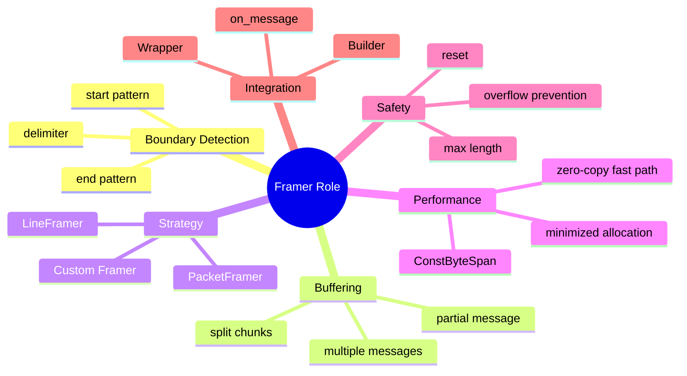
```mermaid
mindmap
  root((Framer Role))
    Boundary Detection
      delimiter
      start pattern
      end pattern
    Buffering
      partial message
      split chunks
      multiple messages
    Strategy
      LineFramer
      PacketFramer
      Custom Framer
    Performance
      ConstByteSpan
      zero-copy fast path
      minimized allocation
    Safety
      max length
      reset
      overflow prevention
    Integration
      Builder
      Wrapper
      on_message
```

정리하면 다음과 같다.

- Transport는 raw bytes를 전달한다.
- Framer는 raw bytes에서 message boundary를 찾는다.
- `ConstByteSpan` 기반 인터페이스를 통해 불필요한 allocation과 copy를 줄인다.
- LineFramer는 delimiter 기반 text protocol에 적합하다.
- PacketFramer는 start/end pattern 기반 binary packet protocol에 적합하다.
- IFramer는 framing 전략을 교체할 수 있는 공통 계약이다.
- Builder는 Framer 전략을 설정하고, Wrapper는 이를 runtime callback과 연결한다.
- max_length와 reset은 buffer 증가와 parser 상태 오류를 방지하는 안전장치다.

Framer 계층은 unilink에서 raw data와 application message 사이의 경계다.
이 계층을 분리했기 때문에 Transport는 I/O에 집중하고, 애플리케이션은 complete message 단위의 callback을 기준으로 로직을 작성할 수 있다.
