## 도입: 통신 데이터는 단순한 byte 배열이 아니다

통신 라이브러리에서 데이터는 대부분 byte 배열로 표현된다.
문자열을 보내든, 바이너리 packet을 보내든, 센서 데이터를 보내든, 결국 transport 계층으로 내려가면 byte buffer가 된다.

하지만 비동기 통신에서 buffer는 단순한 `uint8_t*`나 `std::vector<uint8_t>` 이상의 의미를 가진다.
언제까지 살아 있어야 하는지, 누가 소유하는지, 복사해도 되는지, callback 이후에도 보관해도 되는지에 따라 안전성과 성능이 크게 달라진다.

특히 Boost.Asio 같은 비동기 I/O에서는 write 요청이 호출 직후 완료되지 않는다.
데이터를 넘긴 시점과 실제 I/O가 완료되는 시점이 다르기 때문에, buffer lifetime을 명확히 설계하지 않으면 dangling pointer, 불필요한 copy, memory pressure 같은 문제가 발생할 수 있다.

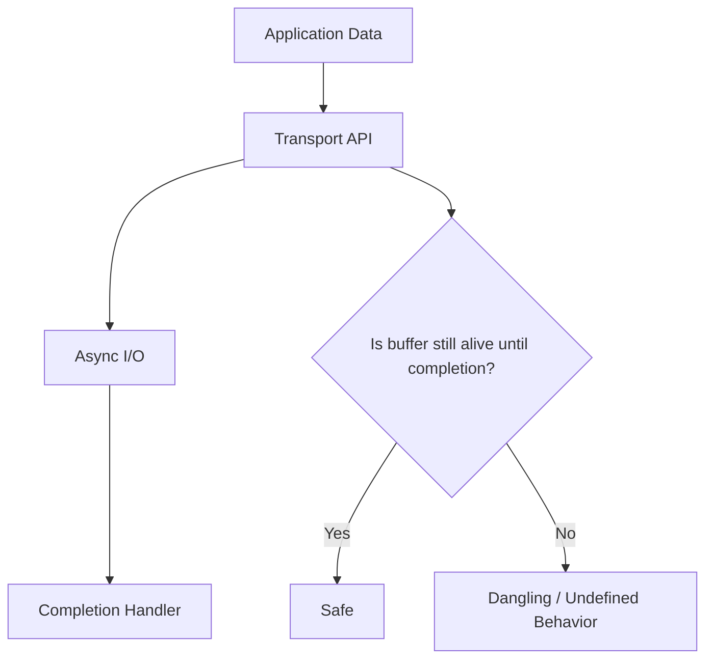

unilink의 Memory / Buffer 설계는 이 문제를 다루기 위한 계층이다.
핵심은 view와 ownership을 구분하고, 비동기 경로에서는 buffer lifetime을 API 수준에서 명확히 표현하는 것이다.

## Buffer 설계에서 중요한 기준

비동기 통신에서 buffer를 다룰 때는 최소한 세 가지를 구분해야 한다.

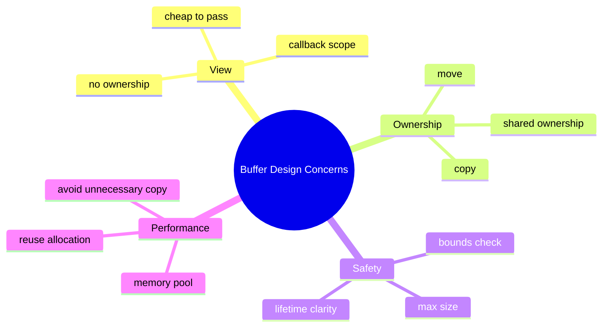

첫 번째는 view다.
view는 데이터를 소유하지 않고 바라보기만 한다. 빠르고 가볍지만, 원본 buffer가 사라지면 더 이상 사용할 수 없다.

두 번째는 ownership이다.
비동기 write처럼 데이터가 나중에 사용되는 경우에는 누가 buffer를 소유하는지 분명해야 한다. 복사해서 내부 소유로 만들 수도 있고, move로 ownership을 넘길 수도 있으며, `shared_ptr`로 공유 lifetime을 유지할 수도 있다.

세 번째는 안전성이다.
외부 입력이나 큰 payload를 다루는 통신 라이브러리에서는 bounds check, max size, buffer validation이 필요하다.

unilink는 이 세 가지를 각각 다른 타입과 API로 표현한다.

## SafeSpan: 소유하지 않는 byte view

`SafeSpan`은 `std::span` 기반의 memory view다.
데이터를 소유하지 않고, pointer와 size를 함께 들고 있는 가벼운 view 역할을 한다.

개념적으로 보면 다음과 같다.

```cpp
template <typename T>
class SafeSpan : public std::span<T> {
public:
    T& at(std::size_t index) const;
    SafeSpan<T> subspan(std::size_t offset, std::size_t count) const;
};

using ByteSpan = SafeSpan<uint8_t>;
using ConstByteSpan = SafeSpan<const uint8_t>;
```

`ConstByteSpan`은 Framer, Transport, Channel callback 등에서 자주 사용된다.
이 타입은 데이터를 복사하지 않고도 byte sequence를 전달할 수 있게 한다.

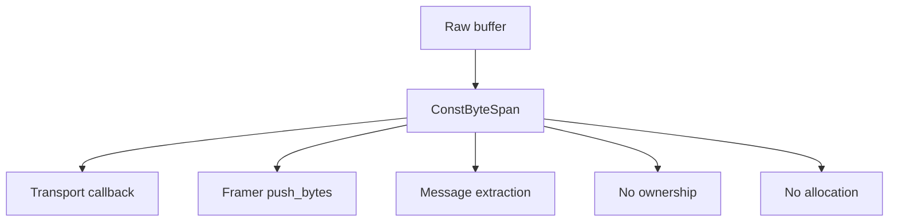

View 기반 API의 장점은 명확하다.

- 복사가 없다.
- 할당이 없다.
- pointer와 size가 함께 이동하므로 raw pointer보다 안전하다.
- callback 경로에서 가볍게 전달할 수 있다.

하지만 단점도 분명하다.
view는 데이터를 소유하지 않기 때문에, view를 callback 밖으로 저장하면 위험할 수 있다. 원본 buffer의 lifetime이 끝나면 view는 무효가 된다.

따라서 `ConstByteSpan`은 “읽기 전용 view”이지, “안전하게 오래 보관 가능한 buffer”가 아니다.

## SafeDataBuffer: 소유권이 있는 안전한 buffer

`SafeDataBuffer`는 데이터를 소유하는 buffer다.
string, string_view, vector, raw pointer, span 등 다양한 입력에서 생성할 수 있고, 내부적으로 `std::vector<uint8_t>`를 보관한다.

```cpp
class SafeDataBuffer {
public:
    explicit SafeDataBuffer(std::string_view data);
    explicit SafeDataBuffer(std::vector<uint8_t> data);
    explicit SafeDataBuffer(const uint8_t* data, size_t size);
    explicit SafeDataBuffer(ConstByteSpan span);

    std::string as_string() const;
    ConstByteSpan as_span() const noexcept;
    const uint8_t* data() const noexcept;
    size_t size() const noexcept;

    const uint8_t& at(size_t index) const;
};
```

`SafeDataBuffer`의 역할은 view와 다르다.
데이터를 내부에 복사하거나 move해서 소유하기 때문에, callback 이후에도 안전하게 보관할 수 있다.

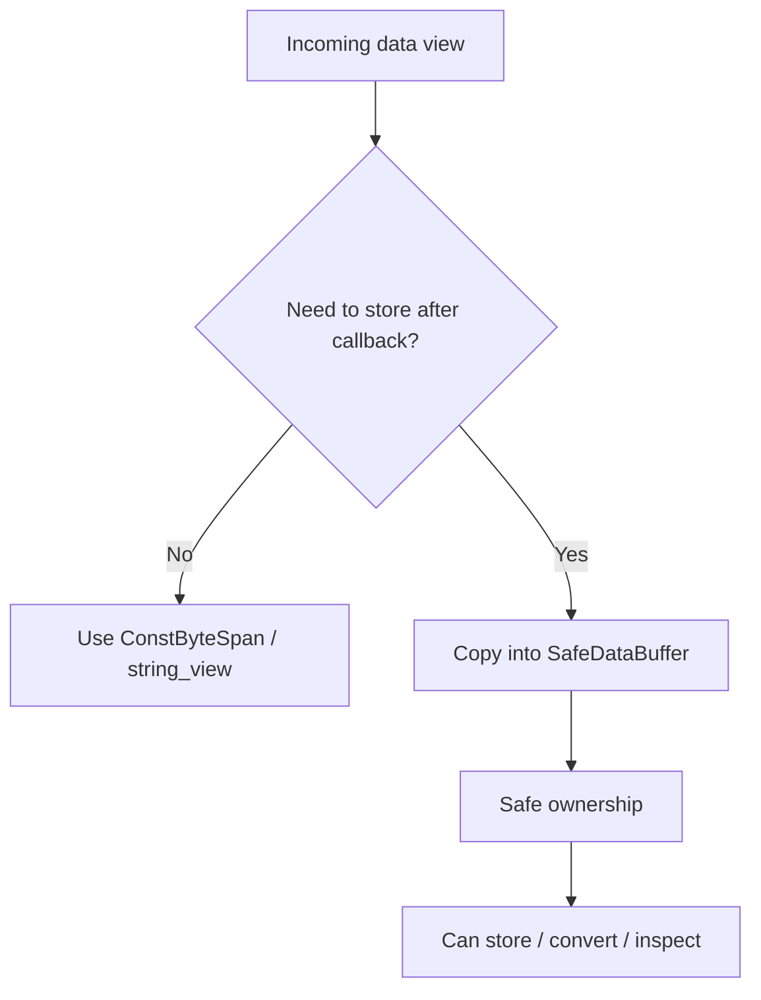

예를 들어 `MessageContext`는 수신 데이터를 `SafeDataBuffer`로 보관하고, 사용자에게는 view 또는 copy 형태로 접근할 수 있게 한다.

```cpp
client.on_data([](const unilink::MessageContext& ctx) {
    auto view = ctx.data();             // callback scope view
    auto copy = ctx.data_as_vector();   // safe to store
});
```

이 설계는 사용자가 lifetime을 선택할 수 있게 한다.

callback 안에서만 읽을 것이라면 view를 사용하면 된다.
callback 이후에도 보관해야 한다면 copy를 얻어야 한다.

즉, `SafeDataBuffer`는 안전한 소유권 경계다.

## View와 Ownership 분리

unilink의 buffer 설계에서 가장 중요한 원칙은 view와 ownership을 분리하는 것이다.

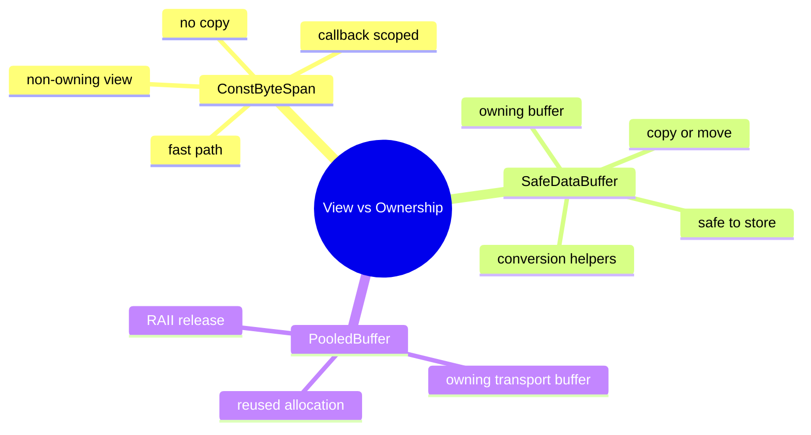

모든 곳에서 owning buffer를 사용하면 안전하지만, 불필요한 copy가 늘어난다.
반대로 모든 곳에서 view만 사용하면 빠르지만, lifetime 문제가 생기기 쉽다.

따라서 unilink는 상황에 따라 다른 타입을 사용한다.

Transport와 Framer의 내부 경로에서는 `ConstByteSpan`을 사용해 가능한 copy를 줄인다.
사용자 callback이나 저장 가능성이 있는 경계에서는 `SafeDataBuffer`를 사용해 lifetime을 명확히 한다.
Transport 송신 queue처럼 반복 allocation이 부담되는 경로에서는 `PooledBuffer`를 사용할 수 있다.

이 구분은 성능과 안전성을 동시에 만족하기 위한 설계다.

## 비동기 write와 buffer lifetime

비동기 write에서 buffer lifetime은 특히 중요하다.

다음과 같은 코드는 위험하다.

```cpp
void send_message(Channel& ch) {
    std::vector<uint8_t> data = make_payload();
    ch.async_write(data.data(), data.size());
} // data is destroyed here
```

`async_write`가 실제로 데이터를 사용하는 시점은 함수가 끝난 뒤일 수 있다.
이 경우 `data`가 이미 파괴되었다면 write operation은 무효한 memory를 참조할 수 있다.

unilink는 이 문제를 송신 API에서 명시적으로 나눈다.

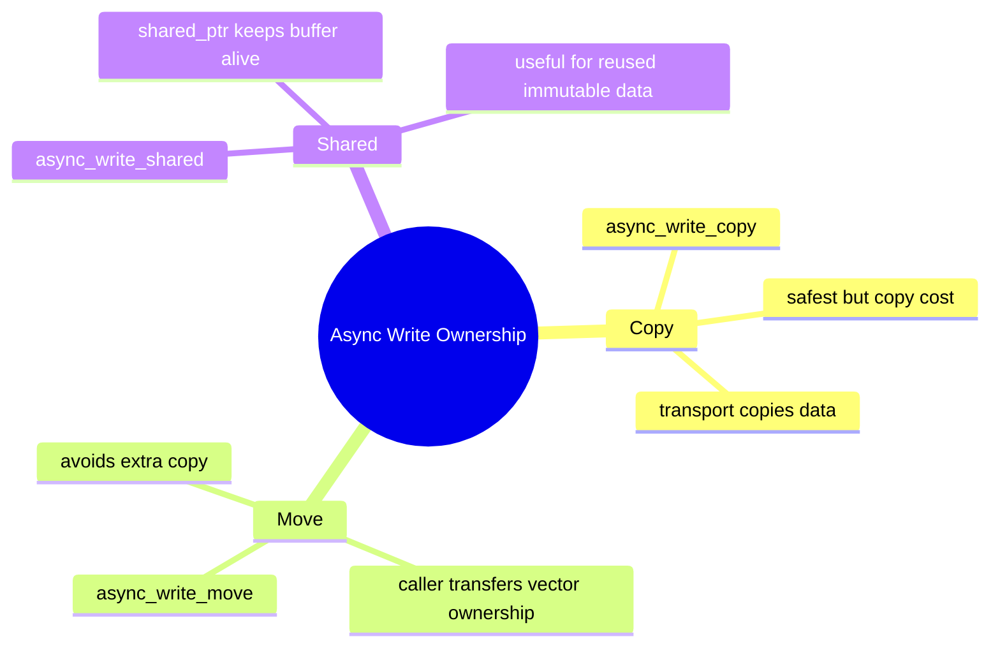

각 API는 buffer lifetime에 대한 다른 의도를 표현한다.

`async_write_copy`는 caller의 buffer를 내부 queue로 복사한다.
가장 안전하지만 copy 비용이 있다.

`async_write_move`는 `std::vector<uint8_t>`의 ownership을 transport로 넘긴다.
caller는 더 이상 해당 buffer를 소유하지 않고, transport가 write 완료까지 lifetime을 보장한다.

`async_write_shared`는 `std::shared_ptr<const std::vector<uint8_t>>`를 통해 공유 ownership을 유지한다.
동일한 payload를 여러 곳에서 참조하거나, immutable buffer를 여러 비동기 작업에 공유하고 싶을 때 유용하다.

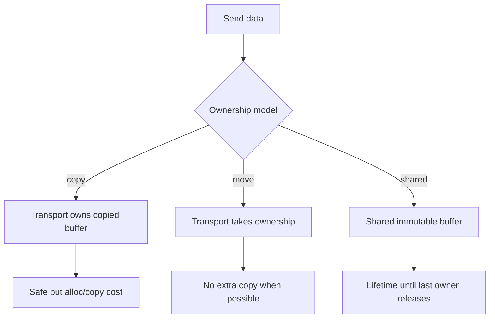

중요한 것은 사용자가 의도적으로 선택할 수 있다는 점이다.
“무조건 빠르게”가 아니라, 데이터 성격과 lifetime 요구사항에 따라 안전성과 성능을 선택할 수 있어야 한다.

## PooledBuffer: 반복 allocation 줄이기

통신 라이브러리에서는 작은 buffer allocation이 매우 자주 발생할 수 있다.
특히 high-frequency telemetry나 작은 packet을 많이 주고받는 경우, 매번 `new` / `delete` 또는 vector allocation이 발생하면 성능과 latency에 영향을 줄 수 있다.

`MemoryPool`은 이런 반복 allocation을 줄이기 위한 계층이다.

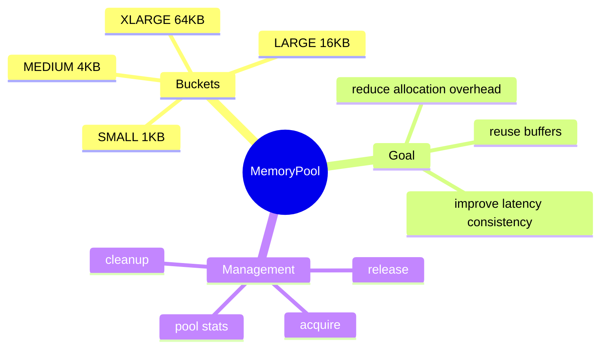

`PooledBuffer`는 memory pool에서 얻은 buffer를 RAII로 관리한다.

```cpp
memory::PooledBuffer buffer(size);
if (buffer.valid()) {
    std::memcpy(buffer.data(), data.data(), size);
    // buffer is returned to pool when PooledBuffer is destroyed
}
```

이 구조의 장점은 buffer 반환을 명시적으로 호출하지 않아도 된다는 점이다.
`PooledBuffer`의 lifetime이 끝나면 내부 buffer가 pool로 돌아갈 수 있다.

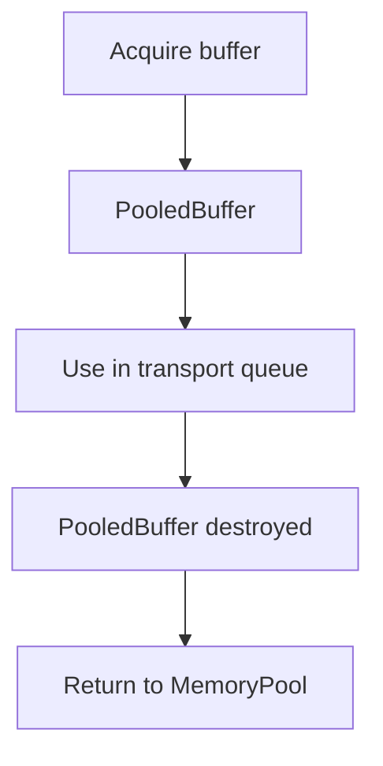

RAII는 memory pool과 잘 맞는다.
pool 사용의 핵심은 acquire와 release가 반드시 짝을 이루어야 한다는 것인데, RAII wrapper를 사용하면 예외나 조기 return 상황에서도 release 누락 가능성을 줄일 수 있다.

## MemoryPool의 bucket 전략

MemoryPool은 모든 크기를 하나의 pool에서 다루지 않는다.
일반적인 통신 payload 크기를 기준으로 여러 bucket을 둔다.

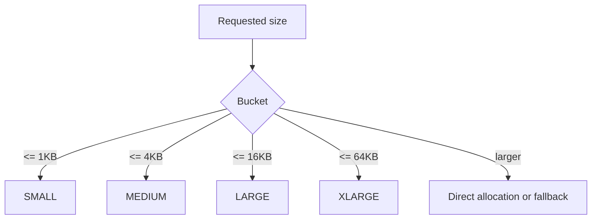

Bucket을 나누면 자주 쓰이는 크기의 buffer를 재사용하기 쉽다.
작은 메시지와 큰 데이터 전송을 같은 pool에서 다루면 낭비가 생길 수 있는데, 크기별 bucket은 이런 문제를 줄인다.

`PooledBuffer`는 이러한 pool buffer를 RAII 방식으로 감싸는 객체다.
buffer를 얻고, 사용하고, scope가 끝나면 반환하는 흐름을 객체 lifetime에 묶으면 release 누락 가능성을 줄일 수 있다.


다만 memory pool이 항상 이득인 것은 아니다.

- pool 관리 비용이 있다.
- 잘못된 bucket 크기는 memory 낭비를 만들 수 있다.
- 사용 패턴에 따라 hit rate가 낮을 수 있다.
- 멀티스레드 환경에서는 bucket lock 경합이 생길 수 있다.

특히 high-throughput 환경에서는 memory pool 자체가 병목이 될 수도 있다.
여러 transport thread가 같은 bucket을 자주 acquire/release하면 mutex 경합이 발생할 수 있고, 이 경우 allocation 비용을 줄이려던 구조가 오히려 latency jitter를 만들 수 있다.

이런 경합을 줄이기 위해서는 thread-local cache를 두거나, 특정 hot path에는 lock-free 구조를 적용하거나, transport별 pool을 분리하는 방식도 고려할 수 있다.
즉, MemoryPool은 단순한 최적화 장치가 아니라 workload와 동시성 수준에 맞춰 조정되어야 하는 성능 계층이다.

따라서 MemoryPool의 목적은 모든 allocation을 무조건 pool로 대체하는 것이 아니다.
반복 allocation이 많은 hot path에서 선택적으로 사용할 수 있는 기반을 제공하고, 필요에 따라 pool 크기와 bucket 정책을 조정할 수 있게 하는 것이다.

## 수신 경로의 lifetime

수신 경로에서는 Transport가 raw bytes를 읽고, Wrapper 또는 Framer가 이를 처리한다.

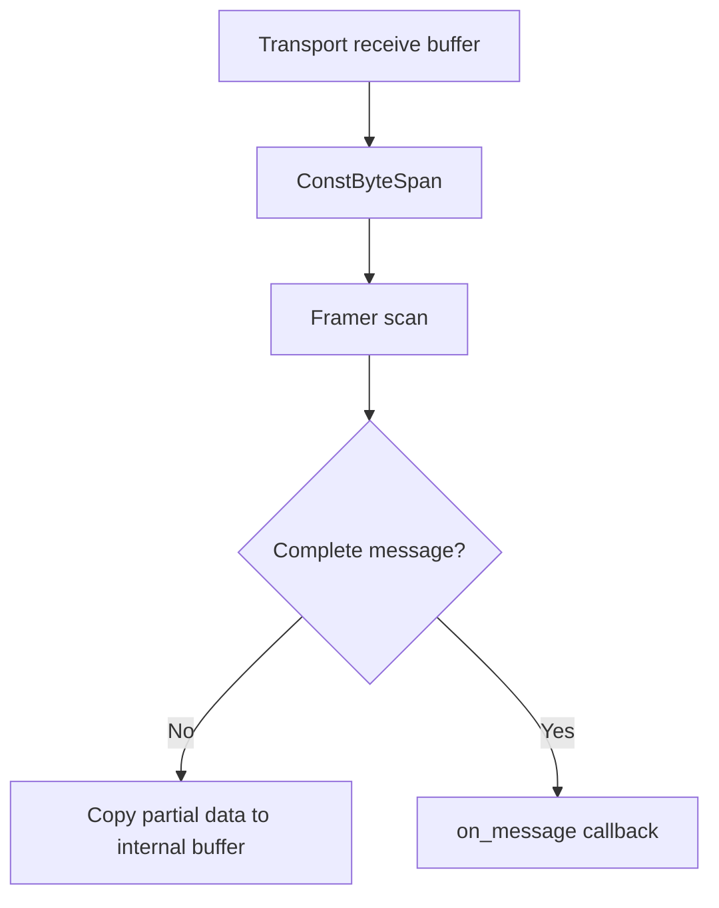

Framer가 현재 chunk 안에서 메시지를 바로 찾을 수 있다면, `ConstByteSpan` view를 통해 별도 allocation 없이 callback으로 전달할 수 있다.

반면 메시지가 chunk 경계에 걸치면 partial data를 내부 buffer에 복사해야 한다.
이 복사는 피할 수 없는 비용이다. 메시지를 완성하기 위해 현재 chunk 이후의 데이터가 필요하기 때문이다.

즉, 수신 경로의 원칙은 다음과 같다.

- 즉시 처리 가능한 데이터는 view로 처리한다.
- 이후에도 필요한 partial data는 owning buffer로 복사한다.
- 사용자 callback 이후에도 보관해야 한다면 명시적으로 copy한다.

이 원칙을 지키면 zero-copy 가능성과 lifetime safety를 동시에 확보할 수 있다.

## callback scope와 저장 가능한 데이터

사용자 callback에서 가장 흔한 실수 중 하나는 view를 오래 보관하는 것이다.

```cpp
std::string_view saved;

client.on_data([&](const unilink::MessageContext& ctx) {
    saved = ctx.data(); // dangerous if used after callback
});
```

`ctx.data()`가 반환하는 view는 callback scope 안에서만 안전하다.
callback 이후에도 데이터를 보관해야 한다면 owning copy를 만들어야 한다.

```cpp
std::vector<uint8_t> saved;

client.on_data([&](const unilink::MessageContext& ctx) {
    saved = ctx.data_as_vector(); // safe to store
});
```

이 차이를 API로 명확히 드러내는 것이 중요하다.

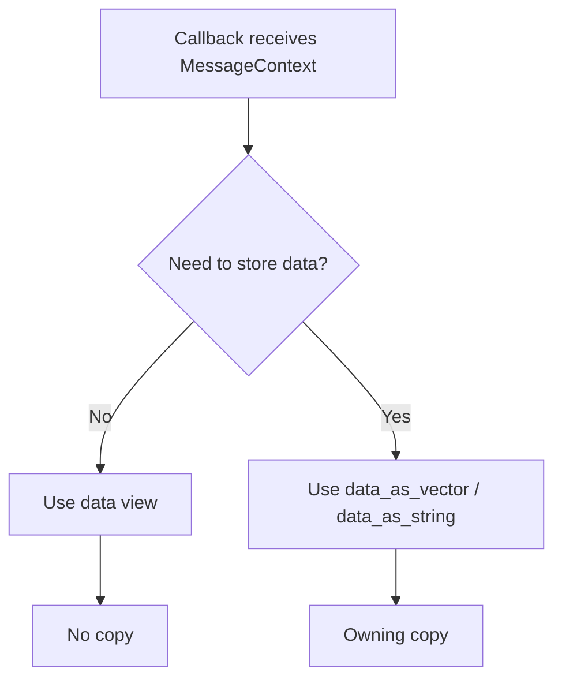

unilink의 MessageContext는 view와 copy API를 함께 제공한다.
이는 사용자가 성능과 안전성 사이에서 의식적인 선택을 하도록 만드는 API 설계다.

## Zero-copy의 의미와 한계

Zero-copy는 매력적인 표현이지만, 통신 라이브러리에서 항상 가능한 것은 아니다.

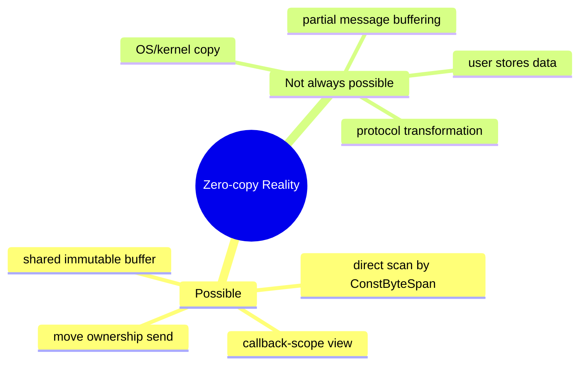

unilink에서 zero-copy는 “항상 복사가 없다”는 의미가 아니다.
그보다는 불필요한 복사를 피하고, 복사가 필요한 지점을 명확히 한다는 의미에 가깝다.

예를 들어 Framer가 현재 chunk 안에서 complete message를 찾으면 view만으로 처리할 수 있다.
하지만 partial message가 남으면 내부 buffer에 복사해야 한다.

비동기 write에서도 마찬가지다.
caller가 데이터를 넘긴 뒤 바로 소멸될 수 있다면 transport는 copy하거나 ownership을 가져야 한다.
move나 shared ownership을 사용하면 copy를 줄일 수 있지만, lifetime 관리는 여전히 필요하다.

즉, zero-copy는 목표이지만 절대 원칙은 아니다.
안전하지 않은 zero-copy보다 명확한 ownership이 더 중요하다.

## Memory / Buffer 설계의 Trade-off

Memory / Buffer 계층은 성능과 안전성 사이의 trade-off를 다룬다.

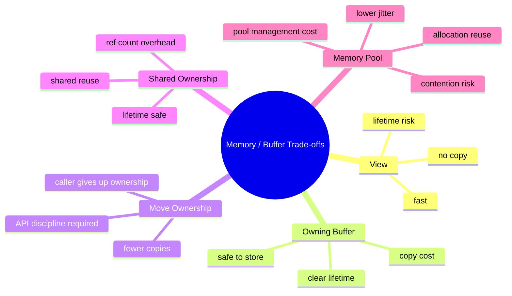

모든 데이터를 copy하면 안전하지만 느릴 수 있다.
모든 데이터를 view로 처리하면 빠르지만 lifetime 문제가 생긴다.
move는 효율적이지만 caller의 ownership을 명확히 포기해야 한다.
shared ownership은 안전하지만 reference count overhead가 있다.
memory pool은 allocation 비용을 줄이지만 pool 관리 비용과 thread contention 가능성이 있다.

따라서 중요한 것은 하나의 방식을 강제하지 않는 것이다.
데이터 성격과 경로에 맞는 선택지를 제공해야 한다.

## 정리

unilink에서 Memory / Buffer 설계는 비동기 통신의 lifetime과 ownership 문제를 다루기 위한 계층이다.

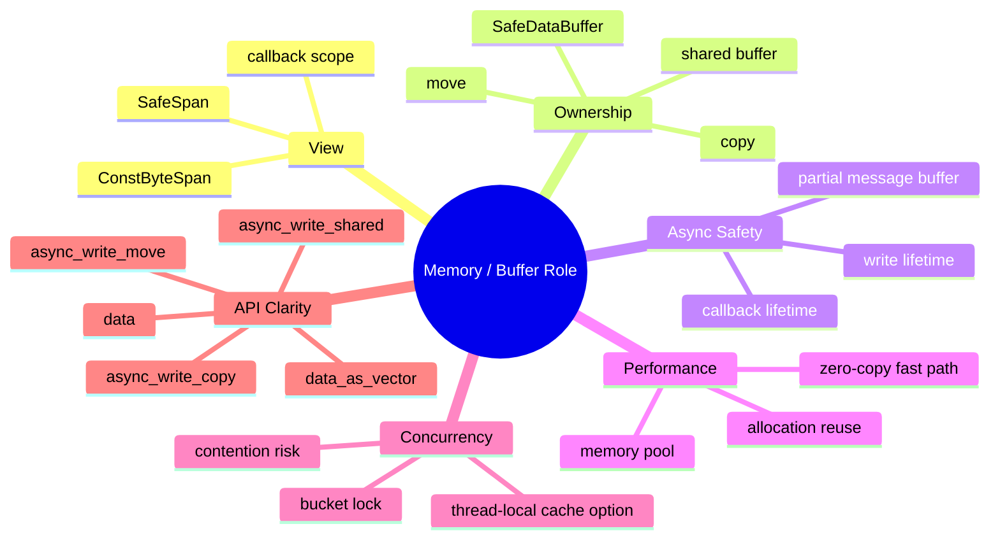

정리하면 다음과 같다.

- `ConstByteSpan`은 소유권 없는 view로, callback 경로에서 불필요한 copy를 줄인다.
- `SafeDataBuffer`는 데이터를 소유하는 안전한 buffer로, callback 이후에도 보관 가능한 데이터를 제공한다.
- 비동기 write에서는 buffer가 완료 시점까지 살아 있어야 하므로 ownership 모델이 명확해야 한다.
- `copy`, `move`, `shared` 송신 API는 서로 다른 lifetime / performance trade-off를 표현한다.
- `PooledBuffer`와 `MemoryPool`은 반복 allocation을 줄이기 위한 최적화 기반이다.
- MemoryPool은 allocation 비용을 줄일 수 있지만, 멀티스레드 환경에서는 bucket lock 경합도 함께 고려해야 한다.
- Framer는 즉시 처리 가능한 데이터는 view로 처리하고, partial message는 내부 buffer로 보관한다.
- Zero-copy는 절대 원칙이 아니라, 안전성이 확보되는 범위에서 불필요한 복사를 줄이는 전략이다.

통신 라이브러리에서 buffer 설계는 단순한 성능 최적화가 아니다.
비동기 실행 모델에서 데이터가 언제까지 살아 있어야 하는지, 누가 소유하는지, 언제 복사해야 하는지를 명확히 하는 안정성 설계다.

unilink는 view, owning buffer, move ownership, shared ownership, memory pool을 구분함으로써 성능과 안전성 사이의 선택지를 API와 내부 구조에 반영한다.

# unilink Memory / Buffer 설계

> 비동기 통신에서 Lifetime과 Ownership을 명확히 하기

## 도입: 통신 데이터는 단순한 byte 배열이 아니다

통신 라이브러리에서 데이터는 대부분 byte 배열로 표현된다.
문자열을 보내든, 바이너리 packet을 보내든, 센서 데이터를 보내든, 결국 transport 계층으로 내려가면 byte buffer가 된다.

하지만 비동기 통신에서 buffer는 단순한 `uint8_t*`나 `std::vector<uint8_t>` 이상의 의미를 가진다.
언제까지 살아 있어야 하는지, 누가 소유하는지, 복사해도 되는지, callback 이후에도 보관해도 되는지에 따라 안전성과 성능이 크게 달라진다.

특히 Boost.Asio 같은 비동기 I/O에서는 write 요청이 호출 직후 완료되지 않는다.
데이터를 넘긴 시점과 실제 I/O가 완료되는 시점이 다르기 때문에, buffer lifetime을 명확히 설계하지 않으면 dangling pointer, 불필요한 copy, memory pressure 같은 문제가 발생할 수 있다.


unilink의 Memory / Buffer 설계는 이 문제를 다루기 위한 계층이다.
핵심은 view와 ownership을 구분하고, 비동기 경로에서는 buffer lifetime을 API 수준에서 명확히 표현하는 것이다.

## Buffer 설계에서 중요한 기준

비동기 통신에서 buffer를 다룰 때는 최소한 세 가지를 구분해야 한다.


첫 번째는 view다.
view는 데이터를 소유하지 않고 바라보기만 한다. 빠르고 가볍지만, 원본 buffer가 사라지면 더 이상 사용할 수 없다.

두 번째는 ownership이다.
비동기 write처럼 데이터가 나중에 사용되는 경우에는 누가 buffer를 소유하는지 분명해야 한다. 복사해서 내부 소유로 만들 수도 있고, move로 ownership을 넘길 수도 있으며, `shared_ptr`로 공유 lifetime을 유지할 수도 있다.

세 번째는 안전성이다.
외부 입력이나 큰 payload를 다루는 통신 라이브러리에서는 bounds check, max size, buffer validation이 필요하다.

unilink는 이 세 가지를 각각 다른 타입과 API로 표현한다.

## SafeSpan: 소유하지 않는 byte view

`SafeSpan`은 `std::span` 기반의 memory view다.
데이터를 소유하지 않고, pointer와 size를 함께 들고 있는 가벼운 view 역할을 한다.

개념적으로 보면 다음과 같다.

```cpp
template <typename T>
class SafeSpan : public std::span<T> {
public:
    T& at(std::size_t index) const;
    SafeSpan<T> subspan(std::size_t offset, std::size_t count) const;
};

using ByteSpan = SafeSpan<uint8_t>;
using ConstByteSpan = SafeSpan<const uint8_t>;
```

`ConstByteSpan`은 Framer, Transport, Channel callback 등에서 자주 사용된다.
이 타입은 데이터를 복사하지 않고도 byte sequence를 전달할 수 있게 한다.


View 기반 API의 장점은 명확하다.

- 복사가 없다.
- 할당이 없다.
- pointer와 size가 함께 이동하므로 raw pointer보다 안전하다.
- callback 경로에서 가볍게 전달할 수 있다.

하지만 단점도 분명하다.
view는 데이터를 소유하지 않기 때문에, view를 callback 밖으로 저장하면 위험할 수 있다. 원본 buffer의 lifetime이 끝나면 view는 무효가 된다.

따라서 `ConstByteSpan`은 “읽기 전용 view”이지, “안전하게 오래 보관 가능한 buffer”가 아니다.

## SafeDataBuffer: 소유권이 있는 안전한 buffer

`SafeDataBuffer`는 데이터를 소유하는 buffer다.
string, string_view, vector, raw pointer, span 등 다양한 입력에서 생성할 수 있고, 내부적으로 `std::vector<uint8_t>`를 보관한다.

```cpp
class SafeDataBuffer {
public:
    explicit SafeDataBuffer(std::string_view data);
    explicit SafeDataBuffer(std::vector<uint8_t> data);
    explicit SafeDataBuffer(const uint8_t* data, size_t size);
    explicit SafeDataBuffer(ConstByteSpan span);

    std::string as_string() const;
    ConstByteSpan as_span() const noexcept;
    const uint8_t* data() const noexcept;
    size_t size() const noexcept;

    const uint8_t& at(size_t index) const;
};
```

`SafeDataBuffer`의 역할은 view와 다르다.
데이터를 내부에 복사하거나 move해서 소유하기 때문에, callback 이후에도 안전하게 보관할 수 있다.


예를 들어 `MessageContext`는 수신 데이터를 `SafeDataBuffer`로 보관하고, 사용자에게는 view 또는 copy 형태로 접근할 수 있게 한다.

```cpp
client.on_data([](const unilink::MessageContext& ctx) {
    auto view = ctx.data();             // callback scope view
    auto copy = ctx.data_as_vector();   // safe to store
});
```

이 설계는 사용자가 lifetime을 선택할 수 있게 한다.

callback 안에서만 읽을 것이라면 view를 사용하면 된다.
callback 이후에도 보관해야 한다면 copy를 얻어야 한다.

즉, `SafeDataBuffer`는 안전한 소유권 경계다.

## View와 Ownership 분리

unilink의 buffer 설계에서 가장 중요한 원칙은 view와 ownership을 분리하는 것이다.

```mermaid
mindmap
  root((View vs Ownership))
    ConstByteSpan
      non-owning view
      no copy
      callback scoped
      fast path
    SafeDataBuffer
      owning buffer
      copy or move
      safe to store
      conversion helpers
    PooledBuffer
      owning transport buffer
      reused allocation
      RAII release
```

모든 곳에서 owning buffer를 사용하면 안전하지만, 불필요한 copy가 늘어난다.
반대로 모든 곳에서 view만 사용하면 빠르지만, lifetime 문제가 생기기 쉽다.

따라서 unilink는 상황에 따라 다른 타입을 사용한다.

Transport와 Framer의 내부 경로에서는 `ConstByteSpan`을 사용해 가능한 copy를 줄인다.
사용자 callback이나 저장 가능성이 있는 경계에서는 `SafeDataBuffer`를 사용해 lifetime을 명확히 한다.
Transport 송신 queue처럼 반복 allocation이 부담되는 경로에서는 `PooledBuffer`를 사용할 수 있다.

이 구분은 성능과 안전성을 동시에 만족하기 위한 설계다.

## 비동기 write와 buffer lifetime

비동기 write에서 buffer lifetime은 특히 중요하다.

다음과 같은 코드는 위험하다.

```cpp
void send_message(Channel& ch) {
    std::vector<uint8_t> data = make_payload();
    ch.async_write(data.data(), data.size());
} // data is destroyed here
```

`async_write`가 실제로 데이터를 사용하는 시점은 함수가 끝난 뒤일 수 있다.
이 경우 `data`가 이미 파괴되었다면 write operation은 무효한 memory를 참조할 수 있다.

unilink는 이 문제를 송신 API에서 명시적으로 나눈다.

```mermaid
mindmap
  root((Async Write Ownership))
    Copy
      async_write_copy
      transport copies data
      safest but copy cost
    Move
      async_write_move
      caller transfers vector ownership
      avoids extra copy
    Shared
      async_write_shared
      shared_ptr keeps buffer alive
      useful for reused immutable data
```

각 API는 buffer lifetime에 대한 다른 의도를 표현한다.

`async_write_copy`는 caller의 buffer를 내부 queue로 복사한다.
가장 안전하지만 copy 비용이 있다.

`async_write_move`는 `std::vector<uint8_t>`의 ownership을 transport로 넘긴다.
caller는 더 이상 해당 buffer를 소유하지 않고, transport가 write 완료까지 lifetime을 보장한다.

`async_write_shared`는 `std::shared_ptr<const std::vector<uint8_t>>`를 통해 공유 ownership을 유지한다.
동일한 payload를 여러 곳에서 참조하거나, immutable buffer를 여러 비동기 작업에 공유하고 싶을 때 유용하다.

```mermaid
flowchart TD
    A[Send data] --> B{Ownership model}

    B -- copy --> C[Transport owns copied buffer]
    C --> D[Safe but alloc/copy cost]

    B -- move --> E[Transport takes ownership]
    E --> F[No extra copy when possible]

    B -- shared --> G[Shared immutable buffer]
    G --> H[Lifetime until last owner releases]
```

중요한 것은 사용자가 의도적으로 선택할 수 있다는 점이다.
“무조건 빠르게”가 아니라, 데이터 성격과 lifetime 요구사항에 따라 안전성과 성능을 선택할 수 있어야 한다.

## PooledBuffer: 반복 allocation 줄이기

통신 라이브러리에서는 작은 buffer allocation이 매우 자주 발생할 수 있다.
특히 high-frequency telemetry나 작은 packet을 많이 주고받는 경우, 매번 `new` / `delete` 또는 vector allocation이 발생하면 성능과 latency에 영향을 줄 수 있다.

`MemoryPool`은 이런 반복 allocation을 줄이기 위한 계층이다.

```mermaid
mindmap
  root((MemoryPool))
    Buckets
      SMALL 1KB
      MEDIUM 4KB
      LARGE 16KB
      XLARGE 64KB
    Goal
      reuse buffers
      reduce allocation overhead
      improve latency consistency
    Management
      acquire
      release
      pool stats
      cleanup
```

`PooledBuffer`는 memory pool에서 얻은 buffer를 RAII로 관리한다.

```cpp
memory::PooledBuffer buffer(size);
if (buffer.valid()) {
    std::memcpy(buffer.data(), data.data(), size);
    // buffer is returned to pool when PooledBuffer is destroyed
}
```

이 구조의 장점은 buffer 반환을 명시적으로 호출하지 않아도 된다는 점이다.
`PooledBuffer`의 lifetime이 끝나면 내부 buffer가 pool로 돌아갈 수 있다.

```mermaid
flowchart TD
    A[Acquire buffer] --> B[PooledBuffer]
    B --> C[Use in transport queue]
    C --> D[PooledBuffer destroyed]
    D --> E[Return to MemoryPool]
```

RAII는 memory pool과 잘 맞는다.
pool 사용의 핵심은 acquire와 release가 반드시 짝을 이루어야 한다는 것인데, RAII wrapper를 사용하면 예외나 조기 return 상황에서도 release 누락 가능성을 줄일 수 있다.

## MemoryPool의 bucket 전략

MemoryPool은 모든 크기를 하나의 pool에서 다루지 않는다.
일반적인 통신 payload 크기를 기준으로 여러 bucket을 둔다.

```mermaid
flowchart TD
    A[Requested size] --> B{Bucket}

    B -- <= 1KB --> C[SMALL]
    B -- <= 4KB --> D[MEDIUM]
    B -- <= 16KB --> E[LARGE]
    B -- <= 64KB --> F[XLARGE]
    B -- larger --> G[Direct allocation or fallback]
```

Bucket을 나누면 자주 쓰이는 크기의 buffer를 재사용하기 쉽다.
작은 메시지와 큰 데이터 전송을 같은 pool에서 다루면 낭비가 생길 수 있는데, 크기별 bucket은 이런 문제를 줄인다.

`PooledBuffer`는 이러한 pool buffer를 RAII 방식으로 감싸는 객체다.
buffer를 얻고, 사용하고, scope가 끝나면 반환하는 흐름을 객체 lifetime에 묶으면 release 누락 가능성을 줄일 수 있다.

```mermaid
flowchart TD
    A[Acquire buffer] --> B[PooledBuffer]
    B --> C[Use in transport queue]
    C --> D[PooledBuffer destroyed]
    D --> E[Return to MemoryPool]
```

다만 memory pool이 항상 이득인 것은 아니다.

- pool 관리 비용이 있다.
- 잘못된 bucket 크기는 memory 낭비를 만들 수 있다.
- 사용 패턴에 따라 hit rate가 낮을 수 있다.
- 멀티스레드 환경에서는 bucket lock 경합이 생길 수 있다.

특히 high-throughput 환경에서는 memory pool 자체가 병목이 될 수도 있다.
여러 transport thread가 같은 bucket을 자주 acquire/release하면 mutex 경합이 발생할 수 있고, 이 경우 allocation 비용을 줄이려던 구조가 오히려 latency jitter를 만들 수 있다.

이런 경합을 줄이기 위해서는 thread-local cache를 두거나, 특정 hot path에는 lock-free 구조를 적용하거나, transport별 pool을 분리하는 방식도 고려할 수 있다.
즉, MemoryPool은 단순한 최적화 장치가 아니라 workload와 동시성 수준에 맞춰 조정되어야 하는 성능 계층이다.

따라서 MemoryPool의 목적은 모든 allocation을 무조건 pool로 대체하는 것이 아니다.
반복 allocation이 많은 hot path에서 선택적으로 사용할 수 있는 기반을 제공하고, 필요에 따라 pool 크기와 bucket 정책을 조정할 수 있게 하는 것이다.

## 수신 경로의 lifetime

수신 경로에서는 Transport가 raw bytes를 읽고, Wrapper 또는 Framer가 이를 처리한다.

```mermaid
flowchart TD
    A[Transport receive buffer] --> B[ConstByteSpan]
    B --> C[Framer scan]
    C --> D{Complete message?}

    D -- No --> E[Copy partial data to internal buffer]
    D -- Yes --> F[on_message callback]
```

Framer가 현재 chunk 안에서 메시지를 바로 찾을 수 있다면, `ConstByteSpan` view를 통해 별도 allocation 없이 callback으로 전달할 수 있다.

반면 메시지가 chunk 경계에 걸치면 partial data를 내부 buffer에 복사해야 한다.
이 복사는 피할 수 없는 비용이다. 메시지를 완성하기 위해 현재 chunk 이후의 데이터가 필요하기 때문이다.

즉, 수신 경로의 원칙은 다음과 같다.

- 즉시 처리 가능한 데이터는 view로 처리한다.
- 이후에도 필요한 partial data는 owning buffer로 복사한다.
- 사용자 callback 이후에도 보관해야 한다면 명시적으로 copy한다.

이 원칙을 지키면 zero-copy 가능성과 lifetime safety를 동시에 확보할 수 있다.

## callback scope와 저장 가능한 데이터

사용자 callback에서 가장 흔한 실수 중 하나는 view를 오래 보관하는 것이다.

```cpp
std::string_view saved;

client.on_data([&](const unilink::MessageContext& ctx) {
    saved = ctx.data(); // dangerous if used after callback
});
```

`ctx.data()`가 반환하는 view는 callback scope 안에서만 안전하다.
callback 이후에도 데이터를 보관해야 한다면 owning copy를 만들어야 한다.

```cpp
std::vector<uint8_t> saved;

client.on_data([&](const unilink::MessageContext& ctx) {
    saved = ctx.data_as_vector(); // safe to store
});
```

이 차이를 API로 명확히 드러내는 것이 중요하다.

```mermaid
flowchart TD
    A[Callback receives MessageContext] --> B{Need to store data?}

    B -- No --> C[Use data view]
    C --> D[No copy]

    B -- Yes --> E[Use data_as_vector / data_as_string]
    E --> F[Owning copy]
```

unilink의 MessageContext는 view와 copy API를 함께 제공한다.
이는 사용자가 성능과 안전성 사이에서 의식적인 선택을 하도록 만드는 API 설계다.

## Zero-copy의 의미와 한계

Zero-copy는 매력적인 표현이지만, 통신 라이브러리에서 항상 가능한 것은 아니다.

```mermaid
mindmap
  root((Zero-copy Reality))
    Possible
      callback-scope view
      direct scan by ConstByteSpan
      move ownership send
      shared immutable buffer
    Not always possible
      partial message buffering
      user stores data
      protocol transformation
      OS/kernel copy
```

unilink에서 zero-copy는 “항상 복사가 없다”는 의미가 아니다.
그보다는 불필요한 복사를 피하고, 복사가 필요한 지점을 명확히 한다는 의미에 가깝다.

예를 들어 Framer가 현재 chunk 안에서 complete message를 찾으면 view만으로 처리할 수 있다.
하지만 partial message가 남으면 내부 buffer에 복사해야 한다.

비동기 write에서도 마찬가지다.
caller가 데이터를 넘긴 뒤 바로 소멸될 수 있다면 transport는 copy하거나 ownership을 가져야 한다.
move나 shared ownership을 사용하면 copy를 줄일 수 있지만, lifetime 관리는 여전히 필요하다.

즉, zero-copy는 목표이지만 절대 원칙은 아니다.
안전하지 않은 zero-copy보다 명확한 ownership이 더 중요하다.

## Memory / Buffer 설계의 Trade-off

Memory / Buffer 계층은 성능과 안전성 사이의 trade-off를 다룬다.

```mermaid
mindmap
  root((Memory / Buffer Trade-offs))
    View
      no copy
      fast
      lifetime risk
    Owning Buffer
      safe to store
      clear lifetime
      copy cost
    Move Ownership
      fewer copies
      caller gives up ownership
      API discipline required
    Shared Ownership
      lifetime safe
      shared reuse
      ref count overhead
    Memory Pool
      allocation reuse
      lower jitter
      pool management cost
      contention risk
```

모든 데이터를 copy하면 안전하지만 느릴 수 있다.
모든 데이터를 view로 처리하면 빠르지만 lifetime 문제가 생긴다.
move는 효율적이지만 caller의 ownership을 명확히 포기해야 한다.
shared ownership은 안전하지만 reference count overhead가 있다.
memory pool은 allocation 비용을 줄이지만 pool 관리 비용과 thread contention 가능성이 있다.

따라서 중요한 것은 하나의 방식을 강제하지 않는 것이다.
데이터 성격과 경로에 맞는 선택지를 제공해야 한다.

## 정리

unilink에서 Memory / Buffer 설계는 비동기 통신의 lifetime과 ownership 문제를 다루기 위한 계층이다.

```mermaid
mindmap
  root((Memory / Buffer Role))
    View
      ConstByteSpan
      SafeSpan
      callback scope
    Ownership
      SafeDataBuffer
      copy
      move
      shared buffer
    Async Safety
      write lifetime
      callback lifetime
      partial message buffer
    Performance
      zero-copy fast path
      memory pool
      allocation reuse
    Concurrency
      bucket lock
      contention risk
      thread-local cache option
    API Clarity
      data
      data_as_vector
      async_write_copy
      async_write_move
      async_write_shared
```

정리하면 다음과 같다.

- `ConstByteSpan`은 소유권 없는 view로, callback 경로에서 불필요한 copy를 줄인다.
- `SafeDataBuffer`는 데이터를 소유하는 안전한 buffer로, callback 이후에도 보관 가능한 데이터를 제공한다.
- 비동기 write에서는 buffer가 완료 시점까지 살아 있어야 하므로 ownership 모델이 명확해야 한다.
- `copy`, `move`, `shared` 송신 API는 서로 다른 lifetime / performance trade-off를 표현한다.
- `PooledBuffer`와 `MemoryPool`은 반복 allocation을 줄이기 위한 최적화 기반이다.
- MemoryPool은 allocation 비용을 줄일 수 있지만, 멀티스레드 환경에서는 bucket lock 경합도 함께 고려해야 한다.
- Framer는 즉시 처리 가능한 데이터는 view로 처리하고, partial message는 내부 buffer로 보관한다.
- Zero-copy는 절대 원칙이 아니라, 안전성이 확보되는 범위에서 불필요한 복사를 줄이는 전략이다.

통신 라이브러리에서 buffer 설계는 단순한 성능 최적화가 아니다.
비동기 실행 모델에서 데이터가 언제까지 살아 있어야 하는지, 누가 소유하는지, 언제 복사해야 하는지를 명확히 하는 안정성 설계다.

unilink는 view, owning buffer, move ownership, shared ownership, memory pool을 구분함으로써 성능과 안전성 사이의 선택지를 API와 내부 구조에 반영한다.
