## 도입: 통신 라이브러리는 문제가 생겼을 때 더 중요하다

통신 라이브러리는 정상 상황에서는 단순해 보인다.
연결하고, 보내고, 받고, 끊으면 된다.

하지만 실제 시스템에서 중요한 순간은 대개 정상 상황이 아니다.
연결이 끊겼거나, 송신 queue가 쌓였거나, 데이터가 drop되었거나, callback은 호출되는데 실제 메시지 처리가 늦어지는 상황에서 문제가 시작된다.

이때 라이브러리가 아무 정보도 제공하지 않으면 사용자는 애플리케이션 레벨에서 원인을 추측해야 한다.

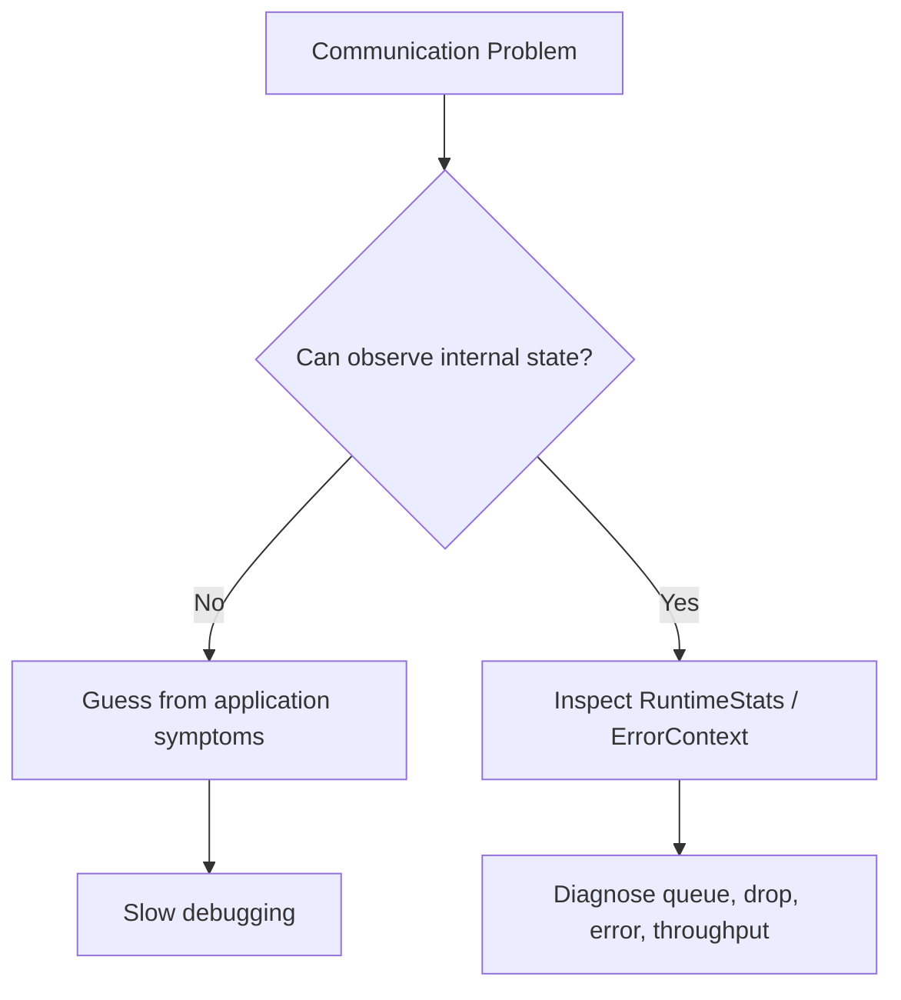

unilink에서 RuntimeStats와 Diagnostics는 이런 문제를 줄이기 위한 계층이다.
목표는 단순히 카운터를 제공하는 것이 아니라, 통신 객체가 런타임에 어떤 상태인지 사용자가 판단할 수 있는 최소한의 관측 지점을 제공하는 것이다.

## 관측성이 필요한 이유

통신 문제는 외부 증상만 보고 원인을 파악하기 어렵다.

예를 들어 `send()`가 실패했다고 하자.
원인은 여러 가지일 수 있다.

- 연결이 끊겼을 수 있다.
- queue가 가득 찼을 수 있다.
- backpressure가 활성화되었을 수 있다.
- buffer size 제한을 넘었을 수 있다.
- Transport 내부에서 I/O error가 발생했을 수 있다.

수신이 느려졌을 때도 마찬가지다.
네트워크가 느린 것인지, peer가 보내지 않는 것인지, Framer가 message boundary를 기다리는 것인지, application callback이 병목인지 구분하기 어렵다.

따라서 통신 라이브러리는 내부 상태를 어느 정도 외부에 드러내야 한다.

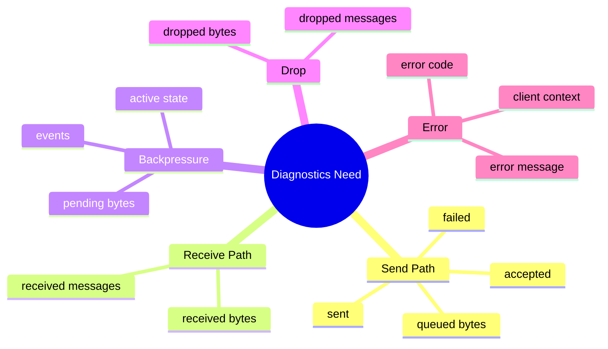

## RuntimeStats의 역할

`RuntimeStats`는 사용자-facing snapshot이다.

Transport 내부에서는 여러 atomic counter와 queue 상태가 계속 변하지만, 사용자는 특정 시점의 상태를 읽고 싶어 한다.
`RuntimeStats`는 이 값을 하나의 구조체로 모아 제공한다.

개념적으로 보면 다음과 같다.

```cpp
struct RuntimeStats {
    uint64_t bytes_accepted = 0;
    uint64_t messages_accepted = 0;

    uint64_t bytes_sent = 0;
    uint64_t messages_sent = 0;

    uint64_t bytes_received = 0;
    uint64_t messages_received = 0;

    uint64_t failed_sends = 0;

    uint64_t dropped_messages = 0;
    uint64_t dropped_bytes = 0;

    uint64_t backpressure_events = 0;

    size_t queued_bytes = 0;
    size_t pending_bytes = 0;
    size_t max_queued_bytes = 0;

    bool backpressure_active = false;
};
```

이 구조는 크게 다섯 영역으로 나눌 수 있다.

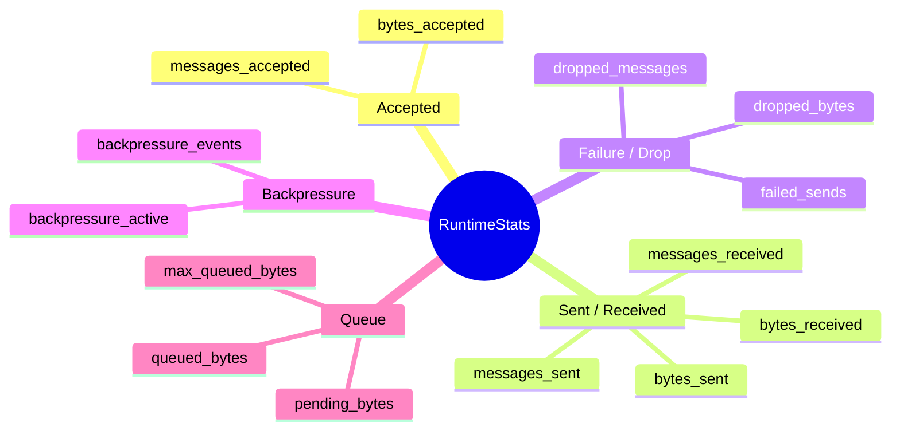

중요한 점은 RuntimeStats가 “정답”을 알려주는 도구가 아니라는 것이다.
대신 문제를 좁혀갈 수 있는 관측 지점을 제공한다.

예를 들어 `messages_accepted`는 증가하지만 `messages_sent`가 증가하지 않는다면 queue나 I/O write 경로를 의심할 수 있다.
`dropped_messages`가 증가한다면 BestEffort 정책이나 threshold 설정을 확인해야 한다.
`backpressure_active`가 자주 켜진다면 producer rate와 실제 전송 속도의 차이를 봐야 한다.

## Counters와 Snapshot 분리

내부 구현에서는 `RuntimeStatsCounters`가 atomic counter를 관리하고, 사용자가 조회할 때 snapshot으로 변환한다.

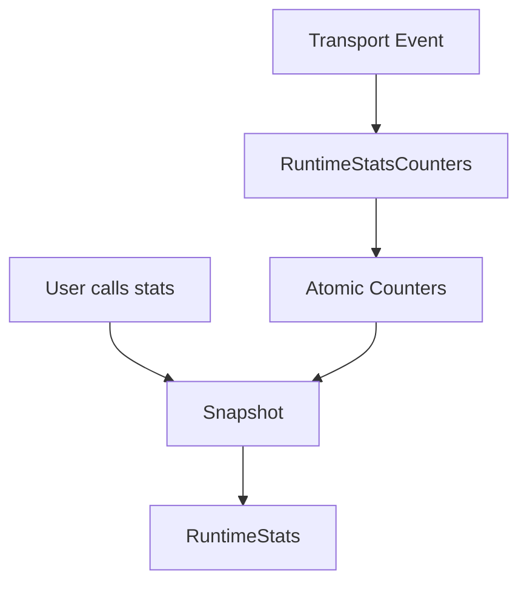

이 구조의 장점은 기록과 조회를 분리할 수 있다는 점이다.

Transport 내부에서는 send accepted, sent, received, dropped, failed send, backpressure event 같은 이벤트가 비동기적으로 발생한다.
이 값들은 여러 handler에서 갱신될 수 있으므로 atomic counter로 관리하는 편이 자연스럽다.

반면 사용자는 atomic counter 자체를 직접 다룰 필요가 없다.
사용자는 `stats()`를 호출해 특정 시점의 `RuntimeStats` snapshot을 받으면 된다.

```cpp
auto stats = client.stats();

if (stats.backpressure_active) {
    // queue pressure is currently active
}

if (stats.dropped_messages > 0) {
    // BestEffort drop or queue trimming may have occurred
}
```

이 방식은 내부 동시성 구현을 public API로 노출하지 않으면서도, 운영에 필요한 정보를 제공한다.

다만 atomic counter도 비용이 없는 것은 아니다.
초당 수십만 건 이상의 I/O 이벤트가 발생하는 환경에서는 atomic update 자체가 cache line contention이나 false sharing의 원인이 될 수 있다. 특히 여러 counter가 같은 cache line에 모여 있고, 서로 다른 thread에서 동시에 갱신된다면 계측 로직이 성능 병목이 될 가능성도 있다.

따라서 현재 구조는 단순성과 thread-safety를 우선한 설계로 볼 수 있다.
극단적인 high-throughput 환경에서는 Transport 내부에서 thread-local 또는 handler-local counter로 먼저 누적한 뒤, 일정 주기나 특정 조건에서 atomic counter에 반영하는 방식도 고려할 수 있다.

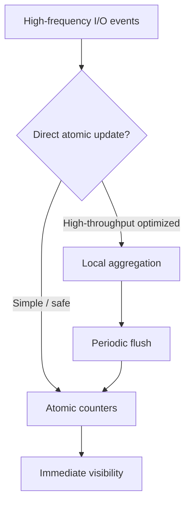

즉, RuntimeStats 설계는 관측성과 성능 사이의 균형이다.
기본 구조에서는 단순하고 안전한 atomic counter를 사용하고, 더 높은 처리량이 필요한 경우에는 계측 경로 자체도 최적화 대상이 될 수 있다.

## record와 observe의 차이

RuntimeStats에는 단순 누적 counter와 현재 상태에 가까운 값이 함께 존재한다.

예를 들어 `bytes_sent`, `messages_received`, `dropped_messages`는 누적 값이다.
반면 `queued_bytes`, `pending_bytes`, `backpressure_active`는 특정 시점의 상태다.

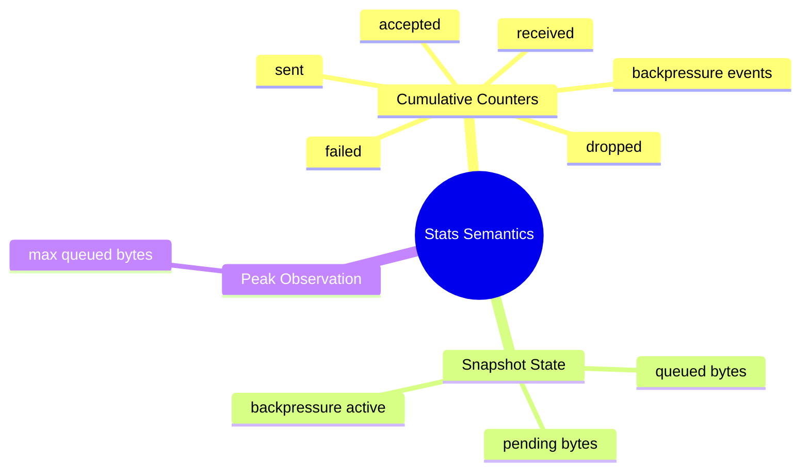

누적 counter는 시스템이 지금까지 어떤 일을 했는지 보여준다.
Snapshot state는 현재 어떤 상태인지 보여준다.
Peak observation은 운영 중 최대 부하가 어느 정도였는지 보여준다.

예를 들어 `queued_bytes`가 현재 0이어도 `max_queued_bytes`가 매우 컸다면, 과거에 queue pressure가 있었다는 의미가 된다.
반대로 `backpressure_active`가 false라도 `backpressure_events`가 증가했다면, backpressure가 발생했다가 해소된 이력이 있다는 의미다.

## Backpressure 관측

RuntimeStats는 Backpressure 설계와 밀접하게 연결된다.

Backpressure가 제대로 동작하는지 확인하려면 다음 정보를 볼 수 있어야 한다.

```mermaid
mindmap
  root((Backpressure Diagnostics))
    Current State
      backpressure_active
      queued_bytes
      pending_bytes
    History
      backpressure_events
      max_queued_bytes
    Loss
      dropped_messages
      dropped_bytes
    Failure
      failed_sends
```

예를 들어 BestEffort 전략을 사용하는데 `dropped_messages`가 계속 증가한다면, 이것이 의도된 최신성 유지인지, threshold가 너무 낮아서 과도하게 drop되는 것인지 판단해야 한다.

Reliable 전략에서 `pending_bytes`가 계속 증가한다면, producer가 너무 빠르거나 consumer가 너무 느릴 가능성이 있다.

이런 지표가 없으면 Backpressure는 내부 정책으로만 존재한다.
하지만 RuntimeStats와 함께 제공되면 Backpressure는 관측 가능한 runtime behavior가 된다.

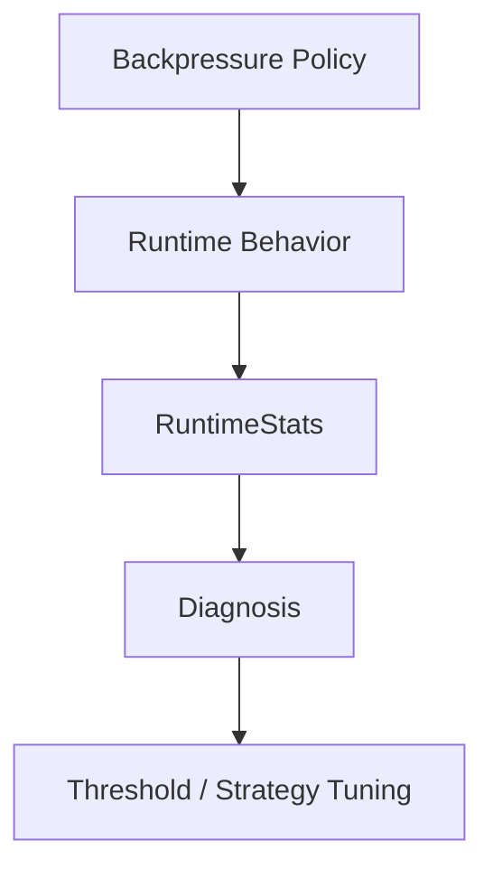

Backpressure는 정책이고, RuntimeStats는 그 정책이 실제로 어떻게 동작하는지 보는 창이다.

## ErrorContext: 사용자-facing 에러 전달

RuntimeStats가 수치 기반의 관측성이라면, `ErrorContext`는 이벤트 기반의 진단 정보다.

통신 중 에러가 발생하면 사용자는 최소한 다음을 알고 싶어 한다.

- 어떤 종류의 에러인지
- 어떤 메시지인지
- 특정 client와 관련된 에러인지

unilink의 error callback은 이런 정보를 context로 전달한다.

```cpp
class ErrorContext {
public:
    ErrorCode code() const;
    std::string_view message() const;
    std::optional<ClientId> client_id() const;
};
```

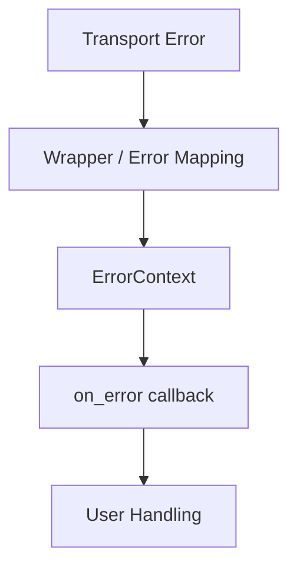

`ErrorContext`는 Transport 내부의 구체적인 error code를 그대로 노출하기 위한 구조가 아니다.
사용자 callback에서 판단할 수 있는 형태로 에러를 정리하는 역할에 가깝다.

예를 들어 TCP의 connect 실패, Serial port open 실패, write 실패는 내부 원인이 다르다.
하지만 public API에서는 이를 사용자-facing error context로 받아 처리할 수 있어야 한다.

## MessageContext와 ConnectionContext

Diagnostics는 error에만 해당하지 않는다.

수신 데이터와 연결 이벤트도 context를 통해 전달된다.

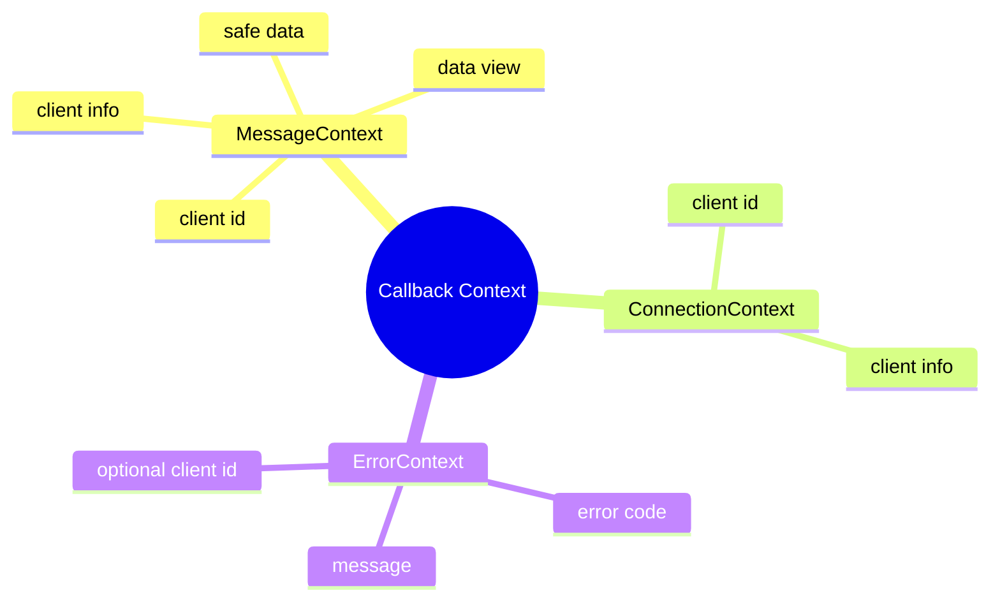

`MessageContext`는 수신 데이터와 client 정보를 함께 제공한다.
특히 `data()`는 view를 반환하고, 필요하면 `data_as_string()`이나 `data_as_vector()`로 소유권이 있는 복사본을 얻을 수 있다.

이 설계는 callback 사용성을 높이면서도 lifetime 문제를 명확히 한다.

```cpp
client.on_data([](const unilink::MessageContext& ctx) {
    auto view = ctx.data();             // callback scope view
    auto copy = ctx.data_as_vector();   // safe to store
});
```

`ConnectionContext`는 연결/해제 이벤트에서 client id와 endpoint 같은 정보를 전달하는 용도로 사용된다.

이런 context 객체들은 단순한 데이터 묶음이 아니다.
사용자 callback이 내부 구현 세부사항에 의존하지 않고도 필요한 정보를 얻도록 만드는 public diagnostics boundary다.

## Logging과 RuntimeStats의 차이

운영 진단에는 logging도 필요하다.
하지만 logging과 RuntimeStats는 역할이 다르다.

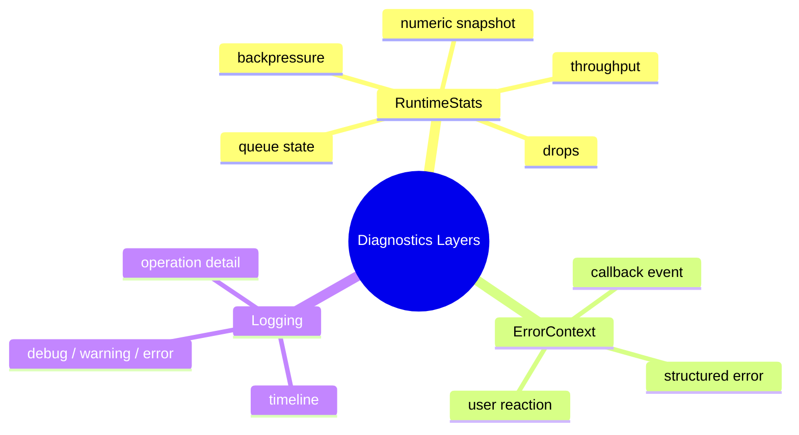

RuntimeStats는 현재 상태와 누적 지표를 보는 데 적합하다.
Logging은 시간 순서에 따른 사건을 추적하는 데 적합하다.
ErrorContext는 사용자 코드가 이벤트에 반응하는 데 적합하다.

예를 들어 queue pressure가 발생했다면 RuntimeStats에서는 `backpressure_events`와 `queued_bytes`를 볼 수 있다.
로그에서는 언제 어떤 transport에서 pressure가 발생했는지 확인할 수 있다.
Callback에서는 사용자가 즉시 대응 로직을 수행할 수 있다.

세 가지는 서로 대체 관계가 아니라 보완 관계다.

## reset_stats의 의미

RuntimeStats에는 reset 기능도 필요하다.

장시간 실행되는 프로세스에서는 누적 counter가 계속 증가한다.
테스트나 운영 중 특정 구간만 보고 싶을 때는 stats를 초기화할 수 있어야 한다.

```cpp
client.reset_stats();
auto stats = client.stats();
```

다만 reset은 모든 상태를 0으로 만드는 것만을 의미하지 않는다.
현재 queue 상태는 여전히 존재할 수 있다.

예를 들어 reset 시점에 queue가 이미 쌓여 있다면, `max_queued_bytes`를 현재 queue 기준으로 다시 시작하는 편이 더 자연스럽다.

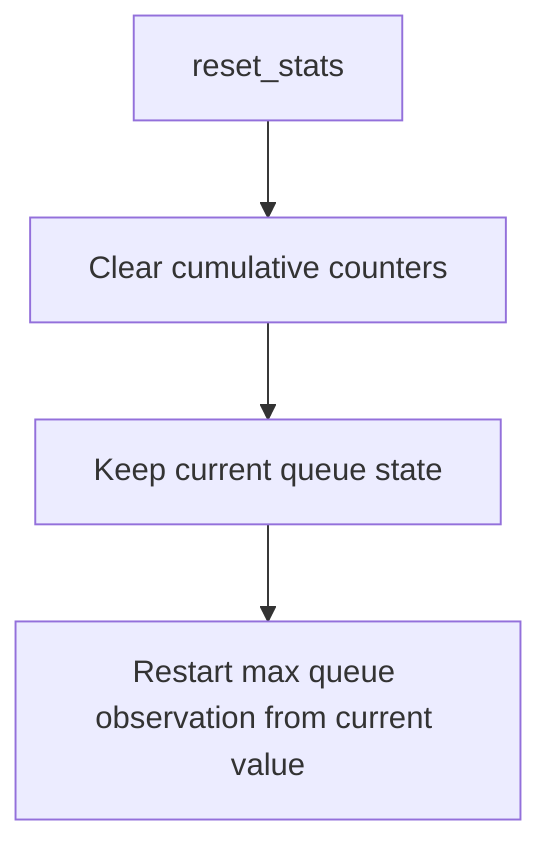

즉, `reset_stats()`는 transport 상태를 초기화하는 함수가 아니다.
통신 객체를 재시작하거나 queue를 비우는 것이 아니라, 관측 counter를 새 측정 구간으로 전환하는 기능이다.

## Diagnostics 설계의 Trade-off

Diagnostics 계층도 비용이 있다.

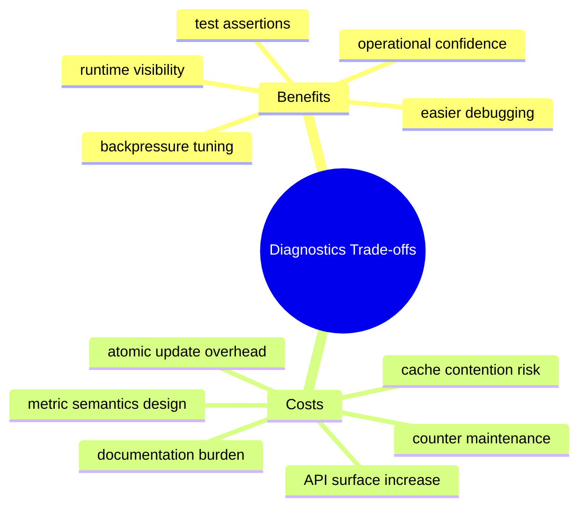

첫 번째 비용은 counter 유지 비용이다.
Transport의 여러 경로에서 accepted, sent, failed, dropped, received를 정확히 기록해야 한다.

두 번째 비용은 계측 자체의 성능 비용이다.
일반적인 사용에서는 atomic counter update가 큰 문제가 되지 않을 수 있지만, 매우 높은 빈도의 I/O 경로에서는 atomic 연산과 cache line contention이 무시하기 어려운 비용이 될 수 있다. 따라서 관측성을 추가할 때는 “무엇을 볼 것인가”뿐 아니라 “얼마나 자주 기록할 것인가”도 함께 고려해야 한다.

세 번째 비용은 metric semantics를 명확히 해야 한다는 점이다.
`accepted`와 `sent`의 차이, `queued_bytes`와 `pending_bytes`의 차이, `failed_sends`와 `dropped_messages`의 차이를 문서화하지 않으면 오히려 혼란이 생길 수 있다.

네 번째 비용은 public API surface가 늘어난다는 점이다.
한 번 공개한 stats 필드는 쉽게 바꾸기 어렵다.

그럼에도 Diagnostics는 필요하다.
통신 라이브러리는 외부 환경과 상호작용하기 때문에 문제가 발생했을 때 내부 상태를 보지 못하면 원인 분석이 매우 어렵다.

Diagnostics는 “문제가 없도록 만드는 기능”이 아니라, 문제가 생겼을 때 시스템이 무엇을 겪고 있는지 설명할 수 있게 만드는 기능이다.
성능 비용을 의식하면서도 필요한 수준의 계측을 제공하는 것이 운영 가능한 통신 라이브러리의 중요한 설계 기준이다.

## 정리

unilink에서 RuntimeStats와 Diagnostics는 통신 객체를 관측 가능한 runtime component로 만들기 위한 계층이다.

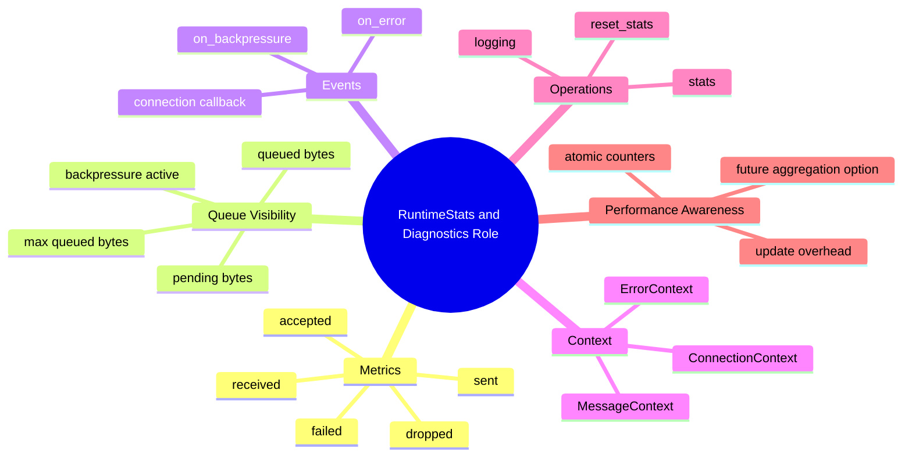

정리하면 다음과 같다.

- RuntimeStats는 통신 객체의 특정 시점 상태를 보여주는 snapshot이다.
- 내부 RuntimeStatsCounters는 atomic counter로 비동기 이벤트를 기록한다.
- accepted, sent, received, failed, dropped는 서로 다른 의미를 가진다.
- queued bytes, pending bytes, max queued bytes는 queue pressure를 분석하는 데 중요하다.
- ErrorContext는 사용자 callback에서 처리 가능한 에러 정보를 제공한다.
- MessageContext와 ConnectionContext는 수신 데이터와 연결 이벤트를 public API에 맞게 정리한다.
- Logging, RuntimeStats, callback context는 서로 보완적인 diagnostics 계층이다.
- reset_stats는 transport 상태를 초기화하는 것이 아니라 관측 구간을 새로 시작하는 기능이다.
- atomic counter 기반 계측은 단순하고 안전하지만, high-throughput 환경에서는 계측 비용도 최적화 대상이 될 수 있다.

통신 라이브러리는 정상 동작만 제공해서는 부족하다.
실제 시스템에서는 느려짐, 끊김, drop, queue pressure, callback 지연 같은 문제가 반복적으로 발생한다.

RuntimeStats와 Diagnostics는 이런 상황에서 라이브러리가 침묵하지 않도록 만드는 장치다.
즉, unilink의 Diagnostics 설계는 “문제를 없애는 것”이 아니라 “문제를 볼 수 있게 만드는 것”에 가깝다.
