## 도입: send가 항상 즉시 전송을 의미하지는 않는다

통신 라이브러리에서 `send()`라는 이름은 단순해 보인다.
사용자 입장에서는 데이터를 보내는 함수처럼 보이지만, 내부적으로는 훨씬 복잡한 문제가 숨어 있다.

애플리케이션이 데이터를 생성하는 속도가 실제 네트워크나 장치가 처리할 수 있는 속도보다 빠르면 송신 queue가 쌓인다. 이 상태가 오래 지속되면 메모리 사용량이 증가하고, 오래된 데이터가 뒤늦게 전송되면서 지연이 커진다.

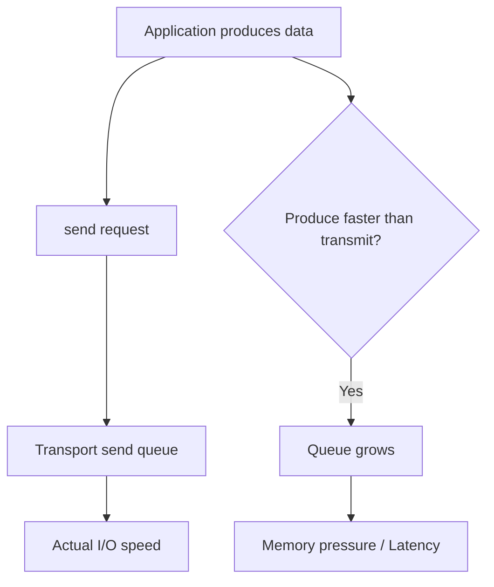
```mermaid
flowchart TD
    A[Application produces data] --> B[send request]
    B --> C[Transport send queue]
    C --> D[Actual I/O speed]

    A --> E{Produce faster than transmit?}
    E -- Yes --> F[Queue grows]
    F --> G[Memory pressure / Latency]
```

이 문제를 단순히 “queue를 크게 잡으면 된다”로 해결할 수는 없다.
어떤 데이터는 반드시 순서대로 전달되어야 하지만, 어떤 데이터는 오래된 값을 보내는 것보다 최신 값만 유지하는 것이 더 중요하다.

예를 들어 명령 메시지나 로그성 데이터는 누락 없이 보내는 것이 중요할 수 있다. 반면 센서 상태, 위치 추정, 주기적 heartbeat처럼 최신성이 중요한 데이터는 오래된 값이 뒤늦게 도착하는 것이 오히려 더 나쁜 결과를 만들 수 있다.

Backpressure 설계는 이 지점에서 필요하다.

> 송신 queue가 압박을 받을 때, 데이터를 보존할 것인가, 아니면 최신성을 위해 일부 데이터를 버릴 것인가?

wirestead는 이 선택을 `Reliable`과 `BestEffort`라는 두 가지 전략으로 나눈다.

## Backpressure가 필요한 이유

Backpressure는 생산자와 소비자의 속도 차이를 다루는 문제다.

통신 경로에서는 애플리케이션이 생산자이고, 실제 네트워크 socket이나 serial port가 소비자에 가깝다. 생산자가 더 빠르면 queue가 증가하고, 소비자가 더 빠르거나 비슷하면 queue는 안정적으로 유지된다.

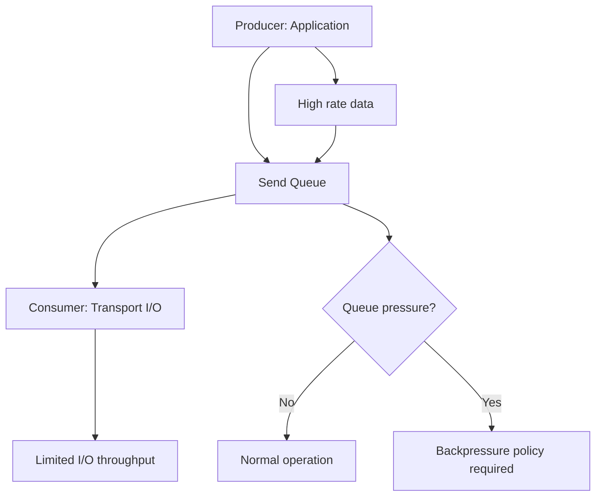
```mermaid
flowchart TD
    A[Producer: Application] --> B[Send Queue]
    B --> C[Consumer: Transport I/O]

    A --> D[High rate data]
    C --> E[Limited I/O throughput]

    D --> B
    B --> F{Queue pressure?}

    F -- No --> G[Normal operation]
    F -- Yes --> H[Backpressure policy required]
```

Backpressure가 없다면 일반적으로 두 가지 문제가 생긴다.

첫째, queue가 무한히 증가할 수 있다.
이 경우 메모리 사용량이 계속 증가하고, 최악의 경우 프로세스 안정성에 영향을 줄 수 있다.

둘째, queue가 오래된 데이터로 가득 찰 수 있다.
실시간성이나 최신성이 중요한 시스템에서는 오래된 데이터가 뒤늦게 전송되는 것이 실제로는 의미 없는 동작일 수 있다.

따라서 통신 라이브러리는 송신 queue가 커질 때 어떻게 행동할지 정책을 가져야 한다.

## 두 가지 전략: Reliable과 BestEffort

wirestead의 Backpressure 전략은 크게 두 가지다.

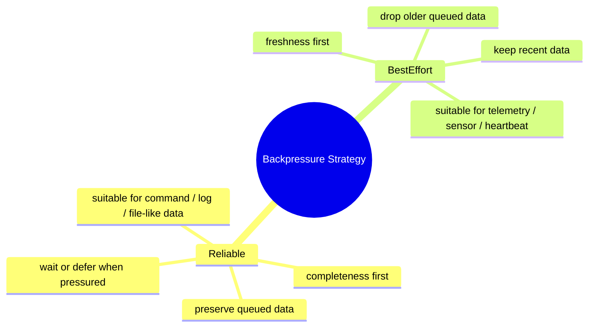
```mermaid
mindmap
  root((Backpressure Strategy))
    Reliable
      completeness first
      preserve queued data
      wait or defer when pressured
      suitable for command / log / file-like data
    BestEffort
      freshness first
      drop older queued data
      keep recent data
      suitable for telemetry / sensor / heartbeat
```

`Reliable`은 데이터를 가능한 보존하는 전략이다.
송신 queue가 압박을 받더라도 데이터를 쉽게 버리지 않는다. 대신 queue pressure가 해소될 때까지 기다리거나, pending queue에 보관하는 방식으로 completeness를 우선한다.

`BestEffort`는 최신성을 우선하는 전략이다.
queue가 threshold를 넘어서면 오래된 데이터를 제거하고 새 데이터를 받아들인다. 이 방식은 모든 데이터를 보장하지는 않지만, 실시간 시스템에서 오래된 데이터를 계속 전송하는 문제를 줄일 수 있다.

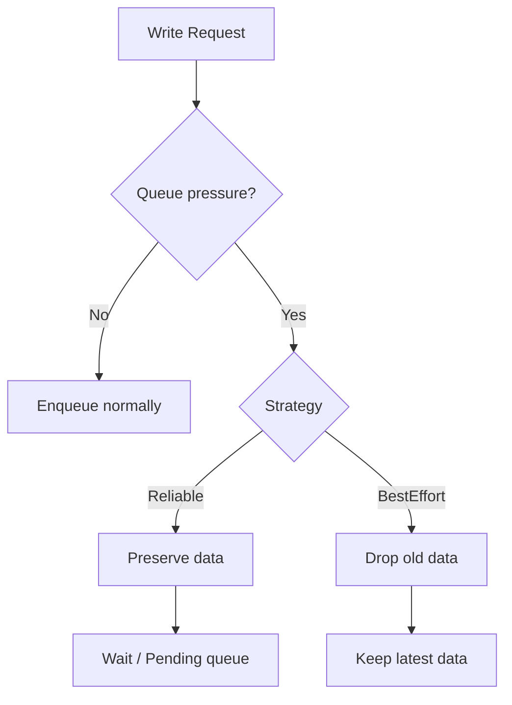
```mermaid
flowchart TD
    A[Write Request] --> B{Queue pressure?}

    B -- No --> C[Enqueue normally]

    B -- Yes --> D{Strategy}

    D -- Reliable --> E[Preserve data]
    E --> F[Wait / Pending queue]

    D -- BestEffort --> G[Drop old data]
    G --> H[Keep latest data]
```

핵심은 두 전략 중 하나가 항상 더 좋다는 것이 아니다.
데이터 성격에 따라 다른 선택이 필요하다는 점이다.

## Reliable: 완전성 우선

`Reliable` 전략은 completeness를 우선한다.

명령 메시지, 상태 전이 이벤트, 로그, 파일 조각처럼 누락되면 안 되는 데이터는 가능한 보존되어야 한다. 이런 경우 queue가 압박을 받는다고 해서 오래된 데이터를 버리면 시스템 의미가 깨질 수 있다.

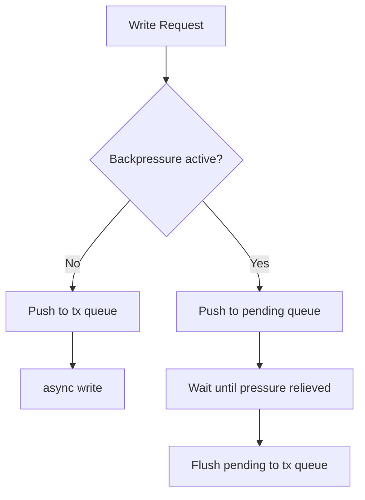
```mermaid
flowchart TD
    A[Write Request] --> B{Backpressure active?}

    B -- No --> C[Push to tx queue]
    C --> D[async write]

    B -- Yes --> E[Push to pending queue]
    E --> F[Wait until pressure relieved]
    F --> G[Flush pending to tx queue]
```

Reliable 전략에서 중요한 것은 “무조건 무한히 보관한다”가 아니다.
queue limit을 두고, 그 한계 안에서 가능한 보존하려고 한다.

완전성을 우선한다고 해서 메모리를 무제한으로 쓰면 안 된다. 따라서 Reliable 전략에서도 hard limit은 필요하다.

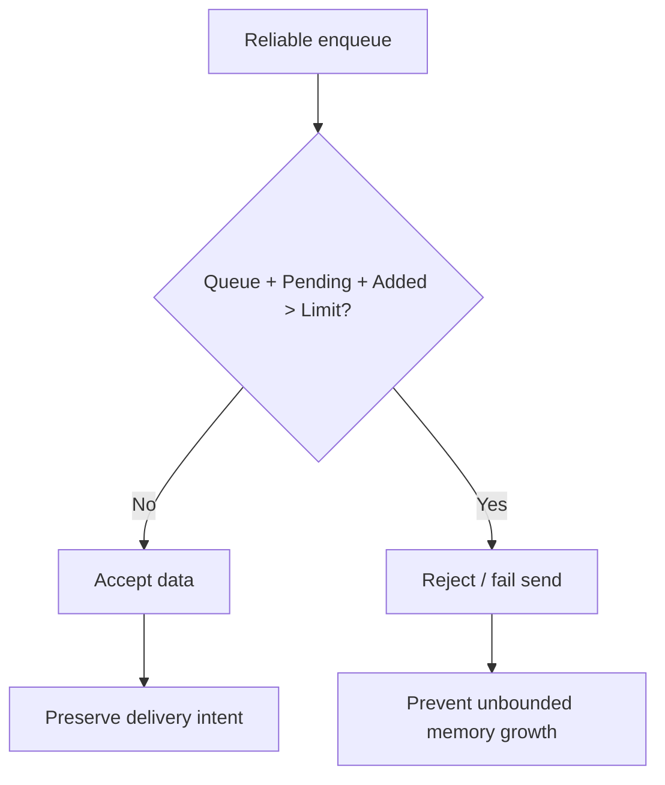
```mermaid
flowchart TD
    A[Reliable enqueue] --> B{Queue + Pending + Added > Limit?}

    B -- No --> C[Accept data]
    B -- Yes --> D[Reject / fail send]

    C --> E[Preserve delivery intent]
    D --> F[Prevent unbounded memory growth]
```

Reliable은 “절대 실패하지 않는다”가 아니라 “backpressure만으로 쉽게 drop하지 않는다”에 가깝다.
메모리와 queue limit은 여전히 안전장치로 남아 있어야 한다.

## BestEffort: 최신성 우선

`BestEffort` 전략은 freshness를 우선한다.

센서 데이터, 위치 추정값, 주기적 상태 보고, heartbeat처럼 최신 값이 중요한 데이터는 오래된 값을 모두 보내는 것보다 최신 값을 유지하는 편이 더 낫다.

예를 들어 AMR의 위치 상태를 50Hz로 보내고 있는데 네트워크가 잠시 느려졌다고 하자.
이때 2초 전 위치 데이터를 뒤늦게 모두 보내는 것은 큰 의미가 없을 수 있다. 오히려 오래된 데이터가 queue를 막고 최신 데이터 전달을 지연시킨다.

BestEffort 전략은 이런 상황에서 오래된 queue 항목을 제거한다.

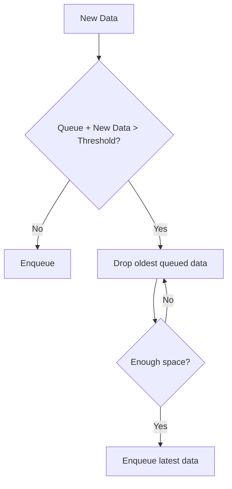
```mermaid
flowchart TD
    A[New Data] --> B{Queue + New Data > Threshold?}

    B -- No --> C[Enqueue]

    B -- Yes --> D[Drop oldest queued data]
    D --> E{Enough space?}
    E -- No --> D
    E -- Yes --> F[Enqueue latest data]
```

wirestead의 keep-latest 계열 동작은 새 데이터가 threshold보다 큰 경우 기존 queue를 비우는 방향으로 동작할 수 있다. 그렇지 않은 경우에는 새 데이터가 들어갈 수 있을 때까지 오래된 queue 항목을 제거한다.

이 전략은 모든 메시지를 보장하지 않는다.
대신 queue가 오래된 데이터로 가득 차는 것을 막고, 가능한 최신 상태를 유지한다.

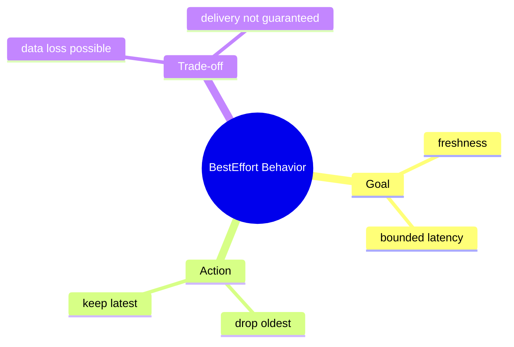
```mermaid
mindmap
  root((BestEffort Behavior))
    Goal
      freshness
      bounded latency
    Action
      drop oldest
      keep latest
    Trade-off
      data loss possible
      delivery not guaranteed
```

BestEffort는 “덜 중요한 데이터”를 위한 전략이 아니다.
실시간 시스템에서는 오히려 최신성이 가장 중요한 데이터에 필요한 전략이다.

## Threshold와 Watermark

Backpressure는 단순히 queue가 비어 있는지 아닌지를 보는 문제가 아니다.
어느 정도부터 압박 상태로 볼 것인지 기준이 필요하다.

wirestead는 threshold를 기준으로 backpressure 상태를 판단한다.

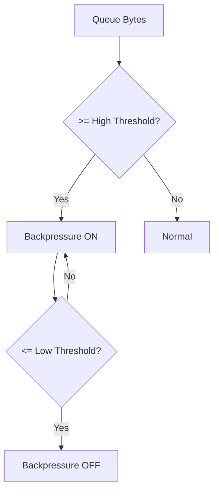
```mermaid
flowchart TD
    A[Queue Bytes] --> B{>= High Threshold?}

    B -- Yes --> C[Backpressure ON]
    B -- No --> D[Normal]

    C --> E{<= Low Threshold?}
    E -- Yes --> F[Backpressure OFF]
    E -- No --> C
```

High threshold는 backpressure를 켜는 기준이다.
Low threshold는 backpressure를 해제하는 기준이다.

이렇게 high/low 기준을 나누면 queue 크기가 threshold 근처에서 조금씩 오르내릴 때 backpressure 상태가 계속 켜졌다 꺼지는 문제를 줄일 수 있다.

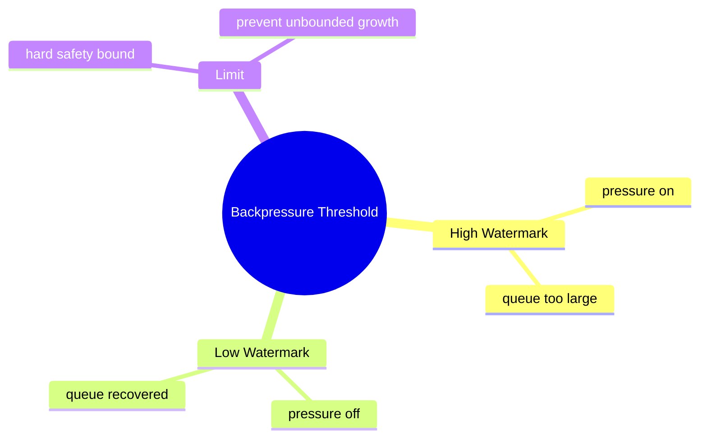
```mermaid
mindmap
  root((Backpressure Threshold))
    High Watermark
      pressure on
      queue too large
    Low Watermark
      pressure off
      queue recovered
    Limit
      hard safety bound
      prevent unbounded growth
```

Threshold는 단순한 숫자가 아니라 라이브러리의 runtime behavior를 결정하는 중요한 설정이다.
너무 작으면 자주 drop하거나 wait하게 되고, 너무 크면 latency와 memory pressure가 커질 수 있다.

## send, try_send, send_blocking의 의미

Backpressure 정책은 public send API와도 연결된다.

사용자 입장에서 중요한 것은 `send()`가 어떤 의미인지 명확히 아는 것이다.

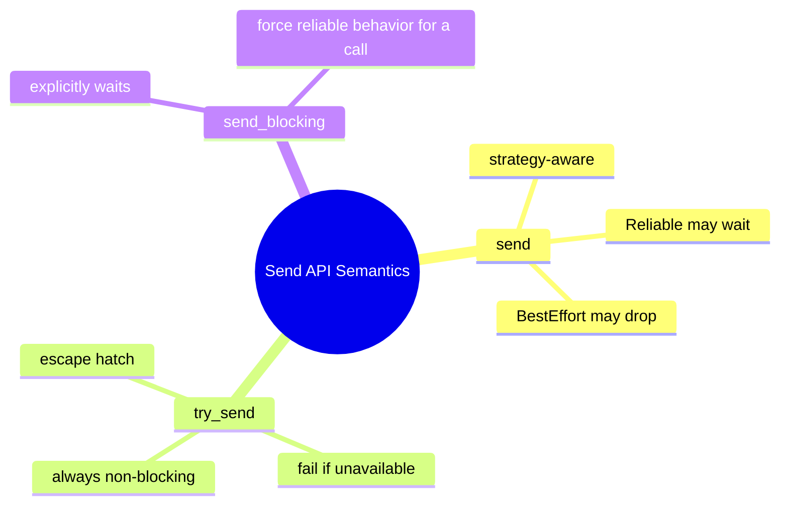
```mermaid
mindmap
  root((Send API Semantics))
    send
      strategy-aware
      Reliable may wait
      BestEffort may drop
    try_send
      always non-blocking
      fail if unavailable
      escape hatch
    send_blocking
      explicitly waits
      force reliable behavior for a call
```

`send()`는 설정된 backpressure strategy를 따른다.
Reliable이면 queue pressure가 해소될 때까지 기다리는 방향으로 동작할 수 있고, BestEffort이면 non-blocking 방식으로 동작하면서 queue 상황에 따라 drop될 수 있다.

`try_send()`는 명시적인 escape hatch다.
채널이 Reliable 전략으로 설정되어 있더라도, 특정 호출에서 “지금 안 되면 보내지 않아도 된다”는 의미를 표현할 수 있다.

`send_blocking()`은 반대 방향의 escape hatch다.
BestEffort 채널이라도 특정 데이터는 반드시 기다려서 보내고 싶을 수 있다.

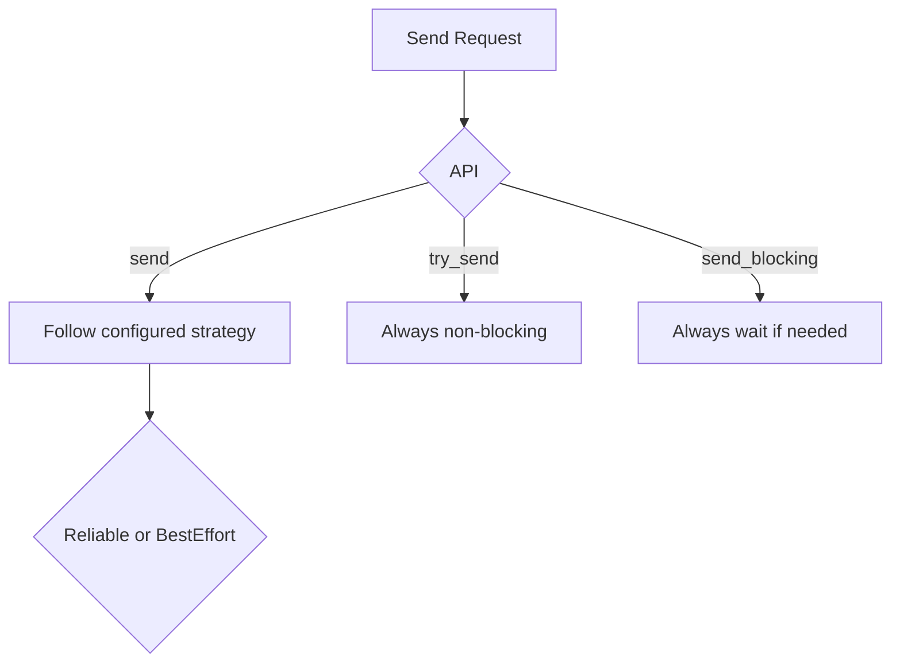
```mermaid
flowchart TD
    A[Send Request] --> B{API}

    B -- send --> C[Follow configured strategy]
    B -- try_send --> D[Always non-blocking]
    B -- send_blocking --> E[Always wait if needed]

    C --> F{Reliable or BestEffort}
```

이 구분은 API 이름에 정책 의도를 담기 위한 선택이다.
동일한 “보내기”라도 데이터의 중요도와 호출자의 의도에 따라 다른 의미를 가질 수 있기 때문이다.

다만 `send_blocking()`은 신중하게 사용해야 한다.
wirestead는 비동기 I/O 기반으로 동작하므로, `io_context`를 실행하는 스레드나 latency-sensitive한 callback 내부에서 blocking send를 남용하면 전체 통신 루프의 응답성이 떨어질 수 있다.

따라서 `send_blocking()`은 초기화 단계, 별도 worker thread, 또는 호출자가 blocking 비용을 명확히 감수할 수 있는 제한적인 상황에서 사용하는 것이 적절하다.
실시간성이 중요한 경로에서는 `send()`와 `try_send()`를 통해 configured strategy를 따르거나, 데이터 성격에 맞게 Reliable / BestEffort 전략을 분리하는 편이 더 안전하다.

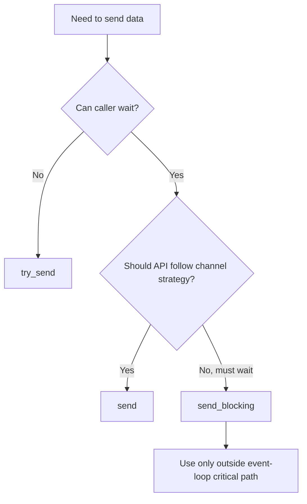
```mermaid
flowchart TD
    A[Need to send data] --> B{Can caller wait?}

    B -- No --> C[try_send]
    B -- Yes --> D{Should API follow channel strategy?}

    D -- Yes --> E[send]
    D -- No, must wait --> F[send_blocking]

    F --> G[Use only outside event-loop critical path]
```

즉, `send_blocking()`은 “더 안전한 send”가 아니라 “호출자가 blocking 비용을 명시적으로 선택하는 API”에 가깝다.

## Backpressure 이벤트와 관측성

Backpressure는 내부 queue 관리만의 문제가 아니다.
운영 중인 시스템에서는 queue pressure가 언제 발생했는지, 얼마나 자주 발생하는지, drop이 발생했는지 확인할 수 있어야 한다.

wirestead는 backpressure 상태를 callback과 runtime stats로 관측할 수 있게 한다.

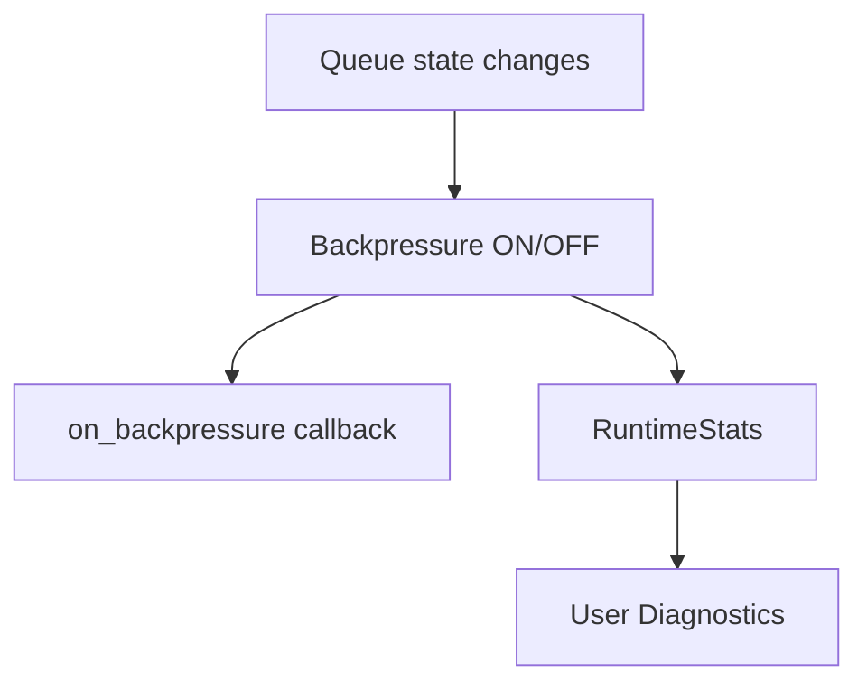
```mermaid
flowchart TD
    A[Queue state changes] --> B[Backpressure ON/OFF]
    B --> C[on_backpressure callback]
    B --> D[RuntimeStats]
    D --> E[User Diagnostics]
```

`on_backpressure` callback은 queue 압박 상태 변화를 외부로 알리는 신호다.
RuntimeStats는 accepted, failed, dropped, queue bytes, backpressure event 같은 정보를 제공할 수 있다.

이 관측성이 없으면 사용자는 단순히 “send가 실패했다” 정도만 알 수 있다.
하지만 backpressure 정보를 보면 데이터 생성 속도가 너무 빠른지, threshold가 너무 낮은지, 네트워크 처리량이 부족한지 추정할 수 있다.

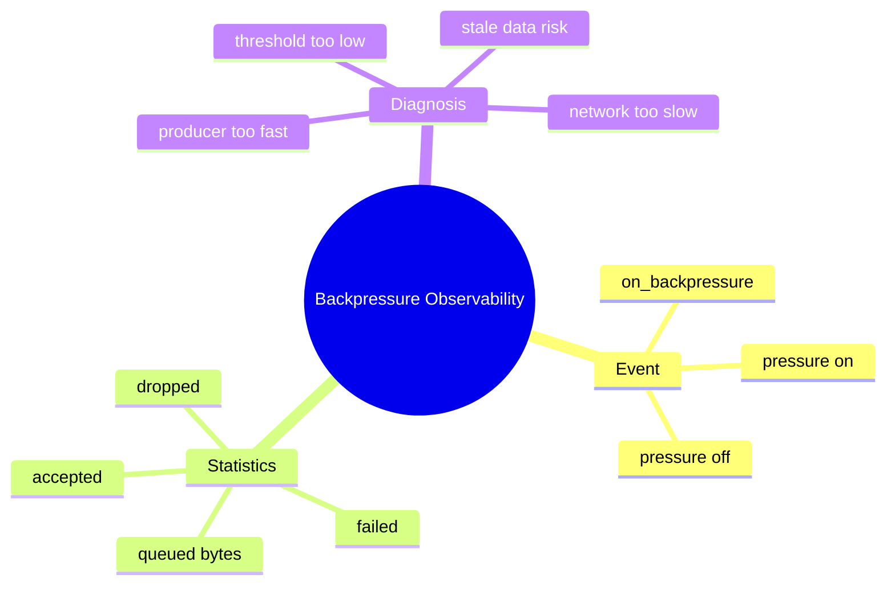
```mermaid
mindmap
  root((Backpressure Observability))
    Event
      on_backpressure
      pressure on
      pressure off
    Statistics
      accepted
      failed
      dropped
      queued bytes
    Diagnosis
      producer too fast
      network too slow
      threshold too low
      stale data risk
```

Backpressure 설계에서 관측성은 선택 기능이 아니다.
정책이 실제 운영에서 어떻게 동작하는지 확인하기 위한 필수 요소다.

## UDP에서의 Backpressure 의미

UDP는 연결형 프로토콜이 아니고, TCP처럼 receiver-side flow control을 제공하지 않는다.
따라서 UDP에서 Reliable 전략을 사용한다고 해서 네트워크 레벨의 전송 보장이 생기는 것은 아니다.

UDP에서 Reliable은 “수신자가 반드시 받는다”가 아니라, sender-side queue에서 backpressure 때문에 쉽게 drop하지 않는다는 의미에 가깝다.

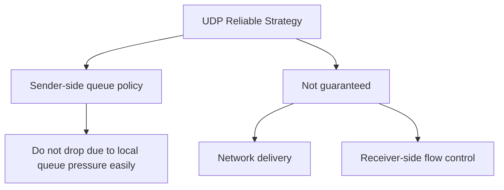
```mermaid
flowchart TD
    A[UDP Reliable Strategy] --> B[Sender-side queue policy]
    B --> C[Do not drop due to local queue pressure easily]

    A --> D[Not guaranteed]
    D --> E[Network delivery]
    D --> F[Receiver-side flow control]
```

즉, BackpressureStrategy는 transport 내부 queue 정책이지, 프로토콜의 전송 보장성을 바꾸는 기능은 아니다.

TCP의 Reliable 전략과 UDP의 Reliable 전략은 같은 API 이름을 사용하더라도, 네트워크 계층에서 보장하는 의미는 다르다. wirestead의 Backpressure는 transport가 가진 물리적 특성을 바꾸지 않고, sender-side queue policy를 통일된 방식으로 다룬다.

## 데이터 성격에 따른 전략 선택

Backpressure 전략은 데이터 성격에 따라 선택해야 한다.

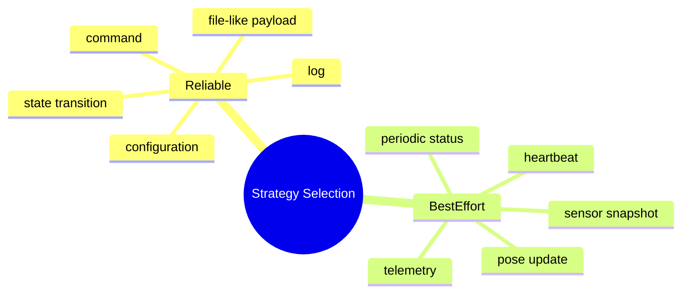
```mermaid
mindmap
  root((Strategy Selection))
    Reliable
      command
      configuration
      state transition
      log
      file-like payload
    BestEffort
      telemetry
      sensor snapshot
      pose update
      heartbeat
      periodic status
```

명령이나 설정 변경처럼 누락되면 안 되는 데이터는 Reliable이 적합하다.
반면 센서 snapshot이나 pose update처럼 최신성이 중요한 데이터는 BestEffort가 더 적합할 수 있다.

예를 들어 다음과 같은 기준으로 생각할 수 있다.

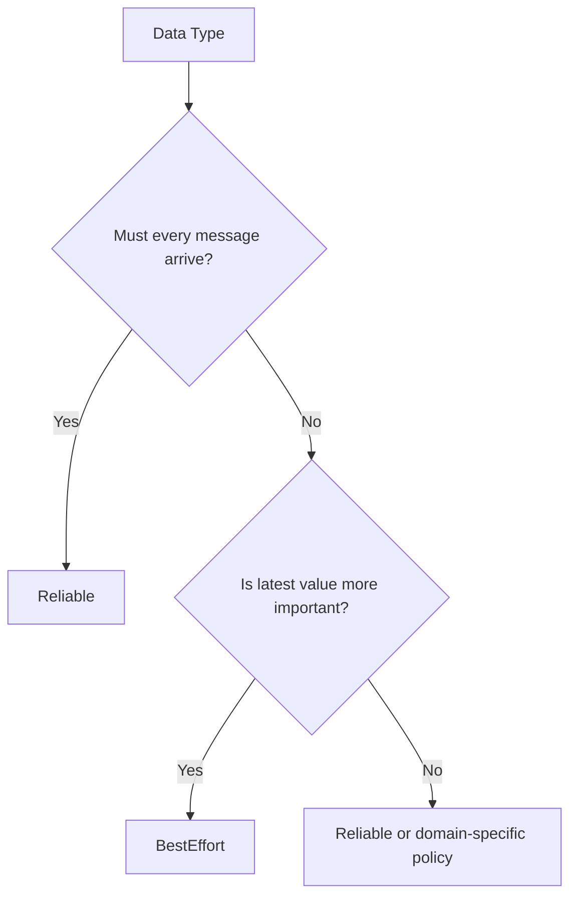
```mermaid
flowchart TD
    A[Data Type] --> B{Must every message arrive?}

    B -- Yes --> C[Reliable]
    B -- No --> D{Is latest value more important?}

    D -- Yes --> E[BestEffort]
    D -- No --> F[Reliable or domain-specific policy]
```

중요한 것은 전략을 “좋고 나쁨”으로 나누지 않는 것이다.
Reliable은 안정적인 데이터 보존을 위한 전략이고, BestEffort는 실시간성을 위한 전략이다.

둘은 서로 다른 문제를 해결한다.

## Backpressure 설계의 Trade-off

Backpressure 설계는 결국 trade-off다.

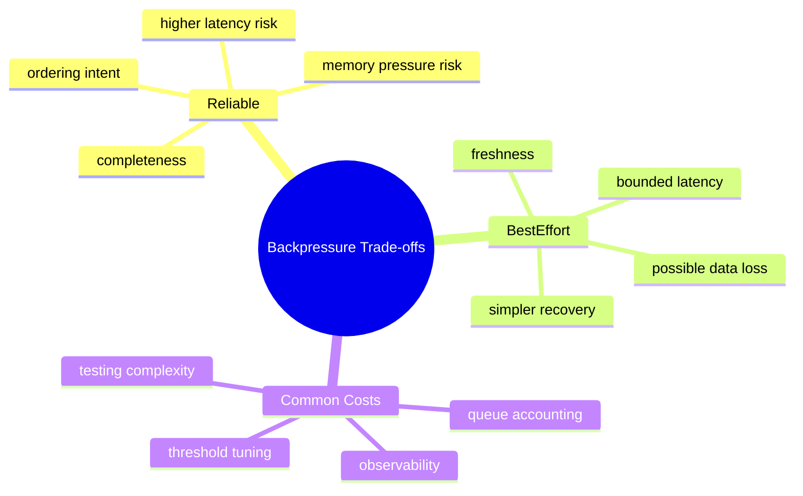
```mermaid
mindmap
  root((Backpressure Trade-offs))
    Reliable
      completeness
      ordering intent
      higher latency risk
      memory pressure risk
    BestEffort
      freshness
      bounded latency
      possible data loss
      simpler recovery
    Common Costs
      queue accounting
      threshold tuning
      observability
      testing complexity
```

Reliable은 누락을 줄이지만 latency가 커질 수 있다.
BestEffort는 latency와 최신성을 관리하기 좋지만 data loss를 허용한다.

또한 두 전략 모두 queue accounting, threshold tuning, drop accounting, stats, callback 같은 구현 비용을 요구한다.

그럼에도 Backpressure 계층은 필요하다.
송신 queue가 커지는 문제를 명시적으로 다루지 않으면, 통신 라이브러리는 부하가 걸리는 순간부터 예측하기 어려운 동작을 하게 된다.

Backpressure는 장애를 완전히 없애는 기능이 아니다.
부하 상황에서 어떤 실패 방식을 선택할지 명시하는 설계다.

## 정리

wirestead에서 Backpressure는 송신 queue가 압박을 받을 때 어떤 정책으로 대응할지 정하는 계층이다.

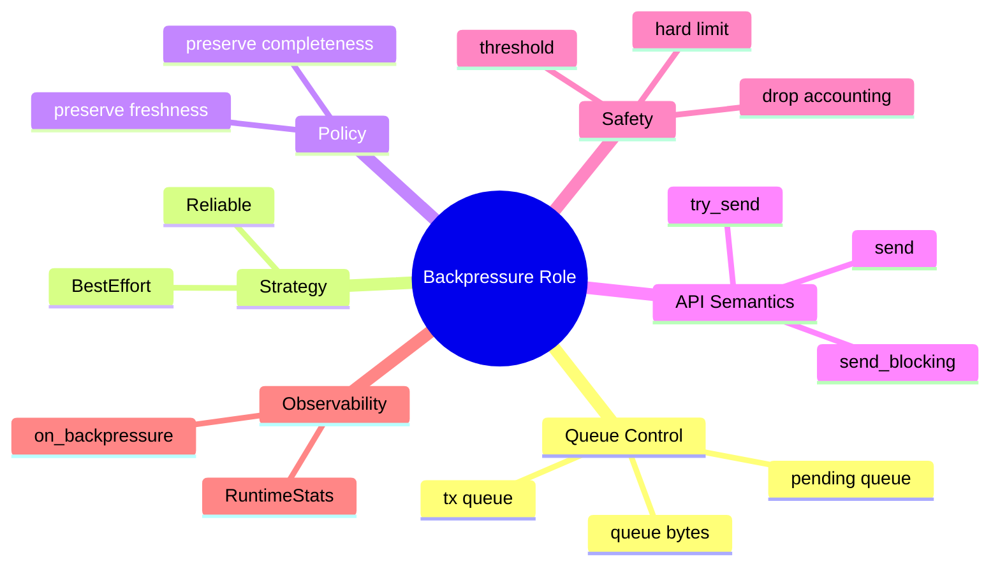
```mermaid
mindmap
  root((Backpressure Role))
    Queue Control
      tx queue
      pending queue
      queue bytes
    Strategy
      Reliable
      BestEffort
    Policy
      preserve completeness
      preserve freshness
    API Semantics
      send
      try_send
      send_blocking
    Safety
      threshold
      hard limit
      drop accounting
    Observability
      on_backpressure
      RuntimeStats
```

정리하면 다음과 같다.

- Backpressure는 생산 속도와 전송 속도 차이를 다룬다.
- Reliable은 completeness를 우선하고, BestEffort는 freshness를 우선한다.
- Reliable도 무한 queue를 의미하지 않으며 hard limit이 필요하다.
- BestEffort는 오래된 데이터를 버려 최신성을 유지한다.
- `send`, `try_send`, `send_blocking`은 호출자가 원하는 전송 의미를 구분한다.
- `send_blocking`은 event-loop critical path에서 남용하면 응답성을 떨어뜨릴 수 있다.
- UDP에서 Reliable은 network delivery 보장이 아니라 sender-side queue 정책이다.
- Backpressure event와 RuntimeStats는 운영 중 queue pressure를 진단하기 위한 관측성이다.

Backpressure 설계의 핵심은 단순히 queue overflow를 막는 것이 아니다.
부하 상황에서 라이브러리가 어떤 방식으로 실패하거나 버틸지를 명확히 정의하는 것이다.

통신 라이브러리에서 좋은 API는 정상 상황만 잘 처리하는 API가 아니다.
속도 차이, 네트워크 지연, 장치 응답 지연처럼 실제 시스템에서 반복되는 압박 상황에서도 예측 가능한 선택지를 제공해야 한다.

Backpressure는 이 관점에서 graceful degradation을 위한 설계 장치다.
데이터를 모두 보존할지, 오래된 데이터를 버리고 최신성을 유지할지, 호출자가 직접 blocking을 감수할지에 대한 선택지를 API와 정책으로 분리함으로써, 부하 상황에서도 시스템이 의도된 방식으로 동작하도록 만든다.
