## 도입: 구현만으로는 라이브러리가 되지 않는다

wirestead를 설계하면서 가장 크게 느낀 점은, 라이브러리는 기능 구현만으로 완성되지 않는다는 것이다.

TCP client가 동작하고, Serial 통신이 되고, UDP packet을 주고받을 수 있다고 해서 바로 사용할 수 있는 라이브러리가 되는 것은 아니다.
다른 개발자가 자신의 프로젝트에 포함할 수 있어야 하고, 여러 플랫폼에서 빌드되어야 하며, 테스트로 기본 동작을 확인할 수 있어야 한다. 또한 설치, 패키징, 문서화, 릴리즈 절차까지 어느 정도 정리되어 있어야 한다.

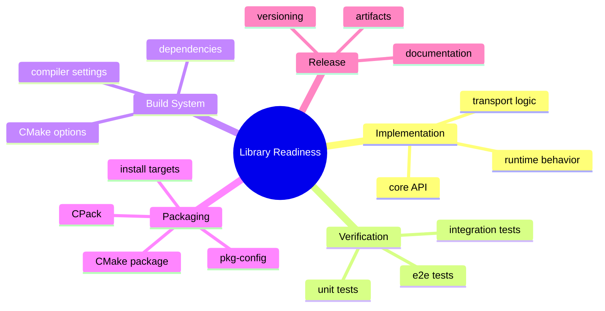

이 글은 wirestead의 내부 구조 자체보다, 그 구조를 실제로 사용할 수 있는 라이브러리로 만들기 위해 어떤 운영 기반을 갖췄는지 정리하는 회고에 가깝다.

## 빌드 구조: 기능보다 먼저 안정적인 진입점 만들기

C++ 라이브러리에서 빌드 구조는 public API만큼 중요하다.
사용자가 라이브러리를 사용하기 위해 가장 먼저 만나는 것은 코드가 아니라 `CMakeLists.txt`, build option, dependency 설정이다.

wirestead의 최상위 CMake 구조는 여러 관심사를 별도 파일로 나눈다.

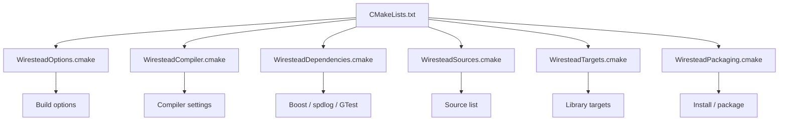

빌드 옵션, 컴파일러 설정, 의존성, target 구성, 패키징은 서로 다른 변경 이유를 가진다.
이들을 하나의 `CMakeLists.txt`에 모두 넣으면 작은 수정도 전체 구조를 읽어야 한다. 반대로 역할별로 분리하면 빌드 시스템 자체도 유지보수 가능한 구조가 된다.

wirestead의 빌드 구조에서 중요한 기준은 다음이었다.

- 사용자가 켜고 끌 수 있는 옵션을 명확히 둔다.
- shared / static library를 모두 고려한다.
- 테스트와 설치를 옵션으로 분리한다.
- compiler warning, sanitizer, coverage 같은 개발 옵션을 분리한다.
- 패키징 설정을 별도 계층으로 둔다.

즉, 빌드 시스템도 라이브러리의 일부로 보고 설계해야 한다.

## CMake 옵션: 사용 환경을 가정하지 않기

라이브러리는 다양한 환경에서 사용된다.

어떤 사용자는 static library를 원하고, 어떤 사용자는 shared library를 원한다.
테스트를 함께 빌드하고 싶은 경우도 있고, 패키지 소비자 입장에서는 테스트를 끄고 라이브러리만 빌드하고 싶을 수도 있다.

따라서 wirestead는 주요 build option을 명시적으로 제공한다.

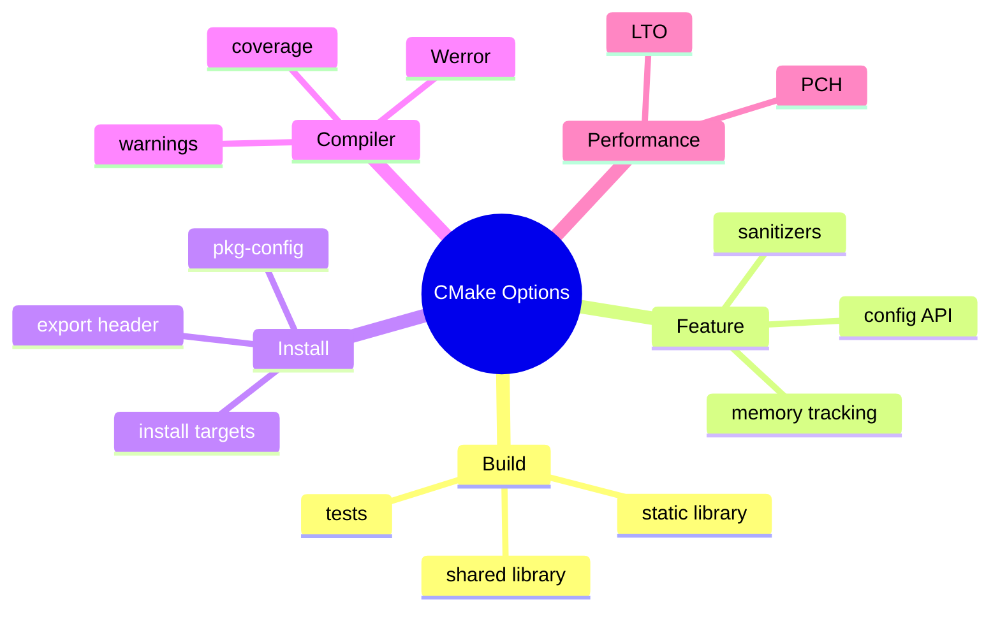

이런 옵션은 사용자의 빌드 환경과 목적이 다를 수 있음을 인정하는 장치다.

예를 들어 CI에서는 테스트와 warning을 강하게 켜고, 패키징 빌드에서는 install/export target을 확인할 수 있다.
반대로 소비자 프로젝트에서는 테스트를 끄고 최소한의 library target만 사용할 수 있다.

좋은 라이브러리의 빌드 옵션은 개발자의 편의만이 아니라 사용자의 통합 비용을 줄이기 위해 존재한다.

## 테스트 구조: Unit, Integration, E2E 분리

통신 라이브러리의 테스트는 단순하지 않다.

순수 함수나 단일 클래스처럼 빠르게 확인할 수 있는 코드도 있지만, 실제 socket이나 serial port, event loop, thread, timeout이 얽히는 테스트도 있다. 이들을 모두 같은 테스트 계층에 두면 테스트 실행 시간이 길어지고, 실패 원인도 모호해진다.

wirestead는 테스트를 크게 세 단계로 나눈다.

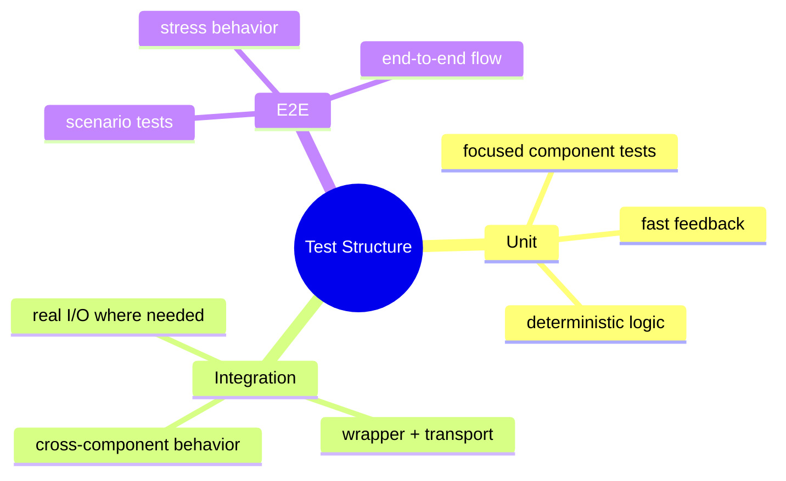

Unit test는 빠르고 좁게 검증한다.
예를 들어 builder, framer, buffer, stats counter처럼 독립적으로 확인 가능한 요소는 unit test가 적합하다.

Integration test는 여러 계층이 함께 동작하는지 확인한다.
Wrapper와 Transport, Framer와 callback, 실제 I/O 흐름이 맞물리는 경우가 여기에 해당한다.

E2E test는 사용자가 실제로 기대하는 시나리오를 확인한다.
여러 설정이 조합된 상태에서 start, send, receive, stop이 정상적으로 이어지는지를 확인하는 쪽에 가깝다.

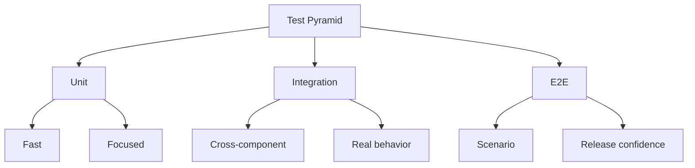

테스트를 분리하면 실패를 해석하기 쉬워진다.

Unit test가 깨지면 특정 컴포넌트의 logic 문제일 가능성이 높다.
Integration test가 깨지면 계층 간 연결 문제를 의심할 수 있다.
E2E test가 깨지면 실제 사용 시나리오의 안정성을 봐야 한다.

## CTest와 label 기반 실행

테스트는 작성하는 것만큼 실행하기 쉬워야 한다.

wirestead는 CTest와 GoogleTest discovery를 기반으로 test를 등록하고, unit / integration / e2e label을 기준으로 실행할 수 있게 구성한다.

```text
ctest -L unit
ctest -L integration
ctest -L e2e
ctest
```

이 구조는 개발 중 feedback loop를 줄이는 데 중요하다.

전체 테스트를 매번 돌리는 것은 시간이 오래 걸릴 수 있다.
작은 수정 중에는 unit test만 빠르게 돌리고, PR이나 release 전에는 integration / e2e까지 확인하는 방식이 더 현실적이다.

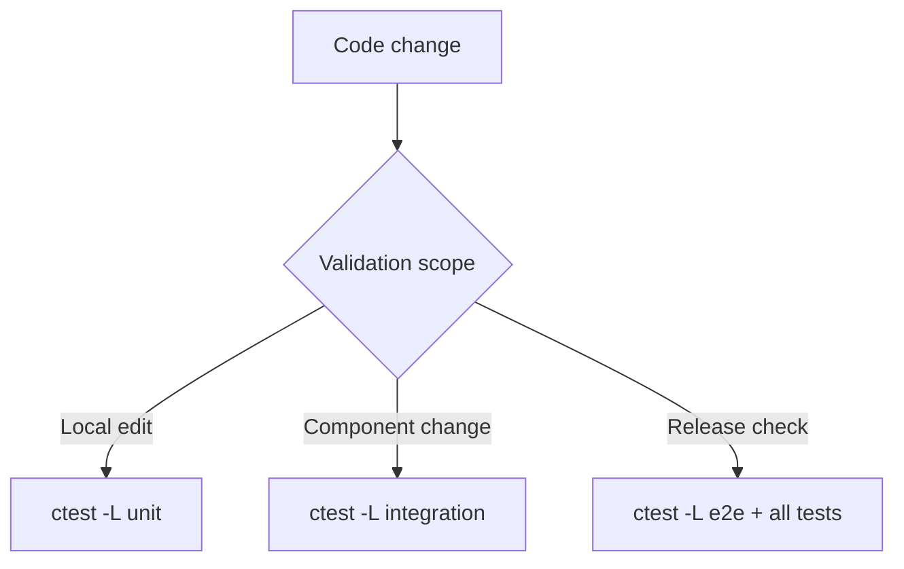

이러한 테스트 label 구조는 CI 환경에서도 유용하다.
예를 들어 GitHub Actions 같은 자동화 환경에서는 빠른 피드백이 필요한 job에서는 unit test만 먼저 실행하고, main branch나 release candidate에서는 integration / e2e / packaging job을 함께 실행하는 식으로 검증 단계를 나눌 수 있다.

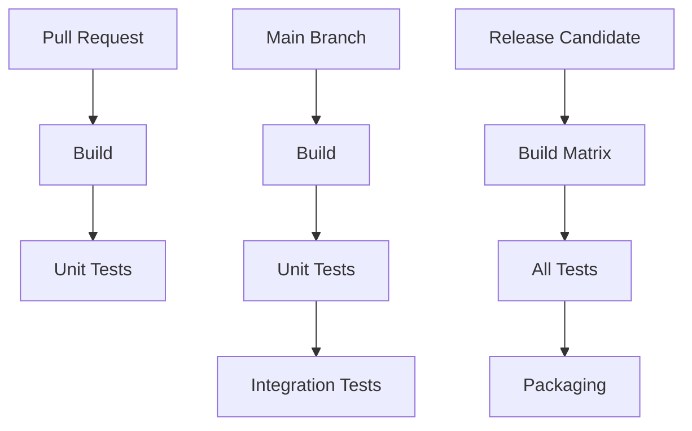

테스트 구조는 코드 품질을 위한 장치이기도 하지만, 개발 속도를 유지하기 위한 장치이기도 하다.
테스트를 unit / integration / e2e로 나누면 로컬 개발, PR 검증, 릴리즈 검증의 무게를 다르게 가져갈 수 있다.

## 플랫폼 차이와 빌드 안정성

cross-platform C++ 라이브러리에서는 플랫폼 차이가 생각보다 자주 문제를 만든다.

Linux에서 잘 빌드되는 코드가 Windows에서 깨질 수 있고, MSVC에서 warning이나 link option 문제가 발생할 수 있다.
반대로 Windows를 기준으로 작성한 설치 경로나 DLL 배치 방식이 Linux 패키징에는 맞지 않을 수 있다.

wirestead는 Linux / Windows를 모두 고려해 target, output directory, runtime dependency, MSVC workaround 등을 빌드 시스템에 반영한다.

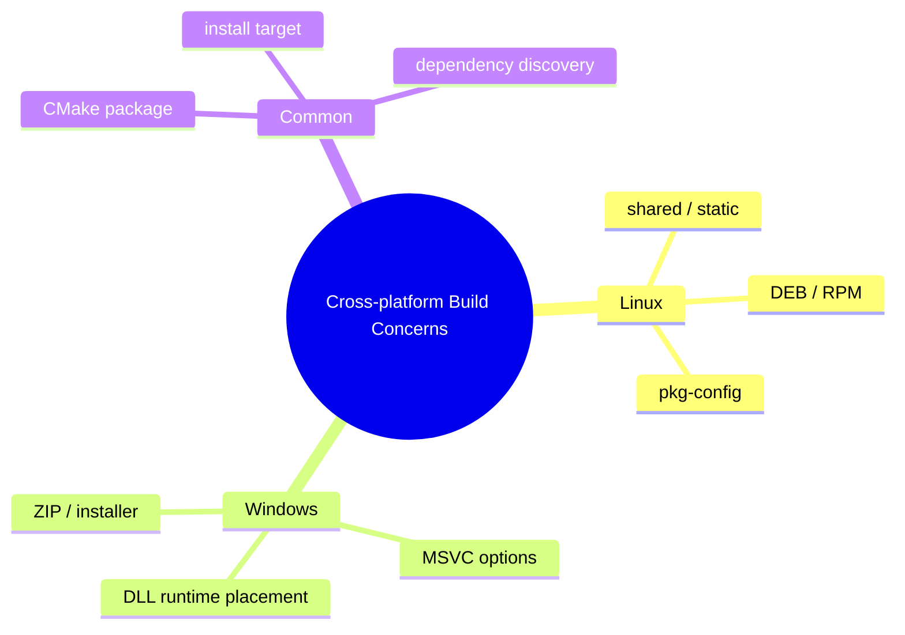

특히 C++ 라이브러리는 “내 컴퓨터에서 빌드됨”만으로는 부족하다.
다른 OS, 다른 compiler, 다른 package manager에서도 반복 가능하게 빌드되어야 한다.

이 과정에서 빌드 시스템은 단순 보조 도구가 아니라, 라이브러리 품질을 결정하는 중요한 구성요소가 된다.

## 패키징: install 가능한 라이브러리 만들기

라이브러리를 다른 프로젝트에서 쓰려면 install/export 구조가 필요하다.

단순히 `add_library`로 target을 만드는 것과, 외부 프로젝트에서 `find_package(wirestead)`로 가져올 수 있게 만드는 것은 다르다.

wirestead는 install target, CMake package config, pkg-config, CPack 설정을 둔다.

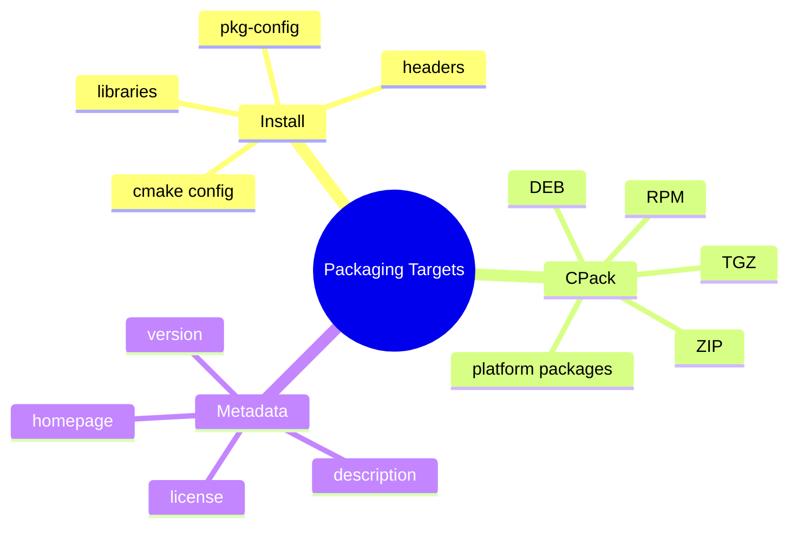

패키징에서 중요한 것은 파일을 압축하는 것이 아니다.
사용자가 설치 후 어떻게 찾고, 어떻게 링크하고, 어떤 dependency를 함께 가져가야 하는지를 정의하는 것이다.

예를 들어 CMake package config는 CMake 기반 프로젝트에서 사용하기 좋고, pkg-config는 Unix 계열 build system과 잘 맞는다.
CPack은 release artifact를 만들기 위한 기반이 된다.

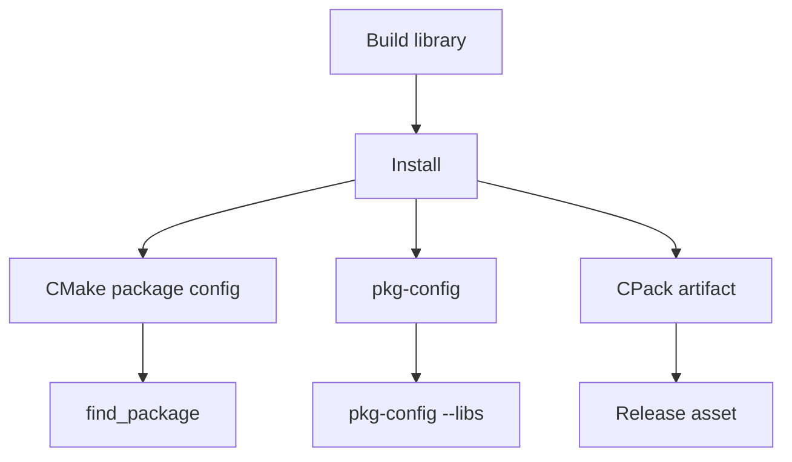

이 구조가 있어야 라이브러리가 “소스 코드를 받아 직접 빌드하는 프로젝트”를 넘어, 실제로 배포 가능한 형태에 가까워진다.

더 나아가 잘 정리된 CMake install/export 구조는 `vcpkg`나 `Conan` 같은 모던 C++ 패키지 매니저 생태계와 연동하기 위한 기반이 된다.
패키지 매니저에 등록하려면 단순히 소스 코드만 준비되어 있으면 부족하다. 버전, dependency, install layout, exported target, license, build option이 일관되게 정리되어 있어야 한다.

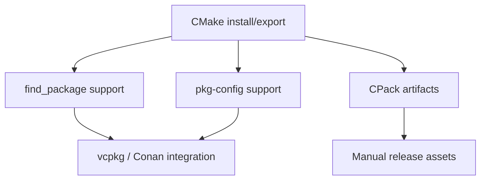

즉, 패키징 구조는 단기적으로는 install 가능한 라이브러리를 만들기 위한 장치이고, 장기적으로는 패키지 매니저와 배포 생태계에 올라가기 위한 준비 작업이다.

## 문서화 전략: 핵심 문서와 상세 문서 분리

wirestead는 문서를 모두 한 repository에 넣는 방식 대신, 기본 문서는 core repository에 남기고 상세 문서는 별도 문서 repository로 분리하는 방향을 선택했다.

이 선택은 문서가 많아질수록 중요해진다.

Core repository에는 사용자가 처음 봐야 하는 정보가 있어야 한다.

- 프로젝트가 무엇인지
- 어떻게 설치하는지
- 가장 간단한 예제는 무엇인지
- 어떤 transport를 지원하는지
- 어디에서 상세 문서를 볼 수 있는지

반면 상세 설계 문서, 튜토리얼, architecture guide, API guide는 별도 문서 사이트에서 관리하는 편이 더 적합하다.

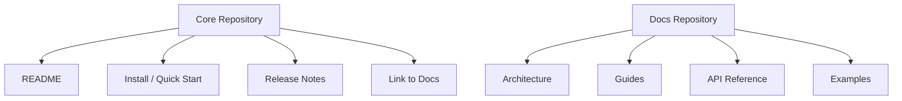

이 구조는 repository의 역할을 명확히 한다.

Core repository는 코드와 최소 문서 중심으로 유지한다.
Docs repository는 사용 설명과 설계 설명을 확장하는 공간으로 둔다.

문서도 코드처럼 관심사 분리가 필요하다.

## 릴리즈 준비: 기능 완료와 배포 가능성은 다르다

릴리즈 준비에서 중요한 기준은 “기능이 다 됐는가”만이 아니다.

다음 질문에 답할 수 있어야 한다.

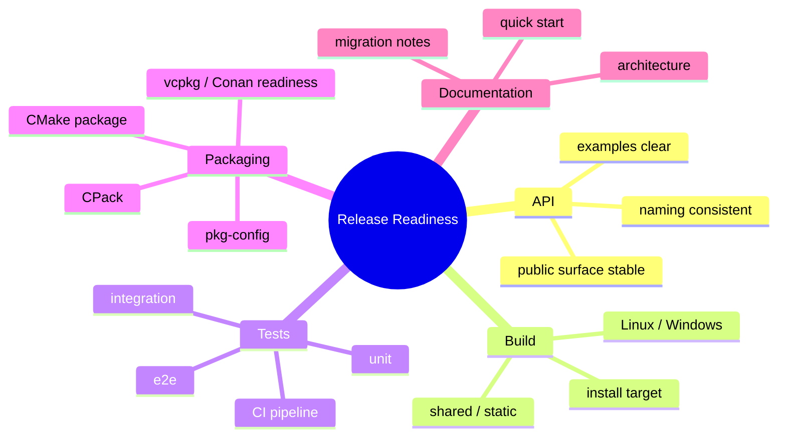

기능이 동작하더라도 public API가 자주 바뀌면 사용자는 도입하기 어렵다.
테스트가 부족하면 내부 변경을 안전하게 이어가기 어렵다.
패키징이 없으면 사용자가 매번 소스 구조를 직접 이해해야 한다.
문서가 부족하면 라이브러리의 의도와 사용 흐름이 전달되지 않는다.

따라서 릴리즈 준비는 구현 완료가 아니라 사용 가능성의 점검에 가깝다.

특히 C++ 라이브러리는 릴리즈 전에 다음 요소를 함께 확인해야 한다.

- source build가 가능한가
- install target이 정상 동작하는가
- `find_package`로 소비 가능한가
- shared / static library가 모두 빌드되는가
- Windows / Linux에서 빌드 결과가 일관적인가
- unit / integration / e2e test가 자동화되어 있는가
- 패키지 매니저 등록을 위한 metadata가 준비되어 있는가

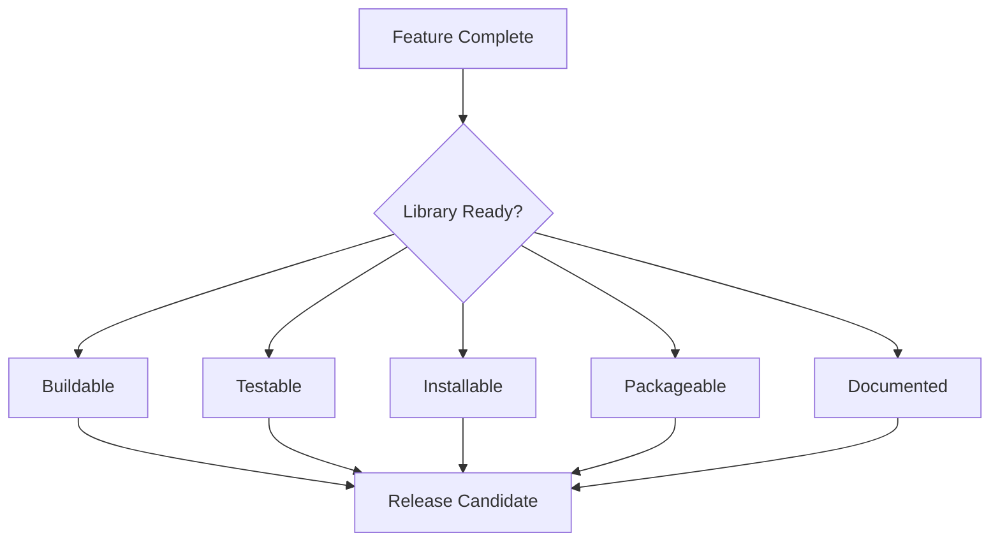

이 관점에서 보면 릴리즈는 단순히 tag를 찍는 행위가 아니다.
사용자가 라이브러리를 가져와서 빌드하고, 링크하고, 테스트하고, 문제를 추적할 수 있는 상태를 만드는 과정이다.

## 오픈소스 라이브러리로서의 기준

오픈소스 라이브러리는 개인 프로젝트와 다르다.

개인 프로젝트에서는 내가 구조를 알고 있으면 된다.
하지만 오픈소스 라이브러리는 다른 사람이 읽고, 빌드하고, 테스트하고, 문제를 보고하고, 기여할 수 있어야 한다.

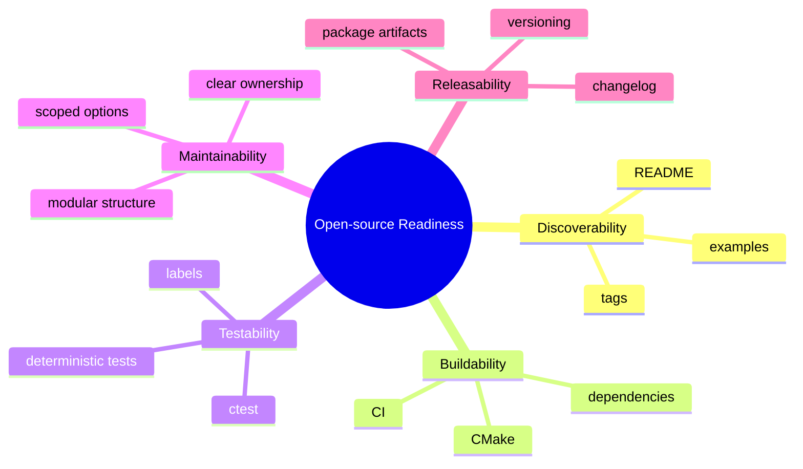

이 관점에서 보면 wirestead의 구조화 작업은 단순한 정리가 아니었다.

Builder, Wrapper, Channel, Transport 같은 코드 아키텍처뿐 아니라, CMake, 테스트 구조, 패키징, 문서 분리까지 함께 정리해야 “다른 사람이 사용할 수 있는 라이브러리”에 가까워진다.

## 설계하면서 배운 점

wirestead를 설계하면서 가장 크게 느낀 점은, 좋은 라이브러리는 내부 구현이 잘 되어 있는 것만으로 충분하지 않다는 것이다.

내부 구현은 복잡할 수 있다.
비동기 I/O, buffer lifetime, reconnect, backpressure, framer, diagnostics 같은 요소는 피할 수 없다.

하지만 사용자가 만나는 API는 단순해야 한다.
그리고 라이브러리를 통합하는 과정도 예측 가능해야 한다.

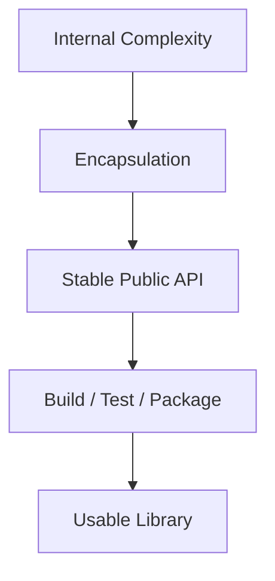

결국 라이브러리 설계는 두 가지를 동시에 달성해야 한다.

첫째, 내부 복잡성을 견딜 수 있는 구조를 만든다.
둘째, 외부 사용자에게는 단순하고 안정적인 경험을 제공한다.

wirestead의 여러 설계 요소는 이 두 목표 사이의 균형을 맞추기 위한 시도였다.

## Trade-off: 완성도를 높일수록 관리할 것도 늘어난다

빌드 옵션, 테스트 계층, 패키징, 문서화는 모두 라이브러리 품질을 높인다.
하지만 동시에 유지보수해야 할 표면도 넓어진다.

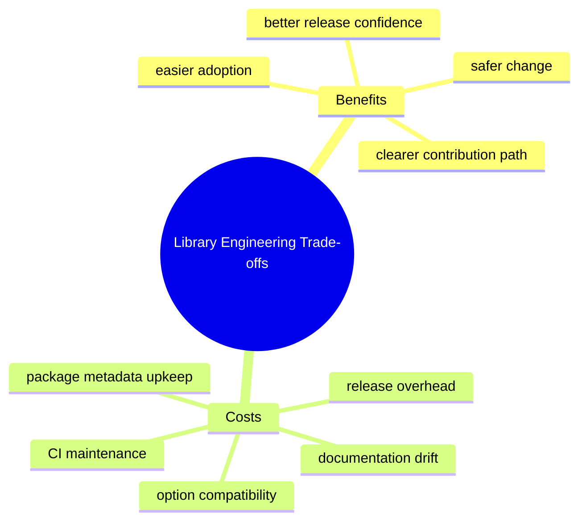

테스트가 많아지면 변경 안정성은 높아지지만 테스트 유지 비용도 증가한다.
패키징 target이 많아지면 사용성은 좋아지지만 각 플랫폼별 이슈도 늘어난다.
문서가 많아지면 진입 장벽은 낮아지지만 코드와 문서가 어긋날 가능성도 커진다.

따라서 모든 것을 한 번에 완벽하게 만들려고 하기보다, core library에서 반드시 필요한 기반부터 정리하고 나머지는 별도 repository나 release cycle에서 관리하는 것이 현실적이다.

## 정리

wirestead의 설계는 단순히 통신 기능을 구현하는 것으로 끝나지 않았다.

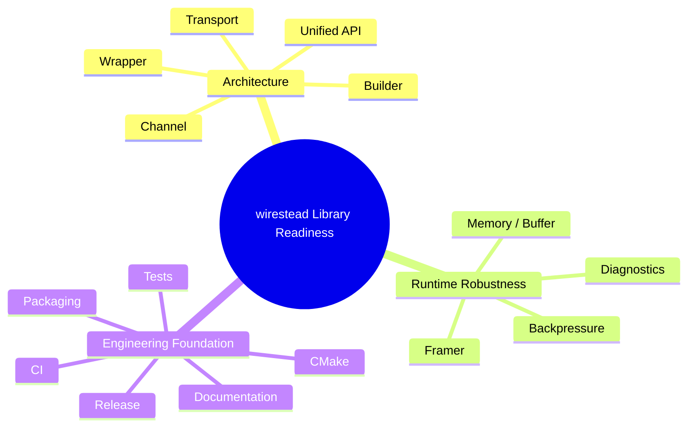

정리하면 다음과 같다.

- 라이브러리는 기능 구현만으로 완성되지 않는다.
- CMake 구조는 빌드 옵션, 컴파일러 설정, 의존성, target, 패키징을 분리해야 유지보수하기 쉽다.
- 테스트는 unit, integration, e2e로 나누면 실패 원인을 해석하기 쉽다.
- CTest label 기반 실행은 로컬 개발과 CI pipeline을 모두 유연하게 만든다.
- 패키징은 단순한 압축이 아니라, 사용자가 라이브러리를 찾고 링크할 수 있게 만드는 과정이다.
- CMake install/export 구조는 `find_package`, `pkg-config`, CPack뿐 아니라 vcpkg / Conan 같은 패키지 매니저 연동의 기반이 된다.
- 문서화는 core repository와 docs repository의 역할을 나눌 수 있다.
- 릴리즈 준비는 기능 완료가 아니라 사용 가능성의 점검이다.
- 오픈소스 라이브러리는 빌드 가능성, 테스트 가능성, 문서화, 배포 가능성을 함께 갖춰야 한다.

wirestead를 만들면서 반복적으로 확인한 것은 하나다.

> 좋은 라이브러리는 내부가 강해야 하지만, 외부에서는 단순해야 한다.

내부에는 복잡한 transport, queue, buffer, diagnostics가 있어도, 사용자는 명확한 API와 안정적인 빌드·테스트·배포 경험을 기대한다.
wirestead의 설계와 릴리즈 준비 과정은 이 두 세계 사이의 간격을 줄이기 위한 작업이었다.

구현은 라이브러리의 출발점이고, 테스트와 패키징과 문서화는 라이브러리를 실제로 사용할 수 있게 만드는 기반이다.
이 과정을 거치면서 wirestead는 단순한 통신 코드 묶음이 아니라, 다른 프로젝트에서 가져다 쓸 수 있는 C++ 통신 라이브러리에 가까워질 수 있었다.
