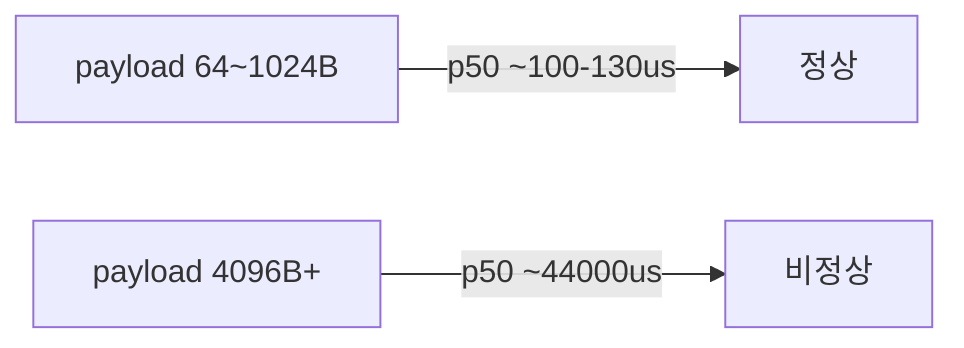
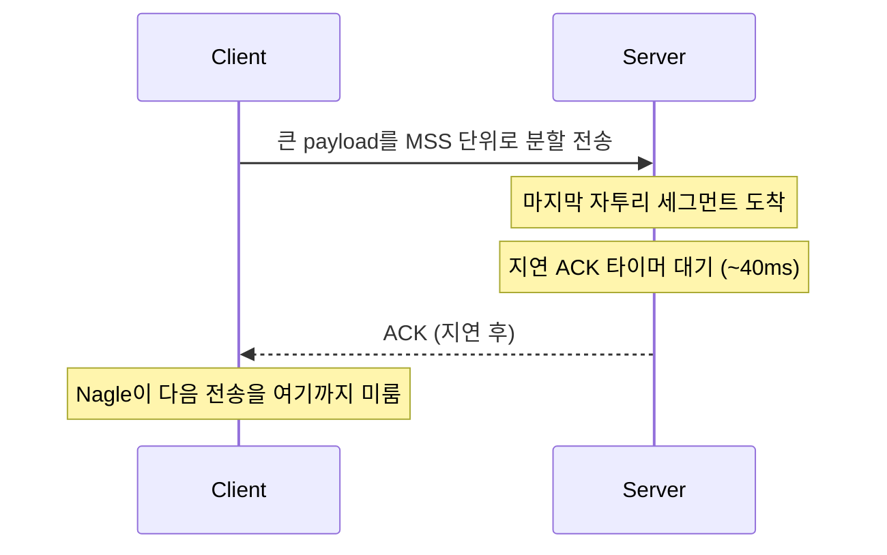
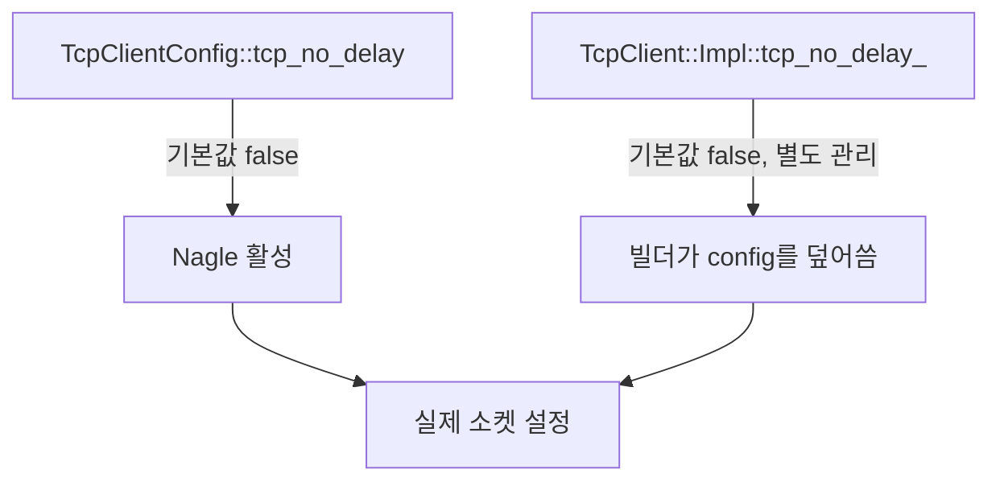
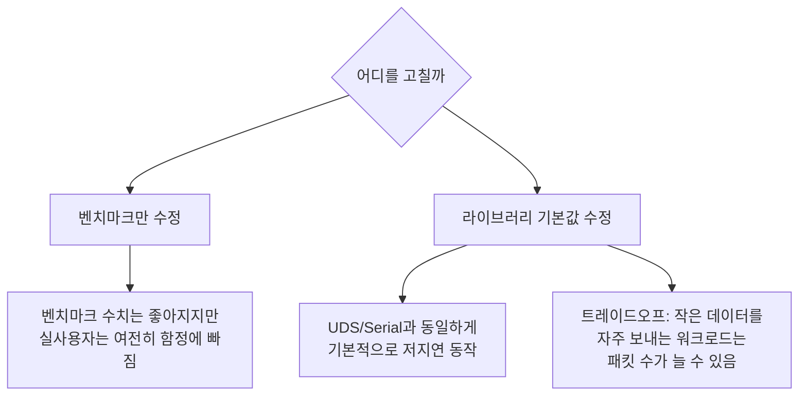
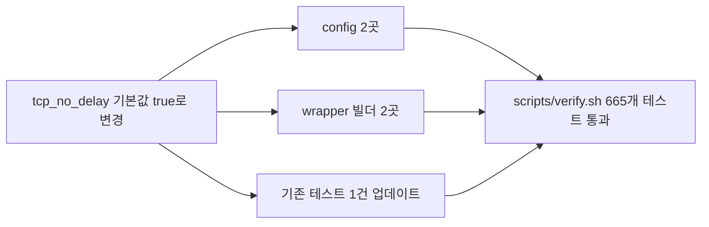
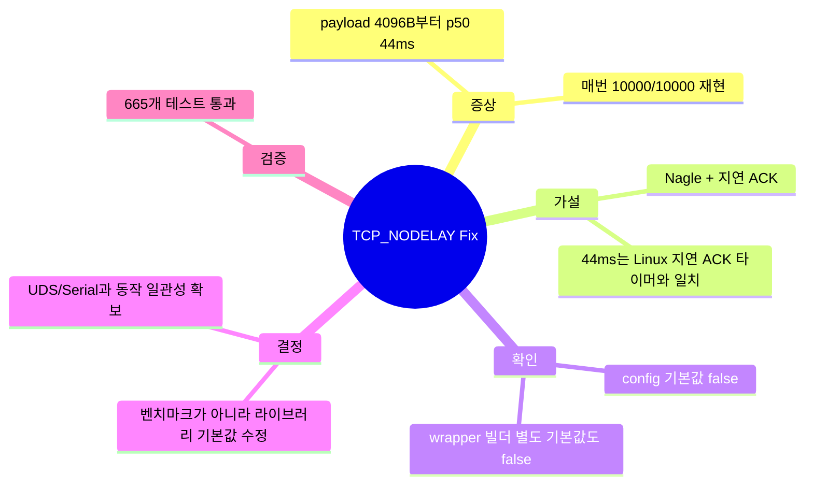

## 도입: 숫자 하나가 이상했다

[[unilink] transport 계층 설계](/blog/2026-06-02-unilink-transport-계층-설계)에서 unilink는 TCP, UDP, Serial, UDS를 하나의 인터페이스로 감싼다고 정리했다. 이번 글은 그중 TCP 쪽에서 벤치마크가 잡아낸 이상 수치에 대한 이야기다.

v0.8.2 벤치마크 결과표를 보다가 이상한 패턴을 발견했다.

| payload | p50 (us) |
|---|---:|
| 64 | 131 |
| 256 | 122 |
| 1024 | 124 |
| **4096** | **43997** |
| 16384 | 43994 |
| 65536 | 43983 |

1024바이트까지는 100us대인데, 4096바이트로 넘어가는 순간 p50이 44,000us(44ms) 근처로 튄다. 그것도 10000번 반복 중 10000번 전부, 매번 똑같이.



가끔 튀는 지연이면 네트워크 잡음이라고 넘길 수 있다. 하지만 매번 정확히 같은 자리에서, 정확히 비슷한 크기로 튄다는 건 우연이 아니라 구조적인 문제라는 뜻이었다.

## 가설: 44ms라는 숫자가 낯설지 않다

44ms라는 크기 자체가 단서였다. 이 정도 지연은 TCP 통신에서 흔히 보는 값이 하나 있다 — Nagle 알고리즘과 지연 ACK(delayed ACK)이 만나는 전형적인 정체 구간이다.

- Nagle 알고리즘은 작은 패킷을 모아서 보내려고, 이전에 보낸 데이터의 ACK을 받을 때까지 다음 전송을 미룬다.
- Linux의 지연 ACK 타이머는 보통 40ms 근처다.
- 두 메커니즘이 겹치면, 특정 크기의 마지막 조각 전송이 상대방의 지연 ACK을 기다리며 40ms 안팎 멈춰 있다가 나가는 패턴이 반복된다.



payload가 커질수록 MSS(약 1448바이트) 단위로 여러 세그먼트로 쪼개지고, 그중 마지막 자투리 세그먼트가 이 패턴에 걸릴 가능성이 커진다. 1024바이트 이하는 세그먼트가 1~2개뿐이라 영향이 거의 없고, 4096바이트부터는 세그먼트 수가 늘면서 매번 이 지연을 맞는다는 설명이 앞뒤가 맞았다.

## 확인: 코드에서 실제로 꺼져 있었나

가설을 세웠으니 실제로 `TCP_NODELAY`가 꺼져 있는지 코드를 확인했다.

```cpp
// unilink/config/tcp_client_config.hpp
bool tcp_no_delay = false;

// unilink/config/tcp_server_config.hpp
bool tcp_no_delay = false;
```

기본값이 `false`였다. 즉 Nagle 알고리즘이 기본적으로 켜져 있다는 뜻이다. 벤치마크 클라이언트/서버 코드도 이 옵션을 명시적으로 켜지 않았으니, 기본값 그대로 사용하고 있었다.

여기서 한 가지 더 확인해야 할 게 있었다. unilink는 `TcpClientConfig`/`TcpServerConfig` struct 말고도, 사용자가 실제로 쓰는 `unilink::tcp_client(...)` 빌더 API가 별도의 내부 기본값을 들고 있었다.

```cpp
// unilink/wrapper/tcp_client/tcp_client.cc
bool tcp_no_delay_ = false;

// unilink/wrapper/tcp_server/tcp_server.cc
std::atomic<bool> tcp_no_delay_{false};
```

config struct의 기본값만 고치면 빌더 API 쪽 기본값이 그걸 덮어써서 실제로는 아무것도 안 바뀔 뻔했다. 두 군데를 같이 고쳐야 했다.



## 결정: 벤치마크를 고칠까, 라이브러리를 고칠까

여기서 선택지가 갈렸다. 벤치마크 코드에서만 `.tcp_no_delay(true)`를 켜면 벤치마크 수치는 좋아지지만, 실제로 라이브러리를 가져다 쓰는 사용자는 여전히 이 함정을 그대로 밟는다.

unilink는 serial, network, IPC를 하나의 인터페이스로 통일하는 게 목적인 라이브러리다. UDS나 serial은 애초에 Nagle이 없어서 빠른데, TCP만 기본값 때문에 들쭉날쭉하다면 "통일된 인터페이스"라는 취지에 어긋난다. 그래서 벤치마크가 아니라 라이브러리 기본값 쪽을 고치기로 했다.



트레이드오프는 있다. `tcp_no_delay = true`가 기본이 되면 작은 데이터를 자주 보내는 워크로드에서는 Nagle이 해주던 패킷 병합이 없어져서 패킷 수가 늘어날 수 있다. 하지만 대량 벌크 전송처럼 처리량이 우선인 소수 케이스는 사용자가 명시적으로 `.tcp_no_delay(false)`로 되돌리면 되는 문제고, 예측 불가능한 40ms대 지연은 대부분의 요청-응답/제어 메시지 용도에서 훨씬 치명적이다. 응답성이 기본이어야 하는 통신 라이브러리라면, 기본값은 안전한 쪽(저지연)에 둬야 한다고 판단했다.

## 수정과 검증

`TcpClientConfig`/`TcpServerConfig`의 기본값과, 빌더가 들고 있던 별도 기본값 두 군데 모두 `true`로 바꿨다. 기존에 default가 `false`라고 가정하고 작성된 유닛 테스트 하나도 함께 고쳤다.

```cpp
struct TcpClientConfig {
  ...
  bool tcp_no_delay = true;  // false -> true
  ...
};
```

수정 후 `./scripts/verify.sh`로 포맷, 빌드, 유닛/통합 테스트 전체(665개)를 돌려서 회귀가 없는지 확인했다. 전부 통과했다.



## 정리



- 증상은 TCP payload 4096바이트 이상에서 p50이 44ms 근처로 매번 튀는 것이었다.
- 44ms라는 크기 자체가 Nagle 알고리즘과 Linux 지연 ACK 타이머(~40ms)가 겹치는 전형적인 패턴과 일치했다.
- 코드를 보니 `tcp_no_delay` 기본값이 config struct와 wrapper 빌더 양쪽 모두 `false`였고, 둘 다 고쳐야 실제로 적용됐다.
- 벤치마크만 고치는 대신 라이브러리 기본값을 바꿔서, TCP도 UDS/Serial과 동일하게 기본적으로 저지연 동작하도록 맞췄다.

벤치마크 숫자 하나가 이상해 보이는 걸 그냥 넘기지 않고 원인까지 따라간 게 이번 트러블슈팅의 전부다. 특히 "몇몇 payload 크기에서만 재현된다"는 패턴은 우연이 아니라 항상 구조적인 이유가 있다는 걸 다시 확인했다.
