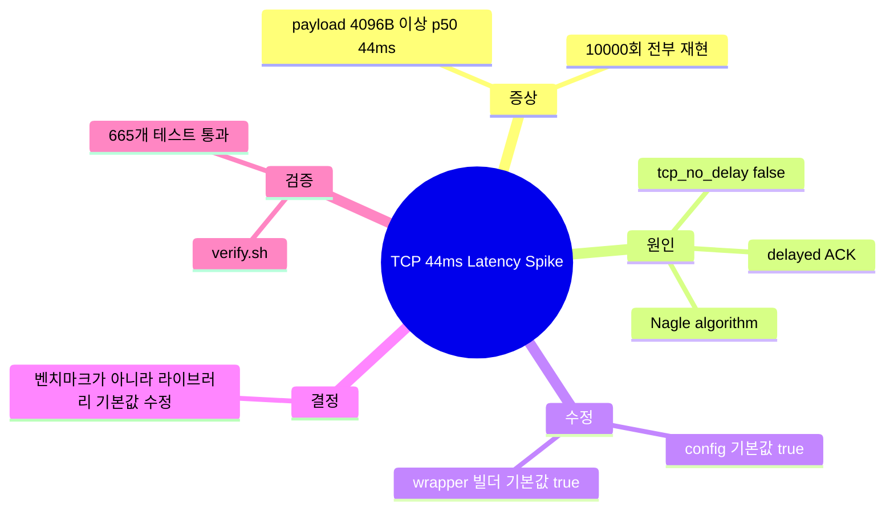
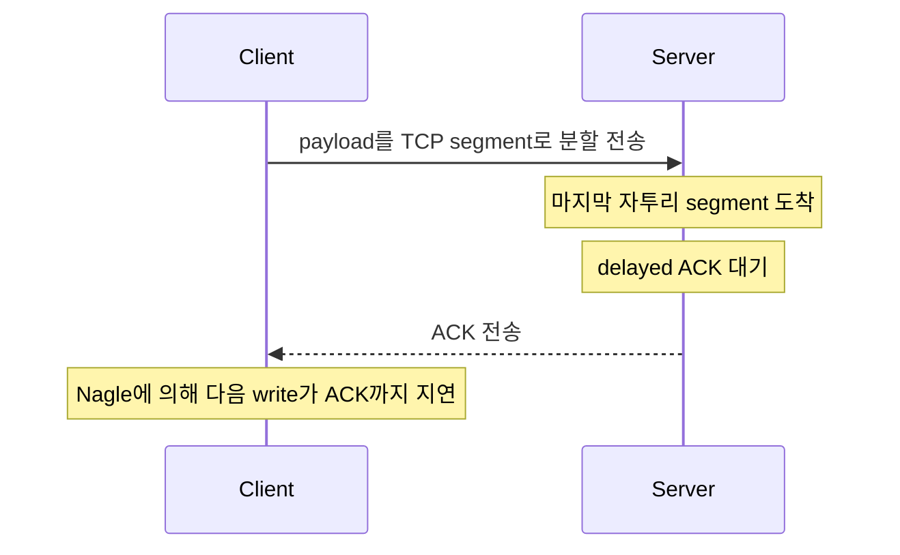
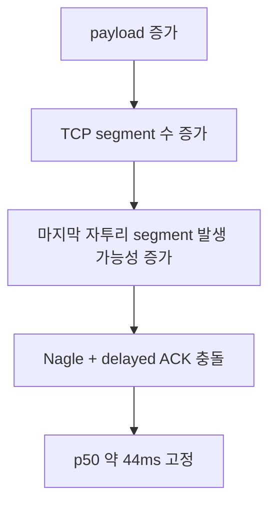
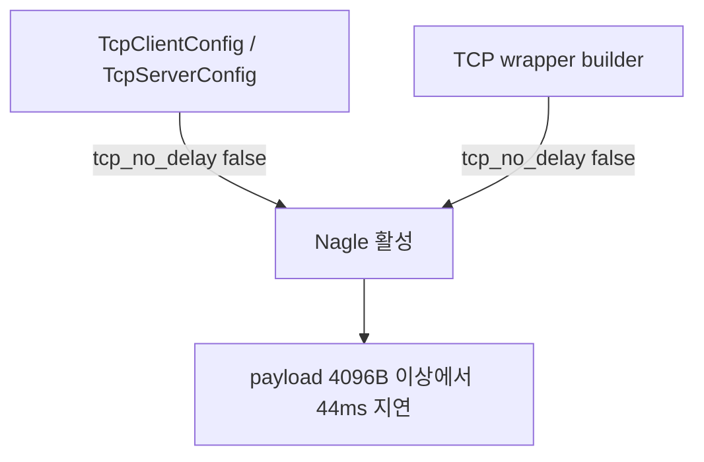
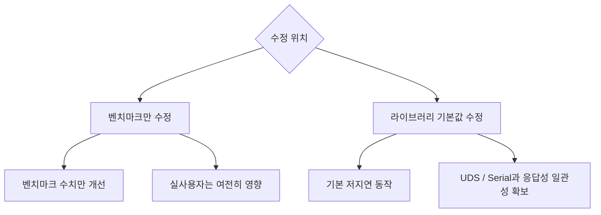
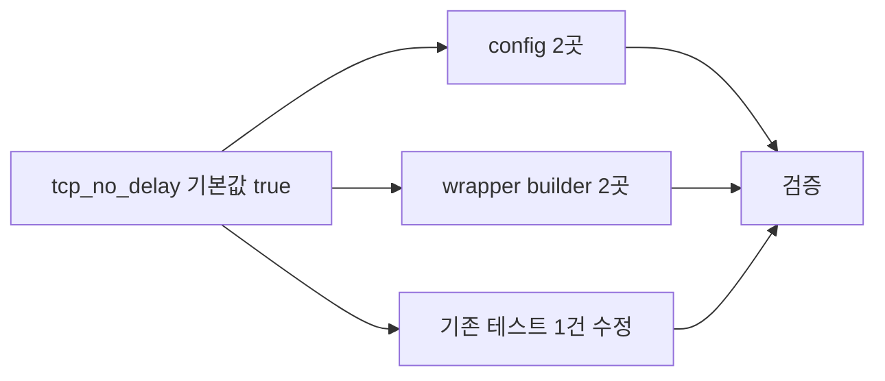
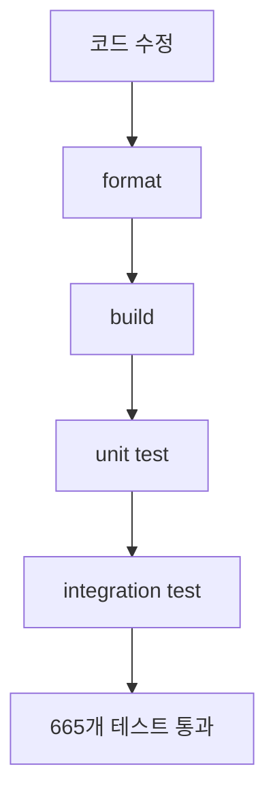

## 도입: 4096B부터 튄 44ms 지연의 원인은 TCP 기본값

`unilink`는 TCP, UDP, Serial, UDS를 하나의 인터페이스로 감싸는 transport 계층을 제공한다. 이 글은 그중 TCP 벤치마크에서 발견한 44ms 지연 패턴과, 그 원인을 `TCP_NODELAY` 기본값까지 추적해 수정한 기록이다.

문제는 TCP payload가 `4096B` 이상일 때부터 p50 latency가 약 `44ms`로 튀는 것이었다. 일시적인 outlier가 아니라, 10000번 반복 중 10000번 모두 같은 구간에서 재현됐다.

핵심은 다음과 같다.

| 항목      | 내용                                                       |
| --------- | ---------------------------------------------------------- |
| 증상      | TCP payload `4096B` 이상에서 p50이 약 `44ms`로 급증        |
| 재현성    | 10000회 반복 중 10000회 동일 패턴                          |
| 원인      | Nagle 알고리즘과 delayed ACK 조합                          |
| 직접 원인 | `tcp_no_delay` 기본값이 config와 wrapper 양쪽 모두 `false` |
| 수정      | TCP client/server 기본값을 `tcp_no_delay = true`로 변경    |
| 검증      | `scripts/verify.sh` 기준 665개 테스트 통과                 |

결론부터 말하면, 벤치마크 수치가 이상했던 이유는 TCP 자체의 성능 문제가 아니었다. 라이브러리 기본값이 저지연 통신에 맞지 않았고, 그 결과 특정 payload 크기부터 Nagle 알고리즘과 delayed ACK이 반복적으로 충돌하고 있었다.



## 증상: 1024B까지는 정상, 4096B부터 44ms

v0.8.2 벤치마크 결과에서 이상한 패턴이 보였다.

| payload  | p50 (us)  |
| -------- | --------- |
| 64       | 131       |
| 256      | 122       |
| 1024     | 124       |
| **4096** | **43997** |
| 16384    | 43994     |
| 65536    | 43983     |

`1024B`까지는 p50이 100us대였다. 그런데 `4096B`부터는 p50이 약 `44,000us`, 즉 `44ms` 근처로 고정됐다.


가끔 튀는 지연이라면 네트워크 잡음이나 스케줄링 이슈로 넘길 수 있다. 하지만 이번 패턴은 달랐다.

- 특정 payload 크기부터만 발생했다.
- 지연 폭이 거의 일정했다.
- 10000번 반복 중 10000번 모두 재현됐다.

이 정도 재현성이면 우연이 아니라 구조적인 원인이 있다고 봐야 했다.

## 원인: Nagle 알고리즘과 delayed ACK 조합

`44ms`라는 숫자가 단서였다. TCP에서 40ms 안팎의 지연은 Nagle 알고리즘과 delayed ACK이 만났을 때 자주 보이는 패턴이다.

- Nagle 알고리즘은 작은 TCP segment를 즉시 보내지 않고 ACK을 기다리며 병합하려고 한다.
- delayed ACK은 수신 측이 ACK 전송을 잠시 늦춰서 패킷 수를 줄이려는 동작이다.
- 두 메커니즘이 겹치면 송신 측은 ACK을 기다리고, 수신 측은 ACK을 늦추는 상태가 된다.
- 그 결과 특정 segment가 delayed ACK 타이머 근처까지 밀릴 수 있다.



`1024B` 이하에서는 segment 수가 적어 이 패턴이 잘 드러나지 않았다. 하지만 `4096B`부터는 MSS 단위 분할이 늘어나고, 마지막 자투리 segment가 Nagle과 delayed ACK 조합에 걸릴 가능성이 커진다.

즉, payload 크기별 latency가 아래처럼 갈라진 것은 자연스러운 신호였다.



## 직접 원인: `tcp_no_delay` 기본값이 꺼져 있었다

가설을 확인하기 위해 TCP 설정 코드를 봤다.

```cpp
// unilink/config/tcp_client_config.hpp
bool tcp_no_delay = false;

// unilink/config/tcp_server_config.hpp
bool tcp_no_delay = false;
```

config struct 기준으로 `tcp_no_delay` 기본값은 `false`였다. 즉, 기본적으로 Nagle 알고리즘이 켜져 있었다.

여기서 끝이 아니었다. unilink는 config struct 외에도 사용자가 실제로 많이 쓰는 wrapper builder API를 제공한다. 이 builder도 별도의 기본값을 가지고 있었다.

```cpp
// unilink/wrapper/tcp_client/tcp_client.cc
bool tcp_no_delay_ = false;

// unilink/wrapper/tcp_server/tcp_server.cc
std::atomic<bool> tcp_no_delay_{false};
```

즉, 수정 지점은 두 군데였다.

| 위치                                  | 기존값  | 문제                                         |
| ------------------------------------- | ------- | -------------------------------------------- |
| `TcpClientConfig` / `TcpServerConfig` | `false` | config 직접 사용 시 Nagle 활성               |
| TCP wrapper builder                   | `false` | builder 사용 시 config 변경을 덮어쓸 수 있음 |

config struct만 고쳤다면 실제 사용자가 쓰는 builder 경로에서는 여전히 `tcp_no_delay = false`가 적용될 수 있었다. 따라서 config와 wrapper builder 기본값을 모두 수정해야 했다.



## 결정: 벤치마크가 아니라 라이브러리 기본값을 고쳤다

선택지는 두 가지였다.

| 선택지                                    | 장점                        | 문제                                             |
| ----------------------------------------- | --------------------------- | ------------------------------------------------ |
| 벤치마크에서만 `.tcp_no_delay(true)` 설정 | 벤치마크 수치는 즉시 개선   | 실제 사용자는 같은 함정을 밟음                   |
| 라이브러리 기본값을 `true`로 변경         | 기본 동작이 저지연에 맞춰짐 | 작은 메시지를 자주 보내는 경우 패킷 수 증가 가능 |

벤치마크만 고치는 건 문제를 숨기는 것에 가깝다. unilink 사용자는 TCP, UDP, Serial, UDS를 같은 추상화로 사용할 것을 기대한다. 그런데 TCP만 기본값 때문에 40ms대 지연을 만들면 transport 간 동작 일관성이 깨진다.

따라서 벤치마크가 아니라 라이브러리 기본값을 고치기로 했다.



물론 `tcp_no_delay = true`에도 trade-off는 있다. 작은 메시지를 매우 자주 보내는 workload에서는 Nagle이 해주던 packet coalescing이 줄어들어 패킷 수가 늘어날 수 있다.

하지만 unilink의 기본 사용처는 요청-응답, 제어 메시지, IPC성 통신에 가깝다. 이 경우 처리량보다 예측 가능한 latency가 더 중요하다. 대량 bulk 전송처럼 throughput이 중요한 사용자는 명시적으로 `.tcp_no_delay(false)`를 선택하면 된다.

기본값은 저지연 쪽에 두는 것이 더 안전하다고 판단했다.

## 수정: config와 wrapper builder 기본값을 모두 변경

수정은 단순하지만 적용 범위를 놓치면 안 됐다.

```cpp
struct TcpClientConfig {
  ...
  bool tcp_no_delay = true;
  ...
};
```

변경 대상은 다음과 같았다.

| 대상                       | 변경                                       |
| -------------------------- | ------------------------------------------ |
| `TcpClientConfig`          | `tcp_no_delay = false` → `true`            |
| `TcpServerConfig`          | `tcp_no_delay = false` → `true`            |
| TCP client wrapper builder | 내부 기본값 `false` → `true`               |
| TCP server wrapper builder | 내부 기본값 `false` → `true`               |
| 기존 테스트                | default가 `false`라고 가정하던 테스트 수정 |



## 검증: 전체 테스트 665개 통과

수정 후 `./scripts/verify.sh`로 포맷, 빌드, 유닛 테스트, 통합 테스트를 모두 실행했다.



검증 결과 전체 665개 테스트가 통과했다.

이번 수정에서 중요한 부분은 단순히 테스트가 통과했다는 점이 아니다. config와 wrapper builder 양쪽 기본값을 모두 맞췄다는 점이다. 사용자 진입점이 여러 개인 라이브러리에서는 한쪽 default만 고치면 실제 동작이 바뀌지 않을 수 있다.

## 정리: 이상한 숫자는 구조적인 신호였다

이번 문제는 TCP 성능이 갑자기 나빠진 문제가 아니었다. TCP 기본 동작인 Nagle 알고리즘이 unilink의 기본 사용 목적과 맞지 않았고, delayed ACK과 만나면서 특정 payload 크기부터 44ms 지연이 고정적으로 발생한 것이다.

정리하면 다음과 같다.

- TCP payload `4096B` 이상에서 p50 latency가 약 `44ms`로 증가했다.
- 10000회 반복 중 10000회 재현되어 우연한 outlier가 아니었다.
- `44ms`라는 값은 Nagle 알고리즘과 delayed ACK 조합을 의심하기에 충분한 단서였다.
- 실제 코드에서 `tcp_no_delay` 기본값은 config와 wrapper builder 양쪽 모두 `false`였다.
- 벤치마크만 수정하지 않고 라이브러리 기본값을 `true`로 바꿨다.
- 수정 후 전체 665개 테스트를 통과했다.

이번 이슈의 핵심은 벤치마크 숫자를 성능 결과로만 보지 않았다는 점이다. 특정 payload 크기부터 반복적으로 같은 latency가 나온다면, 그것은 단순한 수치가 아니라 구조적인 신호다. 벤치마크는 빠르다/느리다를 보여주는 도구이기도 하지만, 라이브러리의 기본값이 사용 목적과 맞는지 검증하는 도구이기도 하다.
