## 도입: Transformer 이후의 구조 분류

Transformer는 Encoder와 Decoder를 모두 포함하는 구조로 제안되었다. 원래 구조는 번역과 같이 입력 문장을 이해한 뒤 다른 문장으로 생성하는 작업을 다루기 위한 형태였다.

예를 들면 다음과 같은 작업이다.

```text
입력: I drank coffee.
출력: 나는 커피를 마셨다.
```

이 작업에는 두 가지 단계가 필요하다.

```text
1. 입력 문장을 이해한다.
2. 이해한 내용을 바탕으로 출력 문장을 생성한다.
```

그래서 원래 Transformer는 Encoder와 Decoder로 나뉜다.

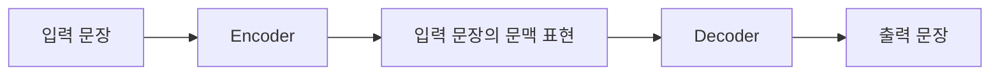

Encoder는 입력 문장을 읽고 문맥 표현을 만든다. Decoder는 그 문맥 표현을 참고하면서 출력 문장을 하나씩 생성한다.

하지만 모든 NLP 작업이 입력과 출력이 모두 필요한 변환 문제는 아니다. 어떤 작업은 입력 문장을 이해하고 분류하는 것이 목적이고, 어떤 작업은 이전 문맥을 기반으로 다음 문장을 생성하는 것이 목적이다.

이 차이에 따라 Transformer 기반 모델은 크게 세 가지 구조로 나뉜다.

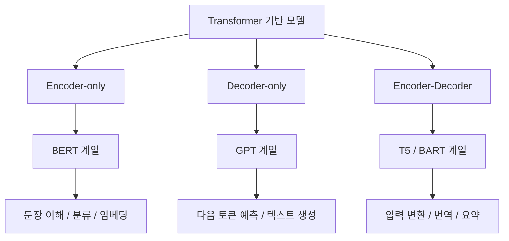

## Encoder-only의 의미

Encoder-only는 Transformer의 Encoder block만 사용하는 구조다. 대표적인 모델은 BERT다.

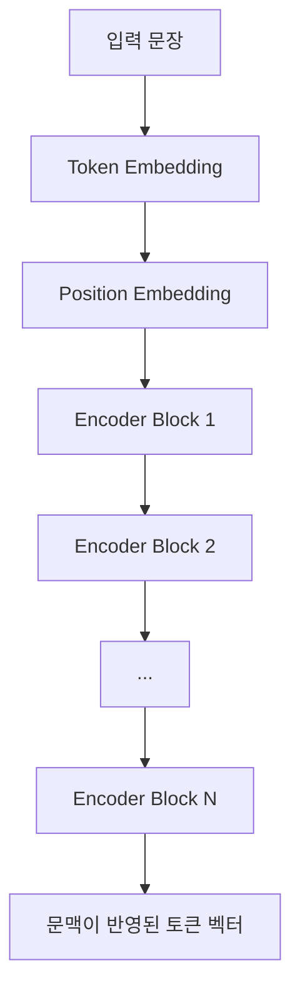

Encoder-only 구조에서는 각 token이 입력 문장 전체를 볼 수 있다. 특정 token을 표현할 때 왼쪽 문맥과 오른쪽 문맥을 모두 참고한다.

예를 들어 다음 문장이 있다고 하자.

```text
나는 커피를 마셨다.
```

Encoder에서는 각 token이 모든 token을 참조할 수 있다.

```text
        나는  커피를  마셨다
나는      O     O      O
커피를    O     O      O
마셨다    O     O      O
```

`커피를`이라는 token을 표현할 때 앞의 `나는`도 참고하고, 뒤의 `마셨다`도 참고한다. 이 구조를 양방향 문맥 구조라고 볼 수 있다.

BERT 계열 모델은 보통 Masked Language Modeling 방식으로 학습한다.

```text
입력:
나는 [MASK]를 마셨다.

정답:
커피
```

모델은 `[MASK]` 앞뒤 문맥을 모두 보고 가려진 token을 예측한다.

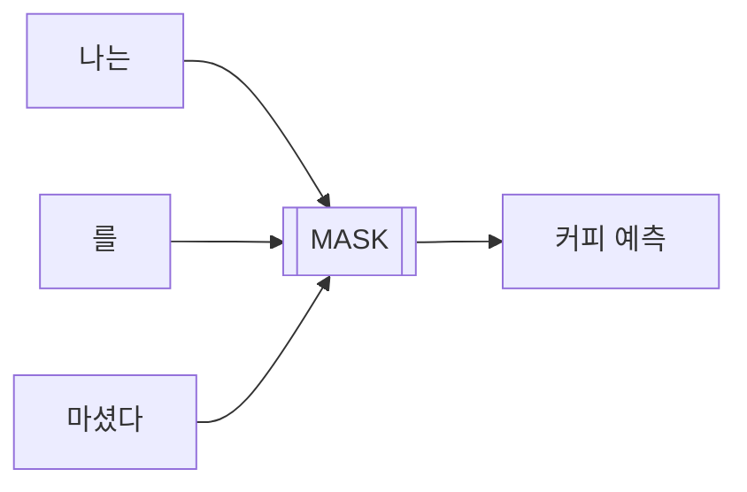

## Encoder-only가 이해 작업에 맞는 이유

Encoder-only 구조는 입력 전체를 이미 알고 있는 상태에서 의미를 판단하는 작업에 맞다.

예를 들어 문장 분류 문제를 보자.

```text
입력:
배송이 너무 늦고 제품도 파손되었다.

출력:
부정
```

이 작업에서는 다음 단어를 생성할 필요가 없다. 입력 문장 전체를 보고 하나의 label을 판단하면 된다.

개체명 인식도 마찬가지다.

```text
입력:
삼성전자는 수원에서 AI 세미나를 열었다.

출력:
삼성전자: 조직
수원: 장소
AI 세미나: 이벤트
```

각 token이 어떤 개체인지 판단하려면 문장 전체 문맥을 보는 구조가 유리하다. 왼쪽 문맥만 보는 것보다 양방향 문맥을 보는 쪽이 token의 역할을 더 명확하게 파악할 수 있다.

Encoder-only는 다음 작업에 주로 사용된다.

| 작업           | 구조가 맞는 이유                          |
| ------------ | ---------------------------------- |
| 문장 분류        | 전체 문장을 보고 하나의 label을 판단            |
| 감정 분석        | 문장 전체의 긍정/부정/중립 판단                 |
| 개체명 인식       | 각 token의 개체 유형 판단                  |
| 문서 유사도       | 문장 또는 문서를 vector로 만들어 비교           |
| 검색 embedding | query와 document를 같은 vector 공간에서 비교 |
| 질문 응답 추출     | 주어진 문서 안에서 답이 되는 span을 찾음          |

Encoder-only 구조를 한 문장으로 정리하면 다음과 같다.

```text
Encoder-only는 입력 전체를 한 번에 보고,
각 token 또는 문장 전체의 의미 표현을 만드는 구조다.
```

## Decoder-only의 의미

Decoder-only는 Transformer의 Decoder 계열 block만 사용하는 구조다. 대표적인 모델은 GPT다.

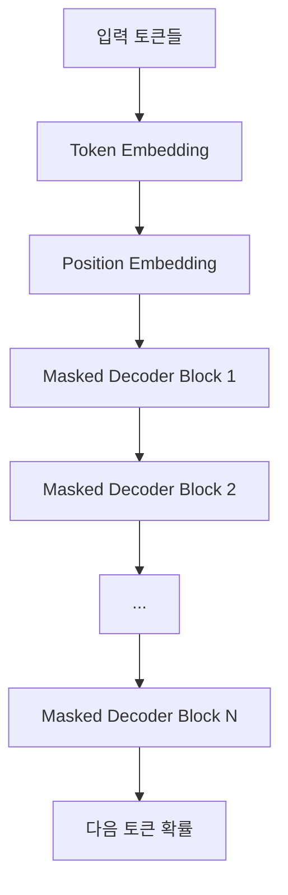

원래 Transformer Decoder에는 두 종류의 attention이 있다.

```text
1. Masked Self-Attention
2. Encoder-Decoder Cross-Attention
```

번역 모델에서는 Decoder가 Encoder의 출력도 참고해야 하므로 Cross-Attention이 필요하다.

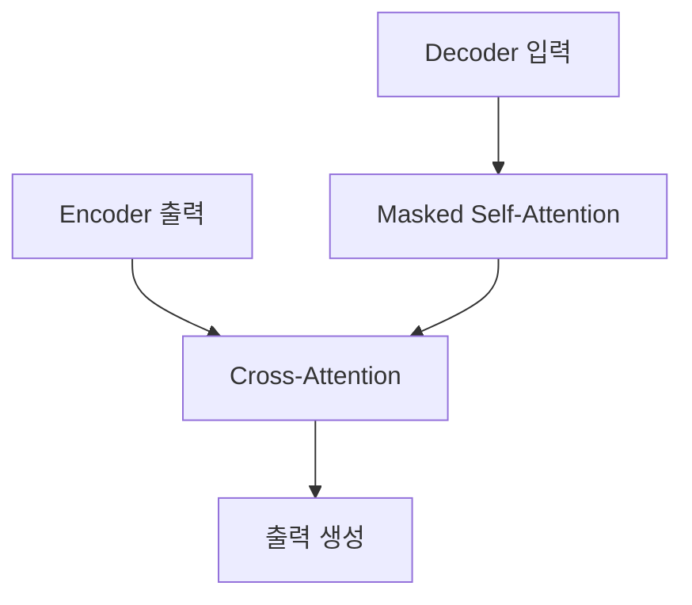

반면 GPT 같은 Decoder-only 모델은 별도의 Encoder가 없다. 따라서 Encoder-Decoder Cross-Attention은 사용하지 않고, Masked Self-Attention 중심의 Decoder block을 쌓는 구조로 이해할 수 있다.

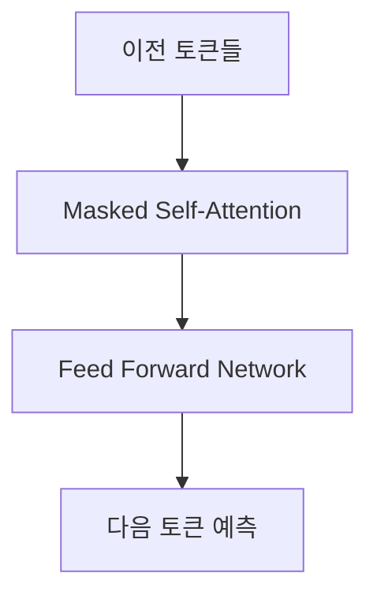

Decoder-only 모델은 이전 token만 보고 다음 token을 예측한다.

```text
나는 커피를 → 마셨다
```

이때 미래 token을 보면 안 된다. 미래 token을 볼 수 있다면 정답을 미리 보는 구조가 된다.

그래서 Decoder-only 모델은 causal mask를 사용한다.

```text
        나는  커피를  마셨다
나는      O     X      X
커피를    O     O      X
마셨다    O     O      O
```

각 token은 자기 자신과 이전 token만 참조할 수 있다.

## Decoder-only가 생성 작업에 맞는 이유

텍스트 생성은 순차적인 과정이다.

```text
나는 → 커피를 → 마셨다 → .
```

다음 token을 생성하는 시점에는 아직 미래 token이 존재하지 않는다. 따라서 현재까지 주어진 token만 보고 다음 token을 예측해야 한다.

GPT 계열의 학습 방식은 이 생성 조건과 동일하다.

```text
입력:
나는

정답:
커피를
```

```text
입력:
나는 커피를

정답:
마셨다
```

```text
입력:
나는 커피를 마셨다

정답:
.
```

학습 중에도 이전 token을 보고 다음 token을 맞히고, 실제 생성 중에도 이전 token을 보고 다음 token을 만든다.

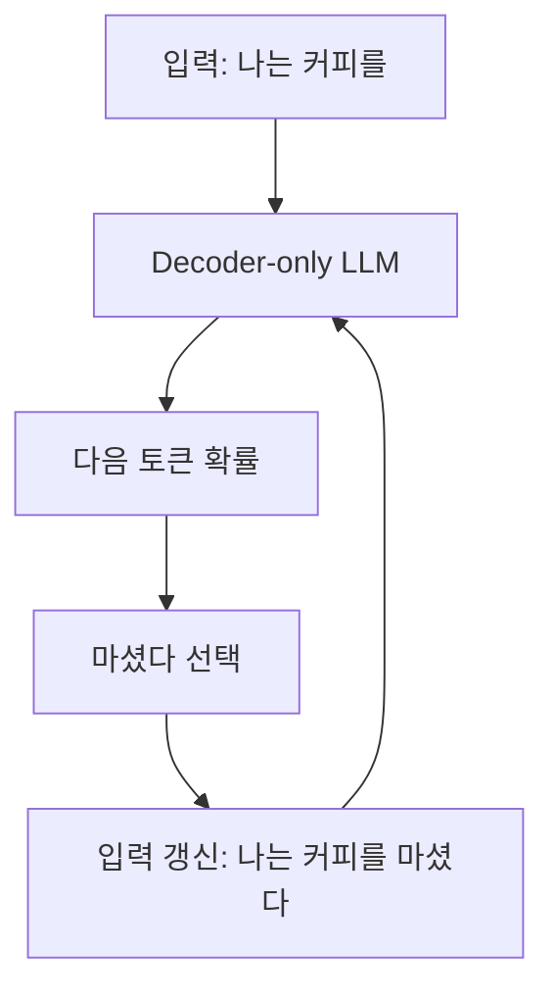

이 구조는 대화형 모델과 문장 생성에 직접 연결된다.

```text
사용자 입력:
Transformer를 설명해줘.

모델 입력:
사용자 입력 + 이전 대화 맥락

모델 출력:
Transformer는 ...
```

모델은 응답 전체를 한 번에 출력하는 것이 아니라, 다음 token을 반복적으로 선택하면서 문장을 구성한다.

Decoder-only는 다음 작업에 주로 사용된다.

| 작업    | 구조가 맞는 이유                     |
| ----- | ----------------------------- |
| 대화    | 이전 대화 맥락 뒤에 이어질 응답 생성         |
| 문서 작성 | 앞 문맥을 기준으로 다음 문장 생성           |
| 요약    | 입력 문서를 prompt로 두고 요약문 생성      |
| 번역    | 입력 문장을 prompt로 두고 목표 언어 문장 생성 |
| 코드 생성 | 기존 코드와 지시문 뒤에 이어질 코드 생성       |
| 질의응답  | 질문과 문맥 뒤에 답변 생성               |

Decoder-only 구조를 한 문장으로 정리하면 다음과 같다.

```text
Decoder-only는 이전 token을 기반으로 다음 token을 반복 예측하면서
텍스트를 생성하는 구조다.
```

## Encoder-Decoder 구조

Encoder-Decoder 구조는 Transformer의 Encoder와 Decoder를 모두 사용하는 구조다. 대표적인 모델로 T5, BART 계열이 있다.

이 구조는 입력 문장을 먼저 Encoder가 문맥 표현으로 바꾸고, Decoder가 그 표현을 참고해 출력 문장을 생성한다.

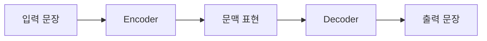

번역 작업을 예로 들면 다음과 같다.

```text
입력:
I drank coffee.

출력:
나는 커피를 마셨다.
```

Encoder는 입력 문장의 의미를 vector 표현으로 만든다. Decoder는 이 표현을 참고하면서 목표 언어의 문장을 생성한다.

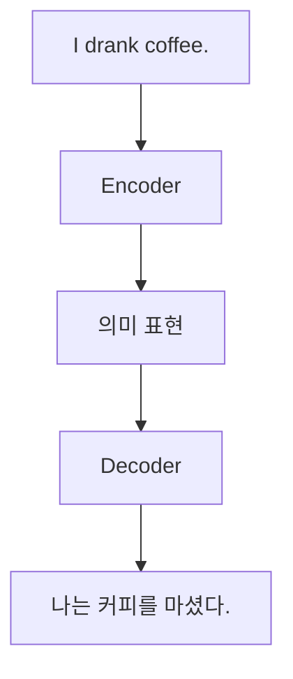

Encoder-Decoder 구조는 입력과 출력이 명확히 분리된 변환 작업에 주로 사용된다.

| 작업              | 구조가 맞는 이유                       |
| --------------- | ------------------------------- |
| 기계 번역           | 입력 언어를 이해한 뒤 목표 언어로 생성          |
| 문서 요약           | 긴 입력 문서를 이해한 뒤 짧은 문장으로 생성       |
| 문장 재작성          | 입력 문장의 의미를 유지한 채 표현 변경          |
| Text-to-Text 작업 | 모든 NLP 작업을 입력 text와 출력 text로 통일 |

## Autoencoding과 Autoregressive

Encoder-only, Decoder-only는 구조의 차이를 설명하는 용어다. Autoencoding, Autoregressive는 학습 방식의 차이를 설명하는 용어다.

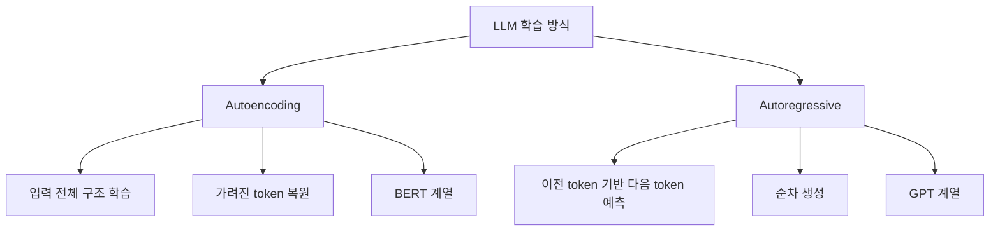

Autoencoding은 입력의 일부가 가려졌을 때 원래 입력을 복원하는 방식이다.

```text
입력:
나는 [MASK]를 마셨다.

예측:
커피
```

Autoregressive는 주어진 sequence를 기반으로 다음 값을 예측하는 방식이다.

```text
입력:
나는 커피를

예측:
마셨다
```

두 방식의 차이는 다음과 같이 정리할 수 있다.

| 구분    | Autoencoding       | Autoregressive    |
| ----- | ------------------ | ----------------- |
| 대표 모델 | BERT               | GPT               |
| 주 구조  | Encoder-only       | Decoder-only      |
| 문맥 사용 | 양방향 문맥             | 이전 문맥             |
| 학습 목표 | 가려진 token 복원       | 다음 token 예측       |
| 주요 출력 | 의미 표현, label, span | 다음 token, 생성 문장   |
| 활용    | 분류, 유사도, 검색, NER   | 대화, 요약, 생성, 코드 작성 |

## BERT와 GPT의 차이

BERT와 GPT는 모두 Transformer 기반이지만 사용하는 구조와 학습 목표가 다르다.

BERT는 입력 문장을 이해하는 방향으로 설계되었다. 문장 전체를 보고 특정 token이나 문장 전체의 의미를 파악한다.

```text
BERT:
문장 전체를 보고 빈칸을 맞힌다.
```

GPT는 이전 token들을 보고 다음 token을 순차적으로 예측한다.

```text
GPT:
이전 token들을 보고 다음 token을 맞힌다.
```

동일한 문장을 두고 보면 차이가 명확하다.

```text
문장:
나는 커피를 마셨다.
```

BERT 방식은 문장 중간을 가린 뒤 복원한다.

```text
나는 [MASK]를 마셨다.
→ 커피
```

GPT 방식은 앞부분을 보고 다음 token을 예측한다.

```text
나는 커피를
→ 마셨다
```

BERT는 전체 문맥을 이용해 입력을 이해하는 구조이고, GPT는 이전 문맥을 기반으로 이어서 생성하는 구조다.

## 구조와 활용의 연결

모델 구조는 활용 방식과 직접 연결된다.

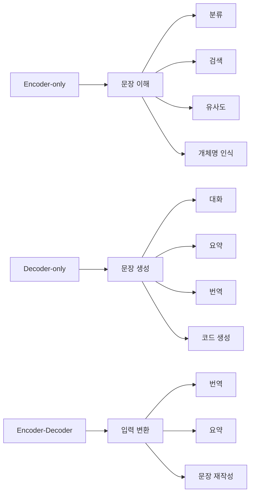

검색 시스템이나 문서 분류 시스템에서는 Encoder-only 계열이 자주 사용된다. 사용자의 질문과 문서를 embedding으로 바꾸고, 두 vector의 유사도를 비교할 수 있기 때문이다.

대화형 챗봇이나 코드 생성 도구에서는 Decoder-only 계열이 사용된다. 주어진 문맥 뒤에 이어질 token을 생성해야 하기 때문이다.

번역이나 요약처럼 입력과 출력이 명확히 분리된 변환 작업에서는 Encoder-Decoder 구조가 사용된다.

## 정리

Transformer 기반 LLM은 목적에 따라 구조가 나뉜다.

```text
Encoder-only:
입력 문장을 이해하는 구조
대표 모델: BERT
주요 작업: 분류, 유사도, 검색, NER

Decoder-only:
이전 token을 기반으로 다음 token을 생성하는 구조
대표 모델: GPT
주요 작업: 대화, 생성, 요약, 코드 작성

Encoder-Decoder:
입력을 이해한 뒤 다른 형태의 출력을 생성하는 구조
대표 모델: T5, BART
주요 작업: 번역, 요약, 문장 변환
```

Autoencoding과 Autoregressive는 학습 방식의 차이를 설명한다.

```text
Autoencoding:
문장 일부를 가리고 복원한다.
전체 문맥 이해에 맞는 학습 방식이다.

Autoregressive:
이전 token을 보고 다음 token을 예측한다.
순차적 생성에 맞는 학습 방식이다.
```

Encoder-only와 Decoder-only의 차이는 단순히 Transformer block의 일부를 쓰느냐의 문제가 아니다. 모델이 해결하려는 문제의 차이에서 나온다.

입력 전체를 이해하고 판단해야 하는 문제에서는 Encoder-only 구조가 사용된다. 이전 문맥을 기반으로 다음 출력을 생성해야 하는 문제에서는 Decoder-only 구조가 사용된다. Transformer는 공통 기반 구조이고, BERT와 GPT는 그 구조를 서로 다른 목적에 맞게 사용한 결과다.
