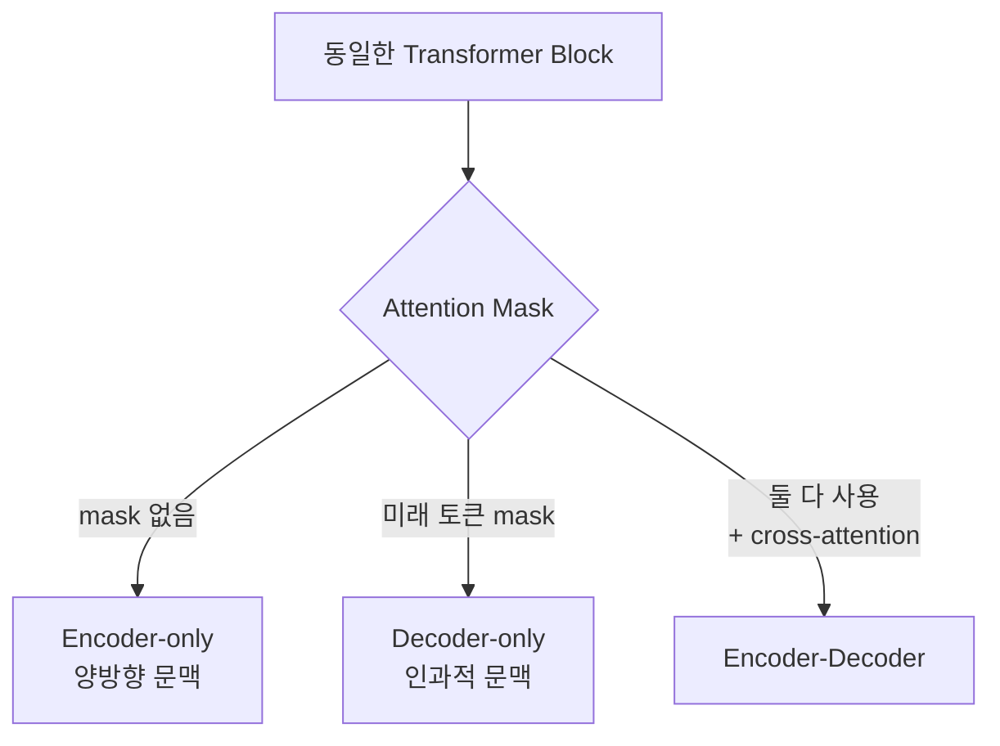
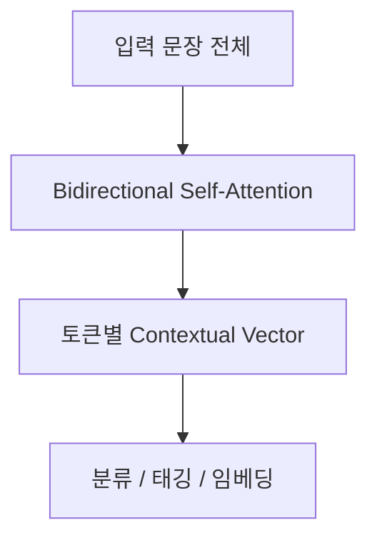
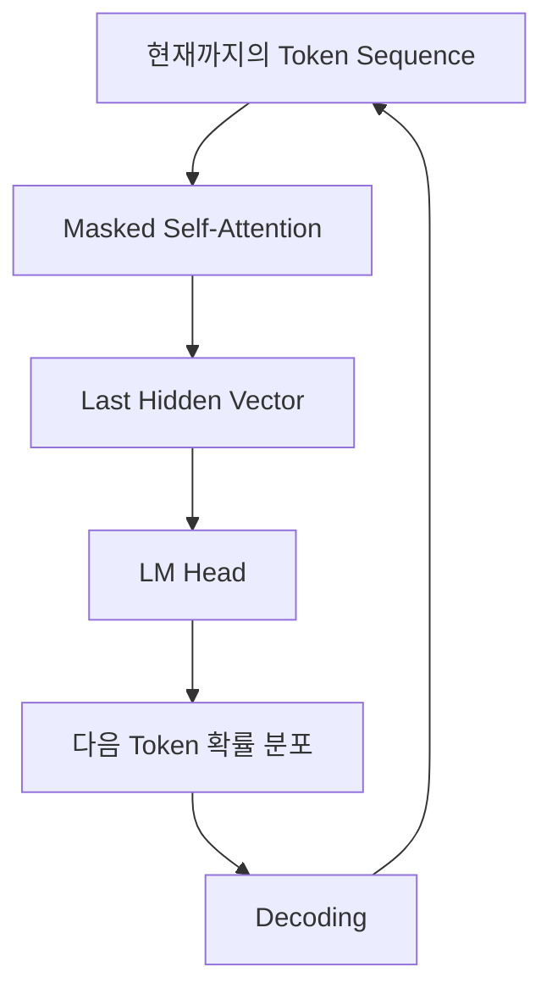
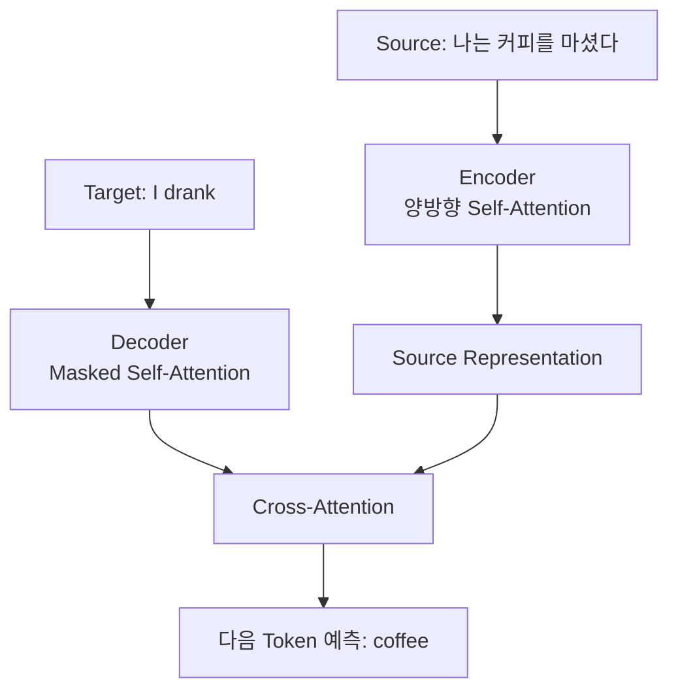
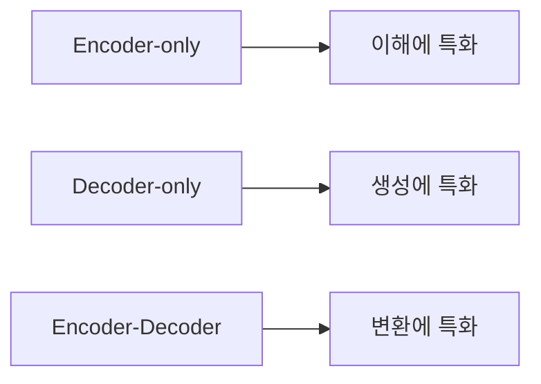
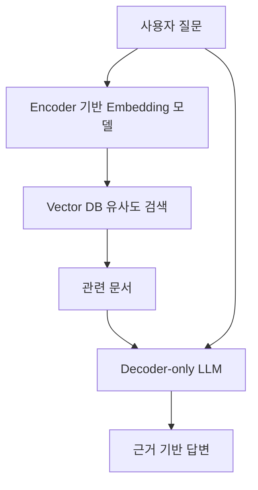

## 도입: 같은 Transformer인데 왜 구조가 갈라지는가

[Transformer와 self-attention](/blog/2026-07-02-llm-transformer와-self-attention-이해하기)에서 본 것처럼, Transformer block의 내부 구성은 단순하다. Self-Attention, Feed Forward Network, Residual Connection, LayerNorm이 전부다.

그런데 실제 모델을 보면 계열이 뚜렷하게 나뉜다.

```text
BERT, RoBERTa, DeBERTa      → Encoder-only
GPT, LLaMA, Qwen            → Decoder-only
T5, BART, 번역 모델          → Encoder-Decoder
```

같은 block을 쌓는데 왜 이렇게 갈라질까. 흔한 오해는 encoder와 decoder가 서로 다른 연산을 한다는 것이다. 그렇지 않다. 세 구조 모두 $\text{softmax}(QK^T/\sqrt{d_k})V$라는 동일한 attention 연산을 쓴다.

갈라지는 지점은 두 가지다.

1. **각 토큰이 어떤 토큰을 볼 수 있는가** (attention mask)
2. **무엇을 맞히도록 학습하는가** (학습 목표)

이 글에서는 이 두 축이 어떻게 세 가지 구조를 만들어내는지, 그리고 왜 오늘날 LLM 대부분이 Decoder-only로 수렴했는지 정리한다.

---

## 이 글에서 다루는 범위

**[ 다루는 내용 ]**

- Attention mask가 구조를 가르는 방식
- Encoder-only: 양방향 문맥
- Decoder-only: 인과적 문맥
- Encoder-Decoder: cross-attention
- 세 구조의 비교와 용도
- LLM이 Decoder-only로 수렴한 이유

이 글은 구조의 차이에 집중한다. 토큰이 벡터가 되는 과정은 [Tokenizer와 Embedding](/blog/2026-07-03-llm-core-tokenizer와-embedding)에서, 출력 벡터가 확률이 되는 과정은 [Logit과 Softmax](/blog/2026-07-03-llm-core-logit과-softmax)에서 다룬다.

---

## 구조를 가르는 것은 Attention Mask다

Self-Attention은 기본적으로 **문장 안의 모든 토큰이 모든 토큰을 참조**할 수 있는 연산이다. 여기에 어떤 mask를 씌우느냐가 모델의 성격을 결정한다.

`나는 커피를 마셨다`라는 입력에서, 각 토큰이 볼 수 있는 범위를 표로 그려 보자.

양방향(Encoder) 구조에서는 모든 칸이 열려 있다.

```text
        나는   커피를   마셨다
나는     O      O       O
커피를   O      O       O
마셨다   O      O       O
```

인과적(Decoder) 구조에서는 오른쪽 위가 막힌다.

```text
        나는   커피를   마셨다
나는     O      X       X
커피를   O      O       X
마셨다   O      O       O
```

차이는 오른쪽 위 삼각형뿐이다. 이 삼각형을 가리면 Decoder가 되고, 열어 두면 Encoder가 된다.



구현 상으로는 [Transformer 글에서 본 것](/blog/2026-07-02-llm-transformer와-self-attention-이해하기)처럼, Softmax 이전에 미래 토큰 위치의 점수에 $-\infty$를 더하는 것으로 처리한다.

이 작은 차이가 모델이 할 수 있는 일을 결정한다.

---

## Encoder-only: 양방향 문맥

Encoder-only 모델은 mask를 씌우지 않는다. 모든 토큰이 문장 전체를 좌우 양쪽으로 참조한다.



### 학습 목표: Masked Language Modeling

문제는 학습 방법이다. 모든 토큰이 문장 전체를 볼 수 있으면 "다음 토큰 맞히기"는 성립하지 않는다. 정답이 입력에 이미 들어 있기 때문이다.

그래서 Encoder-only 모델은 입력의 일부를 가리고 그 자리를 복원하도록 학습한다. 이를 **MLM**(Masked Language Modeling)이라고 한다.

```text
입력:  나는 [MASK] 마셨다
정답:  커피를
```

`[MASK]` 자리를 맞히려면 왼쪽의 `나는`과 오른쪽의 `마셨다`를 **동시에** 봐야 한다. 양방향 문맥이 필요한 과제이고, 양방향 구조라야 풀 수 있다.

### 무엇에 강한가

양방향 문맥은 문장 전체의 의미를 한 벡터로 압축하는 데 유리하다.

| 용도        | 예시                            |
| ----------- | ------------------------------- |
| 문장 분류   | 감성 분석, 스팸 판별, 의도 분류 |
| 토큰 분류   | 개체명 인식(NER), 품사 태깅     |
| 문장 임베딩 | 유사도 검색, RAG의 문서 임베딩  |
| 재순위화    | Cross-encoder reranker          |

### 무엇을 못 하는가

Encoder-only 모델은 **자연스러운 텍스트 생성을 하지 못한다.**

생성은 "앞의 토큰들로 다음 토큰을 예측한다"의 반복인데, 이 모델은 애초에 그렇게 학습되지 않았다. 미래를 보는 것이 전제인 구조에서 미래를 가린 채 한 토큰씩 이어 쓰게 하면, 학습 시점과 추론 시점의 조건이 어긋난다.

즉 Encoder-only는 **이해(understanding)** 쪽에 특화된 구조다.

---

## Decoder-only: 인과적 문맥

Decoder-only 모델은 미래 토큰을 mask로 가린다. 각 토큰은 자기 자신과 그 이전 토큰만 참조한다.



### 학습 목표: Next Token Prediction

미래가 가려져 있으므로 "다음 토큰 맞히기"가 자연스럽게 성립한다. 별도의 `[MASK]` 토큰도, 사람이 붙인 라벨도 필요 없다. 텍스트 자체가 정답이 된다.

```text
입력: 나는            → 정답: 커피를
입력: 나는 커피를      → 정답: 마셨다
입력: 나는 커피를 마셨다 → 정답: .
```

이 학습 방식은 [Pretraining과 Fine-tuning](/blog/2026-07-03-llm-training-pretraining과-fine-tuning)에서 더 자세히 다룬다.

### 생성이 구조에 내장되어 있다

추론 시점의 동작이 학습 시점과 정확히 같다는 점이 중요하다. 마지막 위치의 hidden vector로 다음 토큰의 확률 분포를 만들고, [Decoding](/blog/2026-07-03-llm-core-decoding) 전략으로 토큰 하나를 골라 sequence 뒤에 붙인 뒤, 같은 과정을 반복한다.

학습과 추론 사이에 구조적 간극이 없다.

### 부수 효과: KV Cache

인과적 mask에는 실무적으로 큰 장점이 하나 더 있다. 각 토큰의 표현이 **자기 이전 토큰에만** 의존하므로, 이미 계산한 Key와 Value는 뒤에 토큰이 추가되어도 바뀌지 않는다.

따라서 이전 단계의 K, V를 캐시해 두고 재사용할 수 있다. 토큰 하나를 생성할 때마다 전체 sequence를 다시 계산하지 않아도 된다.

양방향 구조에서는 토큰이 하나 늘 때마다 모든 토큰의 표현이 바뀌므로 이런 캐싱이 성립하지 않는다.

---

## Encoder-Decoder: 두 구조를 잇기

Encoder-Decoder는 이름 그대로 두 계층을 모두 쓴다.



Encoder는 입력 문장 전체를 양방향으로 읽어 표현을 만든다. Decoder는 지금까지 생성한 출력을 인과적으로 보면서, **cross-attention**을 통해 encoder의 표현을 참조한다.

### Cross-Attention

Self-Attention과 Cross-Attention의 차이는 Q, K, V의 출처다.

| 구분                | Query               | Key / Value        |
| ------------------- | ------------------- | ------------------ |
| **Self-Attention**  | 자기 계층의 입력    | 자기 계층의 입력   |
| **Cross-Attention** | Decoder의 현재 상태 | **Encoder의 출력** |

즉 cross-attention에서 decoder는 "지금 이 단어를 쓰려면 원문의 어느 부분을 봐야 하는가"를 묻는다. 기계 번역에서 정렬(alignment)에 해당하는 동작이다.

### 무엇에 적합한가

입력과 출력이 명확히 구분되고, 출력이 입력의 변환인 과제에 잘 맞는다.

- 기계 번역
- 요약
- 문법 교정
- 구조화된 형식 변환

입력을 완전히 양방향으로 읽은 뒤 출력을 생성하므로, 입력 전체에 대한 이해가 중요한 과제에서 유리하다.

---

## 세 구조 비교

| 구분            | Encoder-only           | Decoder-only          | Encoder-Decoder           |
| --------------- | ---------------------- | --------------------- | ------------------------- |
| **Attention**   | 양방향                 | 인과적(masked)        | 양방향 + 인과적 + cross   |
| **학습 목표**   | MLM                    | Next Token Prediction | Seq2Seq (보통 denoising)  |
| **입력 문맥**   | 전체                   | 이전 토큰만           | source 전체 / target 이전 |
| **텍스트 생성** | 어려움                 | 자연스러움            | 자연스러움                |
| **KV Cache**    | 해당 없음              | 가능                  | decoder 쪽 가능           |
| **대표 모델**   | BERT, RoBERTa, DeBERTa | GPT, LLaMA, Qwen      | T5, BART                  |
| **주 용도**     | 분류, 임베딩, 검색     | 대화, 생성, 범용      | 번역, 요약                |



---

## 왜 LLM은 Decoder-only로 수렴했는가

오늘날 우리가 LLM이라고 부르는 모델은 대부분 Decoder-only다. 성능이 절대적으로 우월해서라기보다, 확장에 유리한 성질이 여럿 겹친 결과에 가깝다.

**첫째, 학습 목표 하나로 모든 데이터를 쓸 수 있다.**

Next token prediction은 라벨이 필요 없다. 인터넷의 모든 텍스트가 그대로 학습 데이터가 된다. 데이터 규모를 키우는 데 병목이 없다.

**둘째, 모든 과제를 하나의 형식으로 표현할 수 있다.**

분류도, 요약도, 번역도 "프롬프트를 주고 이어 쓰게 한다"로 통일된다. Encoder-only 모델처럼 과제마다 별도의 head를 붙이고 fine-tuning할 필요가 없다.

```text
분류: "다음 문장의 감정은? 오늘 정말 좋았다 → " → "긍정"
번역: "다음을 영어로: 나는 커피를 마셨다 → "    → "I drank coffee"
```

**셋째, in-context learning이 나타났다.**

모델을 키우자 학습하지 않은 과제도 프롬프트에 예시 몇 개만 넣으면 수행하는 성질이 관찰됐다. 과제마다 모델을 다시 학습시키지 않아도 되므로 활용 비용이 크게 낮아졌다.

**넷째, 추론 효율이 좋다.**

앞서 본 KV cache 덕분에 긴 대화에서도 토큰당 연산량을 억제할 수 있다.

---

## 그래도 Encoder는 사라지지 않았다

Decoder-only가 주류가 됐다고 해서 Encoder 계열이 쓸모없어진 것은 아니다. 오히려 LLM 애플리케이션 안에서 함께 쓰인다.



RAG 파이프라인이 대표적이다. 문서를 벡터로 압축해 검색하는 단계에서는 양방향 문맥이 유리하다. 문장 전체를 한 벡터로 요약하는 일은 원래 Encoder가 잘하는 일이기 때문이다.

검색 결과를 다시 정렬하는 cross-encoder reranker도 같은 이유로 Encoder 계열을 쓴다.

정리하면 역할 분담에 가깝다.

| 단계          | 구조         | 이유                            |
| ------------- | ------------ | ------------------------------- |
| 검색용 임베딩 | Encoder-only | 문장 전체를 한 벡터로 압축      |
| 재순위화      | Encoder-only | 질문-문서 쌍을 함께 읽고 점수화 |
| 답변 생성     | Decoder-only | 자연스러운 텍스트 생성          |

---

## 요약 및 정리

세 구조는 다른 연산을 쓰는 것이 아니다. 같은 Transformer block에 **어떤 mask를 씌우고 무엇을 맞히도록 학습하는가**가 다를 뿐이다.

1. **Encoder-only:** mask 없이 양방향으로 읽고, 가려진 토큰을 복원하도록(MLM) 학습한다. 이해와 임베딩에 강하지만 생성은 어렵다.
2. **Decoder-only:** 미래 토큰을 가리고, 다음 토큰을 예측하도록 학습한다. 생성이 구조에 내장되어 있고 KV cache로 추론 효율도 좋다.
3. **Encoder-Decoder:** 입력은 양방향으로 읽고 출력은 인과적으로 생성하되, cross-attention으로 둘을 잇는다. 번역과 요약처럼 입력을 출력으로 변환하는 과제에 적합하다.

LLM이 Decoder-only로 수렴한 것은 라벨 없는 데이터로 무한히 확장할 수 있고, 모든 과제를 텍스트 이어 쓰기 하나로 통일할 수 있었기 때문이다.

다음 글에서는 이 구조가 만들어낸 출력 벡터가 어떻게 [Logit과 Softmax](/blog/2026-07-03-llm-core-logit과-softmax)를 거쳐 확률 분포가 되는지 살펴본다.
