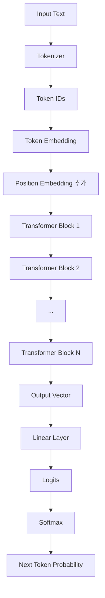
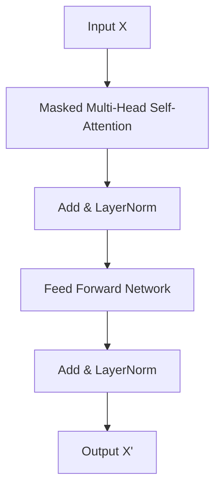
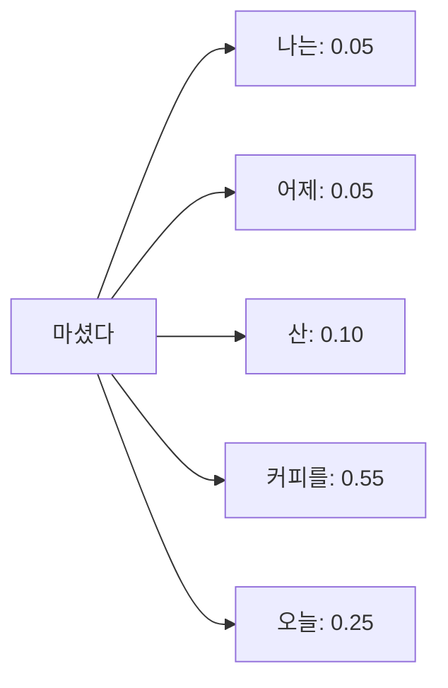
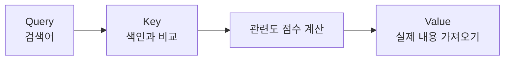
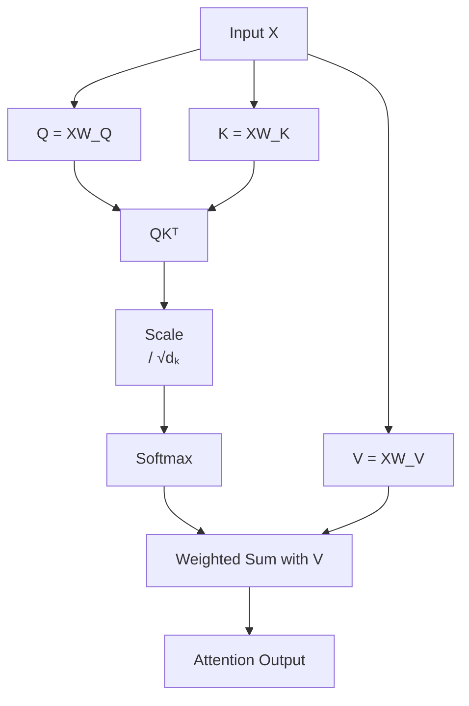
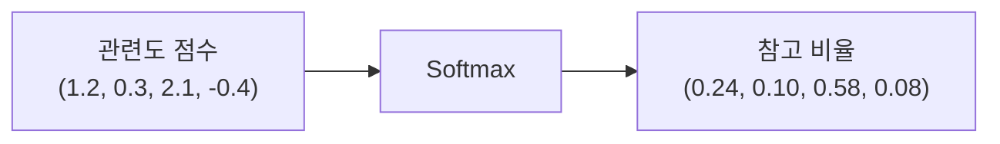
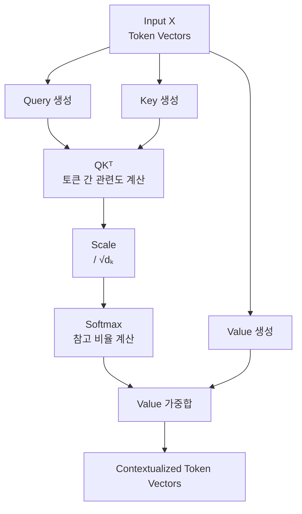
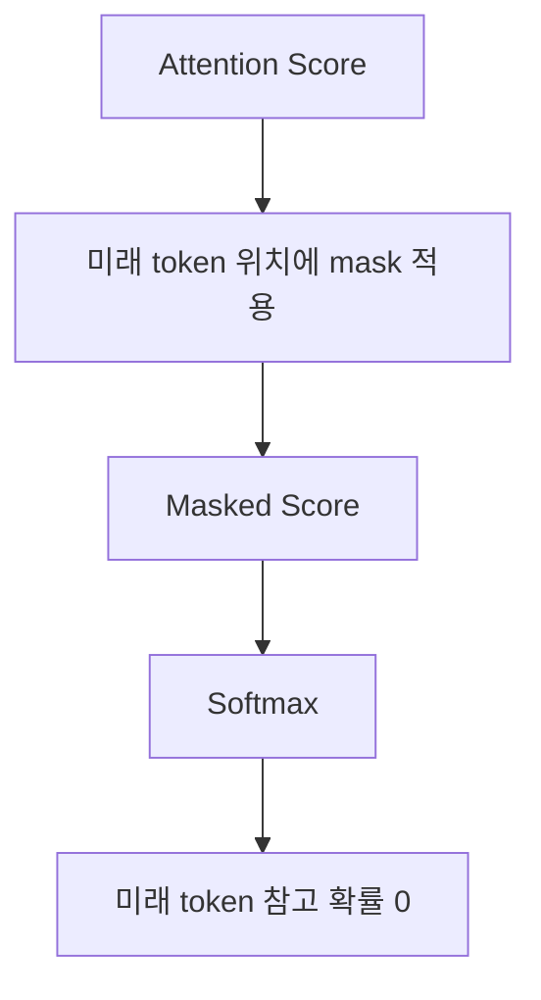
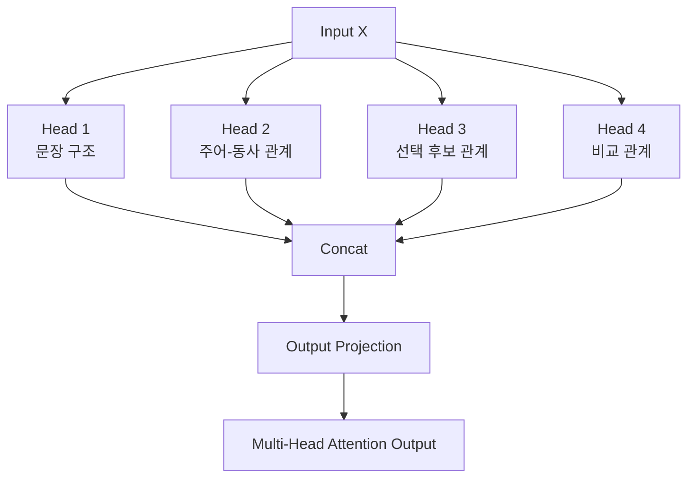
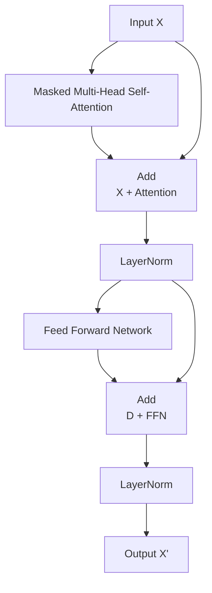

## 도입: 순차 처리에서 관계 계산으로

LLM(대형 언어 모델)을 이해하려면 **Transformer**를 먼저 볼 필요가 있다.

Transformer 이전에도 문장과 같은 sequence 데이터를 처리하는 모델은 있었다. 대표적으로 RNN, LSTM, GRU가 있다. 이 모델들은 입력을 순서대로 처리한다.

```text
나는 → 커피를 → 마셨다
```

순차 처리 방식은 문장을 읽는 인간의 흐름과 유사하다. 하지만 구조적인 한계가 존재한다.

1. **장기 의존성(Long-term Dependency) 문제:** 문장이 길어질수록 앞쪽 정보가 뒤쪽까지 안정적으로 전달되기 어렵다.
2. **병렬화의 한계:** 앞 토큰의 처리가 끝나야 다음 토큰을 처리할 수 있기 때문에, 대규모 데이터셋을 통한 GPU 병렬 학습이 어렵다.
3. **토큰 간 직접 참조의 어려움:** 문장 내에서 멀리 떨어진 토큰 간의 관계(예: 대명사가 가리키는 앞 문장의 명사)를 직접 계산하기 어렵다.

Transformer는 이 문제를 순차적인 기억 전달이 아니라, **토큰 간 관계 계산**으로 접근한다.

```text
"각 토큰이 문장 안의 다른 모든 토큰을 직접 참고한다."
```

이 혁신적인 구조의 중심에 바로 **Self-Attention**이 있다.

---

## Transformer 전체 흐름

Transformer는 하나의 거대한 단일 연산이라기보다, 같은 형태의 **Transformer Block**을 여러 층 쌓아 올린 구조다.



입력 문장은 먼저 **Tokenizer**를 통해 토큰 단위로 나뉘고, 각 토큰은 고차원 벡터로 변환된다. Transformer는 순차적으로 입력을 받지 않기 때문에, 토큰의 절대적/상대적 위치를 알려주는 위치 정보(Position Embedding)를 더해준다.

$$\text{입력 벡터} = \text{Token Embedding} + \text{Position Embedding}$$

그다음 여러 개의 Transformer block을 통과한다. GPT 계열과 같은 **Decoder-only** 구조를 기준으로 보면 block 내부는 다음과 같이 구성된다.



각 구성 요소의 핵심 역할은 다음과 같다.

| 구성 요소                      | 역할                                                      |
| ------------------------------ | --------------------------------------------------------- |
| **Self-Attention**             | 각 토큰이 문맥 내의 다른 토큰을 얼마나 참고할지 계산      |
| **Multi-Head Attention**       | 여러 개의 다른 관점(Head)에서 attention을 병렬 계산       |
| **Feed Forward Network (FFN)** | attention 결과를 토큰별로 비선형 변환 및 특징 추출        |
| **Residual Connection (Add)**  | 입력 정보를 우회하여 더해줌으로써 깊은 모델의 학습 안정화 |
| **LayerNorm**                  | 벡터 분포를 정규화하여 그래디언트 소실/폭발 방지          |

---

## Self-Attention의 역할

Self-Attention은 각 토큰에 대해 다음 질문의 답을 수치로 계산하는 과정이다.

```text
"현재 토큰을 명확히 표현하기 위해, 문장 안의 어떤 토큰을 얼마나 참고해야 하는가?"
```

예를 들어 다음 문장을 보자.

```text
나는 어제 산 커피를 오늘 마셨다
```

`마셨다`라는 토큰의 문맥적 의미를 명확히 하려면 행동의 직접적인 대상인 `커피를`이 가장 중요하고, 시점 정보인 `오늘`도 밀접하게 관련된다. Self-Attention은 이 관계를 다음과 같이 수치화한다.



이 값은 고정된 것이 아니라, 학습 과정에서 가중치 행렬을 통해 모델이 스스로 최적화한다. 결과적으로 `마셨다`라는 토큰의 새로운 표현(Contextualized Vector)은 각 정보의 가중합으로 생성된다.

$$\text{마셨다의 새 표현} = 0.05 \times \text{나는} + 0.05 \times \text{어제} + 0.10 \times \text{산} + 0.55 \times \text{커피를} + 0.25 \times \text{오늘}$$

Attention은 특정 토큰 하나만 선택하는 하드 셀렉션(Hard Selection)이 아니다. 문맥에 따라 여러 토큰의 정보를 **비율대로 매끄럽게 섞어서** 현재 토큰의 의미를 새로이 빌딩하는 연산이다.

---

## Q, K, V의 개념

Self-Attention의 수학적 공식은 다음과 같다.

$$\text{Attention}(Q, K, V) = \text{softmax}\left(\frac{QK^T}{\sqrt{d_k}}\right)V$$

여기서 $Q, K, V$는 각각 **Query**, **Key**, **Value**를 의미하며, 데이터베이스나 검색 시스템에 비유하면 직관적으로 이해할 수 있다.

| 요소          | 의미                                             | 직관적 비유                                     |
| ------------- | ------------------------------------------------ | ----------------------------------------------- |
| **Query (Q)** | 현재 토큰이 찾고자 하는 정보의 주체              | _"나는 지금 어떤 정보를 찾고 있는가?"_          |
| **Key (K)**   | 문장 내 다른 토큰들이 가진 검색용 색인(Index)    | _"나는 어떤 특징을 가졌기에 검색될 수 있는가?"_ |
| **Value (V)** | 조건이 매칭되었을 때 실제로 가져올 본질적인 정보 | _"내가 줄 수 있는 진짜 내용물은 무엇인가?"_     |



Self-Attention에서는 이 $Q, K, V$가 모두 동일한 입력 벡터 $X$로부터 출발한다.

$$Q = XW_Q, \quad K = XW_K, \quad V = XW_V$$

$W_Q, W_K, W_V$는 학습 가능한 가중치 행렬(Weight Matrices)이다. 즉, $Q, K, V$는 사람이 설계한 피처가 아니라, 입력 벡터를 서로 다른 공간으로 선형 투영(Projection)하여 얻어낸 각기 다른 관점의 데이터다.



---

## 단계별 연산 파헤치기

### 1. $QK^T$: 토큰 간 관련도 계산

$Q$ 행렬과 $K$ 행렬의 전치 행렬을 내적($QK^T$)하면, 문장 내 모든 토큰 쌍(Pair) 간의 원시 관련도 점수(Raw Attention Score)가 계산된다. 토큰이 4개라면 $4 \times 4$ 크기의 행렬이 나온다.

```text
              [Key] 토큰들
               나는   커피를   오늘   마셨다
[Query] 나는   0.8     0.1     0.1     0.0
[Query] 커피를 0.1     0.7     0.0     0.2
[Query] 오늘   0.0     0.1     0.8     0.1
[Query] 마셨다 0.1     0.5     0.3     0.1
```

`마셨다`(4번째 행)의 Query는 `커피를`(0.5)과 `오늘`(0.3)의 Key와 높은 내적값을 기록한다. 이 점수는 단순한 단어 유사도가 아니라 문법, 지시, 위치 등 학습된 복합적 관계가 반영된 결과다.

### 2. Scaling: $\sqrt{d_k}$로 나누는 이유

공식을 보면 내적값에 $\sqrt{d_k}$(Key 벡터의 차원수의 제곱근)를 나누는 스케일링 단계가 있다.

벡터의 차원($d_k$)이 커질수록 내적값의 절대적인 크기도 커지기 쉽다. 내적값이 너무 커진 상태에서 바로 Softmax를 적용하면 극단적인 현상이 발생한다.

$$\text{Score (Scaling 없음)} = [2, 4, 20, 3] \rightarrow \text{Softmax} \approx [0, 0, 1, 0]$$

스케일링이 없으면 특정 하나의 값만 1에 수렴하고 나머지는 0이 되어 버려, 다양한 토큰의 문맥을 부드럽게 반영하지 못하고 그래디언트 소실 문제를 야기한다. $\sqrt{d_k}$로 나누어 주면 점수의 분포가 완만해져 학습이 안정화된다.

$$\text{Score (Scaling 적용)} = [0.25, 0.5, 2.5, 0.375]$$

### 3. Softmax: 점수를 확률 비율로 변환

스케일링된 점수 행렬에 Softmax를 취해 각 행의 합이 1이 되는 **Attention Weight(가중치)** 분포로 변환한다.



### 4. Value 가중합 (Weighted Sum)

최종적으로 구한 확률 비율(Attention Weight)을 실제 정보인 Value($V$) 벡터에 곱해 가중합을 구한다.

$$\text{Attention Output} = \text{Softmax}\left(\frac{QK^T}{\sqrt{d_k}}\right)V$$

`마셨다` 토큰의 최종 출력 벡터는 다음과 같이 구성되어, 단순한 단어 임베딩을 넘어 '주어와 목적어, 시간적 문맥 정보가 완전히 결합한 새로운 차원의 벡터'로 거듭난다.

$$\text{Output}_{\text{마셨다}} = 0.1 \times V_{\text{나는}} + 0.5 \times V_{\text{커피를}} + 0.3 \times V_{\text{오늘}} + 0.1 \times V_{\text{마셨다}}$$



---

## 심화 구조

### Masked Self-Attention (Causal Attention)

GPT 같은 디코더 전용(Decoder-only) 모델은 이전 토큰들을 바탕으로 '다음 토큰'을 생성하는 인과적(Causal) 태스크를 수행한다. 따라서 학습할 때 현재 위치보다 미래에 있는 토큰을 참조하면 정답을 미리 커닝하는 꼴이 된다.

이를 방지하기 위해 미래 토큰 행렬 위치를 가려버리는 **Masking** 작업을 수행한다.

```text
   나는  커피를  마셨다
나는    O     X      X
커피를  O     O      X
마셨다  O     O      O
```

구현 상으로는 소프트맥스를 통과하기 전 미래 토큰의 내적 점수 위치에 $-\infty$를 더해준다.

$$\text{softmax}(-\infty) = 0$$

결과적으로 소프트맥스를 거치면 미래 토큰을 참조할 확률이 정확히 `0`이 되어 계산에서 배제된다.



### Multi-Head Attention

Self-Attention을 한 번만 수행(Single-Head)하면 문장을 단 하나의 관점으로만 해석하게 된다. 하지만 하나의 문장 안에는 여러 갈래의 복잡한 관계가 얽혀 있다.

```text
"Which do you like better, coffee or tea?"
```

- `Which` $\leftrightarrow$ `?` (문장의 유형 파악)
- `you` $\leftrightarrow$ `like` (주어-동사 호응 관계)
- `coffee` $\leftrightarrow$ `tea` (대등한 선택 후보 관계)

**Multi-Head Attention**은 $Q, K, V$ 공간을 여러 개($h$개)의 Head로 쪼개어 병렬로 연산을 수행한다. 각 Head는 문장의 서로 다른 문법적, 의미적 관계를 나누어 포착한다.



각 헤드의 출력들을 하나로 이어 붙인(Concat) 뒤, 최종 출력 가중치 행렬($W_O$)을 곱해 원래 차원으로 되돌린다.

$$\text{MultiHead}(Q, K, V) = \text{Concat}(\text{head}_1, \text{head}_2, \dots, \text{head}_h)W_O$$

---

## Transformer Block의 마무리 연산

Self-Attention이 토큰 간의 정보를 '교환하고 섞는 역할'을 끝내면, 뒤이어 여러 컴포넌트가 결합하여 정보를 다듬는다.



1. **Feed Forward Network (FFN):** Attention이 여러 토큰의 정보를 융합했다면, FFN은 다른 토큰을 보지 않고 각 토큰별(Position-wise)로 개별 작동하며 융합된 특징을 비선형 변환하여 심층 표현을 완성한다.
2. **Residual Connection:** 연산 결과에 원래의 입력값을 그대로 더해준다 ($\text{Output} = X + \text{SubLayer}(X)$). 레이어가 깊어져도 초기 정보가 왜곡 없이 끝까지 흘러갈 수 있도록 통로를 열어주어 그래디언트 흐름을 안정화한다.

---

## 요약 및 정리

Transformer는 과거 RNN처럼 시퀀스를 순차적으로 밟아 나가는 대신, 전체 문장을 한 번에 펼쳐 두고 모든 토큰 사이의 관계를 행렬 연산으로 일시에 계산하는 방식을 택했다.

1. 입력 토큰 벡터에서 다른 투영을 통해 $Q, K, V$를 생성한다.
2. $QK^T$ 연산으로 모든 토큰 쌍 간의 연관도를 구한다.
3. $\sqrt{d_k}$로 스케일링하고 Softmax를 취해 '참고 비율'을 도출한다.
4. 확률 비율대로 $V$를 가중합하여 문맥이 온전히 녹아든 토큰 벡터를 얻는다.
5. 이 과정을 **Multi-Head**로 병렬화하고 **Transformer Block**으로 쌓아 올려 인간의 언어를 깊이 있게 이해한다.

이 강건하고 병렬화에 최적화된 아키텍처 위에, 초거대 데이터와 연산량을 쏟아부어 탄생한 결과물이 바로 오늘날 우리가 사용하는 대형 언어 모델(LLM)이다.
