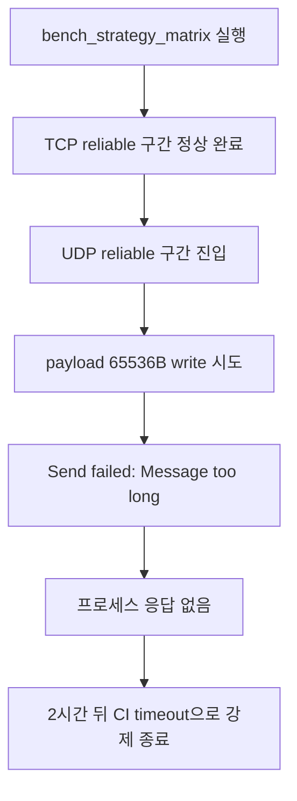
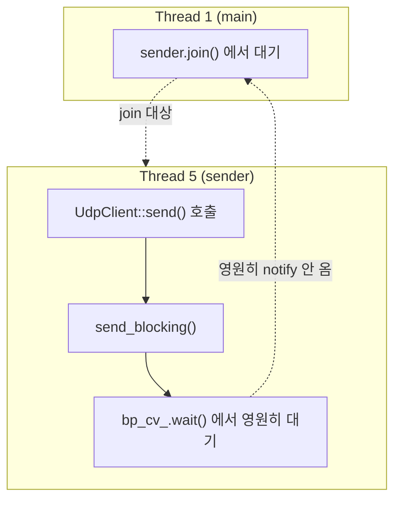
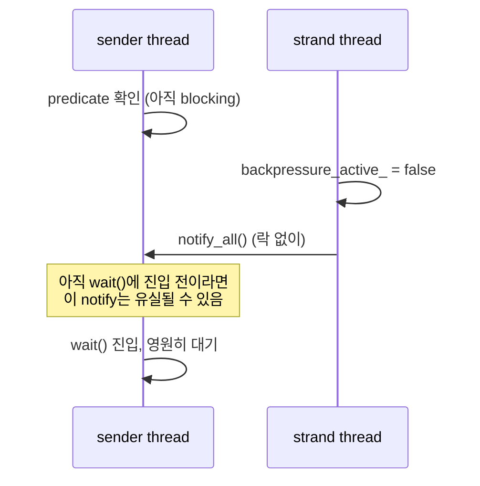
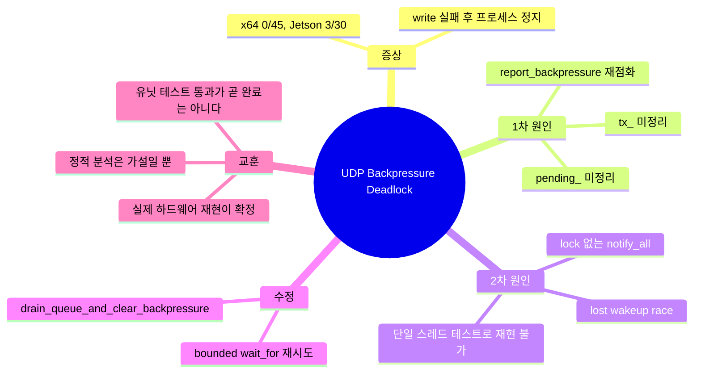

## 도입: 벤치마크가 우연히 잡아낸 문제

[[unilink] backpressure 설계](/blog/2026-06-03-unilink-backpressure-설계)에서 unilink는 송신 queue가 압박을 받을 때 `Reliable`과 `BestEffort`라는 두 가지 전략으로 대응한다고 정리했다.

이번 글은 그 설계가 실제로 어디서 깨졌는지에 대한 이야기다.

TCP_NODELAY 관련 수정을 검증하려고 벤치마크를 돌리는 중이었다. UDP 구간에서 payload 65536바이트 전송이 `Message too long`으로 실패하는 것 자체는 예상된 동작이었다 — UDP datagram 한계(약 65507바이트)를 넘는 값이니 당연하다. 문제는 그 다음이었다. 벤치마크 프로세스가 그 자리에서 그대로 멈췄고, GitHub Actions의 2시간 job timeout에 걸려서야 강제 종료됐다.



## 증상: 어디서, 얼마나 자주 멈췄나

로컬(x64)에서 같은 조건으로 반복 실행해보면 정상적으로 끝났다. 45번을 돌려도 한 번도 멈추지 않았다. 반면 실제 Jetson Orin Nano Super 러너에서는 30번 중 3번꼴로 멈췄다.

이 비대칭이 중요한 단서였다. x64에서 재현이 안 된다는 건 결정적인 로직 버그가 아니라 타이밍에 의존하는 레이스일 가능성이 높다는 뜻이었다.

## 1차 정적 분석: 그럴듯한 후보들

코드를 먼저 읽었다. `UdpChannel::is_connected()`가 `LinkState::Error`로 전이돼도 `connected_` 플래그를 갱신하지 않는다는 것부터 확인했다. 실제로 버그이긴 했지만, 이후 write 시도는 `async_write_copy`에서 상태를 별도로 체크하기 때문에 이 문제 하나만으로 멈춰서는 이유가 설명되지 않았다.

재연결 로직도 의심했다 — UDP 쪽에 재시도 타이머가 있다면 io_context를 계속 붙잡고 있을 수 있으니까. 하지만 UDP transport에는 애초에 그런 코드가 없었다.

정적 분석만으로는 확신이 서지 않았다. 다음 단계는 실제로 멈추는 순간을 붙잡는 것이었다.

## 실제로 재현하기: 확률적 버그를 잡는 법

이 세션(샌드박스)에서는 Jetson으로 직접 SSH가 안 됐다 — 네트워크 자체가 격리돼 있었다. 그래서 재현/디버깅 스크립트를 만들어서 실제 머신에서 직접 돌려달라고 부탁했다.

```bash
for i in $(seq 1 30); do
  ./bin/bench_strategy_matrix --payload-size 65536 --duration 1 &
  PID=$!
  # 20초 안에 안 끝나면 hang으로 간주하고 gdb로 스레드 덤프
  ...
done
```

30번 중 3번, hang이 재현됐다. 이제 gdb로 그 순간의 스레드 상태를 볼 차례였다.


첫 시도에서는 `gdb -p <pid>`가 `Could not attach to process`로 실패했다. Jetson의 `yama/ptrace_scope` 보안 설정 때문이었다. 시스템 설정을 영구적으로 바꾸는 대신 `sudo gdb`로 우회했다.

## gdb 스레드 덤프로 데드락 확정

덤프를 받아보니 그림이 명확했다.



- Thread 1(메인)은 `strategy_matrix.cpp`의 `sender.join()`에서 멈춰 있었다.
- Thread 5(sender)는 `UdpClient::Impl::send_blocking()`의 `bp_cv_.wait()` 안에서 멈춰 있었다.

sender 스레드는 backpressure가 풀리기를 기다리고 있고, 메인 스레드는 그 sender 스레드가 끝나기를 기다리고 있었다. 서로가 서로를 기다리는 전형적인 데드락이었다.

## 1차 수정과 그 실패

`do_write()`의 에러 처리 분기를 보니, write가 실패해서 `LinkState::Error`로 전이될 때 `tx_` queue와 `backpressure_active_` 상태를 정리하지 않고 그냥 리턴하고 있었다. "이미 에러 상태"일 때 처리하는 분기는 있었지만, 그 분기는 `do_write()`가 다시 호출돼야만 실행되는데, 에러가 난 뒤로는 아무도 `do_write()`를 다시 부르지 않았다.

```cpp
if (ec) {
  UNILINK_LOG_ERROR("udp", "write", ...);
  transition_to(LinkState::Error, ec);
  writing_ = false;
  // tx_, backpressure_active_ 정리 없이 그냥 리턴
  return;
}
```

여기에 정리 로직을 추가하고, 로컬에서 결정적으로 재현하는 유닛 테스트도 만들어서 검증했다. 테스트는 통과했다. 하지만 실제 Jetson에서 다시 100번을 돌려보니 — 여전히 2번 멈췄다.

## 진짜 원인: 놓친 게 하나 더 있었다

같은 방식으로 gdb 덤프를 다시 받아보니 정확히 같은 자리에서 멈춰 있었다. 1차 수정이 불완전했다는 뜻이었다.

원인은 두 가지였다.

**첫째**, `Reliable` 전략에서 backpressure가 이미 걸려 있을 때 들어오는 새 전송은 `tx_`가 아니라 `pending_`이라는 별도 overflow queue로 들어간다. 내가 고친 에러 분기는 `tx_`만 비웠고 `pending_`은 그대로 뒀다. `report_backpressure()`는 내부적으로 `pending_`을 `tx_`로 flush하는데, 그 flush만으로도 다시 high watermark를 넘으면 backpressure를 곧바로 재점화한다 — 방금 비웠던 자리에 새 메시지들이 다시 쌓이면서 같은 문제가 재현되는 구조였다.

**둘째**, 이게 진짜 원인에 가까웠다. `bp_cv_.notify_all()`이 `bp_mutex_`를 잡지 않은 채로 호출되고 있었다. `backpressure_active_`는 그냥 atomic bool이라 이 mutex의 보호를 받지 않는다. 조건변수의 대기자가 predicate를 확인하고 실제로 잠드는 그 찰나의 틈에 notify가 발생하면, 그 notify는 그냥 유실된다. 이후 backpressure는 이미 풀렸는데도 대기자는 다시는 오지 않을 신호를 영원히 기다리게 된다.



이건 로컬 유닛 테스트로는 절대 못 잡는 종류의 버그였다. 테스트는 단일 스레드에서 `io_context::poll()`을 수동으로 돌리는 구조라, 실제 스레드 스케줄링에서만 벌어지는 이 좁은 타이밍 레이스가 애초에 발생할 수 없었다.

## 최종 수정

두 가지를 같이 고쳤다.

1. `tx_`와 `pending_`을 함께 비우고 직접 콜백을 호출하는 `drain_queue_and_clear_backpressure()`를 추가했다. `report_backpressure()`의 암묵적인 분기 매칭에 기대지 않고, 이미 존재하던 `perform_stop_cleanup()`의 검증된 패턴을 그대로 따랐다.
2. `send_blocking()` / `send_move()` / `send_shared()`의 무한 `wait()`을 50ms 타임아웃이 있는 `wait_for()` 재시도 루프로 바꿨다. notify를 놓치더라도 최악의 경우 50ms 뒤에 스스로 predicate를 다시 확인하고 회복한다.

```cpp
void wait_for_backpressure_clear(std::unique_lock<std::mutex>& bp_lock) {
  auto predicate = [this] { /* ... */ };
  while (!bp_cv_.wait_for(bp_lock, std::chrono::milliseconds(50), predicate)) {
    // notify를 놓쳤어도 여기서 다시 predicate를 확인한다
  }
}
```

## 회귀 테스트, 그리고 그 한계

두 개의 회귀 테스트를 추가했다 — 하나는 `tx_`에 여러 개가 쌓인 상태, 하나는 `pending_`으로 overflow된 상태에서 에러가 나는 경우를 재현한다. 둘 다 아무 수정도 없는 원본 코드에서는 실패하고, 수정 후에는 통과한다.

다만 정직하게 밝혀야 할 부분이 있다. 이 두 테스트는 `pending_` 정리 수정 하나만 적용해도 통과한다. 즉 진짜 원인이었던 lock 없는 `notify_all()` 문제는 이 테스트들로는 검증되지 않는다. 단일 스레드 테스트 구조로는 애초에 재현할 수 없는 종류의 버그이기 때문이다.

그래서 이 부분의 검증은 결국 실제 Jetson에서 같은 조건으로 다시 100번 돌려보는 것에 의존했다. 유닛 테스트가 초록불이라고 해서 동시성 버그가 다 잡혔다고 믿을 수 없다는 걸 이번에 다시 확인한 셈이다.

## 정리



- 증상은 UDP write 실패 이후 프로세스가 그대로 멈추는 것이었고, x64에서는 재현이 안 되고 Jetson에서만 확률적으로 재현됐다.
- 1차 원인은 에러 처리 분기가 `tx_`와 `pending_` 큐를 제대로 비우지 않는다는 것이었다.
- 하지만 실제로 hang을 반복시킨 진짜 원인은 lock 없이 호출된 `notify_all()`이 만드는 lost wakeup이었다.
- 이 두 번째 원인은 단일 스레드 테스트로는 재현할 수 없어서, 실제 하드웨어에서 반복 재현하는 것이 유일한 검증 수단이었다.

이번 트러블슈팅에서 가장 남는 교훈은 하나다. 정적 분석으로 세운 가설은 출발점일 뿐이고, 확률적으로만 재현되는 버그는 결국 실제 환경에서 충분히 반복해서 재현하고 확정해야 한다는 것. 그리고 수정 후 유닛 테스트가 통과했다고 해서 동시성 버그가 끝났다고 단정하면 안 된다는 것. 특히 조건변수처럼 스레드 간 타이밍에 의존하는 코드는, 그 타이밍이 실제로 존재하는 환경에서 검증하기 전까지는 절반만 고친 것일 수 있다.
