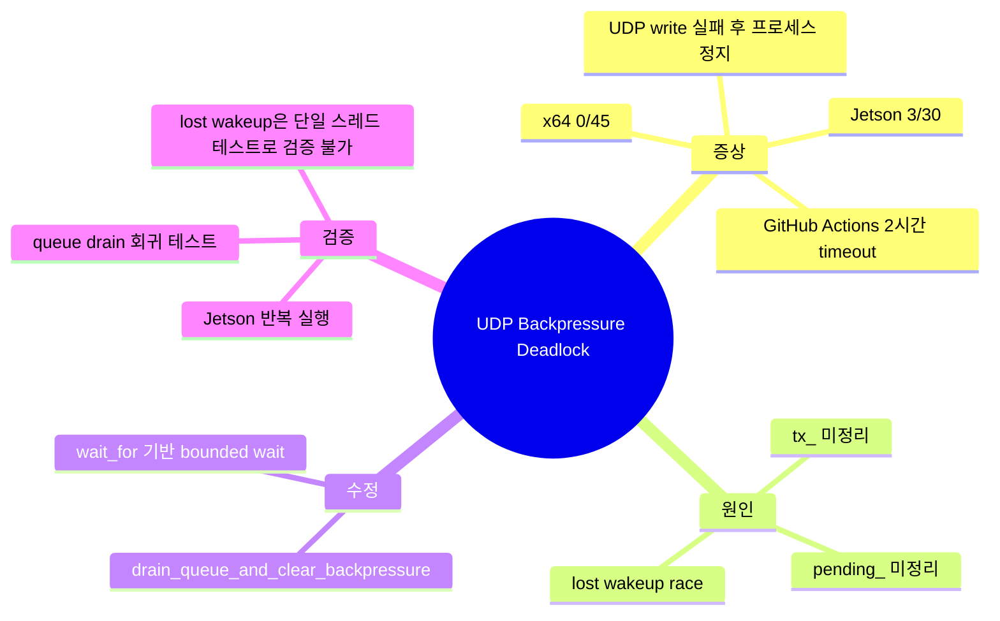
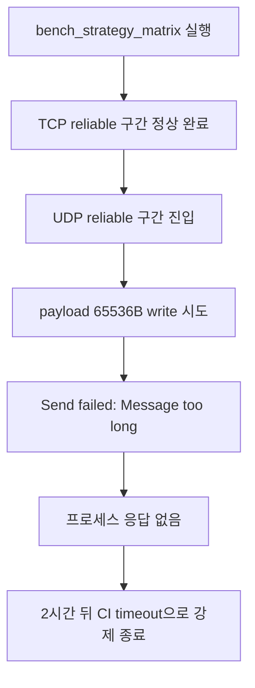
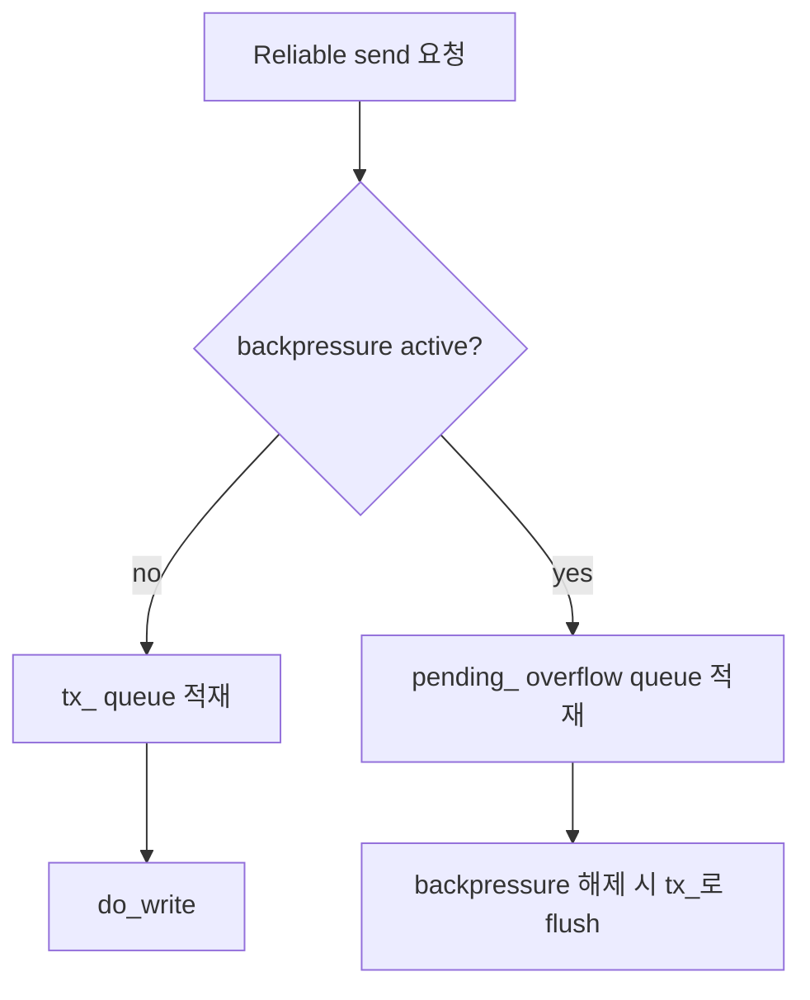
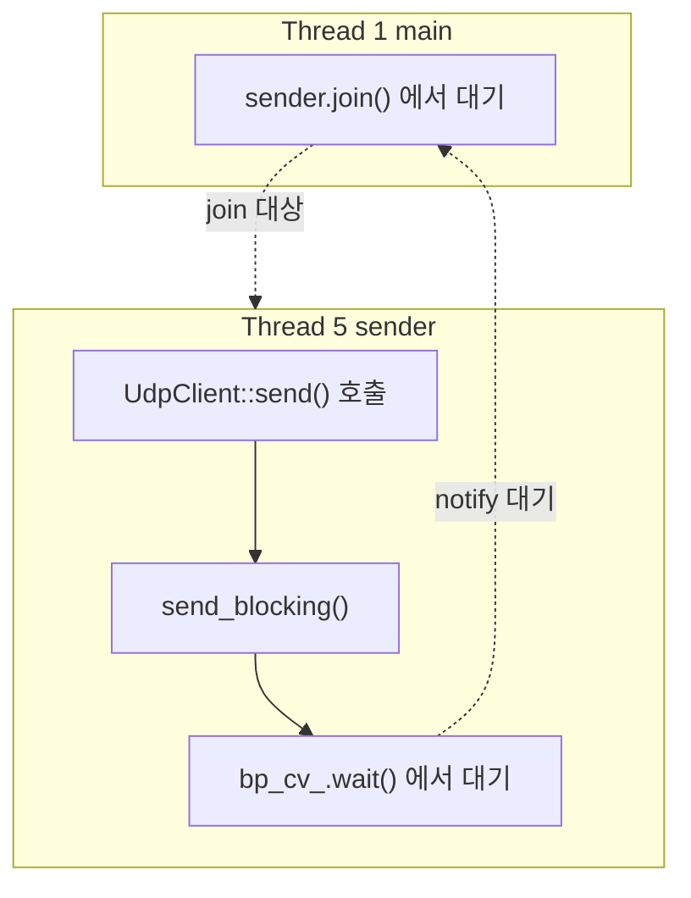
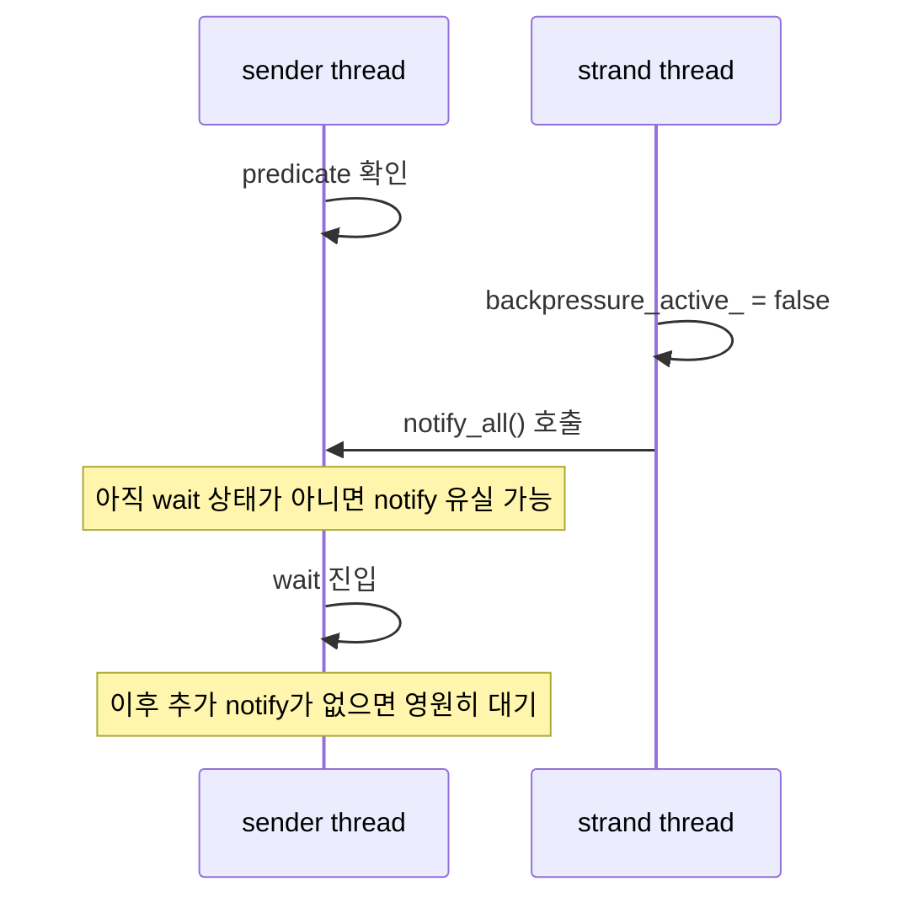

## 도입: UDP write 실패가 아니라, backpressure 해제가 문제

`unilink`의 backpressure 전략은 송신 queue가 압박을 받을 때 `Reliable`과 `BestEffort`로 동작을 나눈다. 이 글은 그 설계가 실제 환경에서 어떻게 깨졌고, 왜 단순한 에러 처리 버그가 아니라 동시성 문제까지 포함하고 있었는지를 정리한 기록이다.

문제는 UDP에서 payload `65536B`를 전송할 때 발생했다. 이 크기는 UDP datagram 한계인 약 `65507B`를 넘기 때문에 `Message too long` 에러가 나는 것 자체는 정상이다. 하지만 실제 문제는 그 다음이었다. write 실패 이후 벤치마크 프로세스가 종료되지 않고 멈췄고, GitHub Actions에서는 2시간 job timeout에 걸려 강제 종료됐다.

핵심 원인은 두 가지였다.

| 구분      | 원인                                                             | 영향                                             |
| --------- | ---------------------------------------------------------------- | ------------------------------------------------ |
| 1차 원인  | UDP write 실패 시 `tx_`와 `pending_` queue를 완전히 비우지 않음  | backpressure 상태가 재점화되거나 해제되지 않음   |
| 2차 원인  | `bp_cv_.notify_all()`이 조건변수와 동일한 mutex 규율 없이 호출됨 | lost wakeup으로 sender thread가 영원히 대기 가능 |
| 최종 대응 | queue drain 전용 함수 추가 + `wait_for()` 기반 bounded wait 도입 | notify 유실에도 최대 50ms 뒤 상태 재확인 가능    |

결론부터 말하면, 이 버그는 단순히 “UDP payload가 너무 커서 실패했다”가 아니었다. 실패 이후 backpressure 상태를 안전하게 정리하지 못했고, 그 상태를 기다리는 thread가 조건변수 notify를 놓칠 수 있는 구조였다.



## 증상: UDP 실패 후 프로세스가 종료되지 않았다

문제는 `bench_strategy_matrix` 실행 중 발견됐다. TCP reliable 구간은 정상 종료됐고, UDP reliable 구간에서 payload `65536B` write를 시도하면서 `Message too long`이 발생했다.

여기까지는 예상된 동작이다. 하지만 그 뒤 프로세스가 종료되지 않았다.



재현 양상도 특이했다.

| 환경                   | 반복 결과            |
| ---------------------- | -------------------- |
| 로컬 x64               | 45회 반복, hang 없음 |
| Jetson Orin Nano Super | 30회 중 3회 hang     |

x64에서 재현되지 않고 Jetson에서만 확률적으로 재현된다는 점은 중요한 단서였다. 결정적인 로직 버그라면 어느 환경에서든 비교적 안정적으로 재현됐을 가능성이 높다. 반면 특정 하드웨어에서만 확률적으로 멈춘다면 thread scheduling, timing, condition variable 같은 동시성 문제가 개입했을 가능성이 높다.

## 원인 1: write 실패 후 `tx_`와 `pending_`이 완전히 정리되지 않았다

첫 번째 문제는 UDP write 실패 분기에 있었다.

```cpp
if (ec) {
  UNILINK_LOG_ERROR("udp", "write", ...);
  transition_to(LinkState::Error, ec);
  writing_ = false;
  // tx_, pending_, backpressure_active_ 정리 없이 return
  return;
}
```

write가 실패해서 `LinkState::Error`로 전이되는데, 송신 queue와 backpressure 상태를 정리하지 않고 그대로 빠져나가고 있었다.

처음에는 `tx_`만 정리하면 충분하다고 판단했다. 하지만 `Reliable` 전략에서는 backpressure가 이미 걸려 있을 때 새 전송 요청이 `tx_`가 아니라 `pending_`이라는 overflow queue에 쌓인다.

즉, 실제 구조는 이랬다.



1차 수정은 `tx_`만 비웠다. 그러나 `pending_`이 남아 있으면 backpressure 해제 과정에서 `pending_`이 다시 `tx_`로 flush될 수 있다. 그 결과 방금 정리한 queue가 다시 차고, high watermark를 넘으면서 backpressure가 재점화될 수 있었다.

따라서 에러 상태에서는 `tx_`와 `pending_`을 모두 비우고, 대기 중인 callback까지 명시적으로 처리해야 했다.

## 원인 2: 조건변수 notify를 놓치는 lost wakeup 가능성이 있었다

두 번째 문제가 실제 hang에 더 가까웠다.

sender thread는 backpressure가 풀리기를 기다리고 있었다.



gdb 덤프를 보면 main thread는 `sender.join()`에서 기다리고 있었고, sender thread는 `send_blocking()` 내부의 `bp_cv_.wait()`에서 멈춰 있었다.

문제는 `bp_cv_.notify_all()` 호출 방식이었다. `backpressure_active_`는 atomic bool이고, notify는 `bp_mutex_`를 잡지 않은 상태에서 호출되고 있었다. 이 구조에서는 waiter가 predicate를 확인하고 실제 wait 상태로 들어가기 직전의 짧은 틈에 notify가 발생할 수 있다. 그러면 notify는 유실되고, waiter는 이미 풀린 backpressure를 다시 확인하지 못한 채 영원히 잠들 수 있다.



이 문제는 로컬 유닛 테스트로는 잡히기 어렵다. 테스트가 단일 스레드에서 `io_context::poll()`을 수동으로 돌리는 구조라면, 실제 thread scheduling에서만 발생하는 좁은 race window가 열리지 않는다.

## 최종 수정: queue drain과 bounded wait를 함께 적용했다

최종 수정은 두 축으로 진행했다.

첫째, 에러 발생 시 `tx_`와 `pending_`을 함께 비우는 전용 정리 함수를 추가했다. 기존 `report_backpressure()` 흐름에 기대지 않고, 이미 존재하던 `perform_stop_cleanup()`의 패턴을 따라 명시적으로 queue와 callback을 정리했다.

```cpp
drain_queue_and_clear_backpressure();
```

이 함수의 목적은 단순하다.

- `tx_`를 비운다.
- `pending_`도 비운다.
- 대기 중인 callback을 실패 상태로 완료시킨다.
- backpressure 상태를 명시적으로 해제한다.
- 대기 중인 sender thread가 깨어날 수 있도록 notify한다.

둘째, `send_blocking()`, `send_move()`, `send_shared()`의 무한 wait를 `wait_for()` 기반 재시도 루프로 바꿨다.

```cpp
void wait_for_backpressure_clear(std::unique_lock<std::mutex>& bp_lock) {
  auto predicate = [this] {
    // backpressure가 해제됐거나,
    // channel이 종료/에러 상태인지 확인
  };

  while (!bp_cv_.wait_for(bp_lock, std::chrono::milliseconds(50), predicate)) {
    // notify를 놓쳤더라도 최대 50ms 뒤 predicate를 다시 확인한다
  }
}
```

이 수정의 의미는 크다. 이제 notify를 놓치더라도 sender thread가 영원히 잠들지 않는다. 최악의 경우 50ms 뒤 스스로 상태를 다시 확인하고 빠져나올 수 있다.

## 검증: 유닛 테스트는 일부만 증명했고, 실제 검증은 Jetson 반복 실행이었다

회귀 테스트는 두 개를 추가했다.

| 테스트                                  | 검증 내용                                          |
| --------------------------------------- | -------------------------------------------------- |
| `tx_` 누적 상태에서 write 실패          | 에러 발생 시 기본 송신 queue가 정리되는지 확인     |
| `pending_` overflow 상태에서 write 실패 | backpressure 중 overflow queue까지 정리되는지 확인 |

두 테스트는 원본 코드에서는 실패하고, 수정 후에는 통과했다.

하지만 이 테스트들이 모든 문제를 증명하지는 않는다. 특히 lost wakeup 문제는 단일 스레드 테스트 구조로 재현할 수 없다. `pending_` 정리 수정만 적용해도 회귀 테스트는 통과할 수 있다. 즉, 테스트는 queue drain 문제를 검증하지만, 조건변수 race 자체를 직접 검증하지는 못한다.

그래서 최종 검증은 실제 Jetson 환경에서 같은 조건으로 반복 실행하는 방식에 의존했다. 이 지점이 이번 이슈의 핵심이다. 동시성 버그는 유닛 테스트가 초록색이라고 해서 끝난 것이 아니다. 실제 scheduling이 발생하는 환경에서 반복 재현과 반복 검증이 필요하다.

## 디버깅 과정: 정적 분석만으로는 확정할 수 없었다

정적 분석 단계에서 몇 가지 후보를 먼저 확인했다.

`UdpChannel::is_connected()`가 `LinkState::Error`로 전이돼도 `connected_` 플래그를 갱신하지 않는 문제가 있었다. 실제 버그이긴 했지만, `async_write_copy()`에서 상태를 별도로 확인하고 있었기 때문에 이것만으로 hang을 설명하기는 어려웠다.

재연결 타이머도 의심했다. UDP transport 쪽에 retry timer가 있고, 그 timer가 `io_context`를 계속 붙잡고 있다면 프로세스가 종료되지 않을 수 있기 때문이다. 하지만 UDP transport에는 해당 재연결 로직이 없었다.

결국 정적 분석은 가설을 줄이는 데는 도움이 됐지만, 확정은 하지 못했다. 결정적인 근거는 hang 순간의 thread dump였다.

샌드박스에서는 Jetson에 직접 SSH 접근이 불가능했기 때문에, 실제 장비에서 반복 실행할 수 있는 재현 스크립트를 따로 만들었다.

```bash
for i in $(seq 1 30); do
  ./bin/bench_strategy_matrix --payload-size 65536 --duration 1 &
  PID=$!

  # 20초 안에 종료되지 않으면 hang으로 판단
  # gdb attach 후 thread dump 수집
done
```

처음에는 `gdb -p <pid>`가 실패했다. Jetson의 `yama/ptrace_scope` 보안 설정 때문이었다. 시스템 설정을 영구 변경하는 대신 `sudo gdb`로 우회해서 thread dump를 확보했다.

그 결과 main thread는 `sender.join()`에서, sender thread는 `bp_cv_.wait()`에서 멈춰 있음이 확인됐다. 이 덤프가 없었다면 queue 정리 문제까지만 고치고, lost wakeup 가능성은 놓쳤을 가능성이 높다.

## 정리: 이번 문제에서 얻은 기준

이번 문제는 UDP payload limit 자체가 원인이 아니었다. UDP write 실패는 정상적인 에러였고, 진짜 문제는 실패 이후 backpressure 상태를 안전하게 정리하지 못한 데 있었다.

정리하면 다음과 같다.

- UDP `65536B` write 실패는 예상된 동작이었다.
- 문제는 write 실패 이후 `tx_`와 `pending_` queue가 완전히 정리되지 않은 것이다.
- `Reliable` 전략에서는 backpressure 중 새 메시지가 `pending_`에 들어가기 때문에 `tx_`만 비워서는 부족했다.
- `notify_all()`이 조건변수와 같은 mutex 규율 없이 호출되면서 lost wakeup 가능성이 있었다.
- 단일 스레드 유닛 테스트는 queue drain 문제는 검증할 수 있었지만, lost wakeup race는 검증하지 못했다.
- 실제 Jetson 환경에서 반복 실행하고 gdb thread dump를 확보한 것이 원인 확정에 결정적이었다.

이번 이슈에서 남는 교훈은 명확하다. 정적 분석은 가설을 세우는 도구일 뿐이고, 확률적으로 재현되는 동시성 버그는 실제 환경에서 반복 재현해야 한다. 특히 condition variable, atomic flag, strand thread, blocking send가 섞이는 구조에서는 “테스트 통과”와 “동시성 안전”을 같은 의미로 보면 안 된다.
