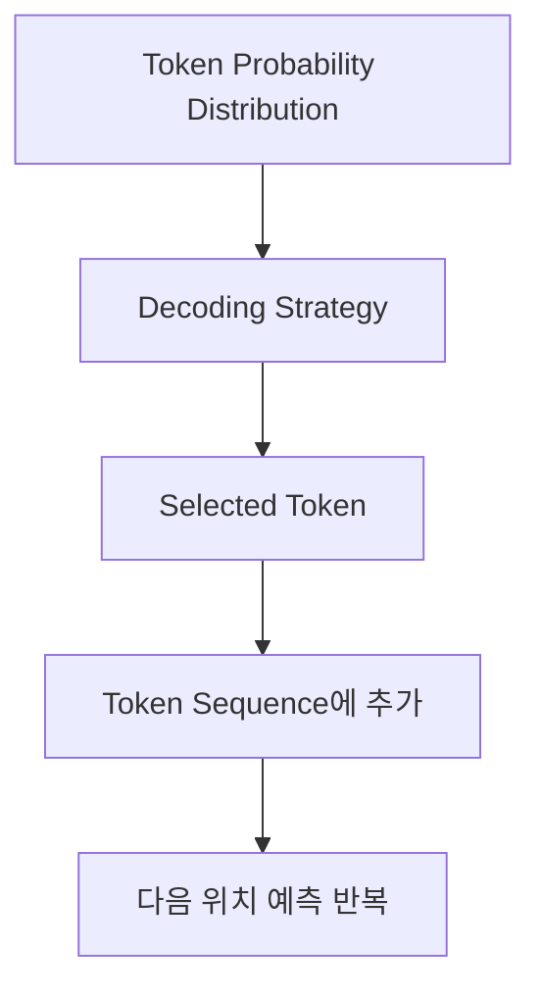
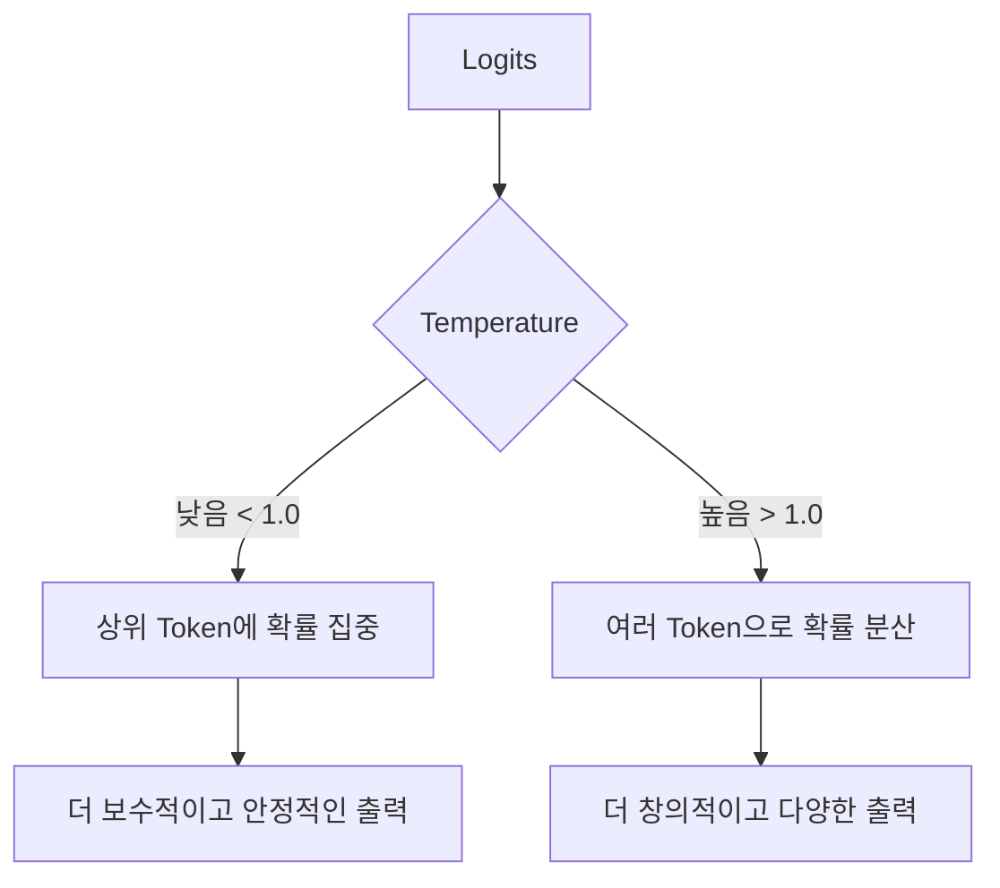
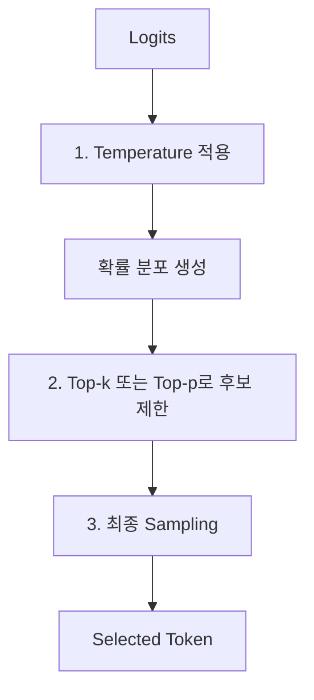
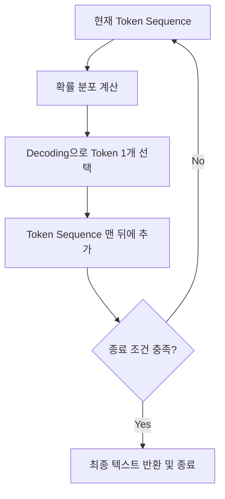

## 도입: 확률 분포만으로는 문장이 생성되지 않는다

LLM은 현재까지의 token sequence를 보고 다음 token 후보들의 확률 분포를 만든다.

예를 들어 입력이 다음과 같다고 하자.

> "나는 커피를"

모델은 Vocabulary 전체 token에 대해 다음과 같은 확률 분포를 만들 수 있다.

| Token    | Probability (확률) |
| :------- | :----------------- |
| 마셨다   | 0.60               |
| 좋아한다 | 0.20               |
| 샀다     | 0.15               |
| 내렸다   | 0.03               |
| .        | 0.02               |

하지만 확률 분포만으로는 실제 문장이 완성되지 않는다. 이 수많은 후보 중에서 출력으로 내보낼 최종 token 하나를 선택해야 한다.

> **확률 분포:** 마셨다(0.60), 좋아한다(0.20), 샀다(0.15) ...
> **선택된 token:** 마셨다

이처럼 계산된 확률 분포에서 실제 출력할 token을 선택하는 과정을 **Decoding**(디코딩)이라고 한다.

---

## 이 글에서 다루는 범위

이 글은 LLM이 계산해 낸 '다음 token 확률 분포'를 기준으로, 실제 token을 선택하는 추론 전략을 정리한다.

**[ 다루는 내용 ]**

- Greedy Decoding
- Sampling
- Temperature
- Top-k Sampling
- Top-p Sampling
- Penalty 기반 Logit 조정
- Stop Sequence와 종료 조건

명심해야 할 점은, **Decoding은 모델을 학습(Training)시키는 과정이 아니다.** 이미 학습이 완료된 모델이 내뱉은 확률 분포 안에서, 어떤 방식으로 다음 token을 고를지 결정하는 **추론 단계의 선택 전략**이다.

---

## 전체 흐름

Decoding은 Softmax 연산 직후에 일어난다.

조금 더 세분화하여 이전 단계와 연결하면 다음과 같다.

> **Logits $\rightarrow$ Softmax $\rightarrow$ Token Probability Distribution $\rightarrow$ Decoding Strategy $\rightarrow$ Selected Token**

이 글의 핵심은 다음 질문에 답하는 것이다.

> "확률이 계산된 여러 token 후보 중에서, 과연 어떤 기준으로 실제 token 하나를 선택할 것인가?"

---

## Decoding이란 무엇인가

Decoding은 token 확률 분포에서 실제 출력할 token을 선택하는 과정이다. 앞선 예시의 확률 분포에서 token을 선택하는 방법은 단 하나가 아니다.

- 항상 **가장 높은 확률**의 token을 고를 수 있다.
- 확률에 따라 무작위(Random)로 뽑을 수 있다.
- 낮은 확률의 token을 아예 **후보에서 제외**할 수 있다.
- 확률 분포를 더 **날카롭게** 혹은 **평평하게** 조작할 수 있다.

이 선택 방식에 따라 LLM의 출력은 항상 똑같고 안정적일 수도 있고, 매번 새롭고 창의적일 수도 있다.

---

## Greedy Decoding

가장 단순한 방식은 무조건 가장 확률이 높은 token을 선택하는 것이다. 이를 Greedy Decoding(탐욕적 탐색)이라고 한다.

> **Greedy Decoding:** 가장 높은 확률을 가진 token을 1순위로 확정하여 선택한다.

| Token      | Probability | 선택 여부      |
| ---------- | ----------- | -------------- |
| **마셨다** | **0.60**    | **선택 (1위)** |
| 좋아한다   | 0.20        | 제외           |
| 샀다       | 0.15        | 제외           |

**[ Greedy 방식의 특징 ]**

| 항목       | 특징                                                                  |
| ---------- | --------------------------------------------------------------------- |
| **안정성** | 높음                                                                  |
| **다양성** | 낮음                                                                  |
| **재현성** | 높음                                                                  |
| **단점**   | 출력이 단조롭거나 국소적으로 최적인 선택(Local Optima)에 갇힐 수 있음 |

Greedy decoding은 기술문서 요약, 코드 설명, 구조화된 데이터 추출처럼 **일관성이 중요한 작업**에 적합하다. 다만 항상 1순위의 token만 고르기 때문에 다채로운 표현을 만들어내기는 어렵다.

---

## Sampling

Sampling(샘플링)은 확률 분포에 따라 주사위를 굴리듯 무작위로 token을 선택하는 방식이다.

> **Sampling:** 확률이 높은 token이 더 자주 선택되지만, 무조건 1등만 뽑히지는 않는다. 2위나 3위 token이 뽑힐 수도 있다.

| Token    | Probability | 선택 가능성      |
| -------- | ----------- | ---------------- |
| 마셨다   | 0.60        | 가장 자주 선택됨 |
| 좋아한다 | 0.20        | 종종 선택됨      |
| 샀다     | 0.15        | 가끔 선택됨      |

Sampling은 출력에 **다양성**을 부여한다. 똑같은 Prompt를 넣어도 매번 답변이 미묘하게 달라지는 이유가 바로 이 Sampling 덕분이다.

| 항목            | 특징                                                     |
| --------------- | -------------------------------------------------------- |
| **안정성**      | Greedy보다 낮음                                          |
| **다양성**      | 높음                                                     |
| **재현성**      | 낮음                                                     |
| **적합한 작업** | 창작, 아이디어 브레인스토밍, 표현의 다양성이 필요한 챗봇 |

단, 순수 Sampling만 사용하면 낮은 확률의 엉뚱한 token이 선택되어 문맥을 망칠 위험이 있다. 따라서 실무에서는 이를 보완하기 위해 **Temperature, Top-k, Top-p** 같은 제어 장치를 함께 엮어 사용한다.

---

## Temperature

Temperature(온도)는 Softmax 함수에 개입하여 확률 분포의 '날카로움'을 조절하는 파라미터다.

$$ \text{softmax}(\text{logits} / \text{temperature}) $$

Temperature가 낮으면 높은 logit을 가진 token에 확률이 더 뾰족하게 집중되고, 반대로 높으면 하위권 token들에게 확률이 넓게 분산된다.

### Temperature가 낮은 경우

Temperature가 1보다 작으면 확률 분포가 훨씬 날카로워진다.

- 높은 확률 token이 더 강하게 선택됨
- 출력이 결정적(Deterministic)으로 변함
- 다양성은 줄어듦

| Token      | 원래 확률 | **낮은 Temp 적용 후** |
| ---------- | --------- | --------------------- |
| **마셨다** | 0.60      | **0.82** (집중)       |
| 좋아한다   | 0.20      | 0.10                  |
| 샀다       | 0.15      | 0.07                  |

기술 문서 QA, 코드 디버깅, 장애 분석처럼 **정확성과 안정성**이 생명일 때는 낮은 temperature가 적합하다.

### Temperature가 높은 경우

Temperature가 1보다 크면 확률 분포가 둥글고 평평해진다.

- 낮은 확률 token도 선택될 가능성이 커짐
- 출력 다양성이 크게 증가함
- 산만하거나 부정확한 출력이 나올 위험도 증가함

| Token      | 원래 확률 | **높은 Temp 적용 후** |
| ---------- | --------- | --------------------- |
| **마셨다** | 0.60      | **0.42** (감소)       |
| 좋아한다   | 0.20      | 0.24 (증가)           |
| 샀다       | 0.15      | 0.20 (증가)           |

아이디어 생성, 창작 문장 쓰기 등 **새로운 표현과 영감**이 필요할 때는 높은 temperature를 사용할 수 있다.

### Temperature 0에 대한 주의

일부 API나 도구에서는 `Temperature = 0`을 가장 결정적인 세팅으로 사용한다. 수식 그대로 보면 0으로 나누는 것은 정의되지 않으므로, 실제 구현부에서는 무작위성을 배제하고 **Greedy Decoding**에 가깝게 동작하도록 예외 처리되어 있다.

- Temperature가 낮을수록 Greedy에 가까워진다.
- Temperature가 높을수록 Sampling의 무작위성이 커진다.

---

## Top-k Sampling

**Top-k**는 확률이 높은 상위 $k$개의 token만 후보로 남기고, 나머지는 단호하게 잘라내는 필터링 방식이다.

> **Top-k:** 1등부터 $k$등까지만 본선에 진출시킨다. 나머지는 확률을 0으로 만들어 제외한다.

예를 들어 $k = 3$이면 상위 3개 token만 남는다.

| Token    | Probability | 상태      |
| -------- | ----------- | --------- |
| 마셨다   | 0.60        | **유지**  |
| 좋아한다 | 0.20        | **유지**  |
| 샀다     | 0.15        | **유지**  |
| 내렸다   | 0.03        | 제외 (0%) |
| .        | 0.02        | 제외 (0%) |

남은 3개의 후보 안에서만 다시 확률의 합이 100%가 되도록 조정한 뒤 Sampling을 진행한다.

| $k$ 값   | 특징                                                      |
| -------- | --------------------------------------------------------- |
| **작음** | 안정적이지만 다양성이 낮음 (1이면 Greedy와 동일)          |
| **큼**   | 다양성은 증가하지만, 품질 낮은 엉뚱한 후보가 섞일 수 있음 |

Top-k는 문맥을 해치는 치명적인 오답을 차단하는 데 유용하다. 다만, 확률 분포의 형태와 관계없이 **무조건 고정된 개수**만 남기기 때문에 때로는 융통성이 떨어질 수 있다.

---

## Top-p Sampling (Nucleus Sampling)

**Top-p**는 등수(개수)가 아니라 '누적 확률'이 $p$에 도달할 때까지 후보를 남기는 방식이다.

> **Top-p:** 확률이 높은 순서대로 더해 나가다가, 누적 합이 $p$에 도달하는 순간 후보 풀(Pool)을 닫는다.

예를 들어 **$p = 0.90$** (누적 확률 90%)이라고 하자.

| Token    | Probability | **누적 확률** | 상태               |
| -------- | ----------- | ------------- | ------------------ |
| 마셨다   | 0.50        | 0.50          | **유지**           |
| 좋아한다 | 0.25        | 0.75          | **유지**           |
| 샀다     | 0.10        | 0.85          | **유지**           |
| 내렸다   | 0.05        | **0.90**      | **유지 (Cut-off)** |
| .        | 0.03        | 0.93          | 제외               |

Top-p는 확률 분포의 모양에 따라 후보 개수가 유동적으로 변한다.

- 1위 확률이 압도적이면 후보 수가 1~2개로 적어진다.
- 확률이 여러 token에 팽팽하게 분산되어 있다면 후보 수가 10개 이상으로 늘어난다.

| 방식      | 컷오프 기준               | 후보 수                  |
| --------- | ------------------------- | ------------------------ |
| **Top-k** | 상위 $k$개 token          | **고정됨**               |
| **Top-p** | 누적 확률 $p$까지의 token | **분포에 따라 유동적임** |

Top-p는 문맥 상황에 맞춰 유연하게 대처하므로 최신 자연어 생성 모델에서 널리 쓰인다.

---

## Temperature, Top-k, Top-p의 관계

이 세 가지 파라미터는 모두 Sampling의 다양성을 조절하지만 톱니바퀴처럼 서로 다른 역할을 맡고 있다.

| 설정            | 역할                                    |
| --------------- | --------------------------------------- |
| **Temperature** | 확률 분포 자체의 날카로움/평평함 조절   |
| **Top-k**       | 갯수를 기준으로 하위 후보를 잘라냄      |
| **Top-p**       | 누적 확률을 기준으로 하위 후보를 잘라냄 |

일반적인 파이프라인 흐름은 다음과 같다.

**[ 목적에 따른 세팅 방향 ]**

- **안정적인 답변이 필요할 때:** 낮은 Temperature, 작은 Top-p 또는 제한적인 Top-k.
- **다양하고 창의적인 답변이 필요할 때:** 높은 Temperature, 넓은 Top-p.

특정 숫자 값 자체에 집착하기보다는 "이 파라미터가 전체 분포에 어떤 영향을 주는가"를 이해하는 편이 더 중요하다.

---

## Repetition, Frequency, Presence Penalty

Decoding 단계에서는 모델이 똑같은 말을 앵무새처럼 반복하는 현상을 억제하기 위해 Logit 점수를 강제로 깎는 페널티 기법을 쓰기도 한다.

- 이미 등장한 단어에 대한 선택 가능성을 낮춘다.
- 완전히 새로운 표현이 나올 가능성을 높인다.

### Repetition Penalty

연속된 텍스트 내에서 같은 token이 반복적으로 선택되는 것을 직접적으로 억제한다.

> "나는 커피를 마셨다. 커피를 마셨다." 같은 기계적인 루프를 방지한다.

### Frequency Penalty

특정 token이 **등장한 횟수**에 비례하여 점수를 깎는다.
특정 단어("매우", "진짜" 등)를 남용하여 문장이 지루해지는 것을 막아준다.

### Presence Penalty

등장 횟수와 상관없이 특정 token이 한 번이라도 등장했는지(여부)를 따져 점수를 깎는다.
모델이 이전에 하던 이야기를 멈추고 새로운 화제나 단어를 꺼내도록 유도할 때 효과적이다.

| Penalty                | 기준                | 효과                              |
| ---------------------- | ------------------- | --------------------------------- |
| **Repetition Penalty** | 연속된 문맥 내 반복 | 기계적인 동일 구문 반복 억제      |
| **Frequency Penalty**  | 등장 횟수 비례      | 특정 단어의 과도한 쏠림/남용 방지 |
| **Presence Penalty**   | 등장 여부 (0 or 1)  | 새로운 토픽과 단어로의 전환 유도  |

---

## Stop Sequence와 종료 조건

Decoding은 token을 딱 하나 고르고 끝나는 단발성 과정이 아니다. 선택된 token을 기존 Sequence 뒤에 이어 붙이고, 다시 다음 token을 예측하는 무한 루프다.

이 루프는 **종료 조건**을 만날 때 비로소 멈춘다.

**[ 대표적인 종료 조건 ]**

- **EOS Token 선택:** 모델이 문맥상 문장이 끝났다고 판단해 마침표 격인 `[EOS]` (End Of Sequence) 토큰을 스스로 생성했을 때.
- **최대 출력 길이 도달:** 사전에 설정해 둔 Max Tokens 한계치에 다다랐을 때.
- **Stop Sequence 감지:** `\n\nUser:` 처럼 사용자가 지정한 특정 패턴이 출력될 조짐이 보이면 즉시 시스템이 컷오프(Cut-off) 할 때.

---

## 같은 질문에 다른 답변이 나오는 이유

챗GPT에게 동일한 Prompt를 넣었는데 어제와 오늘의 답변이 달라지는 이유는 바로 이 Decoding 설정과 관련이 있다.

Greedy 방식으로 세팅하면 1순위만 쫓아가므로 늘 비슷한 대답이 나온다. 하지만 기본적으로 LLM은 일정 수준의 Temperature와 Sampling이 활성화되어 있으므로, 매 턴마다 확률의 주사위를 굴리며 다른 갈래의 token을 뻗어 나갈 가능성을 품고 있다.

> **같은 Prompt $\rightarrow$ 비슷한 확률 분포 $\rightarrow$ Decoding 주사위에 따라 다른 Token 선택**

즉, LLM이 내뱉는 문장의 생동감과 다양성은 모델의 지식뿐만 아니라 Decoding 설정이 빚어낸 결과물이다.

---

## 작업 유형별 Decoding 설정 방향

수행하려는 태스크에 따라 Decoding 파라미터의 밸런스를 적절히 맞춰주어야 최상의 결과를 얻을 수 있다.

| 작업               | 설정 방향                               |
| ------------------ | --------------------------------------- |
| **기술문서 요약**  | 낮은 Temperature, 안정적 출력 유도      |
| **코드 생성/설명** | 낮은 Randomness, 형식 안정성 최우선     |
| **장애 로그 분석** | 팩트와 근거 중심, 과도한 Sampling 제한  |
| **JSON 출력**      | 극히 낮은 Temperature, 출력 Schema 제약 |
| **브레인스토밍**   | Sampling 허용, 다양한 영감 확보         |
| **창작 글쓰기**    | 높은 Temperature 또는 넓은 Top-p 설정   |
| **후보 문장 생성** | 여러 번 Sampling하여 다채로운 후보 확보 |

---

## Decoding은 학습이 아니다

마지막으로 짚고 넘어가야 할 점은, Decoding 과정에서 **모델의 파라미터(Weight)는 단 1%도 변하지 않는다**는 사실이다.

| 구분          | Training (학습)                      | Decoding (추론)                    |
| ------------- | ------------------------------------ | ---------------------------------- |
| **시점**      | 학습 단계                            | 모델 배포 후 추론 단계             |
| **목적**      | 정답 확률을 높이도록 가중치 업데이트 | 계산된 확률 안에서 다음 token 선택 |
| **입력**      | 방대한 학습 데이터셋                 | 사용자의 Prompt                    |
| **출력**      | Loss 계산 및 Weight 수정             | 화면에 찍힐 실제 Token 문자        |
| **모델 변경** | **있음 (Weight 업데이트)**           | **전혀 없음**                      |

Decoding은 모델을 똑똑하게 만드는 작업이 아니다. 이미 충분히 똑똑해진 모델이 머릿속에 띄운 선택지(확률 분포)를 우리가 **어떤 렌즈로 필터링하여 끄집어낼 것인가**에 대한 전략일 뿐이다.

---

## 요약 및 정리

Decoding은 LLM이 내놓은 Token 확률 분포표에서 실제 화면에 찍힐 Token을 최종 결정하는 과정이다.

> **Token Probability Distribution $\rightarrow$ Decoding Strategy $\rightarrow$ Selected Token**

- **Greedy Decoding:** 무조건 1등만 고른다. 안정적이지만 단조롭다.
- **Sampling:** 확률에 기대어 주사위를 굴린다. 문맥이 다채로워진다.
- **Temperature:** 확률 분포의 날카로움을 조절한다. (낮으면 안정, 높으면 창의)
- **Top-k:** 순위를 기준으로 무조건 상위 $k$개의 후보만 남긴다.
- **Top-p:** 누적 확률 $p$에 도달할 때까지 유동적으로 후보를 남긴다.
- **Penalty:** 앵무새처럼 똑같은 표현을 반복하는 현상을 억제한다.
- **Stop Sequence / EOS:** 텍스트 생성의 브레이크(종료) 역할을 수행한다.

목적에 맞는 완벽한 프롬프트를 짰더라도 Decoding 설정이 어긋나면 원하는 결과물을 얻기 힘들다. 이 설정값들의 원리를 이해하고 조작하는 것이 실무 LLM 활용의 핵심 키(Key)다.

여기까지가 학습이 끝난 모델이 텍스트를 생성하는 과정이다. 그렇다면 모델은 애초에 어떻게 이런 확률 분포를 만들 수 있게 되었을까. 이어지는 [Pretraining과 Fine-tuning](/blog/2026-07-03-llm-training-pretraining과-fine-tuning)에서 학습 과정을 다룬다.
