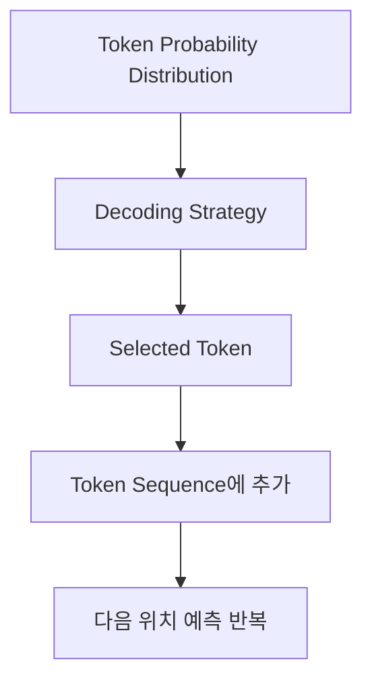
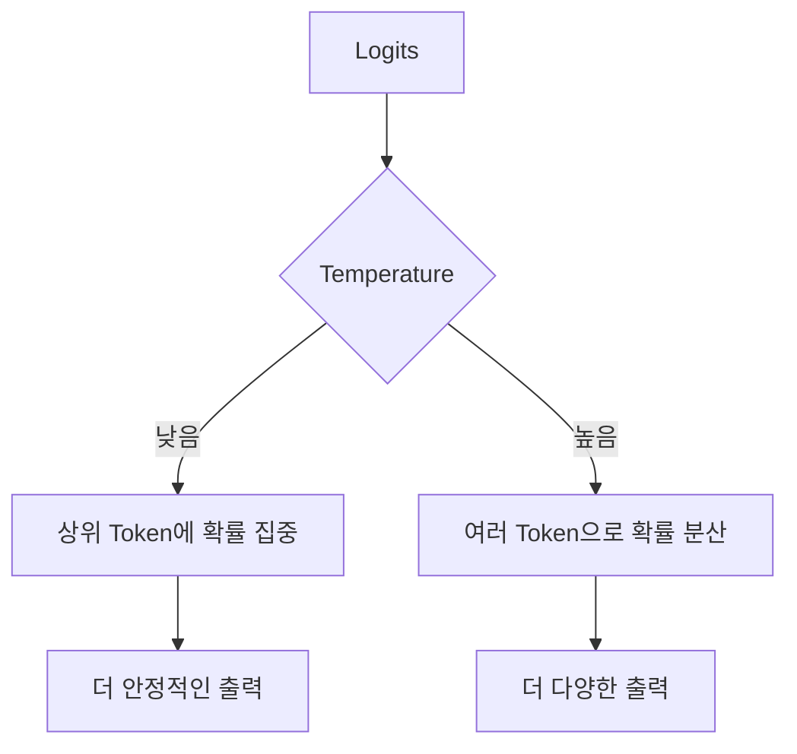
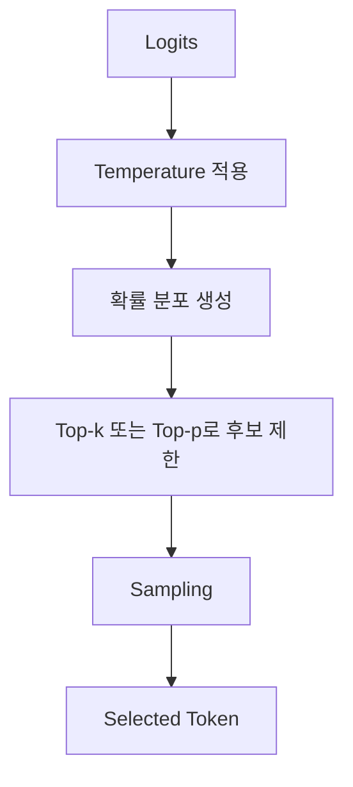
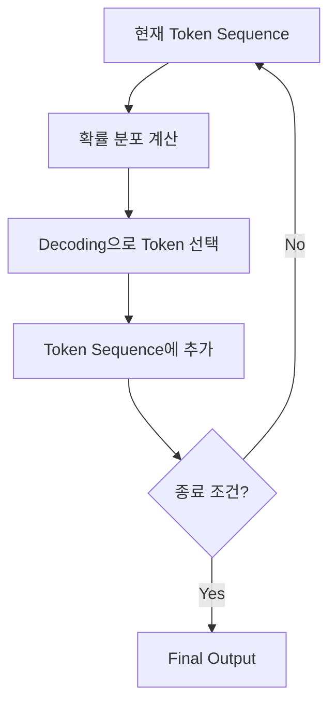

# 도입: 확률 분포만으로는 문장이 생성되지 않는다

LLM은 현재까지의 token sequence를 보고 다음 token 후보들의 확률 분포를 만든다.

예를 들어 입력이 다음과 같다고 하자.

```text id="input-example"
나는 커피를
```

모델은 vocabulary 전체 token에 대해 다음과 같은 확률 분포를 만들 수 있다.

| Token | Probability |
| ----- | ----------: |
| 마셨다   |        0.60 |
| 좋아한다  |        0.20 |
| 샀다    |        0.15 |
| 내렸다   |        0.03 |
| .     |        0.02 |

하지만 확률 분포만으로는 실제 문장이 생성되지 않는다.
출력으로 내보낼 token 하나를 선택해야 한다.

```text id="prob-to-token"
확률 분포:
마셨다 0.60
좋아한다 0.20
샀다 0.15
...

선택된 token:
마셨다
```

이처럼 확률 분포에서 실제 token을 선택하는 과정을 **decoding**이라고 한다.

---

# 이 글에서 보는 범위

이 글은 LLM이 만든 다음 token 확률 분포를 기준으로, 실제 token을 선택하는 전략을 정리한다.

```text id="scope"
다루는 내용:
- Greedy Decoding
- Sampling
- Temperature
- Top-k Sampling
- Top-p Sampling
- Penalty 기반 logit 조정
- Stop Sequence와 종료 조건
```

Decoding은 모델을 학습시키는 과정이 아니다.
이미 학습된 모델이 계산한 확률 분포에서, 어떤 방식으로 다음 token을 고를지 정하는 **추론 단계의 선택 전략**이다.

---

# 전체 흐름

Decoding은 softmax 이후에 일어난다.



조금 더 세분화하면 다음과 같다.

```text id="decoding-flow-text"
Logits
→ Softmax
→ Token Probability Distribution
→ Decoding Strategy
→ Selected Token
```

이 글의 핵심은 다음 질문이다.

```text id="main-question"
확률이 계산된 여러 token 후보 중에서
어떤 기준으로 실제 token 하나를 선택할 것인가?
```

---

# Decoding이란 무엇인가

Decoding은 token 확률 분포에서 실제 출력 token을 선택하는 과정이다.

예를 들어 다음 확률 분포가 있다고 하자.

| Token | Probability |
| ----- | ----------: |
| 마셨다   |        0.60 |
| 좋아한다  |        0.20 |
| 샀다    |        0.15 |
| 내렸다   |        0.03 |
| .     |        0.02 |

이 분포에서 token을 선택하는 방법은 하나가 아니다.

```text id="selection-options"
항상 가장 높은 확률의 token을 고를 수 있다.
확률에 따라 무작위로 뽑을 수 있다.
낮은 확률의 token을 후보에서 제외할 수 있다.
확률 분포를 더 날카롭게 만들 수 있다.
확률 분포를 더 평평하게 만들 수 있다.
```

이 선택 방식에 따라 LLM의 출력은 더 안정적일 수도 있고, 더 다양해질 수도 있다.

---

# Greedy Decoding

가장 단순한 방식은 가장 확률이 높은 token을 선택하는 것이다.
이를 **Greedy Decoding**이라고 한다.

```text id="greedy-rule"
Greedy Decoding:
가장 높은 확률을 가진 token을 선택한다.
```

예를 들어 다음 분포가 있다고 하자.

| Token | Probability |
| ----- | ----------: |
| 마셨다   |        0.60 |
| 좋아한다  |        0.20 |
| 샀다    |        0.15 |
| 내렸다   |        0.03 |
| .     |        0.02 |

Greedy decoding은 `마셨다`를 선택한다.

```text id="greedy-result"
선택:
마셨다
```

Greedy 방식의 특징은 다음과 같다.

| 항목  | 특징                              |
| --- | ------------------------------- |
| 안정성 | 높음                              |
| 다양성 | 낮음                              |
| 재현성 | 높음                              |
| 단점  | 출력이 단조롭거나 국소적으로 최적인 선택에 갇힐 수 있음 |

Greedy decoding은 기술문서 요약, 코드 설명, 구조화된 답변처럼 일관성이 중요한 작업에 적합하다.
다만 항상 가장 높은 확률의 token만 고르기 때문에 다양한 표현을 만들기 어렵다.

---

# Sampling

Sampling은 확률 분포에 따라 token을 무작위로 선택하는 방식이다.

```text id="sampling-rule"
Sampling:
확률이 높은 token이 더 자주 선택되지만,
항상 가장 높은 token만 선택하지는 않는다.
```

예를 들어 다음 분포가 있다고 하자.

| Token | Probability |
| ----- | ----------: |
| 마셨다   |        0.60 |
| 좋아한다  |        0.20 |
| 샀다    |        0.15 |
| 내렸다   |        0.03 |
| .     |        0.02 |

Sampling에서는 `마셨다`가 가장 자주 선택되지만, `좋아한다`나 `샀다`가 선택될 수도 있다.

```text id="sampling-result"
가능한 선택:
마셨다
좋아한다
샀다
...
```

Sampling은 출력 다양성을 만든다.
같은 prompt를 넣어도 답변이 달라질 수 있는 이유 중 하나가 sampling이다.

| 항목     | 특징                          |
| ------ | --------------------------- |
| 안정성    | Greedy보다 낮음                 |
| 다양성    | 높음                          |
| 재현성    | 낮음                          |
| 적합한 작업 | 창작, 아이디어 생성, 표현 다양성이 필요한 작업 |

Sampling은 다양성을 높이지만, 낮은 확률의 부적절한 token이 선택될 가능성도 만든다.
따라서 실제 사용에서는 temperature, top-k, top-p 같은 설정과 함께 사용되는 경우가 많다.

---

# Temperature

Temperature는 확률 분포의 날카로움을 조절하는 값이다.

Softmax에 temperature를 적용하면 다음과 같은 형태가 된다.

```text id="temperature-formula"
softmax(logits / temperature)
```

Temperature가 낮으면 높은 logit을 가진 token에 확률이 더 집중된다.
Temperature가 높으면 확률이 여러 token으로 더 넓게 분산된다.



## Temperature가 낮은 경우

Temperature가 1보다 작으면 확률 분포가 더 날카로워진다.

```text id="low-temperature"
낮은 temperature:
- 높은 확률 token이 더 강하게 선택됨
- 출력이 더 결정적임
- 다양성은 줄어듦
```

예를 들어 다음과 같은 경향이 생긴다.

| Token | 원래 확률 | 낮은 temperature 적용 후 |
| ----- | ----: | ------------------: |
| 마셨다   |  0.60 |                0.82 |
| 좋아한다  |  0.20 |                0.10 |
| 샀다    |  0.15 |                0.07 |
| 내렸다   |  0.03 |                0.01 |
| .     |  0.02 |                0.00 |

기술문서 QA, 코드 설명, 장애 분석처럼 안정성이 필요한 작업에서는 낮은 temperature가 적합한 경우가 많다.

## Temperature가 높은 경우

Temperature가 1보다 크면 확률 분포가 더 평평해진다.

```text id="high-temperature"
높은 temperature:
- 낮은 확률 token도 선택될 가능성이 커짐
- 출력 다양성이 증가함
- 부정확하거나 산만한 출력 가능성도 증가함
```

예시는 다음과 같다.

| Token | 원래 확률 | 높은 temperature 적용 후 |
| ----- | ----: | ------------------: |
| 마셨다   |  0.60 |                0.42 |
| 좋아한다  |  0.20 |                0.24 |
| 샀다    |  0.15 |                0.20 |
| 내렸다   |  0.03 |                0.08 |
| .     |  0.02 |                0.06 |

아이디어 생성, 창작 문장, 다양한 표현 후보가 필요한 작업에서는 상대적으로 높은 temperature를 사용할 수 있다.

## Temperature 0에 대한 주의

일부 API나 도구에서는 `temperature = 0`을 가장 결정적인 설정처럼 사용한다.
수식 그대로 보면 `logits / 0`은 정의되지 않으므로, 실제 구현에서는 보통 greedy에 가깝게 동작하도록 별도 처리한다.

따라서 실무적으로는 다음처럼 이해하면 된다.

```text id="temperature-zero"
temperature가 낮을수록 greedy에 가까워진다.
temperature가 높을수록 sampling의 다양성이 커진다.
```

---

# Top-k Sampling

Top-k sampling은 확률이 높은 상위 `k`개의 token만 후보로 남기고, 그 안에서 sampling하는 방식이다.

```text id="topk-rule"
Top-k:
상위 k개 token만 후보로 유지한다.
나머지 token은 제외한다.
```

예를 들어 `k = 3`이면 상위 3개 token만 남긴다.

| Token | Probability | 사용 여부 |
| ----- | ----------: | ----- |
| 마셨다   |        0.60 | 사용    |
| 좋아한다  |        0.20 | 사용    |
| 샀다    |        0.15 | 사용    |
| 내렸다   |        0.03 | 제외    |
| .     |        0.02 | 제외    |

그 다음 남은 후보에서 확률을 다시 정규화하고 sampling한다.

```text id="topk-normalized"
Top-k 후보:
마셨다
좋아한다
샀다

이 후보 안에서 다시 확률을 맞춘 뒤 sampling
```

Top-k의 특징은 후보 개수를 고정한다는 점이다.

| k 값 | 특징                     |
| --: | ---------------------- |
|  작음 | 안정적이지만 다양성 낮음          |
|   큼 | 다양성 증가, 낮은 품질 후보 포함 가능 |
|   1 | greedy와 유사             |

Top-k는 낮은 확률의 token이 선택되는 것을 막는 데 유용하다.
다만 분포 상황과 관계없이 후보 개수를 고정하기 때문에, 어떤 경우에는 불필요하게 많은 후보를 남기거나, 반대로 필요한 후보를 잘라낼 수 있다.

---

# Top-p Sampling

Top-p sampling은 누적 확률이 `p`에 도달할 때까지 상위 token을 후보로 남기는 방식이다.
이를 **nucleus sampling**이라고도 한다.

```text id="topp-rule"
Top-p:
확률이 높은 순서대로 token을 누적하고,
누적 확률이 p에 도달할 때까지 후보로 유지한다.
```

예를 들어 `p = 0.9`라고 하자.

| Token | Probability | 누적 확률 | 사용 여부 |
| ----- | ----------: | ----: | ----- |
| 마셨다   |        0.50 |  0.50 | 사용    |
| 좋아한다  |        0.25 |  0.75 | 사용    |
| 샀다    |        0.10 |  0.85 | 사용    |
| 내렸다   |        0.05 |  0.90 | 사용    |
| .     |        0.03 |  0.93 | 제외    |

Top-p는 확률 분포의 모양에 따라 후보 개수가 달라진다.

```text id="topp-dynamic"
확률이 상위 token에 집중되어 있으면 후보 수가 적어진다.
확률이 여러 token에 분산되어 있으면 후보 수가 많아진다.
```

Top-k와 Top-p의 차이는 다음과 같다.

| 방식    | 기준               | 후보 수      |
| ----- | ---------------- | --------- |
| Top-k | 상위 k개 token      | 고정        |
| Top-p | 누적 확률 p까지의 token | 분포에 따라 변함 |

Top-p는 문맥에 따라 후보 수가 유동적으로 바뀌므로, 자연어 생성에서 자주 사용된다.

---

# Temperature, Top-k, Top-p의 관계

Temperature, top-k, top-p는 모두 sampling의 품질과 다양성을 조절하는 설정이다.
하지만 역할은 다르다.

| 설정          | 역할                        |
| ----------- | ------------------------- |
| Temperature | 확률 분포의 날카로움 조절            |
| Top-k       | 상위 k개 token만 후보로 유지       |
| Top-p       | 누적 확률 p 범위의 token만 후보로 유지 |

일반적인 적용 흐름은 다음처럼 볼 수 있다.



예를 들어 안정적인 답변이 필요하다면 다음 방향을 사용할 수 있다.

```text id="stable-setting"
낮은 temperature
작은 top-p 또는 제한적인 top-k
짧고 명확한 출력 형식
```

다양한 답변이 필요하다면 다음 방향을 사용할 수 있다.

```text id="creative-setting"
높은 temperature
넓은 top-p
sampling 허용
```

단, 설정값은 모델, API, 작업 유형에 따라 다르게 동작할 수 있다.
따라서 특정 값 자체보다 “어떤 방향의 효과를 주는가”를 이해하는 편이 중요하다.

---

# Repetition, Frequency, Presence Penalty

Decoding에서는 반복 출력을 줄이기 위해 logit을 조정하기도 한다.
대표적으로 repetition penalty, frequency penalty, presence penalty가 있다.

이들은 softmax 이전 또는 sampling 이전에 token 점수를 조정하는 방식으로 볼 수 있다.

```text id="penalty-purpose"
목적:
같은 token이나 표현이 반복되는 것을 줄인다.
이미 등장한 단어에 대한 선택 가능성을 낮춘다.
새로운 표현이 나올 가능성을 높인다.
```

## Repetition Penalty

Repetition penalty는 이미 나온 token이 다시 선택되는 것을 줄이기 위한 설정이다.

```text id="repetition"
같은 token 반복을 억제한다.
```

예를 들어 모델이 다음처럼 반복하려는 경향을 보일 수 있다.

```text id="repeat-example"
나는 커피를 마셨다. 커피를 마셨다. 커피를 마셨다.
```

Repetition penalty는 이미 나온 token의 점수를 낮추어 이런 반복을 줄인다.

## Frequency Penalty

Frequency penalty는 token이 등장한 횟수에 비례해 점수를 낮추는 방식이다.

```text id="frequency"
많이 나온 token일수록 더 강하게 억제한다.
```

이미 여러 번 나온 단어가 계속 반복되는 것을 줄이는 데 사용된다.

## Presence Penalty

Presence penalty는 token이 한 번이라도 등장했는지 여부를 기준으로 점수를 조정한다.

```text id="presence"
이미 등장한 token이면 점수를 낮춘다.
등장 횟수보다는 등장 여부에 반응한다.
```

Frequency penalty는 “몇 번 나왔는가”에 더 민감하고, presence penalty는 “나온 적이 있는가”에 더 민감하다.

| Penalty            | 기준       | 효과             |
| ------------------ | -------- | -------------- |
| Repetition penalty | 반복 token | 같은 표현 반복 억제    |
| Frequency penalty  | 등장 횟수    | 많이 나온 token 억제 |
| Presence penalty   | 등장 여부    | 새로운 token 유도   |

---

# Stop Sequence와 종료 조건

Decoding은 token을 하나 선택하고 끝나는 과정이 아니다.
선택된 token을 sequence 뒤에 추가하고, 다시 다음 token을 예측한다.

이 과정은 종료 조건을 만날 때까지 반복된다.



대표적인 종료 조건은 다음과 같다.

```text id="stop-conditions"
EOS token이 선택됨
최대 출력 token 수에 도달함
stop sequence가 생성됨
외부 시스템이 생성을 중단함
```

`EOS`는 End Of Sequence를 의미하는 특수 token이다.
모델이 `[EOS]`를 선택하면 응답이 끝났다고 볼 수 있다.

Stop sequence는 시스템이 지정한 문자열이나 token 패턴이다.

예를 들어 stop sequence를 다음처럼 둘 수 있다.

```text id="stop-sequence"
stop sequence:
"\n\nUser:"
```

모델 출력 중 이 패턴이 나오면 생성을 중단할 수 있다.

---

# 같은 질문에 다른 답변이 나오는 이유

같은 prompt를 넣었는데 답변이 달라지는 이유는 decoding 설정과 관련이 있다.

Greedy 방식에 가깝게 설정하면 같은 입력에서 비슷한 답변이 나올 가능성이 높다.
Sampling, 높은 temperature, 넓은 top-p를 사용하면 같은 입력에서도 다른 token이 선택될 수 있다.

```text id="same-prompt"
같은 prompt
→ 같은 확률 분포 또는 비슷한 확률 분포
→ decoding 설정에 따라 다른 token 선택 가능
```

따라서 LLM 출력의 다양성은 모델 자체만이 아니라 decoding 설정의 영향을 받는다.

---

# 작업 유형별 Decoding 설정 방향

Decoding 설정은 작업 유형에 따라 다르게 잡아야 한다.

| 작업       | 설정 방향                        |
| -------- | ---------------------------- |
| 기술문서 요약  | 낮은 temperature, 안정적 출력       |
| 코드 설명    | 낮은 randomness, 형식 안정성        |
| 장애 분석    | 근거 중심, 과도한 sampling 제한       |
| JSON 출력  | 낮은 temperature, 출력 schema 제약 |
| 브레인스토밍   | sampling 허용, 다양성 확보          |
| 창작 글쓰기   | 높은 temperature 또는 넓은 top-p   |
| 후보 문장 생성 | 여러 번 sampling해 다양한 후보 확보     |

예를 들어 기술문서 기반 QA에서 높은 temperature를 사용하면 문서에 없는 표현이 섞일 가능성이 커질 수 있다.
반대로 아이디어 생성에서 너무 낮은 temperature를 사용하면 답변이 보수적이고 반복적으로 나올 수 있다.

---

# Decoding은 학습이 아니다

Decoding은 모델을 학습시키는 과정이 아니다.
모델의 parameter를 업데이트하지 않는다.

```text id="training-vs-decoding"
Training:
정답 token에 더 높은 확률을 주도록 weight를 업데이트한다.

Decoding:
이미 계산된 확률 분포에서 token을 선택한다.
```

차이를 표로 정리하면 다음과 같다.

| 구분           | Training             | Decoding       |
| ------------ | -------------------- | -------------- |
| 시점           | 학습 단계                | 추론 단계          |
| 목적           | 모델 weight 업데이트       | 다음 token 선택    |
| 입력           | 학습 데이터               | 사용자 prompt     |
| 출력           | loss, updated weight | selected token |
| parameter 변경 | 있음                   | 없음             |

Decoding은 모델의 지식을 새로 학습시키는 작업이 아니다.
모델이 이미 계산한 분포를 어떻게 사용할지 정하는 추론 전략이다.

---

# Decoding 전략 정리

대표적인 decoding 전략과 설정을 정리하면 다음과 같다.

| 항목                 | 의미                 | 효과              |
| ------------------ | ------------------ | --------------- |
| Greedy             | 가장 높은 확률 token 선택  | 안정적, 다양성 낮음     |
| Sampling           | 확률 분포에 따라 token 선택 | 다양성 증가          |
| Temperature        | 분포의 날카로움 조절        | 낮으면 안정적, 높으면 다양 |
| Top-k              | 상위 k개 token만 후보 유지 | 후보 수 고정         |
| Top-p              | 누적 확률 p 범위 후보 유지   | 후보 수 유동적        |
| Repetition penalty | 반복 token 점수 조정     | 반복 감소           |
| Stop sequence      | 특정 패턴에서 생성 종료      | 출력 범위 제어        |

Decoding 설정은 답변의 품질, 안정성, 다양성, 재현성에 영향을 준다.

---

# 정리

Decoding은 LLM이 만든 token 확률 분포에서 실제 출력 token을 선택하는 과정이다.

```text id="summary-flow"
Token Probability Distribution
→ Decoding Strategy
→ Selected Token
```

Greedy decoding은 가장 높은 확률의 token을 선택한다.
안정적이고 재현성이 높지만 출력이 단조로울 수 있다.

Sampling은 확률 분포에 따라 token을 선택한다.
출력 다양성을 만들지만, 낮은 확률의 부적절한 token이 선택될 가능성도 있다.

Temperature는 확률 분포의 날카로움을 조절한다.

```text id="temperature-summary"
낮은 temperature:
상위 token에 확률 집중, 안정적 출력

높은 temperature:
여러 token으로 확률 분산, 다양한 출력
```

Top-k는 상위 k개 token만 후보로 남긴다.
Top-p는 누적 확률 p에 도달할 때까지 후보를 남긴다.

```text id="top-summary"
Top-k:
후보 개수를 고정한다.

Top-p:
확률 분포에 따라 후보 개수가 달라진다.
```

Repetition, frequency, presence penalty는 반복 표현을 줄이기 위해 token 점수를 조정한다.
Stop sequence와 EOS token은 생성 종료를 제어한다.

Decoding은 학습이 아니다.
모델 weight를 바꾸는 과정이 아니라, 이미 학습된 모델이 계산한 확률 분포에서 token을 선택하는 추론 단계의 전략이다.
