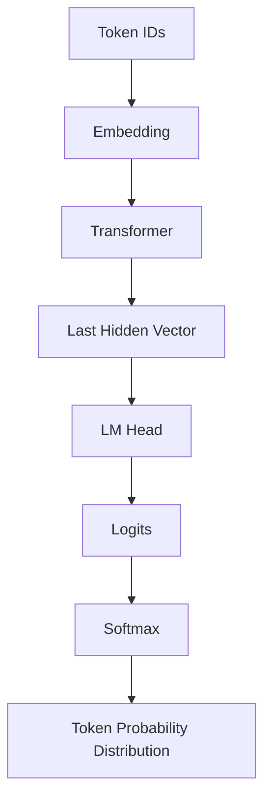
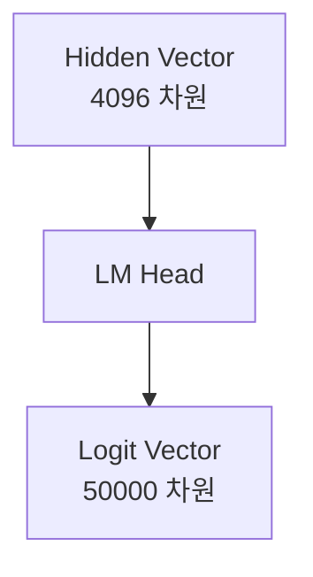
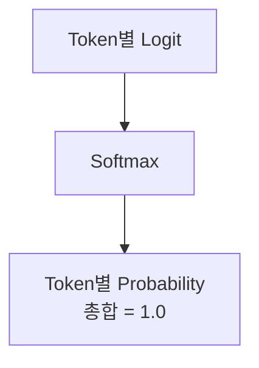

## 도입: LLM은 다음 token의 확률 분포를 만든다

LLM(대형 언어 모델)은 입력 문장을 보고 한 번에 전체 답변을 뚝딱 완성하지 않는다.
현재까지 주어진 token sequence를 기준으로, **다음 위치에 올 수 있는 token들의 확률 분포**를 계산하는 방식을 취한다.

예를 들어 입력이 다음과 같다고 하자.

> "나는 커피를"

모델은 다음에 올 수 있는 token 후보들에 대해 각각 점수를 계산한다.

* `마셨다`
* `좋아한다`
* `샀다`
* `내렸다`
* `.`
* ...

이 후보들은 모두 모델의 **Vocabulary(어휘 사전)** 안에 있는 token들이다. 즉, LLM은 Vocabulary 전체 token에 대해 다음 위치에 올 가능성을 수학적으로 계산한다.

이 글에서는 Transformer의 출력 벡터가 어떻게 **Logit(로짓)**이 되고, 이 Logit이 **Softmax(소프트맥스)**를 거쳐 최종적인 Token별 확률 분포로 바뀌는지 정리한다.

---

## 이 글에서 다루는 범위

이 글은 GPT 계열과 같은 **Decoder-only LLM**이 다음 token을 예측하는 과정을 기준으로 설명한다. 현재까지의 token sequence를 보고, 그 다음 위치에 올 token의 확률 분포를 만드는 흐름에 집중한다.

> **현재까지의 token sequence $\rightarrow$ 다음 token 후보들의 점수 계산 $\rightarrow$ 확률 분포 생성**

### 핵심 다룸 요소
* **Last Hidden Vector**
* **LM Head**
* **Logit**
* **Softmax**
* **Token Probability Distribution**

실제 텍스트 생성 단계에서는 이 확률 분포에서 token 하나를 최종 선택해야 한다. 그 선택 과정에는 Greedy Search, Sampling, Temperature 조정, Top-k, Top-p 같은 디코딩 전략이 사용되지만, 이 글에서는 **확률 분포를 만드는 과정까지만** 다룬다.

---

## 전체 흐름

입력 문장은 token id로 변환되고, 임베딩을 거쳐 Transformer에 들어간다. Transformer는 입력 token sequence를 문맥이 깊게 반영된 hidden vector sequence로 변환한다. 그중 **마지막 위치의 hidden vector**가 다음 token 예측에 사용된다.



핵심 연산 흐름은 다음과 같이 요약할 수 있다.

1. **Last Hidden Vector** 추출
2. **LM Head** 통과
3. **Logits** 도출
4. **Softmax** 적용
5. **Token Probability Distribution (확률 분포)** 생성

이 글에서는 Transformer 내부의 복잡한 구조(Self-Attention 등)는 생략하고, Transformer를 "입력을 문맥이 반영된 hidden vector로 바꾸는 블랙박스"로 상정한다.

---

## Transformer 출력은 무엇인가

입력이 다음과 같다고 하자.

> "나는 커피를"

Tokenizer를 거치면 여러 token으로 나뉜다.
`["나는", "커피", "를"]`

Transformer는 입력 token 개수만큼 hidden vector를 출력한다. 입력 token이 3개라면 출력 vector도 3개다.

```text
[입력 Token Sequence]
["나는", "커피", "를"]

[Transformer 출력]
[ h_1, h_2, h_3 ]

```

각 hidden vector는 해당 위치의 token과 그 이전의 문맥을 모두 반영한 고차원 표현(Representation)이다.

| 위치 | 입력 Token | 출력 Hidden Vector |
| --- | --- | --- |
| 1 | 나는 | $h_1$ |
| 2 | 커피 | $h_2$ |
| 3 | 를 | $h_3$ |

Decoder-only LLM에서 '다음 token'을 예측할 때는 보통 **마지막 위치의 hidden vector**를 사용한다.

> **다음 token 예측에 사용하는 vector:** $h_3$

여기서 $h_3$는 단순히 `를`이라는 token 하나만의 표현이 아니다. `나는 커피를`이라는 **현재까지의 전체 문맥이 압축 반영된** 마지막 위치의 벡터다.

---

## Last Hidden Vector는 아직 token이 아니다

Transformer의 마지막 hidden vector는 단순한 숫자 배열(Vector)이다. 예를 들어 모델의 차원 크기($d_{model}$)가 4,096이라면 마지막 hidden vector는 4,096차원이다.

$$h_3 = [0.12, -0.03, 0.44, \dots, 0.31]$$

이 벡터 자체는 `마셨다`나 `좋아한다` 같은 특정 token 문자를 의미하지 않는다. 다음 token을 예측하기 위해 가공되어야 할 중간 표현일 뿐이다.

따라서 이 거대한 벡터를 **Vocabulary 전체 token에 대한 점수**로 변환해야 한다. 이 변환을 담당하는 계층이 바로 **LM Head**다.

---

## LM Head란 무엇인가

LM Head(Language Modeling Head)는 마지막 hidden vector를 Vocabulary 전체 token에 대한 점수로 바꾸는 선형 계층(Linear Layer)이다.

예를 들어 Vocabulary에 다음과 같은 token들이 있다고 하자.
`["나는", "커피", "를", "마셨다", "좋아한다", "샀다", ".", ...]`

LM Head는 마지막 hidden vector($h_3$)를 받아 각 token에 대한 원시 점수(Raw Score)로 변환한다.

```text
마셨다   -> 8.2
좋아한다 -> 5.1
샀다     -> 4.7
내렸다   -> 2.0
.        -> 1.3
나는     -> -2.0
...

```

이렇게 계산된 각 점수를 Logit(로짓)이라고 부른다.

### LM Head의 차원 변화

LM Head는 $d_{model}$ 차원의 벡터를 `Vocabulary Size` 차원의 벡터로 투영(Projection)한다.

예를 들어 다음과 같은 스펙의 모델이 있다면:

* $d_{model} = 4096$
* Vocabulary Size = $50,000$

LM Head는 4,096차원의 hidden vector를 50,000차원의 logit vector로 변환한다.



Logit vector의 각 인덱스는 Vocabulary 안의 token 하나하나에 직접적으로 대응한다.

* `logit[0]` $\rightarrow$ token id 0의 점수
* `logit[1]` $\rightarrow$ token id 1의 점수
* ...
* `logit[49999]` $\rightarrow$ token id 49999의 점수

따라서 **Logit Vector의 전체 크기는 Vocabulary Size와 일치한다.**

---

## Logit이란 무엇인가

**Logit**은 Softmax 함수를 통과하기 전 단계의 원시 점수(Raw Score)다.

> **Logit = 확률로 변환되기 전의 상대적 점수**

| Token | Logit |
| --- | --- |
| 마셨다 | 8.2 |
| 좋아한다 | 5.1 |
| 샀다 | 4.7 |
| 내렸다 | 2.0 |
| . | 1.3 |

Logit 값이 크다는 것은 해당 token이 다음 위치에 올 가능성이 모델 내부적으로 높게 평가되었다는 뜻이다.

하지만 **Logit 자체는 확률이 아니다.** 8.2라는 숫자가 82%를 의미하지 않으며, 5.1이 51%를 뜻하지 않는다. Logit은 어디까지나 token 간의 '상대적인 점수 차이'를 나타낼 뿐이며, 우리가 아는 0~1 사이의 확률로 해석하려면 **Softmax**를 거쳐야만 한다.

### Logit은 '상대적인 점수'다

Logit은 개별 숫자 하나만 떼어놓고 보면 해석하기 어렵다. 핵심은 다른 token의 logit과 비교했을 때의 상대적인 차이(Gap)다.

**[ Case 1 ]**

* `마셨다`: 8.2
* `좋아한다`: 5.1
* `샀다`: 4.7

**[ Case 2 ]**

* `마셨다`: 2.2
* `좋아한다`: -0.9
* `샀다`: -1.3

두 케이스는 절대적인 값의 크기는 다르지만, token 간의 차이는 완전히 동일하다.

* `마셨다`와 `좋아한다`의 점수 차이 = $3.1$
* `좋아한다`와 `샀다`의 점수 차이 = $0.4$

Softmax 연산은 절대값이 아닌 이런 '상대적인 차이'를 기반으로 확률 분포를 만든다. 따라서 logit은 개별 값이 아니라 전체 logit vector 분포 안에서 해석되어야 한다.

---

## Softmax란 무엇인가

Softmax(소프트맥스)는 Logit vector를 정규화하여 실제 확률 분포(Probability Distribution)로 변환하는 수학 함수다. Softmax를 거친 결과물은 다음의 필수 성질을 가진다.

1. 모든 값은 **0 이상 1 이하**다.
2. 모든 값의 전체 합은 정확히 1(100%)이다.
3. Logit이 클수록 더 큰 확률 값을 부여받는다.

수식으로는 다음과 같이 표현된다.

$$\text{softmax}(z_i) = \frac{\exp(z_i)}{\sum \exp(z_j)}$$

| 기호 | 의미 |
| --- | --- |
| $z_i$ | 특정 token의 logit 점수 |
| $z_j$ | Vocabulary 전체 token의 logit 점수 |
| $\exp$ | 지수 함수 (Exponential) |
| $\sum \exp(z_j)$ | 전체 token의 $\exp$ 결과값을 모두 더한 총합 |



Softmax는 Vocabulary 전체 token을 대상으로 한 번에 계산된다. 즉, 특정 token의 최종 확률은 자기 자신의 logit뿐만 아니라 **다른 모든 token들의 logit 점수에도 영향을 받는다.**

### Softmax 예시

앞선 Logit 예시를 다시 가져와 보자.

| Token | Logit |
| --- | --- |
| 마셨다 | 8.2 |
| 좋아한다 | 5.1 |
| 샀다 | 4.7 |

이를 Softmax에 통과시키면 다음과 같은 확률 분포가 도출된다.

| Token | Probability (확률) |
| --- | --- |
| **마셨다** | **0.91 (91%)** |
| 좋아한다 | 0.04 (4%) |
| 샀다 | 0.03 (3%) |
| 내렸다 | 0.01 (1%) |
| . | 0.01 (1%) |

이 결과는 모델이 `"나는 커피를"` 다음에 `"마셨다"`가 올 확률을 압도적으로 높게(91%) 평가했음을 직관적으로 보여준다.

### Softmax는 점수 차이를 '확률 차이'로 극대화한다

Softmax 내부에는 지수 함수($\exp$)가 있기 때문에, Logit의 미세한 차이가 확률에서는 큰 격차로 벌어진다.

특정 token의 logit이 2~3점만 높아도 Softmax 결과는 그 token에 확률의 대부분을 몰아주게 된다(위 예시처럼 91% 집중). 반대로 1, 2, 3위의 Logit 점수가 4.2, 4.1, 4.0처럼 매우 비슷하다면, 확률 역시 30%, 28%, 25% 식으로 고르게 분산된다.

---

## Softmax 결과는 '결과'가 아니라 '확률 분포'다

Softmax 결과에서 확률이 낮게 나왔다는 것은 선택될 가능성이 낮다는 뜻일 뿐, 후보에서 완전히 삭제되었다는 뜻은 아니다.

위 예시에서 `샀다`의 확률은 3%에 불과하지만, 디코딩 전략(예: Top-p Sampling)에 따라서는 이 3%의 확률을 뚫고 실제 답변으로 선택될 수도 있다.

* **Softmax의 역할:** Token별 확률 분포를 만든다.
* **Token 선택의 역할:** 만들어진 확률 분포를 바탕으로 실제 출력할 token 하나를 고른다.

즉, Softmax는 정답 하나를 확정 짓는 함수가 아니라, **선택을 위한 정밀한 확률 지도**를 그리는 단계다.

---

## 심화: Vocabulary 전체에 대해 계산한다는 것의 의미

LLM은 다음 token으로 유력해 보이는 몇 개의 후보만 추려서 비교하는 것이 아니다. **Vocabulary 사전에 등록된 모든 단일 token에 대해** 빠짐없이 Logit을 만들고 Softmax 연산을 수행한다.

Vocabulary Size가 50,000이라면 연산은 다음과 같이 이루어진다.

```text
token id 0     -> 0.00001%
token id 1     -> 0.00000%
...
token id 1024  -> 91.0000% (마셨다)
...
token id 49999 -> 0.00012%

```

대다수 token의 확률은 0에 한없이 가깝게 수렴하겠지만, 아키텍처 구조상 무조건 전체 크기에 대한 행렬 연산이 수행된다. 이 때문에 Vocabulary Size를 무작정 늘리면 모델의 최종 출력 Layer 크기와 연산량(VRAM 사용량)이 급격히 증가하게 된다.

### Special Token도 확률 분포에 포함된다

Vocabulary에는 일반 단어뿐 아니라 모델을 제어하기 위한 특수 토큰(Special Token)도 포함되어 있다.

* `[EOS]` (End Of Sequence)
* `[PAD]` (Padding)
* `[BOS]` (Begin Of Sequence)

LLM은 일반 단어와 똑같은 취급으로 `[EOS]` 토큰에 대해서도 확률을 계산한다. 만약 Softmax 결과 `[EOS]`의 확률이 가장 높게 나왔다면, 모델이 "문맥상 여기서 문장을 끝내는 것이 자연스럽다"고 판단한 것이다.

## 요약 및 정리

LLM은 텍스트를 바로 뱉어내지 않는다. 여러 단계의 수학적 변환을 거쳐 확률을 계산한다.

1. **Last Hidden Vector:** 현재까지의 Token Sequence를 Transformer에 통과시켜 얻어낸 문맥의 압축본(Vector)이다.
2. **LM Head:** Hidden Vector를 Vocabulary Size만큼의 차원으로 변환하는 선형 계층이다.
3. **Logit:** LM Head를 통과해 나온 Token별 원시 점수(Raw Score)다. 상대적 크기 비교는 가능하지만 아직 확률은 아니다.
4. **Softmax:** Logit Vector를 지수화하고 정규화하여 총합이 1(100%)이 되는 완벽한 '확률 분포'로 변환한다.

최종적으로 도출된 이 Token Probability Distribution(토큰 확률 분포)를 바탕으로, 모델은 Greedy 방식이나 Sampling 기법을 활용해 최종적인 하나의 단어를 선택하고 이를 화면에 출력하게 된다.

---

## 참고

### 입력 Embedding과 출력 LM Head의 관계

입력 단계와 출력 단계는 서로 정반대의 변환을 수행한다.

| 단계 | 변환 방향 |
| --- | --- |
| **입력 (Embedding Layer)** | Token ID $\rightarrow$ 고차원 Vector |
| **출력 (LM Head)** | 고차원 Vector $\rightarrow$ Token별 Score (Logits) |

일부 모델 아키텍처에서는 메모리를 절약하기 위해 처음에 사용한 Embedding Table의 가중치(Weight) 행렬을 뒤집어서(Transpose) 마지막 LM Head의 가중치로 재사용하기도 한다. 이를 **Weight Tying(가중치 공유)** 기법이라고 부른다.

---

### 실제 코드 구현에서의 Softmax 트릭

개념적인 Softmax 수식은 지수($\exp$)를 직접 계산한다.


$$\text{softmax}(z_i) = \frac{\exp(z_i)}{\sum \exp(z_j)}$$

하지만 Logit 값($z$)이 100, 200처럼 조금만 커져도, $\exp(100)$은 컴퓨터가 표현할 수 있는 수치의 한계를 넘어버려 Overflow 에러가 발생한다. 이를 방지하기 위해 실제 딥러닝 프레임워크(PyTorch 등) 내부에서는 **Logit의 최댓값을 빼고 계산하는 수치 안정화 트릭**을 사용한다.

$$\text{softmax}(z_i) = \frac{\exp(z_i - \max(z))}{\sum \exp(z_j - \max(z))}$$

앞서 "Logit은 절대값이 아니라 상대적인 차이가 중요하다"고 설명했다. 모든 Logit에서 똑같이 최댓값을 빼주더라도 token 간의 상대적 점수 차이는 그대로 유지되므로, 최종적인 Softmax 확률 결과는 수학적으로 완벽히 동일하다.

---
