## 도입: LLM은 글자를 그대로 계산하지 않는다

LLM(대형 언어 모델)은 텍스트를 직접 계산하지 않는다. 사람은 다음 문장을 그대로 읽고 의미를 이해할 수 있다.

> "나는 커피를 마셨다."

하지만 모델 입장에서 이 문장은 바로 연산이 가능한 형태가 아니다. 신경망은 숫자를 통한 행렬 연산으로 동작하므로, 텍스트는 반드시 **숫자 형태**로 변환되어야 한다.

LLM의 입력은 대략 다음의 흐름을 거친다.

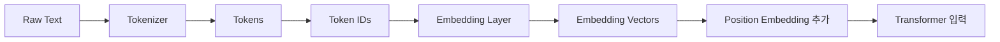

이 글에서는 위 흐름에서 **Tokenizer, Token ID, Embedding, Position Embedding**이 각각 어떤 역할을 하는지 정리한다.

---

## Token이란 무엇인가

Token(토큰)은 LLM이 텍스트를 처리하는 가장 기본적인 단위다.

Token은 반드시 우리가 아는 '단어' 하나와 일치하지는 않는다. 모델과 Tokenizer의 방식에 따라 단어일 수도 있고, 단어의 일부(형태소 등)일 수도 있으며, 알파벳 문자 하나에 가까울 수도 있다.

예를 들어 다음 문장을 보자.

```text
나는 커피를 마셨다.

```

사람이 보기에는 아래처럼 띄어쓰기(단어) 단위로 나눌 수 있다.

```text
나는 / 커피를 / 마셨다

```

하지만 실제 Tokenizer는 모델에 따라 다음과 같이 다르게 쪼갤 수 있다.

```text
나 / 는 / 커피 / 를 / 마셨 / 다

```

또는 이렇게 처리될 수도 있다.

```text
나는 / 커피 / 를 / 마 / 셨다

```

이처럼 실제 분할 결과는 모델이 사용하는 Vocabulary(어휘 사전)와 **학습 방식**에 따라 달라진다.

---

## 왜 단어 단위로만 나누지 않는가?

처음 생각하면 단순히 띄어쓰기 기준인 '단어 단위'로 나누면 충분해 보인다. 하지만 단어 단위 Tokenization에는 치명적인 문제들이 있다.

- **OOV(Out-Of-Vocabulary) 문제:** 처음 보는 신조어나 고유명사를 어떻게 처리할 것인가?
- **복합어와 파생어 처리:** 무한히 생성될 수 있는 복합어를 모두 사전에 넣을 것인가?
- **오타 처리:** 미세한 오타가 발생하면 완전히 모르는 단어로 인식할 것인가?
- **교착어의 한계:** 한국어처럼 조사와 어미가 다양하게 붙는 언어는 어떻게 할 것인가?

예를 들어 '커피'와 관련된 표현을 보자.

```text
커피, 커피를, 커피가, 커피에도, 커피처럼...

```

단어 단위로만 처리하면 이 모든 변형을 각각 독립된 별도의 token으로 사전에 등록해야 한다. 이 경우 Vocabulary 크기가 기하급수적으로 커지고, 사전에 없는 단어가 나오면 처리가 불가능해진다.

이를 해결하기 위해 LLM에서는 주로 **Subword Tokenization(하위 단어 토큰화)** 방식을 사용한다.

```text
커피 + 를
커피 + 가
커피 + 에도
커피 + 처럼

```

Subword 방식은 단어를 더 작은 의미 단위나 빈도 기반 단위로 쪼갠다. 이를 통해 처음 보는 단어라도 기존에 알고 있는 작은 token들의 조합으로 유연하게 표현할 수 있다.

---

## Tokenizer의 역할

**Tokenizer**는 텍스트를 token 단위로 나누고, 각 token을 고유한 '숫자 ID'로 변환하는 구성요소다.

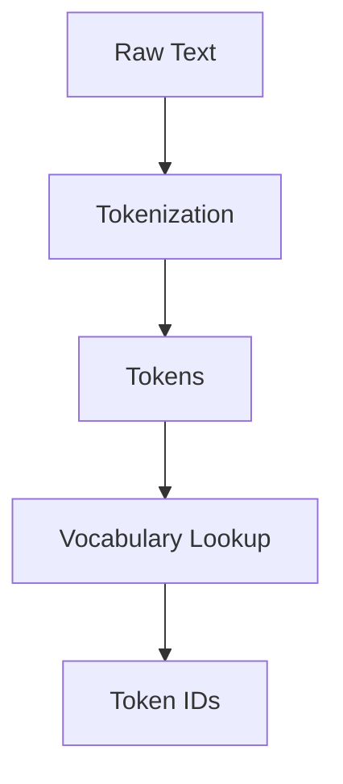

예를 들어 Tokenizer의 사전(Vocabulary)이 다음과 같이 매핑되어 있다고 하자.

- `나는` $\rightarrow$ 1024
- `커피` $\rightarrow$ 3812
- `를` $\rightarrow$ 217
- `마셨다` $\rightarrow$ 9041
- `.` $\rightarrow$ 13

그렇다면 입력 문장은 다음과 같이 변환된다.

> **입력:** 나는 커피를 마셨다.
> **Tokens:** ["나는", "커피", "를", "마셨다", "."]
> **Token IDs:** `[1024, 3812, 217, 9041, 13]`

여기서 **Token ID**는 각 토큰에 부여된 고유한 정수 번호다. LLM은 문자열이 아니라, 이 **정수 ID 시퀀스**를 입력으로 받게 된다.

---

## Vocabulary (어휘 사전)

**Vocabulary**는 Tokenizer가 알고 있는 전체 token의 목록이다.

`Token -> Token ID` 형태의 매핑 테이블(Mapping Table)이라고 볼 수 있다.

| Token  | Token ID |
| ------ | -------- |
| 나는   | 1024     |
| 커피   | 3812     |
| 를     | 217      |
| 마셨다 | 9041     |
| .      | 13       |

실제 LLM의 Vocabulary 크기는 보통 수만 개에서 수십만 개 규모(예: 50,000 ~ 128,000)에 달한다. Vocabulary가 크면 하나의 token으로 더 많은 의미를 압축해 표현할 수 있지만, 반대로 모델의 Embedding Table과 최종 출력 Layer의 파라미터 크기가 매우 커진다는 트레이드오프(Trade-off)가 있다.

---

## BPE: 자주 등장하는 조합을 token으로 만들기

최신 LLM Tokenizer에서 가장 자주 사용되는 서브워드 분할 알고리즘 중 하나가 BPE(Byte Pair Encoding)다.

BPE의 기본 아이디어는 "자주 등장하는 문자나 서브워드 조합을 묶어 하나의 새로운 token으로 병합하는 것"이다. 처음에는 가장 작은 단위(알파벳이나 바이트)에서 시작한다.

빈도수를 계산하여 가장 자주 같이 등장하는 쌍(Pair)을 반복적으로 병합해 나간다.

```text
l + o -> lo
lo + w -> low
e + s -> es
es + t -> est

```

그 결과, 자주 등장하는 익숙한 단어(예: `low`)는 통째로 하나의 token으로 처리되고, 드물게 등장하는 단어(예: `lowest`)는 더 작은 token들의 조합(`low` + `est`)으로 표현된다.

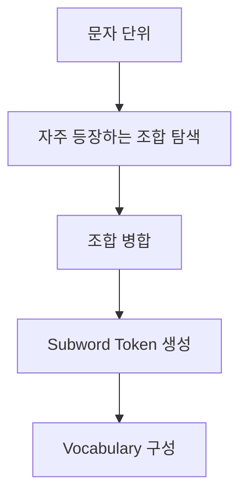

BPE 방식은 Vocabulary의 크기를 일정하게 제한하면서도 OOV 문제 없이 다양한 단어를 표현할 수 있게 해주는 강력한 무기다.

---

## Token ID는 아직 의미를 담고 있지 않다

Tokenizer가 뱉어낸 Token ID는 단순한 정수 번호다.

> `[1024, 3812, 217, 9041, 13]`

이 숫자 자체에는 어떠한 수학적, 문맥적 의미도 담겨있지 않다. 예를 들어 `1024`라는 숫자가 `나는`이라는 단어의 성질을 표현하는 것이 아니라, 단순히 Vocabulary Table의 1,024번째 칸에 위치해 있다는 뜻(Index)일 뿐이다.

모델이 단어의 '의미'를 기반으로 실제로 연산을 수행하려면, 이 맹목적인 Token ID를 **의미를 담은 연속적인 벡터(Vector)** 공간으로 옮겨야 한다. 이 역할을 하는 것이 바로 **Embedding Layer**다.

---

## Embedding이란 무엇인가

Embedding(임베딩)은 단순한 정수인 Token ID를 일정한 길이를 가진 고차원의 실수 벡터(Dense Vector)로 변환하는 과정이다.

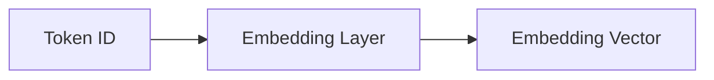

Embedding Layer는 거대한 룩업 테이블(Lookup Table)처럼 동작하여, 각 Token ID에 대응하는 벡터를 찾아 꺼내온다.

```text
1024 -> [ 0.12, -0.03,  0.44, ... ]
3812 -> [-0.51,  0.27,  0.08, ... ]
217  -> [ 0.09,  0.11, -0.32, ... ]

```

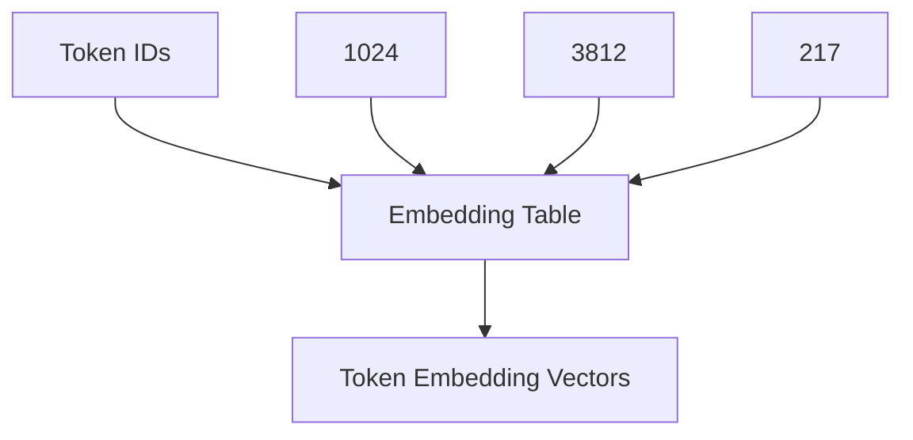

이 벡터의 차원 수(Embedding Dimension)는 모델의 크기에 따라 다르다. 만약 차원이 4,096이라면, 토큰 하나가 4,096개의 실수로 이루어진 정밀한 배열로 표현되는 것이다.

---

## Embedding Table의 크기

Embedding Table의 파라미터 크기는 전적으로 다음 두 가지 요소에 의해 결정된다.

> **Embedding Table 파라미터 수 = Vocabulary Size × Embedding Dimension**

예를 들어 Vocabulary 크기가 50,000개이고 벡터 차원이 4,096이라면, 임베딩 테이블 행렬의 크기는 `50,000 × 4096`이 된다.

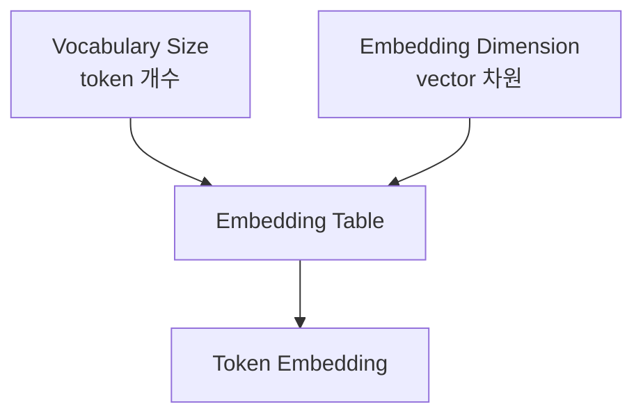

이 거대한 테이블 안의 실수 값들은 고정된 것이 아니다. 신경망이 수많은 텍스트를 학습하는 과정에서 역전파(Backpropagation)를 통해 미세하게 조정되며, 최종적으로는 **의미나 쓰임새가 비슷한 토큰들끼리 벡터 공간상에서 가까운 방향을 가리키도록** 똑똑하게 군집화된다.

---

## Token Embedding과 문맥

명심해야 할 점은, Embedding Layer를 갓 빠져나온 'Token Embedding' 벡터는 아직 문장의 전체 문맥을 충분히 반영하지 못한 상태라는 것이다.

예를 들어 다음 두 문장을 보자.

> 1. 나는 **은행**에 가서 돈을 입금했다. (금융기관)
> 2. 강 옆의 **은행**나무 아래에 앉았다. (식물/지형)

두 문장 모두 `은행`이라는 동일한 토큰을 포함하고 있다. 따라서 Embedding Layer를 통과한 직후의 `은행` 벡터 값은 두 문장 모두 완전히 동일하다.

하지만 문맥 안에서의 진짜 의미는 전혀 다르다. 이 한계는 뒤이어 나오는 **Transformer Block의 Self-Attention 연산**을 거치면서 해결된다. Self-Attention이 주변 토큰(돈, 강, 나무)들의 정보를 끌어와 섞어주면서 비로소 문맥이 완벽히 반영된 벡터로 진화하는 것이다.

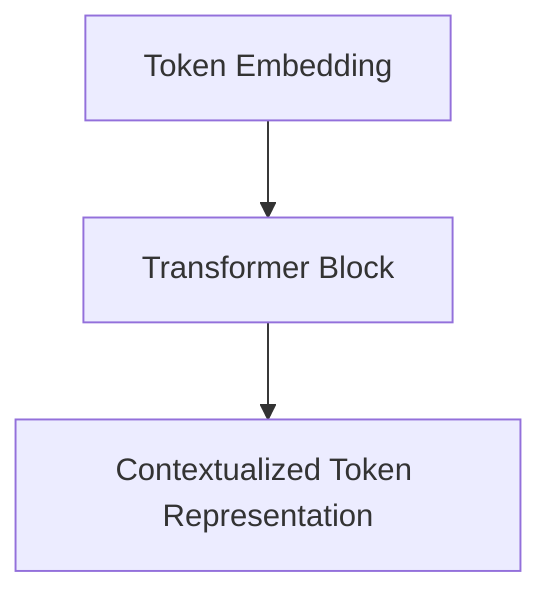

---

## Position Embedding이 필요한 이유

RNN 모델은 문장을 왼쪽부터 순서대로 한 단어씩 읽어 들인다. 하지만 **Transformer는 문장 전체 시퀀스를 한 번에 병렬로 입력받는다.**

만약 Token Embedding만 던져준다면 모델은 어떤 단어가 먼저 나왔는지 '순서'를 전혀 알 수 없다.

> "고양이가 강아지를 쫓았다."
> "강아지가 고양이를 쫓았다."

위 두 문장은 구성 토큰이 완벽히 같지만 순서가 달라 의미가 180도 다르다. 따라서 모델에게 "이 토큰이 문장의 몇 번째 위치에 있는지"를 강제로 알려줘야 한다. 이때 추가되는 것이 바로 Position Embedding(위치 임베딩)이다.

최종적으로 모델의 첫 번째 블록에 들어가는 입력 벡터는 다음과 같이 구성된다.

> **Input Embedding = Token Embedding + Position Embedding**

각 토큰에 위치 인덱스(0, 1, 2...)를 부여하고, 그 위치를 의미하는 고유한 벡터를 생성하여 원래의 단어 벡터에 더해주는 방식이다.

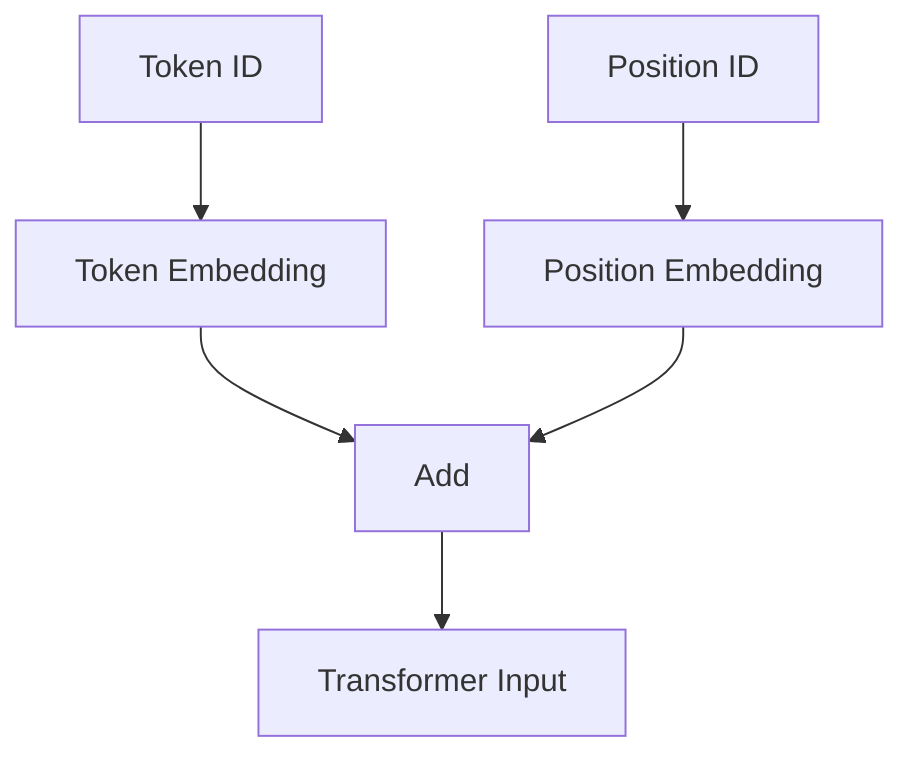

---

## 전체 입력 변환 과정 요약

지금까지의 과정을 하나의 흐름으로 연결하면 다음과 같다.

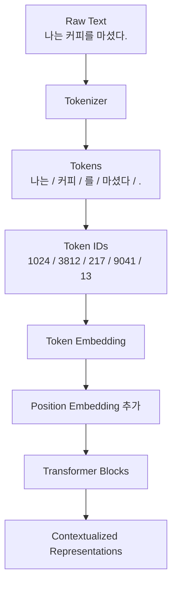

| 단계                   | 역할                                               |
| ---------------------- | -------------------------------------------------- |
| **Raw Text**           | 사람이 입력한 순수 문자열                          |
| **Tokenizer**          | 문자열을 규칙에 따라 token 단위로 쪼갬             |
| **Token IDs**          | 쪼개진 token을 사전의 고유 정수 Index로 매핑       |
| **Token Embedding**    | 정수 ID를 고정된 길이의 고차원 벡터로 변환         |
| **Position Embedding** | 병렬 처리를 위해 순서/위치 정보를 벡터에 더해줌    |
| **Transformer**        | Attention을 통해 토큰 간의 관계와 최종 문맥을 계산 |

---

## Padding과 Attention Mask

LLM은 연산 효율을 위해 여러 문장을 하나의 Batch(배치)로 묶어 동시에 처리한다. 문제는 문장마다 길이가 제각각이라는 점이다.

> **A:** 나는 커피를 마셨다. (4 tokens)
> **B:** 오늘 아침에 따뜻한 커피를 천천히 마셨다. (7 tokens)

길이가 다르면 직사각형 형태의 텐서(Tensor) 행렬로 묶을 수가 없다. 그래서 짧은 문장의 빈 공간에는 `[PAD]`라는 의미 없는 패딩 토큰을 채워 넣어 가장 긴 문장의 길이에 맞춘다.

> **A:** 나는 / 커피를 / 마셨다 / `[PAD]` / `[PAD]` / `[PAD]` / `[PAD]`
> **B:** 오늘 / 아침에 / 따뜻한 / 커피를 / 천천히 / 마셨다 / .

하지만 `[PAD]`는 실제 내용이 아니므로 연산(Attention)에 반영되어서는 안 된다. 이때 모델에게 "이 부분은 가짜니까 무시해!"라고 알려주는 가이드라인이 바로 **Attention Mask**다.

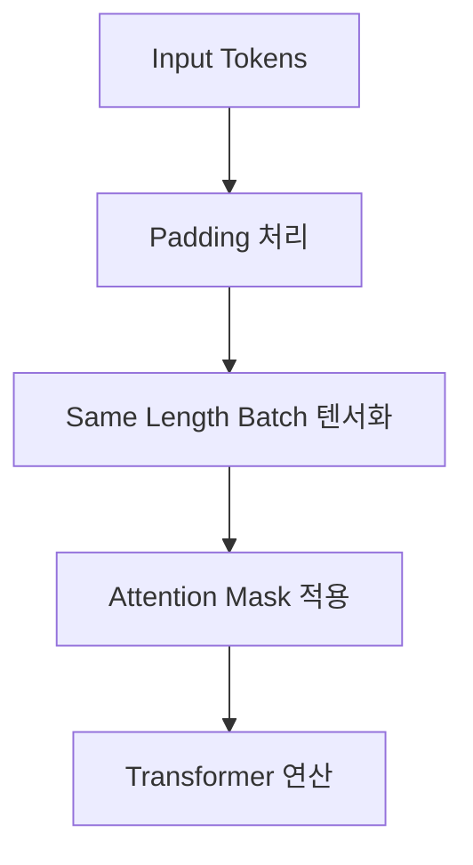

---

## Token 수가 중요한 이유

LLM을 실무에서 다룰 때 '토큰 수(Token Count)'는 시스템의 성능과 비용을 결정짓는 핵심 지표다.

- **입력 가능한 최대 길이 (Context Window)** 제한
- API **호출 비용** (보통 1K Token 당 과금)
- 생성 및 응답 **지연 시간 (Latency)**
- RAG 구현 시 **검색 문맥(Context)의 크기** 제약

특히 한국어나 프로그래밍 코드, JSON 데이터, 시스템 로그 등을 넣을 때는 사람이 느끼는 글자 수보다 토큰 수가 훨씬 뻥튀기될 수 있다.

> `[2026-07-03 10:12:31.123] TCP_TRANSPORT_LATENCY_WARN`

위와 같은 로그는 특수기호(`_`, `[`, `]`)와 숫자가 혼합되어 있어 엄청난 수의 서브워드 토큰으로 조각나기 쉽다. 따라서 LLM 애플리케이션을 설계할 때는 다음과 같은 관리가 필수적이다.

- 불필요한 프롬프트 컨텍스트 제거
- 너무 긴 문서를 적절히 자르기(Chunking)
- 누적된 대화 이력 주기적으로 요약하기
- 로그 및 원시 데이터 전처리

---

## LLM Token Embedding vs RAG Embedding

실무를 하다 보면 **Embedding**이라는 단어가 LLM 내부 아키텍처 설명에서도 나오고, RAG(검색 증강 생성) 파이프라인에서도 등장하여 혼동하기 쉽다. 두 개념은 목적과 단위가 완전히 다르다.

| 구분          | LLM Token Embedding                        | RAG Document Embedding                              |
| ------------- | ------------------------------------------ | --------------------------------------------------- |
| **입력 단위** | 하나의 Token ID                            | 문장, 문단(Chunk), 문서 전체                        |
| **출력 형태** | 단어 수준의 Token Vector                   | 의미론적으로 압축된 Semantic Vector                 |
| **주요 목적** | Transformer 모델에 집어넣기 위한 연산 준비 | Vector DB에 저장하고 유사도 검색(Search) 수행       |
| **사용 위치** | LLM 내부의 첫 번째 Layer                   | 텍스트 검색 파이프라인 (별도의 Embedding 모델 사용) |

**LLM 내부 임베딩**은 텍스트를 연산하기 위해 쪼개진 ID 하나하나를 벡터로 바꾸는 '시작점'이다.
**RAG 임베딩**은 수백 자의 문맥 덩어리(Chunk)가 품고 있는 핵심 '의미'를 하나의 묵직한 벡터로 압축하여 검색 가능하게 만드는 기술이다.

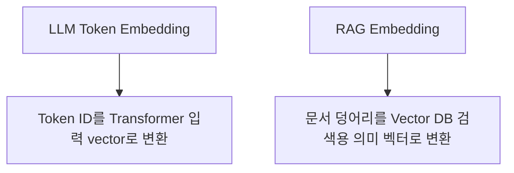

이 차이를 명확히 구분해야 전체적인 LLM 생태계와 RAG 시스템 아키텍처를 헷갈리지 않고 설계할 수 있다.
