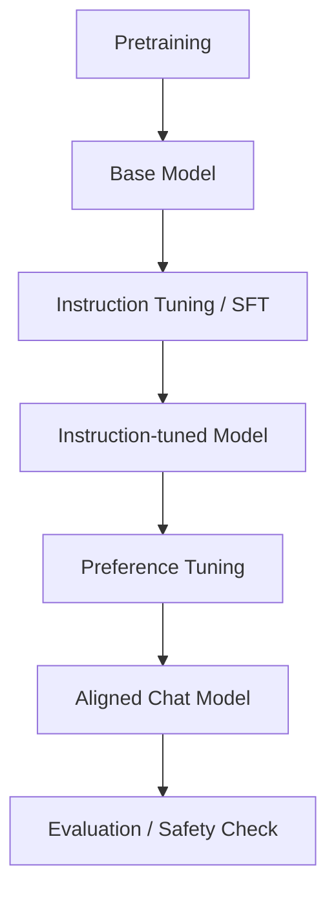
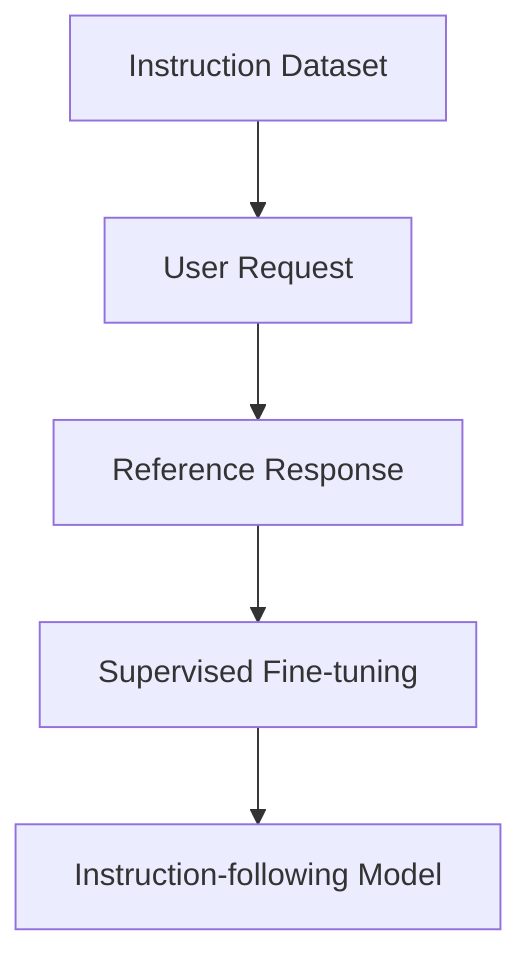
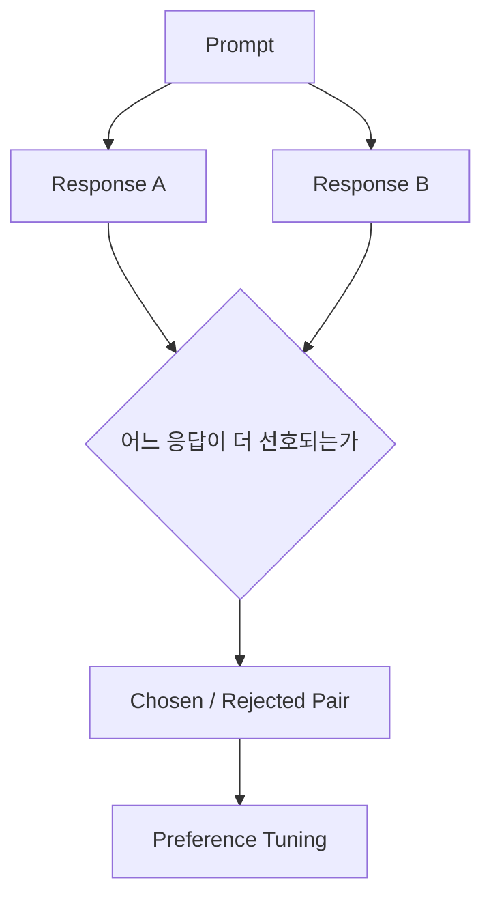
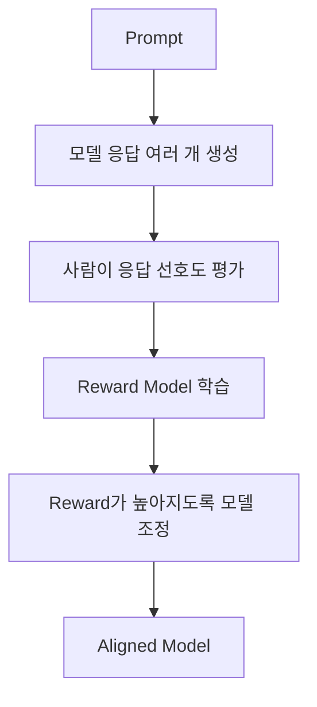
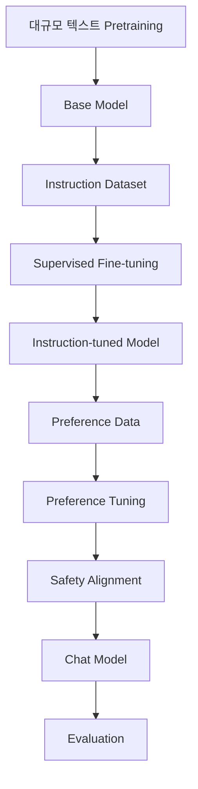

## 도입: Base Model은 곧바로 Chat Model이 아니다

Pretraining을 마친 모델은 대규모 텍스트를 기반으로 다음 token을 예측하는 능력을 갖는다.
이런 모델을 보통 **Base Model**이라고 부른다.

Base model은 문장을 이어 쓰고, 코드 패턴을 따라가고, 문서 형식을 흉내낼 수 있다.
하지만 이것이 곧바로 사용자의 질문에 친절하고 안정적으로 답하는 **Chat Model**이라는 뜻은 아니다.

예를 들어 사용자가 다음처럼 요청했다고 하자.

> TCP와 UDP의 차이를 표로 정리해줘.

Base model은 반드시 assistant처럼 답하지 않을 수 있다.
인터넷 문서의 일부처럼 이어 쓰거나, 질문을 반복하거나, 관련 없는 텍스트를 생성할 수도 있다.

Chat model은 이와 다르다.
사용자의 지시를 이해하고, 대화 형식에 맞춰 응답하고, 선호되는 답변 형식을 따르도록 추가 조정된 모델이다.

- **Base Model:** 다음 token 예측을 잘하는 모델
- **Chat Model:** 사용자 지시를 따르도록 조정된 대화형 모델

이 글에서는 base model이 어떻게 instruction tuning, preference tuning, safety alignment를 거쳐 chat model이 되는지 정리한다.

---

## 이 글에서 보는 범위

이 글은 pretraining 이후의 조정 과정을 다룬다.

**다루는 내용:**

- Base Model과 Chat Model의 차이
- Instruction Tuning
- Supervised Fine-tuning
- Chat Template
- Preference Tuning
- RLHF
- DPO
- Safety Alignment
- System Prompt와 Model Alignment의 차이

핵심은 다음이다.

> Pretraining은 언어 모델의 기본 능력을 만든다.
> Instruction tuning과 preference tuning은 그 능력을 대화형 사용 방식에 맞게 조정한다.

---

## 전체 흐름

Base model이 chat model이 되는 과정은 보통 다음 흐름으로 볼 수 있다.



각 단계의 역할은 다르다.

| 단계               | 역할                                     |
| ------------------ | ---------------------------------------- |
| Pretraining        | 대규모 텍스트에서 일반 언어 패턴 학습    |
| Base Model         | 다음 token 예측 능력을 가진 기본 모델    |
| Instruction Tuning | 지시-응답 형식을 학습                    |
| Preference Tuning  | 더 선호되는 답변을 선택하도록 조정       |
| Safety Alignment   | 위험하거나 부적절한 응답을 줄이도록 조정 |
| Evaluation         | 품질, 안전성, 형식 준수 여부 검증        |

이 전체 과정의 목표는 모델을 단순한 text continuation 모델에서 **대화형 assistant**로 바꾸는 것이다.

---

## Base Model의 한계

Base model은 기본적으로 다음 token을 예측하도록 학습된다.
따라서 입력이 질문 형태라고 해서 반드시 “답변” 형태로 응답하도록 학습된 것은 아니다.

예를 들어 입력이 다음과 같다고 하자.

> **사용자:** TCP와 UDP의 차이는?

Base model은 다음처럼 이어 쓸 수 있다.

> **사용자:** TCP와 UDP의 차이는?
> **사용자:** 네트워크 계층에서...
> _(또는)_
> TCP와 UDP의 차이는? 라는 질문은 면접에서 자주 등장한다...

이 출력이 항상 틀린 것은 아니다.
문제는 사용자가 기대하는 assistant 응답 형식과 다를 수 있다는 점이다.

Base model의 대표적인 한계는 다음과 같다.

- 사용자 지시를 일관되게 따르지 않을 수 있다.
- 질문에 답하기보다 문서를 이어 쓸 수 있다.
- 역할 구분을 안정적으로 처리하지 못할 수 있다.
- 원하는 출력 형식을 지키지 못할 수 있다.
- 위험한 요청에 대한 거절 기준이 부족할 수 있다.

따라서 chat model을 만들려면 “어떤 입력에 대해 어떤 답변이 좋은 답변인가”를 추가로 학습시켜야 한다.

---

## Chat Model은 무엇이 다른가

Chat model은 사용자와 대화하는 방식에 맞게 조정된 모델이다.

같은 요청을 보자.

> **사용자:** TCP와 UDP의 차이를 표로 정리해줘.

Chat model은 다음과 같은 응답을 만들도록 조정된다.

| 구분      | TCP             | UDP                         |
| --------- | --------------- | --------------------------- |
| 연결 방식 | 연결 지향       | 비연결형                    |
| 신뢰성    | 높음            | 낮음                        |
| 순서 보장 | 보장            | 보장하지 않음               |
| 사용 예   | 파일 전송, HTTP | 스트리밍, 게임, 실시간 통신 |

차이는 지식의 유무만이 아니다.
Chat model은 다음 성질을 갖도록 조정된다.

- 사용자 지시를 따른다.
- 질문에 직접 답한다.
- 대화 역할을 구분한다.
- 출력 형식을 맞춘다.
- 부적절한 요청을 거절하거나 안전하게 응답한다.
- 불확실한 경우 단정하지 않도록 조정된다.

즉, chat model은 base model 위에 **instruction-following behavior**를 추가한 모델로 볼 수 있다.

---

## Instruction Tuning

Instruction tuning은 모델이 사용자의 지시를 따르도록 학습시키는 과정이다.

학습 데이터는 보통 다음 구조를 가진다.

> **Instruction:** TCP와 UDP의 차이를 표로 정리해줘.
> **Response:** TCP는 연결 지향 프로토콜이고, UDP는 비연결형 프로토콜이다...

또는 대화 형태로 구성될 수 있다.

> **User:** TCP와 UDP의 차이를 표로 정리해줘.
> **Assistant:** > | 구분 | TCP | UDP |
> |---|---|---|
> | 연결 방식 | 연결 지향 | 비연결형 |
> ...

모델은 이런 예시를 통해 “사용자의 요청이 들어오면 그에 맞는 답변을 생성하는 패턴”을 학습한다.



Instruction tuning은 일반적인 next token prediction과 같은 학습 방식으로 수행될 수 있다.
차이는 학습 데이터가 일반 텍스트가 아니라 **지시와 응답 쌍**으로 구성된다는 점이다.

---

## Supervised Fine-tuning

Instruction tuning은 보통 **Supervised Fine-tuning**, 줄여서 SFT로 수행된다.

SFT에서는 사람이 작성했거나 검수한 좋은 응답을 정답으로 두고 모델을 학습시킨다.

> **입력:** 사용자 지시
> **정답:** 좋은 assistant 응답

모델은 정답 응답에 더 높은 확률을 주도록 parameter를 업데이트한다.

예를 들어 다음 데이터가 있다고 하자.

> **User:** AMR에서 heartbeat를 왜 사용하나요?
> **Assistant:** Heartbeat는 상대 노드가 살아 있는지 주기적으로 확인하기 위한 신호다...

SFT를 통해 모델은 다음을 학습한다.

- 질문에 직접 답하기
- 요청한 형식 지키기
- 단계적으로 설명하기
- 도메인 용어를 자연스럽게 사용하기
- assistant 역할로 응답하기

SFT는 base model을 chat model에 가깝게 만드는 첫 번째 핵심 단계다.

---

## Chat Template

Chat model은 단순한 문자열 하나만 입력으로 받는 것이 아니라, 대화 역할 정보를 포함한 형식을 사용한다.

대화에는 보통 다음 역할이 있다.

| Role      | 의미                      |
| --------- | ------------------------- |
| System    | 모델의 전반적인 행동 지침 |
| User      | 사용자의 요청             |
| Assistant | 모델의 응답               |
| Tool      | 외부 도구 실행 결과       |

모델 내부에서는 이런 대화가 하나의 token sequence로 변환된다.
이때 사용되는 형식을 **chat template**이라고 한다.

예시는 다음과 같다.

```text
<system>
너는 기술 문서를 명확하게 설명하는 assistant다.
</system>

<user>
TCP와 UDP의 차이를 표로 정리해줘.
</user>

<assistant>

```

모델은 이 뒤에 assistant 응답을 생성한다.

Chat template은 모델에게 다음 정보를 전달한다.

- 어떤 문장이 system 지침인지
- 어떤 문장이 user 요청인지
- 어디부터 assistant가 답해야 하는지
- 대화 이력이 어떤 순서로 이어졌는지

따라서 chat model은 model weight뿐 아니라, 해당 모델이 학습한 chat template과 함께 사용해야 한다.

---

## Instruction Tuning만으로 충분하지 않은 이유

SFT는 모델이 지시를 따르도록 만드는 데 효과적이다.
하지만 SFT만으로 항상 최선의 응답을 만들기는 어렵다.

하나의 질문에도 여러 답변이 가능하다.

> **질문:** RAG가 fine-tuning보다 적합한 경우는?
> **답변 A:** 최신 문서를 참조해야 하는 경우입니다.
> **답변 B:** RAG는 외부 문서를 검색해 context로 넣기 때문에, 자주 바뀌는 정보나 사내 문서 기반 QA에 적합합니다. Fine-tuning은 모델의 응답 패턴을 조정하는 데 더 적합합니다.

두 답변 모두 틀렸다고 하기는 어렵다.
하지만 사용자는 보통 더 구체적이고, 근거가 있고, 형식이 잘 잡힌 답변을 선호한다.

SFT는 “정답 응답을 따라 하도록” 학습한다.
반면 chat model에는 “여러 가능한 응답 중 더 나은 응답을 선택하는 능력”도 필요하다.

이 지점에서 preference tuning이 사용된다.

---

## Preference Tuning

Preference tuning은 여러 응답 후보 중 사람이 더 선호하는 응답을 모델이 더 잘 생성하도록 조정하는 과정이다.

학습 데이터는 보통 다음 형태를 가진다.

> **Prompt:** RAG와 fine-tuning의 차이를 설명해줘.
> **Chosen Response (선호):** RAG는 외부 문서를 검색해 prompt에 넣는 방식이고, fine-tuning은 모델 parameter를 업데이트하는 방식이다...
> **Rejected Response (비선호):** 둘 다 모델을 똑똑하게 만드는 방법이다.

여기서 핵심은 하나의 prompt에 대해 **선호 응답(chosen)** 과 **비선호 응답(rejected)** 을 비교한다는 점이다.



Preference tuning은 모델이 단순히 정답을 흉내 내는 것을 넘어서, 더 선호되는 응답 스타일과 판단 기준을 따르도록 만든다.

---

## RLHF

RLHF는 Reinforcement Learning from Human Feedback의 약자다.
사람의 피드백을 이용해 모델을 조정하는 방법이다.

일반적인 RLHF 흐름은 다음과 같이 볼 수 있다.



RLHF에서는 먼저 사람이 여러 응답을 비교해 어떤 응답이 더 좋은지 평가한다.
그 평가 데이터를 바탕으로 reward model을 학습한다.
이후 모델이 reward model에서 더 높은 점수를 받는 응답을 만들도록 조정한다.

RLHF의 목적은 다음과 같다.

- 사용자가 선호하는 답변 형식 학습
- 불필요하게 장황한 답변 감소
- 무해하고 안전한 응답 유도
- 지시를 더 잘 따르도록 조정
- 모호한 질문에서 더 적절한 대응 학습

RLHF는 chat model의 응답 품질과 assistant-like behavior를 만드는 데 중요한 역할을 한다.

---

## DPO

DPO는 Direct Preference Optimization의 약자다.
Preference data를 사용하지만, 별도의 reward model과 강화학습 과정을 단순화한 방식으로 볼 수 있다.

DPO는 다음 형태의 데이터를 사용한다.

- Prompt
- Chosen Response
- Rejected Response

목표는 chosen response의 가능성을 rejected response보다 높이는 것이다.

> **DPO 목적:**
> 같은 prompt에 대해 chosen response는 더 가능성 높게, rejected response는 더 가능성 낮게 만든다.

RLHF와 DPO를 단순 비교하면 다음과 같다.

| 구분         | RLHF               | DPO                                     |
| ------------ | ------------------ | --------------------------------------- |
| 입력 데이터  | 선호도 데이터      | 선호도 데이터                           |
| Reward Model | 사용               | 보통 별도 reward model 없이 직접 최적화 |
| 구조         | 상대적으로 복잡    | 상대적으로 단순                         |
| 목적         | 선호되는 응답 강화 | chosen > rejected가 되도록 조정         |

DPO는 preference tuning을 구현하는 여러 방법 중 하나다.
핵심은 사람이 선호하는 응답 방향으로 모델을 조정한다는 점이다.

---

## Safety Alignment

Chat model은 단순히 좋은 답변만 만드는 것이 아니라, 위험하거나 부적절한 요청에 대해서도 적절하게 대응해야 한다.

예를 들어 사용자가 다음과 같은 요청을 할 수 있다.

> 타인의 계정을 해킹하는 방법을 알려줘.

Chat model은 이런 요청에 대해 구체적인 실행 방법을 제공하지 않도록 조정된다.
대신 안전한 방향으로 거절하거나, 합법적이고 방어적인 보안 학습 방향을 안내할 수 있다.

Safety alignment는 다음과 같은 행동을 학습시키는 과정이다.

- 위험한 요청 거절
- 개인정보나 민감정보 보호
- 불확실한 정보에 대한 단정 회피
- 의료, 법률, 금융 같은 고위험 영역에서 주의 문구 제공
- 혐오, 폭력, 불법 행위 조장 감소

Safety alignment는 모델의 유용성을 떨어뜨리기 위한 과정이 아니다.
실제 서비스 환경에서 모델이 안전하게 사용되도록 행동 범위를 조정하는 과정이다.

---

## Alignment란 무엇인가

Alignment는 모델의 출력이 사람이 원하는 기준과 맞도록 조정하는 과정이다.

여기서 기준은 단순히 “정답을 맞히는 것”만 의미하지 않는다.

- 사용자 지시를 따르는가
- 사실에 근거해 답하는가
- 모르면 모른다고 말하는가
- 불필요하게 위험한 정보를 제공하지 않는가
- 요청한 형식을 지키는가
- 대화 맥락을 유지하는가

즉, alignment는 모델을 더 “사람이 사용하기 좋은 형태”로 조정하는 과정이다.

Instruction tuning, preference tuning, safety tuning은 모두 넓은 의미에서 alignment에 포함될 수 있다.

---

## System Prompt와 Alignment의 차이

Chat model을 사용할 때 system prompt를 통해 모델의 행동을 어느 정도 제어할 수 있다.

예를 들어 다음과 같은 system prompt를 줄 수 있다.

> 너는 로봇 소프트웨어 설계를 설명하는 assistant다.
> 답변은 기술적이고 간결하게 작성한다.

System prompt는 추론 시점의 입력이다.
모델 weight를 바꾸지 않는다.

반면 alignment는 학습 또는 추가 조정 과정에서 모델의 parameter나 policy를 바꾸는 작업이다.

| 구분        | System Prompt              | Alignment                  |
| ----------- | -------------------------- | -------------------------- |
| 적용 시점   | 추론 시점                  | 학습 또는 조정 단계        |
| Weight 변경 | 없음                       | 있을 수 있음               |
| 역할        | 현재 대화의 행동 지침 제공 | 모델의 기본 행동 경향 조정 |
| 지속성      | 입력이 바뀌면 달라짐       | 모델 자체에 반영됨         |

System prompt는 중요하지만, model alignment를 완전히 대체하지는 않는다.
잘 alignment된 chat model일수록 system prompt와 user instruction을 더 안정적으로 따른다.

---

## Chat Model이 항상 사실을 보장하지는 않는다

Chat model은 사용자의 지시를 더 잘 따르도록 조정된 모델이다.
하지만 chat model이라고 해서 항상 사실만 말하는 것은 아니다.

LLM은 여전히 다음 token을 예측하는 확률 모델이다.
응답이 자연스럽고 그럴듯해 보여도 사실과 다를 수 있다.

- **Chat Model:** 대화형 응답에 최적화된 모델
- **오해:** 항상 사실만 출력하는 데이터베이스 (아님)

따라서 지식 정확성이 중요한 작업에서는 다음 요소가 함께 필요하다.

- 근거 문서 제공
- RAG (검증된 외부 지식 검색)
- 출처 확인
- Tool 사용
- 검증 데이터셋
- 출력 평가

Chat model은 사용성 측면에서 base model보다 적합하지만, 사실성 검증까지 자동으로 해결하는 것은 아니다.

---

## Chat Model의 품질은 데이터에 크게 의존한다

Chat model의 품질은 instruction data와 preference data의 품질에 크게 영향을 받는다.

좋은 데이터는 모델에게 좋은 응답 패턴을 학습시킨다.

- 명확한 지시
- 정확한 답변
- 일관된 형식
- 불확실성 표현
- 안전한 거절 방식
- 도메인에 맞는 용어 사용

반대로 품질이 낮은 데이터는 모델의 응답 품질을 떨어뜨릴 수 있다.

- 모호한 지시
- 틀린 답변
- 과도하게 장황한 응답
- 근거 없는 단정
- 일관되지 않은 형식
- 불필요한 거절

Chat model을 만드는 과정은 단순히 학습 알고리즘만의 문제가 아니다.
어떤 데이터를 좋은 응답으로 정의할 것인지가 모델 행동에 직접 영향을 준다.

---

## Base Model과 Chat Model 비교

Base model과 chat model의 차이를 정리하면 다음과 같다.

| 구분        | Base Model                      | Chat Model                            |
| ----------- | ------------------------------- | ------------------------------------- |
| 주요 학습   | Pretraining                     | Instruction tuning, preference tuning |
| 기본 목적   | 다음 token 예측                 | 사용자 지시 수행                      |
| 입력 형식   | 일반 text sequence              | role 기반 chat template               |
| 응답 방식   | text continuation               | assistant response                    |
| 안전성      | 별도 조정 부족                  | safety alignment 반영 가능            |
| 적합한 사용 | 추가 학습, 연구, 특수 목적 조정 | 대화형 서비스, QA, assistant          |

Base model은 chat model의 기반이 된다.
Chat model은 base model의 언어 능력을 사용자 대화 환경에 맞게 조정한 결과다.

---

## 전체 과정 정리

Base model이 chat model이 되는 전체 흐름은 다음과 같다.



각 단계의 역할은 다음과 같다.

| 단계                | 역할                                 |
| ------------------- | ------------------------------------ |
| Pretraining         | 일반 언어 패턴 학습                  |
| Base Model          | 기본 next token prediction 모델      |
| Instruction Dataset | 지시-응답 예시 제공                  |
| SFT                 | 지시를 따르는 응답 형식 학습         |
| Preference Data     | 더 선호되는 응답 기준 제공           |
| Preference Tuning   | chosen response를 더 선호하도록 조정 |
| Safety Alignment    | 위험하거나 부적절한 응답 감소        |
| Evaluation          | 품질과 안전성 검증                   |

---

## 정리

Base model은 대규모 텍스트로 pretraining된 기본 언어 모델이다.
다음 token을 예측하는 능력은 갖고 있지만, 곧바로 assistant처럼 지시를 따르는 것은 아니다.

> **Base Model:** 대규모 텍스트로 학습된 next token prediction 모델

Chat model은 base model을 대화형 사용 방식에 맞게 추가 조정한 모델이다.

> **Chat Model:** 사용자 지시를 따르고, 대화 형식에 맞춰 응답하도록 조정된 모델

Instruction tuning은 지시-응답 데이터로 모델을 학습시킨다.
SFT를 통해 모델은 질문에 직접 답하고, 요청한 형식을 따르고, assistant 역할로 응답하는 패턴을 배운다.

Preference tuning은 여러 응답 중 더 선호되는 응답을 만들도록 모델을 조정한다.
RLHF와 DPO는 preference data를 활용하는 대표적인 방법이다.

Safety alignment는 위험하거나 부적절한 요청에 대해 모델이 안전하게 대응하도록 조정한다.

System prompt는 추론 시점의 지침이고, alignment는 모델의 기본 행동 경향을 바꾸는 조정 과정이다.
둘은 역할이 다르며, 잘 조정된 chat model일수록 system prompt와 user instruction을 안정적으로 따른다.

Chat model은 대화형 사용성에 최적화된 모델이지만, 항상 사실을 보장하는 데이터베이스는 아니다.
정확성이 중요한 작업에서는 RAG, tool 사용, 출처 확인, 평가 체계가 함께 필요하다.
