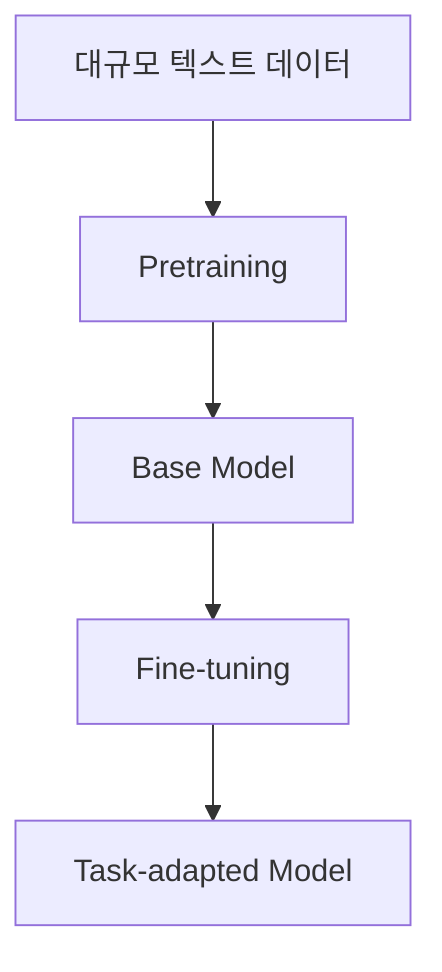
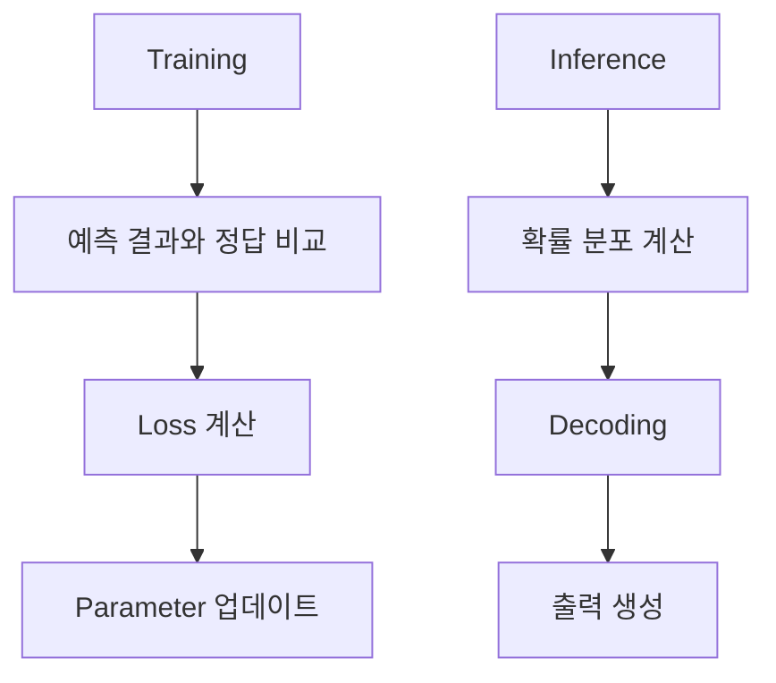
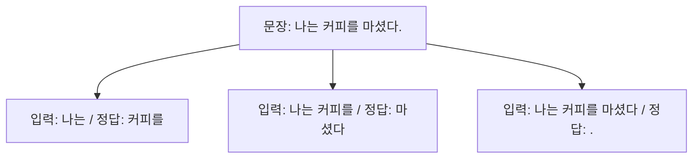
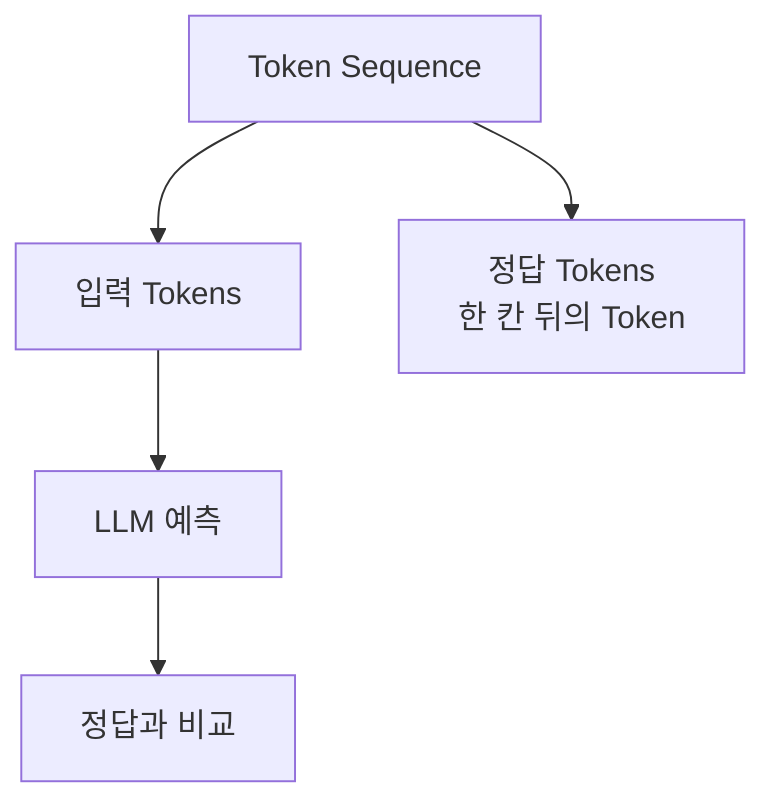
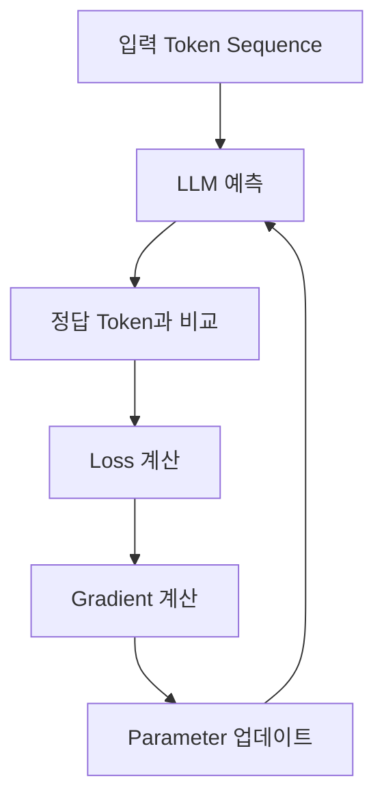
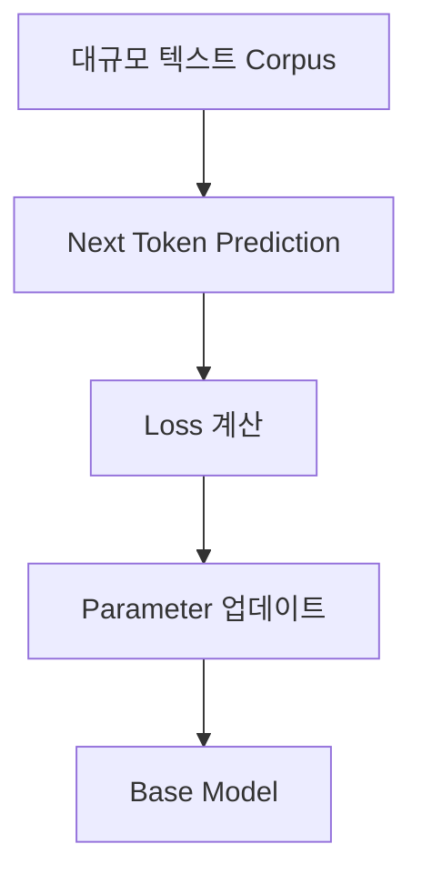
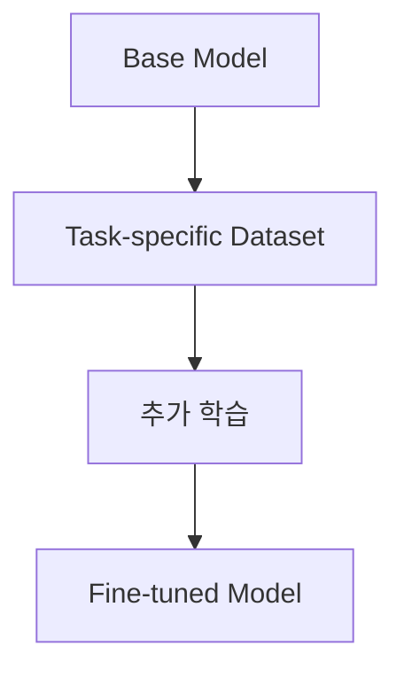
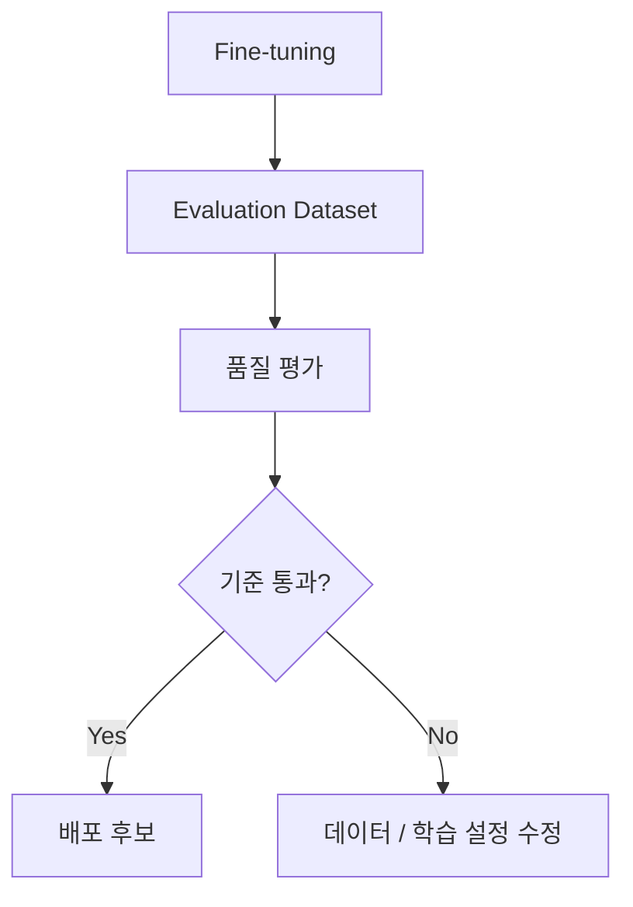
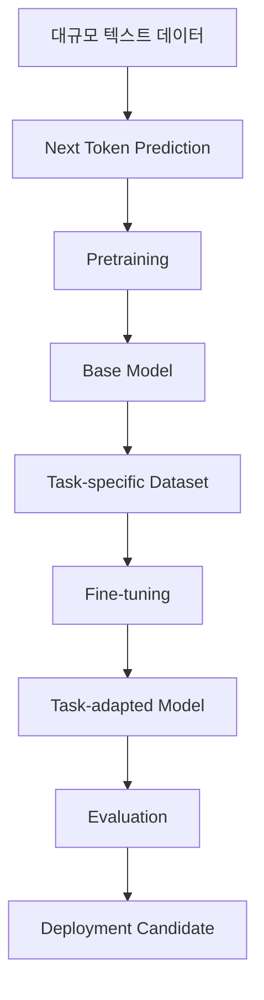

## 도입: LLM은 어떻게 다음 token을 잘 예측하게 되는가

앞선 글에서는 LLM이 다음 token을 생성하는 과정을 봤다.

> Token Sequence → Transformer → Logits → Softmax → Token Probability → Decoding → Selected Token

하지만 아직 한 가지 질문이 남아 있다.

> 모델은 어떻게 다음 token에 더 높은 확률을 주도록 학습되는가?

예를 들어 입력이 다음과 같다고 하자.

> 나는 커피를

학습이 잘 된 모델은 다음 token으로 `마셨다`, `좋아한다`, `샀다` 같은 자연스러운 후보에 높은 확률을 준다.
반대로 학습이 부족한 모델은 문맥과 맞지 않는 token에 높은 확률을 줄 수 있다.

LLM 학습은 이 차이를 줄이는 과정이다.
정답 token에 더 높은 확률을 주도록 모델의 parameter를 반복적으로 조정한다.

---

## 이 글에서 보는 범위

이 글에서는 LLM 학습의 기본 흐름을 다룬다.

**다루는 내용:**

- Next Token Prediction
- Loss
- Parameter Update
- Pretraining
- Base Model
- Fine-tuning
- Pretraining과 Fine-tuning의 차이

설명은 주로 Decoder-only LLM을 기준으로 한다.
GPT 계열 모델처럼 현재까지의 token sequence를 보고 다음 token을 예측하는 구조를 기준으로 보면 흐름이 가장 직관적이다.

---

## 전체 흐름

LLM 학습은 크게 두 단계로 볼 수 있다.

Pretraining은 대규모 텍스트에서 일반적인 언어 패턴을 학습하는 단계다.
Fine-tuning은 이미 학습된 모델을 특정 작업이나 도메인에 맞게 추가 조정하는 단계다.

- **Pretraining:** 일반적인 언어 패턴과 지식 학습
- **Fine-tuning:** 특정 작업, 형식, 도메인에 맞게 조정

---

## Training과 Inference의 차이

먼저 training과 inference를 구분해야 한다.

Inference는 이미 학습된 모델을 사용해 답변을 생성하는 과정이다.

> **Inference:** 입력 prompt → 모델 계산 → 다음 token 확률 분포 → decoding → 출력 생성

Training은 모델의 parameter를 업데이트하는 과정이다.

> **Training:** 학습 데이터 입력 → 모델 예측 → 정답과 비교 → loss 계산 → parameter 업데이트

도식으로 보면 다음과 같다.

Training에서는 모델 weight가 바뀐다.
Inference에서는 모델 weight가 바뀌지 않는다.

| 구분               | Training      | Inference   |
| ------------------ | ------------- | ----------- |
| 목적               | 모델 학습     | 답변 생성   |
| 정답 데이터        | 필요          | 불필요      |
| Loss 계산          | 있음          | 보통 없음   |
| Parameter 업데이트 | 있음          | 없음        |
| 출력               | 학습된 weight | 생성된 text |

---

## Next Token Prediction

Decoder-only LLM의 기본 학습 목표는 **Next Token Prediction**이다.
현재까지의 token을 보고 다음 token을 맞히도록 학습한다.

예를 들어 문장이 다음과 같다고 하자.

> 나는 커피를 마셨다.

모델은 이 문장에서 여러 학습 예시를 만들 수 있다.

- 입력: `나는` / 정답: `커피를`
- 입력: `나는 커피를` / 정답: `마셨다`
- 입력: `나는 커피를 마셨다` / 정답: `.`

즉, 하나의 문장은 여러 개의 다음 token 예측 문제로 바뀐다.

이 방식에서는 별도의 사람이 모든 정답을 라벨링하지 않아도 된다.
텍스트 자체에서 다음 token이 정답이 되기 때문이다.

이를 self-supervised learning으로 볼 수 있다.

---

## 학습 데이터는 어떻게 구성되는가

실제 학습에서는 token sequence를 한 칸씩 밀어서 입력과 정답을 만든다.

예를 들어 token sequence가 다음과 같다고 하자.

> ["나는", "커피를", "마셨다", "."]

모델 입력과 정답은 다음처럼 구성된다.

| 위치 | 입력으로 보는 token | 예측해야 할 정답 token |
| ---- | ------------------- | ---------------------- |
| 1    | 나는                | 커피를                 |
| 2    | 커피를              | 마셨다                 |
| 3    | 마셨다              | .                      |

모델은 각 위치에서 다음 token의 확률 분포를 만든다.
그리고 실제 정답 token에 얼마나 높은 확률을 주었는지 평가한다.

이 구조 때문에 LLM은 많은 텍스트를 읽으면서 다음 token 예측 능력을 학습할 수 있다.

---

## Loss란 무엇인가

모델이 예측한 확률 분포와 실제 정답 token 사이의 차이를 수치화한 값이 **loss**다.

예를 들어 입력이 다음과 같다고 하자.

> 입력: 나는 커피를
> 정답: 마셨다

모델이 다음과 같은 확률을 만들었다고 하자.

| Token    | Probability |
| -------- | ----------- |
| 마셨다   | 0.70        |
| 좋아한다 | 0.15        |
| 샀다     | 0.10        |
| 내렸다   | 0.05        |

정답 token인 `마셨다`에 높은 확률을 주었으므로 loss는 낮아진다.

반대로 다음과 같은 예측을 했다고 하자.

| Token    | Probability |
| -------- | ----------- |
| 마셨다   | 0.05        |
| 좋아한다 | 0.50        |
| 샀다     | 0.30        |
| 내렸다   | 0.15        |

정답 token인 `마셨다`의 확률이 낮으므로 loss는 커진다.

- 정답 token 확률이 높다 → loss 낮음
- 정답 token 확률이 낮다 → loss 높음

LLM 학습에서는 보통 cross entropy loss를 사용한다.
핵심은 정답 token에 더 높은 확률을 주도록 모델을 조정한다는 점이다.

---

## Parameter Update

Loss가 계산되면 모델은 이 loss를 줄이는 방향으로 parameter를 업데이트한다.

모델의 parameter는 Transformer 내부 weight, embedding weight, LM Head weight 등을 포함한다.

이 과정을 매우 많은 데이터에 대해 반복한다.

1. 텍스트 일부를 입력한다.
2. 모델이 다음 token 확률을 예측한다.
3. 실제 다음 token과 비교해 loss를 계산한다.
4. loss를 줄이는 방향으로 parameter를 업데이트한다.
5. 이 과정을 반복한다.

학습이 진행되면 모델은 문맥에 맞는 token에 더 높은 확률을 주는 방향으로 조정된다.

---

## Pretraining이란 무엇인가

Pretraining은 대규모 텍스트 데이터로 모델을 처음 학습시키는 단계다.

이 단계에서 모델은 특정 작업 하나만 배우는 것이 아니라, 넓은 범위의 언어 패턴을 학습한다.

**학습 내용:**

- 문법
- 문장 구조
- 단어 간 관계
- 상식적 패턴
- 문서 형식
- 코드 패턴
- 질문과 답변의 구조

도식으로 보면 다음과 같다.

Pretraining을 마친 모델을 보통 **Base Model**이라고 부른다.

Base model은 다음 token을 예측하는 능력을 갖지만, 반드시 사용자의 지시를 잘 따르는 chat model이라는 뜻은 아니다.

---

## Base Model이란 무엇인가

Base Model은 대규모 pretraining을 통해 일반적인 언어 패턴을 학습한 모델이다.

> **Base Model:** 대규모 텍스트를 기반으로 next token prediction을 학습한 모델

Base model은 문장을 이어 쓰거나, 코드 패턴을 따라가거나, 문서 형식을 흉내낼 수 있다.
하지만 다음과 같은 한계가 있을 수 있다.

- 사용자 지시를 일관되게 따르지 않을 수 있다.
- 대화형 assistant처럼 응답하지 않을 수 있다.
- 안전 정책이나 선호 형식이 충분히 반영되지 않을 수 있다.
- 특정 업무 형식을 안정적으로 따르지 못할 수 있다.

따라서 실제 서비스에서는 base model 위에 추가적인 조정 단계를 거치는 경우가 많다.

---

## Fine-tuning이란 무엇인가

Fine-tuning은 이미 pretraining된 모델을 특정 작업이나 데이터에 맞게 추가 학습하는 과정이다.

Pretraining이 넓은 범위의 일반 학습이라면, fine-tuning은 좁은 목적에 맞춘 추가 조정이다.

예를 들어 다음과 같은 목적에 사용할 수 있다.

- 특정 문서 형식에 맞게 답변하기
- 분류 작업을 잘 수행하기
- 도메인 용어를 일관되게 사용하기
- 특정 스타일의 응답을 만들기
- 코드 리뷰 결과를 일정한 형식으로 출력하기

Fine-tuning은 모델의 parameter를 업데이트한다는 점에서 prompt engineering이나 RAG와 다르다.

---

## Fine-tuning 데이터 예시

Fine-tuning 데이터는 목적에 따라 다르게 구성된다.

예를 들어 요약 작업에 맞추려면 다음과 같은 데이터가 필요하다.

> 입력: 긴 기술 문서
> 정답: 요약문

질의응답 모델을 만들려면 다음과 같은 데이터가 필요하다.

> 입력: 질문 + 관련 문서
> 정답: 문서에 근거한 답변

형식화된 보고서 생성을 맞추려면 다음과 같은 데이터가 필요하다.

> 입력: 장애 로그 + 현상 설명
> 정답: 현상 요약 / 원인 후보 / 근거 / 조치 항목

Fine-tuning은 모델에게 새로운 사실을 단순 저장시키는 목적보다는, 특정 입력에 대해 원하는 출력 패턴을 안정적으로 만들도록 조정하는 데 적합하다.

---

## Pretraining과 Fine-tuning의 차이

Pretraining과 fine-tuning의 차이는 다음과 같다.

| 구분           | Pretraining           | Fine-tuning                |
| -------------- | --------------------- | -------------------------- |
| 목적           | 일반 언어 패턴 학습   | 특정 작업에 맞게 조정      |
| 데이터 규모    | 매우 큼               | 상대적으로 작음            |
| 데이터 범위    | 넓음                  | 좁고 목적이 명확함         |
| 결과           | Base Model            | Task-adapted Model         |
| 학습 비용      | 큼                    | 상대적으로 작음            |
| 주요 학습 목표 | Next Token Prediction | 작업별 목표 또는 응답 패턴 |

Pretraining은 모델의 기본 능력을 만든다.
Fine-tuning은 그 능력을 특정 방향으로 조정한다.

- **Pretraining:** 넓게 배운다.
- **Fine-tuning:** 목적에 맞게 조정한다.

---

## Fine-tuning과 Prompting의 차이

Prompting은 모델 weight를 바꾸지 않는다.
입력 prompt를 통해 모델의 출력을 유도한다.

> **Prompting:** 모델은 그대로 두고 입력 지시를 바꾼다.

Fine-tuning은 모델 weight를 업데이트한다.

> **Fine-tuning:** 학습 데이터를 사용해 모델 parameter를 바꾼다.

차이는 다음과 같다.

| 구분        | Prompting        | Fine-tuning             |
| ----------- | ---------------- | ----------------------- |
| Weight 변경 | 없음             | 있음                    |
| 비용        | 낮음             | 높음                    |
| 적용 속도   | 빠름             | 학습 필요               |
| 적합한 경우 | 지시와 형식 제어 | 반복적인 작업 패턴 학습 |
| 위험        | prompt 의존성    | 과적합, 기존 능력 저하  |

먼저 prompt로 해결 가능한지 확인하고, 반복적으로 같은 패턴을 안정화해야 할 때 fine-tuning을 고려하는 흐름이 일반적이다.

---

## Fine-tuning과 RAG의 차이

RAG는 외부 문서를 검색해서 prompt에 넣는 구조다.
모델 weight를 업데이트하지 않는다.

> **RAG:** 외부 문서를 검색해 context로 제공한다.

Fine-tuning은 모델 parameter를 업데이트한다.

> **Fine-tuning:** 학습 데이터로 모델의 동작을 조정한다.

두 방식은 목적이 다르다.

| 구분           | RAG                                | Fine-tuning                         |
| -------------- | ---------------------------------- | ----------------------------------- |
| 목적           | 외부 지식 참조                     | 모델 동작 조정                      |
| 지식 반영 방식 | 검색 문서를 prompt에 삽입          | parameter 업데이트                  |
| 최신 정보 반영 | 문서 index 갱신                    | 재학습 필요                         |
| 적합한 경우    | 사내 문서, 최신 문서, 근거 기반 QA | 응답 형식, 작업 패턴, 도메인 스타일 |
| 한계           | 검색 품질에 의존                   | 데이터 품질과 학습 비용에 의존      |

최신 문서나 자주 바뀌는 정보는 RAG가 적합하다.
반복적인 응답 형식이나 특정 작업 패턴은 fine-tuning이 적합할 수 있다.

---

## Fine-tuning의 한계

Fine-tuning은 강력하지만 항상 필요한 것은 아니다.
다음과 같은 한계가 있다.

- 학습 데이터 품질에 크게 의존한다.
- 데이터가 부족하면 과적합될 수 있다.
- 잘못된 데이터가 있으면 잘못된 패턴을 학습한다.
- 기존 능력이 일부 저하될 수 있다.
- 학습과 평가 비용이 필요하다.
- 배포와 rollback 관리가 필요하다.

Fine-tuning을 적용하려면 학습 데이터뿐 아니라 평가 데이터도 필요하다.
특정 작업에서 좋아졌는지, 다른 작업에서 나빠지지 않았는지 확인해야 한다.

---

## Overfitting

Overfitting은 모델이 학습 데이터에는 잘 맞지만, 새로운 입력에는 잘 대응하지 못하는 상태다.

예를 들어 fine-tuning 데이터가 특정 문장 형식에만 치우쳐 있으면, 모델은 그 형식만 과하게 따라갈 수 있다.

> **학습 데이터:** 항상 같은 구조의 장애 리포트
> **결과:** 새로운 장애 유형에도 같은 형식과 원인만 반복해서 출력

Overfitting을 줄이려면 데이터 다양성과 평가 기준이 필요하다.

- 다양한 입력 사례 구성
- 검증 데이터 분리
- 학습 후 평가
- 불필요하게 긴 학습 방지

---

## Catastrophic Forgetting

Fine-tuning 과정에서 특정 작업에 지나치게 맞춰지면, 모델이 원래 가지고 있던 일반 능력이 저하될 수 있다.
이를 catastrophic forgetting이라고 부른다.

> **Catastrophic Forgetting:** 새 작업에 맞게 학습하는 과정에서 기존 능력이 손상되는 현상

예를 들어 특정 형식의 보고서만 과하게 fine-tuning하면, 일반적인 질의응답이나 자연스러운 문장 생성 능력이 떨어질 수 있다.

따라서 fine-tuning 후에는 target task 성능뿐 아니라 기본 능력 유지 여부도 평가해야 한다.

---

## Full Fine-tuning과 PEFT

Fine-tuning은 모델 전체 parameter를 업데이트할 수도 있고, 일부 작은 parameter만 학습할 수도 있다.

| 방식             | 설명                                  |
| ---------------- | ------------------------------------- |
| Full Fine-tuning | 모델 전체 parameter 업데이트          |
| PEFT             | 일부 추가 parameter만 학습            |
| LoRA             | low-rank adapter를 학습하는 PEFT 방식 |

Full fine-tuning은 비용이 크고 많은 GPU memory가 필요할 수 있다.
PEFT나 LoRA는 전체 모델을 다 바꾸지 않고 일부 adapter만 학습하는 방식이다.

이 글에서는 fine-tuning의 기본 개념만 다룬다.
실무에서는 비용과 배포 관리 측면에서 PEFT나 LoRA 같은 경량 fine-tuning 방식이 자주 사용된다.

---

## 학습과 평가는 함께 가야 한다

Fine-tuning을 했다고 해서 항상 모델이 좋아지는 것은 아니다.
특정 데이터에서 loss가 낮아져도 실제 업무 품질이 좋아졌다고 단정할 수 없다.

평가 기준이 필요하다.

- 정답 정확도
- 출력 형식 준수
- 근거 기반 답변 여부
- 불필요한 환각 감소 여부
- 기존 능력 유지 여부
- 응답 일관성
- 안전성

도식으로 보면 다음과 같다.

Fine-tuning은 학습 데이터, 평가 데이터, 배포 관리가 함께 설계되어야 한다.

---

## 전체 과정 정리

Pretraining과 fine-tuning의 전체 흐름은 다음과 같다.

각 단계의 역할은 다음과 같다.

| 단계                  | 역할                     |
| --------------------- | ------------------------ |
| 대규모 텍스트 데이터  | 일반 언어 패턴 학습 재료 |
| Next Token Prediction | 기본 학습 목표           |
| Pretraining           | base model 생성          |
| Fine-tuning           | 특정 작업에 맞게 조정    |
| Evaluation            | 실제 품질 검증           |
| Deployment Candidate  | 배포 가능한 모델 후보    |

---

## 정리

LLM은 다음 token을 더 잘 예측하도록 학습된다.
Decoder-only LLM에서는 현재까지의 token sequence를 보고 다음 token의 확률 분포를 만들고, 정답 token에 더 높은 확률을 주도록 parameter를 업데이트한다.

> 입력 token sequence → 다음 token 예측 → 정답 token과 비교 → loss 계산 → parameter 업데이트

Pretraining은 대규모 텍스트 데이터를 사용해 일반적인 언어 패턴을 학습하는 단계다.
Pretraining을 마친 모델을 base model이라고 볼 수 있다.

> Pretraining → Base Model

Fine-tuning은 base model을 특정 작업이나 도메인에 맞게 추가 학습하는 과정이다.

> Base Model → Fine-tuning → Task-adapted Model

Prompting과 RAG는 모델 weight를 바꾸지 않는다.
Fine-tuning은 모델 parameter를 업데이트한다.

- **Prompting:** 입력을 바꿔 출력을 유도한다.
- **RAG:** 외부 문서를 검색해 context로 제공한다.
- **Fine-tuning:** 학습 데이터로 모델 parameter를 조정한다.

Fine-tuning은 반복적인 작업 패턴이나 응답 형식을 안정화하는 데 사용할 수 있다.
하지만 데이터 품질, overfitting, catastrophic forgetting, 평가 비용을 함께 고려해야 한다.

LLM 학습을 이해할 때 핵심은 다음이다.

> Pretraining은 모델의 기본 능력을 만든다.
> Fine-tuning은 그 능력을 특정 목적에 맞게 조정한다.
